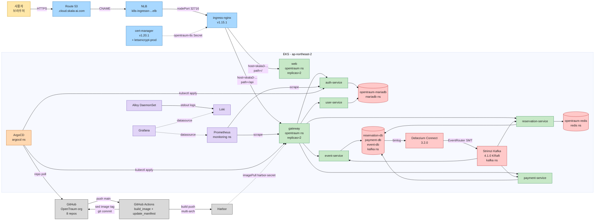

# OpenTraum 인프라 매뉴얼 - 시리즈 인덱스

> 작성일: 2026-04-28
> 클러스터: <CLUSTER_NAME> (ap-northeast-2)
> 시리즈 버전: 2026-04-28

## 목차

- [1. 이 문서가 무엇인지](#1-이-문서가-무엇인지)
- [2. 시리즈 구성](#2-시리즈-구성)
- [3. 시스템 한눈에 보기](#3-시스템-한눈에-보기)
- [3.5 정량 성과 한눈에 보기](#35-정량-성과-한눈에-보기)
- [4. 전체 아키텍처 다이어그램](#4-전체-아키텍처-다이어그램)
- [5. 네임스페이스 카탈로그](#5-네임스페이스-카탈로그)
- [6. 정보 출처와 갱신 정책](#6-정보-출처와-갱신-정책)
- [7. 명명 규약](#7-명명-규약)
- [8. 어디부터 봐야 하나 (진단 가이드)](#8-어디부터-봐야-하나-진단-가이드)
- [9. 빠른 참조 명령어](#9-빠른-참조-명령어)
- [10. 용어집](#10-용어집)
- [11. 미정 / 보강 항목](#11-미정--보강-항목)

## 1. 이 문서가 무엇인지

OpenTraum 의 EKS 인프라(클러스터, 네트워크, 워크로드, 데이터, 관측, 운영, CI/CD)를 클러스터에 직접 접속하지 않고도 모두 파악할 수 있도록 정리한 매뉴얼 시리즈입니다. 기준 시점은 2026-04-28 이며, 본문은 모두 그 시점의 라이브 클러스터 상태를 1차 출처로 합니다. 변경 이력이나 마이그레이션은 본문에 인용하지 않으며, 트러블슈팅 사건의 원인을 설명할 때 한해 최소한으로 인용합니다.

본 문서는 보안 민감 정보(시크릿 값, 자격증명, 토큰, 평문 패스워드)를 포함하지 않습니다. 그래서 비공개 저장소가 아니라 OpenTraum-Infra 의 공개 `docs/` 디렉토리에 함께 둘 수 있도록 작성했습니다.

## 2. 시리즈 구성

이 시리즈는 9개 파일로 구성됩니다. 각 파일은 자기충족적이라 어느 한 파일만 봐도 그 분야의 전체 상을 잡을 수 있도록 작성했습니다. 다른 분야와 맞물리는 부분에는 마크다운 링크로 교차 참조를 걸어두었습니다.

| 파일 | 제목 | 한 줄 요약 |
|---|---|---|
| [00 INDEX](OPENTRAUM-INFRA-00-INDEX.md) | 시리즈 인덱스 / At-a-Glance / 전체 아키텍처 | 본 문서. 어디부터 봐야 할지 안내합니다. |
| [01 CLUSTER](OPENTRAUM-INFRA-01-CLUSTER.md) | EKS 클러스터 / 노드 / 스토리지 | ap-northeast-2 의 7개 노드(t3.medium 6 + g5.xlarge 1)와 50Gi 영구 스토리지를 정리합니다. |
| [02 NETWORK](OPENTRAUM-INFRA-02-NETWORK.md) | 네트워크 / 진입 경로 | Route 53 부터 Pod 까지 한 요청의 여정을 따라가며 NLB, Ingress NGINX, cert-manager, CoreDNS 를 다룹니다. |
| [03 WORKLOAD](OPENTRAUM-INFRA-03-WORKLOAD.md) | 네임스페이스 / 앱 워크로드 카탈로그 | opentraum 네임스페이스의 6 백엔드와 web 을 매니페스트 라인 단위로 분석합니다. |
| [04 DATA](OPENTRAUM-INFRA-04-DATA.md) | 데이터 계층 | 통합 MariaDB, Strimzi Kafka 4.1.0, Debezium CDC, 3개 CDC MariaDB, Redis 와 SAGA 흐름을 다룹니다. |
| [05 MONITORING](OPENTRAUM-INFRA-05-MONITORING.md) | 모니터링 스택 | Prometheus, Loki, Alloy, Grafana 가 만드는 metrics 와 logs 두 축의 흐름을 정리합니다. |
| [06 OPERATIONS](OPENTRAUM-INFRA-06-OPERATIONS.md) | 운영 정책 / 안정성 / 카오스 | PriorityClass, PDB, Probe, Affinity, KEDA, Chaos Toolkit 검증 결과까지 다룹니다. |
| [07 CICD](OPENTRAUM-INFRA-07-CICD.md) | CI/CD 파이프라인 | GitHub repo 에 push 한 한 번의 커밋이 EKS 의 Pod 가 되기까지의 모든 단계를 정리합니다. |
| [08 GATEWAY HPA LOAD TEST](OPENTRAUM-INFRA-08-GATEWAY-HPA-LOAD-TEST.md) | Gateway HPA 부하 테스트 | hey 이력, wrk/wrk2 재검증 결과, 10,000 RPS 달성을 위한 HPA/node/loadgen 튜닝 방향을 정리합니다. |

## 3. 시스템 한눈에 보기

| 항목 | 값 |
|---|---|
| AWS 리전 | ap-northeast-2 (서울) |
| 가용 영역 | ap-northeast-2a, ap-northeast-2b |
| EKS 클러스터명 | <CLUSTER_NAME> |
| EKS 컨트롤 플레인 버전 | v1.34 |
| 노드 수 | 7 (t3.medium 6 + g5.xlarge 1) |
| 총 vCPU / Memory | 14 vCPU / 약 33Gi |
| 영구 스토리지 | 50Gi (전부 ebs-sc) |
| 네임스페이스 | 13개 (default 포함) |
| 컨테이너 런타임 | containerd 2.2.1 |
| OS / 커널 | Amazon Linux 2023 / 6.12.x |
| 진입 도메인 (앱) | <CLUSTER_NAME>.cloud.skala-ai.com |
| 진입 LoadBalancer | NLB (target-type instance, 80:31023, 443:32716) |
| TLS | cert-manager v1.20.1 + Let's Encrypt prod (자동 갱신) |
| 메시징 | Strimzi Kafka 4.1.0 (KRaft 단일 노드) |
| CDC | Debezium MariaDB 3.2.0 + Outbox EventRouter SMT |
| GitOps | ArgoCD v3.3.6 (Application 7개, 모두 Synced/Healthy) |
| 이미지 레지스트리 | Harbor (<HARBOR_REGISTRY> / project <HARBOR_PROJECT>) |
| 모니터링 | Prometheus v3.11.3, Grafana 13.0.1, Loki 3.6.7, Alloy v1.15.0 |

## 3.5 정량 성과 한눈에 보기

OpenTraum 운영을 거치며 카오스 엔지니어링 실험과 빌드 파이프라인 최적화로 검증한 핵심 수치만 한 표에 모았습니다. "튜닝 전" 값은 모두 초기 매니페스트의 측정값이고, "튜닝 후" 값은 본 매뉴얼 작성 시점(2026-04-28 15:10 KST) 라이브 클러스터에서 다시 확인된 값입니다. 각 행이 어느 문서 어느 절에서 본격 분석되는지는 마지막 컬럼의 링크로 따라가시면 됩니다.

### 가용성 / 자가 복구

| 항목 | 튜닝 전 | 튜닝 후 | 출처 |
|---|---|---|---|
| gateway replicas | 1 (SPOF) | 2 (무중단 배포 가능) | [03 §10](OPENTRAUM-INFRA-03-WORKLOAD.md), [06 §9.5](OPENTRAUM-INFRA-06-OPERATIONS.md) |
| Pod 강제 삭제 후 자가 복구 | 60초 이상 (카오스 deviated) | 42.51초 (카오스 completed) | [06 §8.2](OPENTRAUM-INFRA-06-OPERATIONS.md) |
| Gateway HPA scale-out 기준 | 미측정 | 500 RPS=1 replica, 900~1000 RPS부터 scale-out, 1500 RPS=4 replicas, EKS wrk2 17 Pod로 2000 RPS 달성. wrk 전용 노드 1개 + 17 Pod 조건에서 10,000 RPS 60초 smoke는 9887 RPS까지 근접했지만 300초 지속은 실패 | [08 §5~§8](OPENTRAUM-INFRA-08-GATEWAY-HPA-LOAD-TEST.md) |
| Probe initialDelaySeconds (live/ready) | 60~90s / 30~60s | 0s (startupProbe 위임) | [03 §6](OPENTRAUM-INFRA-03-WORKLOAD.md), [06 §4](OPENTRAUM-INFRA-06-OPERATIONS.md) |
| terminationGracePeriodSeconds | 30s 기본 | 10s 또는 40s (서비스별) | [03 §6](OPENTRAUM-INFRA-03-WORKLOAD.md), [06 §4](OPENTRAUM-INFRA-06-OPERATIONS.md) |

### Pod 리소스 (6 Spring 서비스 기준)

| 항목 | 튜닝 전 | 튜닝 후 | 출처 |
|---|---|---|---|
| memory requests | 128Mi | 256Mi (2배) | [03 §10](OPENTRAUM-INFRA-03-WORKLOAD.md), [06 §9.1](OPENTRAUM-INFRA-06-OPERATIONS.md) |
| memory limits | 256Mi | 512Mi (2배) | 동일 |
| cpu requests | 250m | 500m (2배) | 동일 |
| cpu limits | 500m | 1000m (2배) | 동일 |
| event-service mem limits (OOMKilled 해결) | 512Mi | 768Mi (1.5배) | [03 §8](OPENTRAUM-INFRA-03-WORKLOAD.md), [06 §9.1](OPENTRAUM-INFRA-06-OPERATIONS.md) |
| JVM 컨테이너 기동 시간 | JAVA_OPTS 미적용 또는 부분 적용 | TieredStopAtLevel=1 적용 (약 20% 단축, 추정) | [03 §4](OPENTRAUM-INFRA-03-WORKLOAD.md) |

### 컨테이너 이미지 (라이브 실측, 본 매뉴얼 작성 시점)

| 이미지 | 크기 | 비고 |
|---|---|---|
| opentraum-web | 19 MiB | nginx alpine + dist |
| opentraum-gateway | 135 MiB | Spring Boot + Liberica JRE alpine |
| opentraum-user-service | 136 MiB | (동일) |
| opentraum-auth-service | 144 MiB | (동일) |
| opentraum-payment-service | 181 MiB | (동일) |
| opentraum-event-service | 198 MiB | (동일) + OpenAI SDK |
| opentraum-reservation-service | 207 MiB | (동일) + Redisson + Kafka |

상세는 [07 §7.4](OPENTRAUM-INFRA-07-CICD.md) 에서 다룹니다.

### CI/CD 빌드

| 항목 | 튜닝 전 | 튜닝 후 | 출처 |
|---|---|---|---|
| 멀티아키 빌드 시간 | QEMU 풀 에뮬레이션 환경 | BUILDPLATFORM 적용으로 약 5~7배 가속 (추정) | [07 §5, §12](OPENTRAUM-INFRA-07-CICD.md) |
| 캐시 hit 시 빌드 시간 | cold 12~15분 | hit 3~5분 (약 4배 가속, 본 레포 관측) | [07 §12](OPENTRAUM-INFRA-07-CICD.md) |
| 무한루프 방지 | PAT (수동 발급/관리) + actor 체크 우회 | GITHUB_TOKEN 자동 발급/폐기 + 플랫폼 레벨 차단 | [07 §11, §14](OPENTRAUM-INFRA-07-CICD.md) |
| ReplicaSet 누적 | 기본 10 (event 11개, web 10개 관측) | revisionHistoryLimit=2 (80% 감소) | [06 §7](OPENTRAUM-INFRA-06-OPERATIONS.md) |
| Web Docker GHA 캐시 | 미적용 | 7개 레포 cicd.yml 구조 통일과 함께 적용 | [07 §7.2, §12](OPENTRAUM-INFRA-07-CICD.md) |

### 운영 카운트 (라이브)

| 항목 | 값 |
|---|---|
| 전체 트러블슈팅 해결 (배포 9건 + 운영 7건) | 16건 |
| API 엔드포인트 전수 검증 통과 | 16개 |
| Harbor 이미지 / 태그 / pull | 7 / 17 / 430 (보고서 시점 누적) |
| ArgoCD Application (모두 Synced/Healthy) | 7 |
| KafkaTopic | 8 |

위 표의 모든 수치는 본 시리즈의 해당 장 안에 출처 라벨이 함께 명시되어 있습니다. 단일 항목의 효과가 아니라 위 항목들이 동시에 적용되었을 때 카오스 실험이 deviated 에서 completed 로 전환되었다는 점이 중요합니다.

## 4. 전체 아키텍처 다이어그램



이 다이어그램은 시리즈에 등장하는 주요 컴포넌트의 관계를 한 장에 정리한 것입니다. 자세한 내용은 각 장의 mermaid 다이어그램을 참고하시면 됩니다.

## 5. 네임스페이스 카탈로그

| 네임스페이스 | 관할 장 | 거주 워크로드 |
|---|---|---|
| argocd | [07 CICD](OPENTRAUM-INFRA-07-CICD.md) | ArgoCD 7개 컴포넌트 |
| cert-manager | [02 NETWORK](OPENTRAUM-INFRA-02-NETWORK.md) | controller / cainjector / webhook |
| default | (사용 안 함) | 비어있음 |
| ingress-nginx | [02 NETWORK](OPENTRAUM-INFRA-02-NETWORK.md) | ingress-nginx-controller (NLB 진입점) |
| kafka | [04 DATA](OPENTRAUM-INFRA-04-DATA.md) | Strimzi Kafka, Debezium Connect, 3개 CDC MariaDB |
| keda | [06 OPERATIONS](OPENTRAUM-INFRA-06-OPERATIONS.md) | KEDA 2.16.1 (현재 ScaledObject 0개) |
| kube-node-lease | [01 CLUSTER](OPENTRAUM-INFRA-01-CLUSTER.md) | 노드 heartbeat (시스템) |
| kube-public | (시스템) | 클러스터 공개 정보 |
| kube-system | [01 CLUSTER](OPENTRAUM-INFRA-01-CLUSTER.md) | CoreDNS, kube-proxy, VPC CNI, EBS CSI, AWS LBC, metrics-server |
| mariadb | [04 DATA](OPENTRAUM-INFRA-04-DATA.md) | 통합 MariaDB (auth/user) |
| monitoring | [05 MONITORING](OPENTRAUM-INFRA-05-MONITORING.md) | Prometheus, Grafana, Loki, Alloy, Alertmanager |
| opentraum | [03 WORKLOAD](OPENTRAUM-INFRA-03-WORKLOAD.md) | gateway, web, 5 도메인 백엔드 |
| redis | [04 DATA](OPENTRAUM-INFRA-04-DATA.md) | opentraum-redis (분산 락 / 세션 캐시) |

## 6. 정보 출처와 갱신 정책

### 출처
- 라이브 클러스터: `kubectl` 결과(확인 시점 2026-04-28 15:10 KST).
- 매니페스트: 본 레포 [k8s/](../k8s/), [chaos/](../chaos/), 그리고 각 서비스 레포의 `k8s/deployment.yml`.
- Helm release 값: 본 레포 [k8s/monitoring/](../k8s/monitoring/), [k8s/mariadb/](../k8s/mariadb/).
- ArgoCD Application: 라이브 `kubectl get application -n argocd`.

### 갱신 정책
- 클러스터 구성이 바뀔 때마다 변경된 장만 다시 작성합니다.
- 메이저 변경(예: 노드 그룹 재구성, EKS 메이저 업그레이드)이 있을 때 작성일을 갱신합니다.
- 사소한 정정은 같은 V 안에서 작성일만 갱신합니다.

## 7. 명명 규약과 마스킹

본 시리즈는 공개 docs 로 운영되므로 보안 민감 정보를 placeholder 로 마스킹했습니다. 본문 곳곳에 등장하는 placeholder 의 의미는 다음과 같습니다.

| Placeholder | 의미 |
|---|---|
| `<CLUSTER_NAME>` | EKS 클러스터명. 패턴은 `skala{N}-cloud{M}-team{K}` |
| `<TEAM_DOMAIN>` | 팀별 부속 도메인 ID. 클러스터명과 같은 식별자 패밀리 |
| `<AWS_ACCOUNT_ID>` | AWS 계정 12자리 숫자 |
| `<EKS_ENDPOINT_HASH>` | EKS 컨트롤 플레인 엔드포인트의 32자리 식별자 |
| `<NODE_IP_n>` | 노드의 VPC 내부 IP. n은 1~7 |
| `<EXTERNAL_IP>` | 노드의 퍼블릭 IP |
| `<CLUSTER_IP>` | Service ClusterIP |
| `<NODE_n>` | EC2 인스턴스 hostname (예: `ip-<NODE_1>.ap-northeast-2.compute.internal`) |
| `<HARBOR_REGISTRY>` | Harbor 컨테이너 레지스트리 호스트 |
| `<HARBOR_PROJECT>` | Harbor 프로젝트명 |
| `<ACME_EMAIL>` | Let's Encrypt 계정 등록 이메일 |
| `<KAFKA_CLUSTER_ID>` | Strimzi 가 발급한 Kafka clusterId |
| `<HASH>`, `<HASH2>` | NLB DNS 의 16진수 해시 부분 |

도메인 패턴은 `{cluster}.cloud.skala-ai.com` (앱) 또는 `{component}.<TEAM_DOMAIN>.cloud.skala-ai.com` (관제용)이며, 부속 도메인은 SKALA 의 공용 Hosted Zone 을 사용합니다.

## 8. 어디부터 봐야 하나 (진단 가이드)

증상별 우선 참조 장입니다.

| 증상 | 우선 참조 |
|---|---|
| Pod CrashLoopBackOff / ImagePullBackOff | [03 WORKLOAD](OPENTRAUM-INFRA-03-WORKLOAD.md) 트러블슈팅 |
| 외부에서 ALB(NLB) 응답 없음 / TLS 경고 | [02 NETWORK](OPENTRAUM-INFRA-02-NETWORK.md) 트러블슈팅 |
| 노드 NotReady / 메모리 압박 | [01 CLUSTER](OPENTRAUM-INFRA-01-CLUSTER.md), [06 OPERATIONS](OPENTRAUM-INFRA-06-OPERATIONS.md) Affinity 절 |
| Kafka consumer 가 메시지를 못 받음 | [04 DATA](OPENTRAUM-INFRA-04-DATA.md) 트러블슈팅 |
| Debezium connector 가 outbox 를 못 읽음 | [04 DATA](OPENTRAUM-INFRA-04-DATA.md) 트러블슈팅 |
| Grafana 에 데이터가 안 보임 | [05 MONITORING](OPENTRAUM-INFRA-05-MONITORING.md) 트러블슈팅 |
| 노드 drain 이 안 됨 | [06 OPERATIONS](OPENTRAUM-INFRA-06-OPERATIONS.md) PDB 절 |
| ArgoCD OutOfSync / GitHub Actions 실패 | [07 CICD](OPENTRAUM-INFRA-07-CICD.md) 트러블슈팅 |
| 카오스 실험이 deviated 로 끝남 | [06 OPERATIONS](OPENTRAUM-INFRA-06-OPERATIONS.md) 카오스 절 |

## 9. 빠른 참조 명령어

```bash
# 클러스터 접속
aws eks update-kubeconfig --name <CLUSTER_NAME> --region ap-northeast-2

# 한 화면 점검
kubectl get nodes -o wide
kubectl get ns
kubectl get pods -A
kubectl get ingress -A
kubectl get pvc -A

# Helm release 현황
helm list -A

# ArgoCD Application 현황
kubectl get application -n argocd

# 라이브 라우팅 점검
kubectl get svc -n ingress-nginx ingress-nginx-controller
kubectl describe ingress opentraum-ingress -n opentraum
kubectl describe certificate opentraum-tls -n opentraum

# 카프카 / CDC 점검
kubectl get kafka,kafkanodepool,kafkaconnect,kafkaconnector,kafkatopic -A

# 관측 점검
kubectl get pods -n monitoring -o wide
```

## 10. 용어집

처음 등장 시 본문에서 1~2문장으로 인라인 설명하지만, 빠른 검색이 필요할 때를 위해 모아 둡니다.

- **EKS 컨트롤 플레인**: API server / etcd / scheduler / controller-manager 를 AWS 가 관리하는 영역.
- **NLB (Network Load Balancer)**: AWS 의 L4 로드 밸런서. 본 환경의 진입점은 ALB 가 아니라 NLB 입니다.
- **Ingress NGINX**: HTTP/HTTPS 라우팅을 담당하는 Kubernetes Ingress 컨트롤러. 본 환경은 v1.15.1.
- **cert-manager / ClusterIssuer**: TLS 인증서를 자동으로 발급/갱신하는 컨트롤러와 그 발급자 정의.
- **CoreDNS**: Kubernetes 의 클러스터 내부 DNS.
- **Strimzi**: Kafka 를 Kubernetes 위에서 운영하기 위한 Operator. CR(Kafka, KafkaNodePool, KafkaConnect, KafkaConnector, KafkaTopic 등)을 관리합니다.
- **KRaft**: Kafka 가 ZooKeeper 없이 자체 메타데이터 합의 프로토콜로 동작하는 모드.
- **Debezium**: 데이터베이스 binlog 를 읽어 Kafka 에 변경 이벤트를 발행하는 CDC 도구.
- **Outbox 패턴**: 애플리케이션 트랜잭션 안에서 같은 DB 의 outbox 테이블에 이벤트를 쌓고, CDC 가 이를 Kafka 로 흘려 발행 신뢰성을 확보하는 패턴.
- **EventRouter SMT**: Debezium 의 Single Message Transform 으로 outbox 레코드를 적절한 토픽으로 라우팅하고 헤더를 추가합니다.
- **SAGA**: 분산 트랜잭션을 보상 가능한 단계의 연쇄로 풀어내는 패턴. 본 시스템은 reservation/payment/event 3개 도메인의 5단계 SAGA 로 구성됩니다.
- **PriorityClass**: Pod 우선순위. 자원 부족 시 낮은 우선순위 Pod 를 preempt 합니다.
- **PDB (PodDisruptionBudget)**: voluntary disruption(노드 drain 등) 시 동시에 내려갈 수 있는 Pod 수의 상한.
- **Probe (startup / readiness / liveness)**: Pod 의 기동 / 준비 / 살아있음을 각각 검증하는 헬스체크.
- **topologySpreadConstraints**: Pod 들이 노드 / AZ 등 도메인에 걸쳐 균등 분포되도록 하는 스케줄러 힌트.
- **Affinity / AntiAffinity**: Pod 가 어떤 노드 / 어떤 다른 Pod 와 함께 또는 떨어져 배치되어야 하는지를 표현하는 규칙.
- **Loki SingleBinary**: Loki 를 단일 바이너리로 띄우는 배포 모드. 본 환경은 filesystem + 10Gi PVC.
- **Alloy**: Grafana 의 로그 수집 에이전트. 본 환경에서는 DaemonSet 으로 노드당 1 Pod.
- **Grafana datasource sidecar**: 라벨 `grafana_datasource: "1"` 가 붙은 ConfigMap 을 자동으로 Grafana 에 등록해 주는 사이드카 패턴.
- **ArgoCD App-of-Apps**: 하나의 Application 이 다른 Application 들을 자식으로 가지는 GitOps 패턴.
- **Harbor**: 사설 컨테이너 레지스트리. 본 환경은 SKALA 공용 레지스트리(`<HARBOR_REGISTRY>`) 를 사용합니다.
- **GITHUB_TOKEN**: GitHub Actions 가 워크플로 실행 시 자동 발급/폐기하는 단기 토큰. 이 토큰으로 push 한 커밋은 워크플로를 다시 트리거하지 않아 무한루프를 차단합니다.
- **ndots**: DNS resolver 가 search domain 을 순회할지 결정하는 임계 점 수. Kubernetes 기본값 5.
- **FQDN**: Fully Qualified Domain Name. 본 환경에서는 `{svc}.{ns}.svc.cluster.local` 형식 사용을 권장합니다.

## 11. 미정 / 보강 항목

- g5.xlarge 노드(ip-<NODE_1>) 의 향후 활용처. 현재는 시스템 데몬셋 외 거주 워크로드가 관측되지 않습니다.
- Loki S3 backend 전환. 학습 환경에서는 filesystem 으로 충분하지만 운영 단계에서는 권장됩니다.
- KEDA ScaledObject 도입. reservation-service 의 Kafka lag 기반 스케일이 1순위 후보입니다.
- ingress-nginx-controller 를 replicas=2 로 올리고 PDB 를 추가하는 일.
- aws-load-balancer-controller 의 정확한 minor 버전 트래킹(현재 v3.2.1).
- DB Secret 운영 정책의 단계적 SealedSecret / SOPS 전환.
