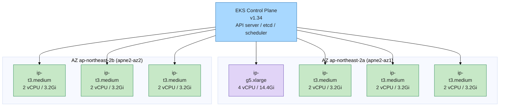
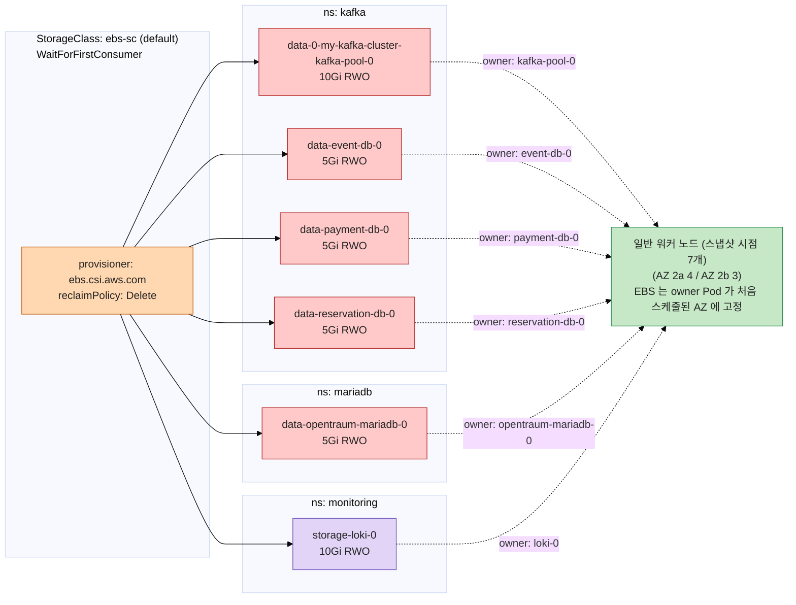

# OpenTraum 인프라 매뉴얼 - EKS 클러스터 / 노드 / 스토리지

> 작성일: 2026-04-28
> 시리즈 인덱스: [00 INDEX](OPENTRAUM-INFRA-00-INDEX.md)
> 이전: [00 INDEX](OPENTRAUM-INFRA-00-INDEX.md) · 다음: [02 NETWORK](OPENTRAUM-INFRA-02-NETWORK.md)

## 목차
- [1. 개요](#1-개요)
- [2. 클러스터 메타데이터](#2-클러스터-메타데이터)
- [3. 노드 인벤토리](#3-노드-인벤토리)
- [4. 노드 할당률 스냅샷](#4-노드-할당률-스냅샷)
- [5. 시스템 컴포넌트](#5-시스템-컴포넌트)
- [6. 스토리지](#6-스토리지)
- [7. 다이어그램](#7-다이어그램)
- [8. 정량 / 튜닝 (현재)](#8-정량--튜닝-현재)
- [9. 트러블슈팅](#9-트러블슈팅)
- [10. 진단 명령어](#10-진단-명령어)

---

## 1. 개요

이 장은 OpenTraum 서비스를 받쳐주는 EKS 클러스터의 컨트롤 플레인 메타, 워커 노드 인벤토리, 영구 스토리지(StorageClass / PVC) 를 다룹니다. 클러스터 외부 진입(ALB, Ingress, ACM, Route53) 과 Pod 간 통신은 [02 NETWORK](OPENTRAUM-INFRA-02-NETWORK.md) 에서, 워크로드별 배치 정책과 affinity 는 [06 OPERATIONS](OPENTRAUM-INFRA-06-OPERATIONS.md) 에서 다룹니다.

본문에 적힌 노드 수, IP, 할당률, PVC 목록은 모두 2026-04-28 15:10 KST 시점에 `kubectl get nodes -o wide`, `kubectl describe node`, `kubectl get pvc -A`, `kubectl get sc` 결과를 그대로 옮긴 것입니다. 이후 노드가 교체되거나 PVC 가 추가/삭제되면 차이가 생길 수 있으므로, 운영 중 의심이 들면 [10. 진단 명령어](#10-진단-명령어) 를 다시 돌려서 비교하시기 바랍니다.

---

## 2. 클러스터 메타데이터

| 항목 | 값 |
|---|---|
| AWS 계정 | <AWS_ACCOUNT_ID> |
| 리전 | ap-northeast-2 (서울) |
| 가용영역(AZ) | ap-northeast-2a (apne2-az1), ap-northeast-2b (apne2-az2) |
| 클러스터명 | <CLUSTER_NAME> |
| 컨트롤 플레인 엔드포인트 | https://<EKS_ENDPOINT_HASH>.gr7.ap-northeast-2.eks.amazonaws.com |
| EKS 컨트롤 플레인 버전 | v1.34 |
| 컨테이너 런타임 | containerd 2.2.1 (모든 노드) |
| OS 이미지 | Amazon Linux 2023 (AL2023.10.20260302 / AL2023.11.20260413) |
| 커널 | 6.12.73-95.123.amzn2023.x86_64 / 6.12.79-101.147.amzn2023.x86_64 |
| kubectl context | arn:aws:eks:ap-northeast-2:<AWS_ACCOUNT_ID>:cluster/<CLUSTER_NAME> |

리전을 ap-northeast-2(서울) 로 둔 이유는 단순합니다. SKALA 클라우드 과정에서 제공되는 실습 계정과 IAM 권한, VPC 청사진이 모두 ap-northeast-2 기준으로 잡혀 있기 때문입니다. 따라서 본 클러스터도 그 위에 올려서 네트워크 지연(서울 사용자 기준) 과 권한 충돌을 동시에 줄였습니다.

EKS 컨트롤 플레인이라는 단어가 자주 등장하는데, 이는 API server, etcd, scheduler, controller-manager 같은 핵심 컴포넌트를 AWS 가 관리형으로 운영해 주는 부분을 말합니다. 우리가 다루는 워커 노드는 그 컨트롤 플레인의 결정을 받아 실제 Pod 를 띄우는 EC2 인스턴스이며, 각 워커에는 kubelet, kube-proxy, 컨테이너 런타임(containerd) 이 함께 돕니다. CRI 는 kubelet 이 컨테이너 런타임과 대화하기 위한 표준 인터페이스로, EKS v1.34 는 dockershim 이 사라진 지 한참 뒤이므로 자연스럽게 containerd 가 기본 런타임이 됩니다.

로컬 개발 머신에서 이 클러스터에 처음 붙거나 토큰이 만료됐을 때는 다음 한 줄로 kubeconfig 를 갱신하면 됩니다.

```bash
aws eks update-kubeconfig --name <CLUSTER_NAME> --region ap-northeast-2
```

이 명령은 `~/.kube/config` 에 위 표의 `kubectl context` 를 등록하고, AWS 자격증명으로 `aws-iam-authenticator` 토큰을 발급해 API server 에 인증하도록 설정합니다.

---

## 3. 노드 인벤토리

노드그룹은 두 개로 구성되어 있습니다. 일반 워크로드용 `general` 노드그룹이 t3.medium × 7 대, GPU 워크로드용 `gpu` 노드그룹이 g5.xlarge × 2 대이며, 총 9 대 모두 ON_DEMAND 입니다. GPU 노드에는 `nodegroup-type=gpu:NoSchedule` taint 가 걸려 있어 toleration 이 없는 일반 Pod 는 자동으로 배제됩니다.

아래 표는 2026-04-28 15:10 KST 시점 스냅샷이며, 일반 노드 7 대 / GPU 노드 1 대가 활성 상태였던 시점입니다 (이후 GPU 노드그룹이 2 대로 확장됨). AZ 분포는 그 시점 기준 AZ 2a 에 4 대, AZ 2b 에 3 대로 비대칭이었습니다.

| 이름 | 내부 IP | 외부 IP | AZ | 인스턴스 타입 | vCPU | Memory(allocatable) | capacityType | 버전 | OS image | kernel | age |
|---|---|---|---|---|---|---|---|---|---|---|---|
| ip-<NODE_1>.ap-northeast-2.compute.internal | <NODE_IP_1> | <EXTERNAL_IP> | 2a | g5.xlarge | 4 | 15147928Ki (~14.4Gi) | ON_DEMAND | v1.34.7-eks-40737a8 | AL2023.11.20260413 | 6.12.79 | 5h33m |
| ip-<NODE_2>.ap-northeast-2.compute.internal | <NODE_IP_2> | (none) | 2a | t3.medium | 2 | 3371448Ki (~3.2Gi) | ON_DEMAND | v1.34.4-eks-f69f56f | AL2023.10.20260302 | 6.12.73 | 5h18m |
| ip-<NODE_3>.ap-northeast-2.compute.internal | <NODE_IP_3> | (none) | 2a | t3.medium | 2 | 3371444Ki | ON_DEMAND | v1.34.4-eks-f69f56f | AL2023.10.20260302 | 6.12.73 | 5h34m |
| ip-<NODE_4>.ap-northeast-2.compute.internal | <NODE_IP_4> | (none) | 2a | t3.medium | 2 | 3371436Ki | ON_DEMAND | v1.34.4-eks-f69f56f | AL2023.10.20260302 | 6.12.73 | 5h34m |
| ip-<NODE_5>.ap-northeast-2.compute.internal | <NODE_IP_5> | (none) | 2b | t3.medium | 2 | 3371440Ki | ON_DEMAND | v1.34.4-eks-f69f56f | AL2023.10.20260302 | 6.12.73 | 5h34m |
| ip-<NODE_6>.ap-northeast-2.compute.internal | <NODE_IP_6> | (none) | 2b | t3.medium | 2 | 3371440Ki | ON_DEMAND | v1.34.4-eks-f69f56f | AL2023.10.20260302 | 6.12.73 | 5h34m |
| ip-<NODE_7>.ap-northeast-2.compute.internal | <NODE_IP_7> | (none) | 2b | t3.medium | 2 | 3371440Ki | ON_DEMAND | v1.34.4-eks-f69f56f | AL2023.10.20260302 | 6.12.73 | 5h18m |

g5.xlarge 한 노드만 외부 IP(<EXTERNAL_IP>) 가 잡혀 있고 나머지는 내부 IP 만 가집니다. 이는 노드 자체에 퍼블릭 IP 를 붙이는 것이 진입 경로가 되지는 않는다는 뜻이며, 실제 외부 진입은 ALB(외부) 와 ALB Ingress Controller 가 담당합니다(자세한 내용은 [02 NETWORK](OPENTRAUM-INFRA-02-NETWORK.md)).

### 3.1 AZ 분포 다이어그램



### 3.2 인스턴스 타입 선택 근거

t3.medium 7 대(general 노드그룹) 는 vCPU 2, 메모리 4GiB(allocatable ~3.2Gi) 의 burstable 인스턴스로, 평소에는 baseline 성능을 쓰다가 짧은 부하 구간에서 CPU credit 을 소모해 turbo 로 올라가는 구조입니다. 학습/데모 환경처럼 트래픽이 항상 높지 않고 비용 민감도가 큰 워크로드에 유리하므로, 백엔드 / 프론트 / 데이터(MariaDB, Redis, Kafka) / 모니터링(Prometheus, Loki) 컴포넌트의 기본 거주지로 활용됩니다.

g5.xlarge 2 대(gpu 노드그룹) 는 NVIDIA A10G GPU(24GB) 가 한 장씩 붙은 인스턴스로, vCPU 4, 메모리 16GiB(allocatable ~14.4Gi) 입니다. 일반 Pod 가 이 노드로 흘러 들어가는 것을 막기 위해 노드그룹 단위로 `nodegroup-type=gpu:NoSchedule` taint 가 걸려 있으며, GPU 워크로드(ML 추론/학습) 만 이에 대응하는 toleration 을 명시해 스케줄됩니다.

### 3.3 ENI 한도 인라인 메모

EKS 의 기본 VPC CNI 는 노드의 ENI(Elastic Network Interface) 에 보조 IP 를 붙여 Pod 에 직접 할당합니다. 그래서 노드 한 대에 띄울 수 있는 Pod 수는 인스턴스 타입의 ENI 개수 × ENI 당 보조 IP 한도로 결정됩니다. t3.medium 의 경우 이 상한이 17개(보안그룹/CNI prefix delegation 미적용 기준) 안팎이며, kube-proxy / aws-node / ebs-csi-node 같은 데몬셋이 이미 자리를 차지하므로 실제 일반 Pod 는 더 적게 들어갑니다. 노드 한 대가 갑자기 가득 차 보이면 CPU/메모리뿐 아니라 이 IP 한도도 같이 의심해야 합니다.

---

## 4. 노드 할당률 스냅샷

확인 시점 2026-04-28 15:10 KST. `kubectl describe node` 의 Allocated resources 블록을 그대로 정리한 표입니다.

| 노드 | CPU req | CPU lim | Mem req | Mem lim |
|---|---|---|---|---|
| ip-<NODE_1> (g5.xlarge) | 180m (4%) | 0 (0%) | 104Mi (0%) | 320Mi (2%) |
| ip-<NODE_2> | 1850m (95%) | 3900m (202%) | 2996Mi (90%) | 5312Mi (161%) |
| ip-<NODE_3> | 900m (46%) | 800m (41%) | 1096Mi (33%) | 2570Mi (78%) |
| ip-<NODE_4> | 940m (48%) | 3200m (165%) | 1094Mi (33%) | 3560Mi (108%) |
| ip-<NODE_5> | 1170m (60%) | 2550m (132%) | 1634Mi (49%) | 3808Mi (115%) |
| ip-<NODE_6> | 1390m (72%) | 3900m (202%) | 2366Mi (71%) | 4136Mi (125%) |
| ip-<NODE_7> | 1050m (54%) | 1100m (56%) | 1280Mi (38%) | 1898Mi (57%) |

ip-<NODE_2> 노드가 CPU req 95%, Mem req 90% 로 가장 부하가 큽니다. requests 가 90% 를 넘는다는 것은 새 Pod 가 이 노드로 스케줄될 여유가 거의 남지 않았다는 뜻이며, 이 노드의 거주 Pod 와 분산 정책은 [06 OPERATIONS](OPENTRAUM-INFRA-06-OPERATIONS.md) 의 Affinity / topologySpread 섹션에서 다룹니다.

표에서 limits 의 % 가 100% 를 넘는 행이 여럿 보이는데, 이는 노드 위 모든 Pod 의 limits 합이 노드 allocatable 을 초과한다는 의미이며 정상 상태입니다. limits 는 burst 상한일 뿐 모든 Pod 가 동시에 그 한도까지 쓰지는 않으므로 over-commit 이 허용됩니다. 다만 실제로 동시에 쓰기 시작하면 OOM 또는 CPU throttling 이 발생할 수 있으므로, requests 합이 노드 allocatable 에 가까워지는 시점이 진짜 위험 신호입니다.

---

## 5. 시스템 컴포넌트

EKS 가 자동으로 깔아 주거나, Helm/매니페스트로 우리가 깐 시스템 레벨 컴포넌트의 현재 버전입니다.

| 컴포넌트 | 버전 |
|---|---|
| aws-ebs-csi-driver | v1.57.1 (sidecars: csi-provisioner v6.2.0, csi-attacher v4.11.0, csi-snapshotter v8.5.0, csi-resizer v2.1.0, livenessprobe v2.18.0) |
| aws-efs-csi-driver | chart 3.4.1 / app 2.3.1 (현재 미사용) |
| VPC CNI | amazon-k8s-cni v1.20.4-eksbuild.2 + aws-network-policy-agent v1.2.7-eksbuild.1 |
| kube-proxy | v1.34.0-eksbuild.2 |
| CoreDNS | v1.12.3-eksbuild.1 |

VPC CNI(amazon-k8s-cni) 는 앞서 언급했듯 노드 ENI 의 보조 IP 를 Pod 에 직접 할당하는 방식으로 동작합니다. 그래서 Pod IP 가 VPC IP 대역(10.0.x.x) 안에 있고, 노드 간 Pod 통신이 별도 overlay 없이 VPC 라우팅으로 그대로 흐릅니다. 이 덕에 ALB Target Group 에 Pod IP 를 IP 타입 타깃으로 직접 등록할 수 있습니다(자세한 내용은 [02 NETWORK](OPENTRAUM-INFRA-02-NETWORK.md)). 같이 도는 aws-network-policy-agent 는 NetworkPolicy 객체를 노드의 eBPF 규칙으로 변환해 강제하는 역할을 합니다.

kube-proxy 는 Service 의 ClusterIP 를 Pod IP 로 풀어 주는 컴포넌트입니다. 운영 모드에는 iptables 와 ipvs 두 가지가 있는데, 본 클러스터는 별도 설정 변경 없이 기본 EKS 설정을 그대로 사용합니다.

CoreDNS 는 클러스터 내 DNS 서버로, Service / Pod 의 이름을 IP 로 해석해 줍니다. 예컨대 `opentraum-mariadb.mariadb.svc.cluster.local` 같은 이름이 풀리는 길이 이 컴포넌트입니다.

EBS CSI 드라이버는 PVC 가 만들어지면 EBS 볼륨을 동적 프로비저닝하고 노드에 attach 한 뒤 Pod 에 mount 시켜 주는 역할을 합니다. EFS CSI 드라이버는 설치는 되어 있으나 현재 PVC 중 EFS 를 쓰는 것이 없으므로 사실상 idle 상태입니다.

---

## 6. 스토리지

### 6.1 StorageClass 3종

| 이름 | provisioner | reclaimPolicy | volumeBindingMode | allowVolumeExpansion | default |
|---|---|---|---|---|---|
| ebs-sc | ebs.csi.aws.com | Delete | WaitForFirstConsumer | false | true |
| efs-sc | efs.csi.aws.com | Delete | Immediate | false | false |
| gp2 | kubernetes.io/aws-ebs | Delete | WaitForFirstConsumer | false | false |

`ebs-sc` 가 default StorageClass 이므로 PVC 가 storageClassName 을 명시하지 않으면 자동으로 이 클래스를 씁니다. provisioner 는 새로운 CSI 표준인 `ebs.csi.aws.com` 이고, reclaimPolicy 가 `Delete` 이므로 PVC 가 지워지면 EBS 볼륨도 함께 사라집니다. 백업이 필요한 데이터는 PVC 삭제 전에 별도로 챙겨야 합니다.

`volumeBindingMode: WaitForFirstConsumer` 의 의미는 이렇습니다. PVC 가 생성되더라도 즉시 EBS 볼륨을 만들지 않고, 그 PVC 를 mount 하는 Pod 가 어느 노드에 스케줄될지 결정될 때까지 기다렸다가 그 노드의 AZ 에서 EBS 를 동적으로 만듭니다. EBS 는 AZ 종속(AZ 2a 에 만든 EBS 는 AZ 2b 노드에 attach 불가) 이므로, 이 모드 덕분에 "PVC 는 2a 에서 만들어졌는데 Pod 는 2b 노드로 스케줄된다" 는 AZ 미스매치 사고가 자연스럽게 막힙니다.

`gp2` 는 옛 in-tree provisioner(`kubernetes.io/aws-ebs`) 를 쓰는 legacy StorageClass 입니다. 새 PVC 에는 권장되지 않으며, 본 클러스터의 PVC 6개 중 어느 것도 gp2 를 사용하지 않습니다.

`efs-sc` 는 EFS 기반으로, 여러 노드에서 동시에 RWX(ReadWriteMany) 마운트가 가능합니다. volumeBindingMode 가 `Immediate` 인 것은 EFS 자체가 AZ 에 묶이지 않아 스케줄 결과를 기다릴 필요가 없기 때문입니다. 다만 현재 워크로드 중 다중 노드에서 동일 파일을 동시에 읽고 쓰는 요구사항이 없어 이 클래스는 미사용 상태입니다.

### 6.2 PVC 인벤토리 (6개)

| 이름 | ns | size | accessMode | StorageClass | owner Pod |
|---|---|---|---|---|---|
| data-0-my-kafka-cluster-kafka-pool-0 | kafka | 10Gi | RWO | ebs-sc | my-kafka-cluster-kafka-pool-0 |
| data-event-db-0 | kafka | 5Gi | RWO | ebs-sc | event-db-0 |
| data-payment-db-0 | kafka | 5Gi | RWO | ebs-sc | payment-db-0 |
| data-reservation-db-0 | kafka | 5Gi | RWO | ebs-sc | reservation-db-0 |
| data-opentraum-mariadb-0 | mariadb | 5Gi | RWO | ebs-sc | opentraum-mariadb-0 |
| storage-loki-0 | monitoring | 10Gi | RWO | ebs-sc | loki-0 |

총 영구 스토리지 용량은 40Gi 이며, 모두 `ebs-sc` 를 사용합니다. accessMode 는 전부 RWO(ReadWriteOnce) 로, 한 노드의 한 Pod 만 동시에 mount 가 가능한 EBS 의 특성을 그대로 반영합니다.

모든 PVC 가 EBS 인 이유는 위 표의 워크로드 특성 때문입니다. Kafka 브로커, MariaDB, 이벤트/예약/결제용 DB, Loki(로그 인덱스/청크) 는 모두 단일 Pod 가 자기 데이터 디렉터리를 독점해서 쓰는 형태이며, 다중 노드에서 동시에 같은 파일을 쓰는 요구가 없으므로 RWO + AZ 종속 EBS 로 충분합니다. 그 대신 트레이드오프가 따라옵니다. 해당 Pod 는 PVC 가 묶인 AZ 의 노드로만 다시 스케줄될 수 있으므로, 그 AZ 에 가용 노드가 사라지면 Pod 가 Pending 으로 멈춥니다. EFS(`efs-sc`) 는 RWX 가 가능하지만 현재 그 요구사항이 없어 미사용 상태이고, `gp2` 는 in-tree legacy provisioner 라 신규 PVC 에는 권장하지 않습니다.

---

## 7. 다이어그램

### 7.1 노드 / AZ 분포도

(섹션 [3.1](#31-az-분포-다이어그램) 의 AZ 분포 다이어그램과 동일하므로 여기서는 다시 그리지 않고 PVC-AZ 바인딩 추정도만 별도로 보입니다.)

### 7.2 PVC - 노드(AZ) 바인딩 추정

EBS 는 AZ 종속이므로 PVC 가 한 번 바인딩되면 그 AZ 의 노드에만 Pod 가 다시 살 수 있습니다. 라이브에서 owner Pod 의 거주 노드를 함께 보면 PVC 가 어느 AZ 에 묶였는지 추정할 수 있습니다(아래 다이어그램의 AZ 매핑은 노드 인벤토리와 PVC owner Pod 를 함께 본 추정이며, 정확한 위치는 운영 시점에 `kubectl get pod -A -o wide` 와 `kubectl describe pv` 로 재확인하시기 바랍니다).



---

## 8. 정량 / 튜닝 (현재)

총 vCPU 는 약 22 코어 (g5.xlarge 2 × 4 + t3.medium 7 × 2). 총 allocatable 메모리는 약 51Gi (g5.xlarge 2 × ~14.4Gi + t3.medium 7 × ~3.2Gi). 영구 스토리지는 EBS 40Gi 한 종류로 통일되어 있고 모두 ebs-sc 를 통해 동적 프로비저닝됐습니다.

가장 부하가 큰 노드는 ip-<NODE_2> 으로 CPU req 95%, Mem req 90% 입니다. 이 수치가 더 올라가면 새 Pod 의 스케줄이 거부되거나 다른 노드로 밀리면서 클러스터 균형이 더 무너질 수 있으므로, 해당 노드의 거주 Pod 분포를 [06 OPERATIONS](OPENTRAUM-INFRA-06-OPERATIONS.md) 에서 확인하고 topologySpread 또는 podAntiAffinity 로 재배치를 검토할 시점입니다.

ebs-sc 가 WaitForFirstConsumer 로 설정된 덕에 EBS 를 한 AZ 에 만들고 Pod 는 다른 AZ 에 떠서 attach 가 실패하는 낭비가 구조적으로 차단됩니다. 이는 학습 환경에서 자주 만나는 실수를 클러스터 레벨에서 막아 주는 안전장치입니다.

9개 노드가 전부 ON_DEMAND 단일 정책인 점은 비용/안정성 트레이드오프입니다. 예측 가능한 비용과 중단 없는 가용성을 얻는 대신, 스팟 인스턴스를 섞어 쓸 때 얻을 수 있는 70% 안팎의 비용 절감 여지를 포기한 상태입니다. 본 클러스터는 SKALA 학습 환경이므로 단순함이 우선이지만, 운영 환경으로 옮긴다면 stateless 워커(프론트, BFF, 웹훅 처리기) 만 별도 노드그룹으로 빼서 스팟에 올리는 패턴이 일반적입니다.

---

## 9. 트러블슈팅

### 9.1 노드 CPU req 95% 도달

- **증상**: 새 Pod 가 Pending 으로 멈추거나 특정 노드만 부하가 쏠림. `kubectl describe node` 의 Allocated resources 가 90% 를 넘어 있음.
- **진단**: `kubectl top nodes` 로 실측 사용률을 확인하고, `kubectl get pods -A -o wide --field-selector spec.nodeName=<해당 노드>` 로 거주 Pod 목록을 확인합니다.
- **원인**: 특정 워크로드(예: 데이터베이스 StatefulSet, Kafka 브로커) 가 한 노드에 몰려 있거나, requests 값을 보수적으로 너무 크게 잡아 둔 Deployment 가 누적된 경우.
- **조치**: 거주 Pod 중 top consumer 를 식별해 requests 를 실측에 맞게 줄이거나, Deployment / StatefulSet 에 topologySpreadConstraints 또는 podAntiAffinity 를 걸어 노드 간 분산을 강제합니다. 자세한 패턴은 [06 OPERATIONS](OPENTRAUM-INFRA-06-OPERATIONS.md) 의 Affinity 섹션을 참고합니다.
- **재발방지**: 신규 Deployment 작성 시 requests 의 근거(부하 테스트 결과 또는 평균 사용률) 를 PR 설명에 남기고, 단일 노드에 같은 종류의 Pod 가 몰리지 않도록 spread 를 기본값으로 두는 컨벤션을 유지합니다.

### 9.2 VolumeBindingFailed (PVC 가 노드 AZ 와 어긋남)

- **증상**: Pod 가 ContainerCreating 단계에서 멈추고 Events 에 `VolumeBindingFailed` 또는 `node(s) had volume node affinity conflict` 가 보임.
- **진단**: `kubectl describe pvc <name>` 로 PVC 가 바인딩된 PV 의 AZ 를 확인하고, `kubectl describe pod <name>` 의 nodeAffinity / Events 를 함께 봅니다.
- **원인**: EBS 는 AZ 종속이므로, PVC 가 AZ 2a 에서 만들어졌는데 Pod 가 AZ 2b 노드로 스케줄될 후보로만 남으면 nodeAffinity 충돌이 발생합니다. 과거에 `volumeBindingMode: Immediate` 로 PVC 를 미리 만들어 둔 뒤 Pod 가 다른 AZ 로 스케줄되는 경우가 전형적입니다.
- **조치**: 신규 PVC 는 WaitForFirstConsumer 가 활성화된 ebs-sc 를 사용하고, 해당 Pod 의 NodeSelector / Affinity 가 PV 의 AZ 와 양립하는지 확인합니다. 기존 PVC 를 옮겨야 하는 상황이라면 데이터를 먼저 복사한 새 PVC 를 만들고 Pod 가 그 PVC 를 바라보도록 매니페스트를 교체하는 식으로 우회합니다(EBS 자체를 다른 AZ 로 옮기는 것은 스냅샷 경유 외에는 불가합니다).
- **재발방지**: PVC 매니페스트에서 storageClassName 을 ebs-sc(default) 로 두고 Immediate 모드 클래스의 사용을 자제합니다. AZ 강제 NodeSelector 를 굳이 박지 않아 스케줄러에 자유도를 남깁니다.

### 9.3 노드 NotReady

- **증상**: `kubectl get nodes` 결과에서 특정 노드가 NotReady 또는 Unknown 으로 표시되고, 그 위 Pod 들이 Terminating 또는 NodeLost 상태로 빠짐.
- **진단**: `kubectl describe node <name>` 의 Conditions(Ready, MemoryPressure, DiskPressure, PIDPressure, NetworkUnavailable) 와 Events 를 먼저 봅니다. 동시에 AWS Console 에서 해당 EC2 인스턴스의 Status check, CloudWatch 메트릭(CPU, EBS I/O, 네트워크) 을 봅니다. 인스턴스 자체는 살아 있으나 kubelet 만 죽은 경우가 가장 흔하므로, SSM Session Manager 로 들어가 `journalctl -u kubelet` 과 `journalctl -u containerd` 를 확인합니다.
- **원인**: kubelet 또는 containerd 의 OOM, 디스크 가득참, AWS 측 네트워크 장애, ENI 한도 초과로 인한 신규 Pod 생성 실패 등.
- **조치**: 컨테이너 런타임이 살아있다면 kubelet 만 재기동(`systemctl restart kubelet`) 으로 회복되는 경우가 많습니다. 인스턴스 자체가 하드웨어 이슈로 흔들리면 노드를 cordon + drain 하고 ASG 가 새 인스턴스로 교체하도록 종료시키는 편이 빠릅니다.
- **재발방지**: 노드 disk pressure 를 막기 위해 이미지 GC 정책과 로그 회전을 점검하고, 시스템 컴포넌트의 requests 를 적정 수준으로 잡아 둡니다.

### 9.4 워커와 컨트롤 플레인 minor version skew

- **증상**: kubelet 이 API server 와의 일부 API 버전을 협상하지 못하거나, 새 기능이 워커에서 동작하지 않음.
- **진단**: `kubectl get nodes` 의 VERSION 컬럼과 `kubectl version --short` 의 Server Version 을 비교합니다.
- **원인**: Kubernetes 의 version skew 정책상 워커 kubelet 은 컨트롤 플레인보다 한 마이너 버전 낮은 것까지만 지원되며, 두 마이너 이상 차이가 나면 미지원 구간으로 들어갑니다.
- **조치**: 현재 본 클러스터의 컨트롤 플레인은 v1.34, 워커는 v1.34.4-eks-f69f56f 와 v1.34.7-eks-40737a8 이 섞여 있어 모두 같은 v1.34 마이너 안에 있습니다. 따라서 지금은 안전 구간이며, 컨트롤 플레인 업그레이드를 진행할 때만 워커 노드그룹 AMI 를 함께 갱신해 skew 가 발생하지 않게 합니다.
- **재발방지**: EKS 컨트롤 플레인 업그레이드 시 노드그룹 업그레이드를 동일 변경 윈도 안에 묶어서 진행하고, 업그레이드 후 `kubectl get nodes` 로 모든 워커 버전이 따라왔는지 검증합니다.

---

## 10. 진단 명령어

```bash
# 노드 인벤토리와 IP, AZ 등 한눈에 보기
kubectl get nodes -o wide

# 부하가 가장 큰 노드의 상세 (Allocated resources, Conditions, Events)
kubectl describe node ip-<NODE_2>.ap-northeast-2.compute.internal

# 실측 사용량
kubectl top nodes

# 영구 스토리지 인벤토리
kubectl get pvc -A
kubectl get sc

# 특정 노드 거주 Pod 만 추출
kubectl get pods -A -o wide --field-selector spec.nodeName=ip-<NODE_2>.ap-northeast-2.compute.internal
```

---

> 다음: [02 NETWORK](OPENTRAUM-INFRA-02-NETWORK.md) 에서 ALB / Ingress / Route53 / ACM 으로 이어지는 외부 진입과 Pod 간 통신을 다룹니다.
