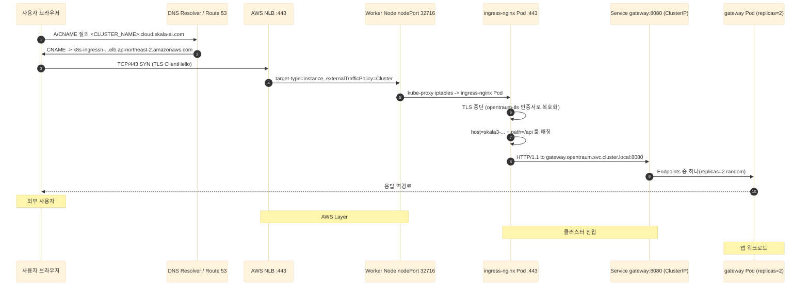

# OpenTraum 인프라 매뉴얼 - 네트워크 / 진입 경로

> 작성일: 2026-04-28
> 시리즈 인덱스: [00 INDEX](OPENTRAUM-INFRA-00-INDEX.md)
> 이전: [01 CLUSTER](OPENTRAUM-INFRA-01-CLUSTER.md) · 다음: [03 WORKLOAD](OPENTRAUM-INFRA-03-WORKLOAD.md)

## 목차
- [1. 개요](#1-개요)
- [2. 도구 스택과 버전](#2-도구-스택과-버전)
- [3. 외부에서 Pod 까지 - 요청 한 건의 여정](#3-외부에서-pod-까지---요청-한-건의-여정)
- [4. Route 53 호스트 매핑](#4-route-53-호스트-매핑)
- [5. NLB 와 Ingress NGINX](#5-nlb-와-ingress-nginx)
- [6. Ingress 매니페스트 라인 단위 분석](#6-ingress-매니페스트-라인-단위-분석)
- [7. cert-manager 와 TLS](#7-cert-manager-와-tls)
- [8. CoreDNS 와 Service Discovery](#8-coredns-와-service-discovery)
- [9. 외부 노출 LB 카탈로그](#9-외부-노출-lb-카탈로그)
- [10. NetworkPolicy](#10-networkpolicy)
- [11. 정량 / 튜닝 (현재)](#11-정량--튜닝-현재)
- [12. 트러블슈팅](#12-트러블슈팅)
- [13. 진단 명령어](#13-진단-명령어)

---

## 1. 개요

이 문서는 OpenTraum 클러스터의 네트워크 진입 경로를 다룹니다. 범위는 외부 DNS(Route 53), L4 부하분산기(NLB), L7 게이트웨이(Ingress NGINX), TLS 자동화(cert-manager), 클러스터 내부 DNS(CoreDNS), 그리고 Pod 네트워킹을 담당하는 VPC CNI 까지입니다. 워크로드 자체와 데이터 평면은 [03 WORKLOAD](OPENTRAUM-INFRA-03-WORKLOAD.md), [04 DATA](OPENTRAUM-INFRA-04-DATA.md) 에서 다루므로, 본 문서는 "어떻게 요청이 클러스터 안으로 들어와 Pod 까지 도달하는가" 에 집중합니다.

정보 출처는 다음과 같습니다.
- 라이브 클러스터 조회 결과 (확인 시점 2026-04-28 15:10 KST): `kubectl get/describe` 출력.
- Helm 차트 설치 정보: `helm list -A` 결과.
- 매니페스트 파일: [../manual/k8s/ingress.yml].

본 문서의 모든 수치와 어노테이션은 위 출처에서 직접 확인된 값만을 적었습니다. 매니페스트 파일과 라이브 상태가 다른 부분(예: opentraum-ingress 의 TLS 섹션)이 존재하는데, 본문 줄글은 라이브 상태 기준으로 서술하고, 매니페스트 라인 분석 표는 파일 내용 그대로 표기한 뒤 차이를 명시합니다.

---

## 2. 도구 스택과 버전

| 컴포넌트 | 버전 | 설치 형태 | 비고 |
|---|---|---|---|
| aws-load-balancer-controller | v3.2.1 | Helm chart aws-load-balancer-controller-3.2.1 | Service type=LoadBalancer 의 NLB 프로비저닝 담당 |
| ingress-nginx-controller | v1.15.1 | Helm chart ingress-nginx-4.15.1 | L7 라우팅, TLS 종단 |
| cert-manager | v1.20.1 | chart cert-manager-v1.20.1 | controller / cainjector / webhook 3 Pod |
| CoreDNS | v1.12.3-eksbuild.1 | EKS managed addon | 클러스터 내부 DNS |
| VPC CNI | amazon-k8s-cni v1.20.4-eksbuild.2 | EKS managed addon | Pod ENI / IP 할당 |
| aws-network-policy-agent | v1.2.7-eksbuild.1 | EKS managed addon | NetworkPolicy 집행(eBPF) |
| kube-proxy | v1.34.0-eksbuild.2 | EKS managed addon | Service ClusterIP iptables 룰 |

aws-load-balancer-controller 와 ingress-nginx-controller 는 역할이 다릅니다. 전자는 Service `type=LoadBalancer` 가 등장하면 AWS NLB(또는 ALB)를 실제로 만들어 주는 컨트롤러이고, 후자는 그 LoadBalancer 뒤에서 HTTP/HTTPS 요청을 받아 Ingress 룰에 따라 Pod 로 넘기는 데이터 평면입니다. 즉 aws-load-balancer-controller 가 "AWS 쪽 박스를 만들어 주는 비서" 라면, ingress-nginx 는 "그 박스 뒤에 앉아 패킷을 까서 분기하는 점원" 입니다.

---

## 3. 외부에서 Pod 까지 - 요청 한 건의 여정

사용자 브라우저에서 `https://<CLUSTER_NAME>.cloud.skala-ai.com/api/health` 를 호출했을 때, 7단계로 Pod 까지 도달합니다. 아래 시퀀스는 라이브 상태 기준입니다.



각 단계의 핵심을 짚으면 다음과 같습니다.

1. 사용자 브라우저가 도메인을 묻습니다. 클라이언트의 DNS resolver 가 위임을 따라 SKALA 공용 Public Hosted Zone 까지 도달합니다.
2. Route 53 가 호스트명을 NLB DNS(`k8s-ingressn-<HASH>.elb.ap-northeast-2.amazonaws.com`) 로 CNAME 응답합니다. → 그래서 사용자는 NLB 의 IP 로 직접 TCP 핸드셰이크를 시도합니다.
3. NLB(443) 는 L4 부하분산기이므로 TLS 를 풀지 않고 TCP 그대로 워커 노드 NodePort 32716 으로 패스스루합니다. target-type=instance 모드라 NLB 는 노드 자체를 타겟으로 등록합니다.
4. 워커 노드의 kube-proxy iptables 룰이 NodePort 32716 패킷을 ingress-nginx-controller Pod 의 443 포트로 DNAT 합니다. externalTrafficPolicy=Cluster 라 Pod 가 같은 노드에 있지 않으면 다른 노드로 한 번 더 점프합니다. → 그래서 source IP 는 SNAT 되어 사라집니다.
5. ingress-nginx Pod 가 TLS 를 종단합니다. 이 시점에 opentraum-tls Secret 의 인증서/키 로 ClientHello 를 처리하고 평문 HTTP 를 얻습니다. 이후 host 헤더(`<CLUSTER_NAME>.cloud.skala-ai.com`) 와 path(`/api`) 를 보고 Ingress 룰에 매칭되는 backend 를 고릅니다.
6. backend 는 ClusterIP Service `gateway:8080` 이므로, Service 의 Endpoints 중 하나(replicas=2 중 랜덤)로 다시 iptables DNAT 됩니다.
7. gateway Pod 가 응답을 만들어 같은 경로를 거꾸로 타고 사용자에게 돌아갑니다. TLS 는 ingress-nginx 가 다시 암호화해 NLB → 사용자 순서로 돌려보냅니다.

---

## 4. Route 53 호스트 매핑

본 문서가 직접 관리하는 호스트는 다음 4 개입니다. Public Hosted Zone(`cloud.skala-ai.com` / `<TEAM_DOMAIN>.cloud.skala-ai.com`) 자체는 SKALA 공용 zone 이라 본 문서의 관리 범위가 아니며, 호스트 레코드만 NLB 로 매핑됩니다.

| 호스트 | 용도 | 백엔드 Ingress | TLS |
|---|---|---|---|
| <CLUSTER_NAME>.cloud.skala-ai.com | OpenTraum 서비스(SPA + API) | opentraum/opentraum-ingress | O (opentraum-tls) |
| argocd.<TEAM_DOMAIN>.cloud.skala-ai.com | Argo CD UI | argocd/argocd-ingress | X |
| (host 없음 - catch-all) | Grafana | monitoring/kube-prometheus-stack-grafana | X |
| (host 없음 + path /prometheus) | Prometheus | monitoring/kube-prometheus-stack-prometheus | X |

네 호스트 모두 동일한 NLB DNS(`k8s-ingressn-<HASH>elb.ap-northeast-2.amazonaws.com`) 로 CNAME 됩니다. → 그래서 NLB 는 호스트 헤더만 보고 ingress-nginx 가 분기하는 구조입니다(ingress-nginx 는 host 가 빈 룰을 catch-all 로 처리). Grafana 와 Prometheus 는 host 가 없는 룰이라, 다른 host 룰에 매칭되지 않은 모든 요청을 받게 됩니다. 운영 환경이라면 명시적 host 부여를 권장합니다.

---

## 5. NLB 와 Ingress NGINX

### 5.1 ingress-nginx LoadBalancer Service

라이브 클러스터의 `ingress-nginx-controller` Service 핵심 필드는 다음과 같습니다.

| 라인 | 값 | 의미 |
|---|---|---|
| spec.type | LoadBalancer | aws-load-balancer-controller 가 NLB 자동 프로비저닝 |
| spec.loadBalancerClass | service.k8s.aws/nlb | in-tree legacy controller 가 아닌 AWS LB Controller 로 위임 |
| spec.externalTrafficPolicy | Cluster | NodePort 도달 후 모든 노드 사이에서 분산. SNAT 발생, source IP 손실 |
| spec.internalTrafficPolicy | Cluster | 클러스터 내부에서도 동일하게 분산 |
| spec.ipFamilyPolicy | SingleStack | IPv4 만 사용 |
| spec.ports[http] | 80, nodePort 31023, targetPort http | NLB 80 -> 노드 31023 -> Pod http |
| spec.ports[https] | 443, nodePort 32716, targetPort https | NLB 443 -> 노드 32716 -> Pod https |
| annotation aws-load-balancer-nlb-target-type | instance | 노드를 타겟으로 등록(반대는 ip 모드, Pod IP 직접 등록) |
| annotation aws-load-balancer-scheme | internet-facing | 퍼블릭 NLB(외부 노출) |
| annotation aws-load-balancer-type | external | EKS 공식 AWS LB Controller 가 처리하라는 시그널 |
| status.loadBalancer.ingress[0].hostname | k8s-ingressn-<HASH>.elb.ap-northeast-2.amazonaws.com | 실제 NLB DNS |

> 참고: 매니페스트 README 등에 "ALB" 로 적힌 곳이 있으나, 위 어노테이션 3종(`aws-load-balancer-type=external` + `aws-load-balancer-nlb-target-type=instance` + `loadBalancerClass=service.k8s.aws/nlb`)이 모두 NLB 를 가리키므로 실제는 **NLB(Network Load Balancer)** 입니다. 본 문서는 NLB 로 통일합니다.

### 5.2 target-type=instance + externalTrafficPolicy=Cluster 의 의미

NLB 가 트래픽을 노드 NodePort 로 던지면, 그 노드의 kube-proxy(iptables) 가 ingress-nginx Pod 가 있는 노드로 다시 라우팅합니다. → 그래서 SNAT 가 발생해 source IP 가 보존되지 않습니다. `X-Forwarded-For` 가 필요한 경우 NLB 의 PROXY protocol 이나 target-type=ip 모드를 검토해야 하지만, 현재는 SKALA 공용 NLB 정책상 instance 모드로 운영합니다.

NLB 는 L4(TCP) 부하분산기라 ALB(L7) 와 달리 호스트/path 기반 라우팅이나 SSL 종단을 수행하지 않습니다. 이 두 기능은 모두 ingress-nginx 가 담당합니다. 즉 "NLB 는 4계층 통과, ingress-nginx 가 7계층 처리" 구조입니다.

---

## 6. Ingress 매니페스트 라인 단위 분석

### 6.1 opentraum-ingress

매니페스트 파일: [../manual/k8s/ingress.yml].

| 키 | 값 (파일) | 의미 / 영향 |
|---|---|---|
| metadata.name | opentraum-ingress | Ingress 리소스 이름 |
| metadata.namespace | opentraum | backend Service(gateway, web) 와 같은 ns 필수 |
| metadata.labels | app.kubernetes.io/part-of=opentraum | 애플리케이션 그룹 식별 |
| annotations.proxy-body-size | 10m | 업로드/요청 본문 한계. nginx 기본 1m 의 10배 |
| annotations.proxy-connect-timeout | 60 | 백엔드 TCP 핸드셰이크 대기(초) |
| annotations.proxy-read-timeout | 300 | 백엔드 응답 대기(초). 긴 처리 대응 |
| annotations.proxy-send-timeout | 60 | 요청 본문 송신 대기(초) |
| spec.ingressClassName | nginx | ingress-nginx-controller 매핑 |
| spec.rules[0].host | <CLUSTER_NAME>.cloud.skala-ai.com | host 헤더 라우팅 키 |
| spec.rules[0].http.paths[0].path | /api | Spring Cloud Gateway 진입 prefix |
| spec.rules[0].http.paths[0].pathType | Prefix | path 가 prefix 로 매칭 |
| spec.rules[0].http.paths[0].backend.service | gateway:8080 | Spring Cloud Gateway Service |
| spec.rules[0].http.paths[1].path | / | Vue SPA 정적 자산 |
| spec.rules[0].http.paths[1].backend.service | web:80 | nginx 정적 호스팅 |

> 라이브 클러스터 차이: 라이브에는 `cert-manager.io/cluster-issuer: letsencrypt-prod` 어노테이션과 `spec.tls[{hosts: [skala3-...], secretName: opentraum-tls}]` 섹션이 적용되어 TLS 가 동작 중입니다. 매니페스트 파일에는 해당 두 항목이 빠져 있어 `kubectl apply` 시 TLS 가 사라질 위험이 있습니다. → 그래서 매니페스트 파일에 TLS 섹션을 동기화해야 합니다(원인 흐름은 12장 사례 1 참고). 라이브 기준으로는 다음 두 항목이 추가됩니다.

| 키 | 값 (라이브) | 의미 / 영향 |
|---|---|---|
| annotations.cert-manager.io/cluster-issuer | letsencrypt-prod | cert-manager-ingress-shim 이 자동으로 Certificate CR 생성 |
| spec.tls[0].hosts[0] | <CLUSTER_NAME>.cloud.skala-ai.com | TLS 적용 호스트 |
| spec.tls[0].secretName | opentraum-tls | cert-manager 가 인증서/키를 저장한 Secret |

### 6.2 그 외 Ingress 3 종

| ns | name | host | path | backend | TLS |
|---|---|---|---|---|---|
| argocd | argocd-ingress | argocd.<TEAM_DOMAIN>.cloud.skala-ai.com | / | argocd-server:80 | X |
| monitoring | kube-prometheus-stack-grafana | (없음, catch-all) | / | kube-prometheus-stack-grafana:80 | X |
| monitoring | kube-prometheus-stack-prometheus | prometheus | /prometheus | kube-prometheus-stack-prometheus:9090 | X |

네 Ingress 모두 `ingressClassName: nginx` 라 같은 ingress-nginx-controller 가 처리하고, 결과적으로 같은 NLB 하나를 공유합니다. → 그래서 NLB 운영 비용이 절감되고, 인증서/라우팅 변경의 단일 진입점을 유지할 수 있습니다.

---

## 7. cert-manager 와 TLS

### 7.1 ClusterIssuer letsencrypt-prod 라인 분석

| 라인 | 값 | 의미 |
|---|---|---|
| spec.acme.email | <ACME_EMAIL> | Let's Encrypt 계정 등록 이메일 |
| spec.acme.privateKeySecretRef.name | letsencrypt-prod | ACME 계정 키가 저장될 Secret(클러스터 단위 1개) |
| spec.acme.server | https://acme-v02.api.letsencrypt.org/directory | 운영 ACME 엔드포인트(staging 아님) |
| spec.acme.solvers[0].http01.ingress.ingressClassName | nginx | HTTP-01 챌린지를 처리할 Ingress class |
| status.conditions[Ready] | True (ACMEAccountRegistered) | ACME 계정 등록 완료 |

운영 endpoint 라 발급 횟수에 rate limit 이 있습니다. 동일 도메인 짧은 시간 다수 발급 시 차단될 수 있어, 테스트 시에는 staging endpoint 로 분리하는 것이 안전합니다.

### 7.2 발급 흐름

```mermaid
%%{init: {'theme':'base'}}%%
flowchart LR
    A[opentraum-ingress<br/>annotation cert-manager.io/cluster-issuer]
    B[cert-manager-ingress-shim]
    C[Certificate CR<br/>opentraum-tls]
    D[Order CR]
    E[Challenge CR<br/>HTTP-01]
    F[ingress-nginx solver<br/>임시 path /.well-known/acme-challenge/...]
    G[Let's Encrypt R12 ICA]
    H[Secret opentraum-tls<br/>tls.crt + tls.key]
    I[opentraum-ingress<br/>spec.tls 사용]

    A --> B --> C --> D --> E --> F --> G --> H --> I

    style A fill:#A8D8FF,stroke:#1F6FB2,color:#222
    style B fill:#A8D8FF,stroke:#1F6FB2,color:#222
    style C fill:#A8D8FF,stroke:#1F6FB2,color:#222
    style D fill:#A8D8FF,stroke:#1F6FB2,color:#222
    style E fill:#A8D8FF,stroke:#1F6FB2,color:#222
    style F fill:#A8D8FF,stroke:#1F6FB2,color:#222
    style G fill:#FFE7A8,stroke:#C58E00,color:#222
    style H fill:#A8D8FF,stroke:#1F6FB2,color:#222
    style I fill:#A8D8FF,stroke:#1F6FB2,color:#222
```



흐름을 짚으면, Ingress 에 `cert-manager.io/cluster-issuer: letsencrypt-prod` 어노테이션과 `spec.tls` 가 함께 있으면 cert-manager 의 ingress-shim 이 Certificate CR 을 자동으로 만듭니다. → Certificate 가 Order 를 만들고, Order 가 Challenge 를 만들면, ingress-nginx solver 가 임시 path `/.well-known/acme-challenge/...` 를 노출해 Let's Encrypt 가 도메인 소유권을 검증합니다. 검증이 끝나면 R12 ICA 로 서명된 인증서가 발급되어 `opentraum-tls` Secret 에 저장되고, opentraum-ingress 가 `spec.tls` 로 그 Secret 을 참조해 TLS 종단에 사용합니다.

### 7.3 갱신과 모니터링

Let's Encrypt 인증서 유효기간은 90일입니다. cert-manager 는 만료 30일 전(즉 발급 후 60일째)에 자동으로 갱신을 시도합니다. → 그래서 운영자는 별도 작업 없이 인증서 만료로 인한 다운타임을 피할 수 있습니다. 상태 확인은 다음 명령으로 합니다.

```bash
kubectl describe certificate opentraum-tls -n opentraum
```

`Status.Conditions` 의 `Ready=True` 와 `Not After` 필드를 확인하면 다음 갱신 시점을 알 수 있습니다.

---

## 8. CoreDNS 와 Service Discovery

### 8.1 ndots:5 와 search domain

Pod 의 `/etc/resolv.conf` 에는 다음이 들어갑니다.

```
search <ns>.svc.cluster.local svc.cluster.local cluster.local
options ndots:5
```

`ndots:5` 의 의미는 "쿼리 이름에 점이 5개 미만이면 search 도메인을 먼저 붙여 본다" 입니다. → 그래서 짧은 이름은 자동 보강되지만, FQDN 처럼 보이는 이름도 점이 4개 이하면 search 가 먼저 시도되어 NXDOMAIN 이 누적됩니다.

예시. opentraum ns 의 Pod 에서 `opentraum-redis.redis` 를 조회하면:
1. `opentraum-redis.redis.opentraum.svc.cluster.local` (ns search) -> NXDOMAIN
2. `opentraum-redis.redis.svc.cluster.local` (svc search) -> 성공

조회 자체는 결국 성공하지만, 첫 번째 NXDOMAIN 응답을 라이브러리가 즉시 실패로 받아들이는 구현이 있다면 곧바로 `UnknownHostException` 이 됩니다. → 그래서 권고는 항상 FQDN 사용입니다.

### 8.2 FQDN 권고

| 잘못된 표기 | 권고 표기 |
|---|---|
| opentraum-redis.redis | opentraum-redis.redis.svc.cluster.local |
| my-kafka-cluster-kafka-bootstrap.kafka | my-kafka-cluster-kafka-bootstrap.kafka.svc.cluster.local |
| gateway | gateway.opentraum.svc.cluster.local |

### 8.3 Service 타입별 DNS

| Service 타입 | DNS 레코드 | 응답 |
|---|---|---|
| ClusterIP | A | Service 의 ClusterIP 1개 |
| Headless (clusterIP=None, 예: my-kafka-cluster-kafka-brokers) | A + SRV | 모든 Endpoint Pod IP 들 |
| LoadBalancer | A (내부) + 외부는 NLB DNS | 클러스터 내부에서는 ClusterIP 와 동일하게 동작, 외부 클라이언트는 NLB DNS 사용 |

Headless Service 는 클라이언트가 Pod 인스턴스 각각을 직접 식별해야 하는 stateful 워크로드(Kafka, MariaDB Galera 등)에 사용됩니다. → 그래서 Strimzi Kafka 의 broker 도메인은 Headless Service 의 SRV 응답을 따라갑니다.

---

## 9. 외부 노출 LB 카탈로그

라이브 기준으로 외부 노출되는 Service `type=LoadBalancer` 는 다음과 같습니다.

| Service | ns | LB 종류 | EXTERNAL hostname (요약) | Port |
|---|---|---|---|---|
| ingress-nginx-controller | ingress-nginx | NLB | k8s-ingressn-<HASH>elb.ap-northeast-2.amazonaws.com | 80, 443 |
| my-kafka-cluster-kafka-external-bootstrap | kafka | NLB | k8s-kafka-mykafkac-<HASH>elb.ap-northeast-2.amazonaws.com | 9094 |
| my-kafka-cluster-kafka-pool-0 | kafka | NLB | k8s-kafka-mykafkac-<HASH2>elb.ap-northeast-2.amazonaws.com | 9094 |

ingress-nginx 의 NLB 는 본 문서에서 다루는 진입점이고, Kafka 외부 리스너 NLB 는 [04 DATA](OPENTRAUM-INFRA-04-DATA.md) 에서 별도로 다룹니다(외부 producer/consumer 가 broker 별 SNI 로 직접 붙기 위함).

---

## 10. NetworkPolicy

라이브 기준 NetworkPolicy 분포는 다음과 같습니다.

| ns | NetworkPolicy 개수 | 출처 |
|---|---|---|
| argocd | 7 | Argo CD 공식 차트가 컴포넌트별(server, repo-server, application-controller 등)로 자동 생성 |
| kafka | 3 | Strimzi 가 my-kafka-cluster 관련 + opentraum-debezium-connect-connect 자동 생성 |
| 그 외 (opentraum, monitoring, redis, ingress-nginx 등) | 0 | 미적용 |

NetworkPolicy 는 Pod 간 통신을 화이트리스트 방식으로 제어합니다. 즉 정책이 적용된 Pod 는 정책이 허용한 트래픽만 받고/보낼 수 있고, 정책이 없는 ns 의 Pod 는 자유 통신을 허용합니다. → 그래서 현재 OpenTraum 앱 워크로드(opentraum ns)는 다른 ns 에서도 Pod 직접 호출이 가능한 상태이며, 향후 zero-trust 강화가 필요하면 ingress-nginx → opentraum, opentraum → redis/kafka/mariadb 만 허용하는 정책 추가를 권고합니다.

집행은 EKS 의 aws-network-policy-agent v1.2.7-eksbuild.1 (eBPF) 가 담당합니다. CNI v1.20.4 와 함께 동작하며, 별도의 Calico/Cilium 설치는 없습니다.

---

## 11. 정량 / 튜닝 (현재)

| 항목 | 값 | 메모 |
|---|---|---|
| proxy-body-size | 10m | nginx 기본 1m 의 10배. 첨부 파일 업로드 여유 |
| proxy-connect-timeout | 60s | 백엔드 TCP 연결 대기 |
| proxy-read-timeout | 300s | 긴 처리 대응(LLM 호출 등) |
| proxy-send-timeout | 60s | 요청 본문 송신 대기 |
| 단일 NLB 공유 호스트 수 | 4 | NLB 운영 비용 절감 |
| TLS 인증서 자동 갱신 주기 | 발급 후 60일째 | Let's Encrypt 90일 만료 - 30일 마진 |
| ingress-nginx-controller replicas | 1 | 현재 단일 인스턴스. 12장 사례 4 참고 |

proxy-read-timeout 을 300s 로 둔 이유는 OpenTraum 게이트웨이가 일부 비동기 처리 결과를 long polling 으로 반환하는 경로가 있어 nginx 기본 60s 로는 끊겼기 때문입니다. → 그래서 5분으로 상향한 상태입니다.

---

## 12. 트러블슈팅

### 12.1 TLS untrusted - 브라우저 "안전하지 않음" 경고 (PR #23)

- **증상**: 사용자 브라우저에서 `NET::ERR_CERT_AUTHORITY_INVALID`. `openssl s_client -connect <CLUSTER_NAME>.cloud.skala-ai.com:443` 의 issuer 가 "Kubernetes Ingress Controller Fake Certificate" 로 응답. `ssl_verify_result=21`.
- **진단**: Ingress 리소스에 `spec.tls` 섹션이 없으면 nginx 는 host 별 인증서를 찾지 못해 default fake cert 를 반환합니다. cert-manager 도 트리거되지 않아 Certificate CR 이 존재하지 않았습니다.
- **원인**: opentraum-ingress 매니페스트에 `cert-manager.io/cluster-issuer` 어노테이션과 `spec.tls` 섹션이 모두 누락.
- **조치**: 어노테이션 `cert-manager.io/cluster-issuer: letsencrypt-prod` 추가 + `spec.tls[0]` 에 host 와 secretName(opentraum-tls) 지정.
- **결과**: 적용 후 11초 만에 Certificate `Ready=True` 도달, 브라우저 경고 해소. 단, 12장 본문 6.1 의 라이브/매니페스트 차이는 매니페스트 파일이 아직 동기화되지 않은 상태라 재적용 시 재현 위험이 있어 매니페스트 정합화가 필요합니다.

### 12.2 Redis DNS 2-label NXDOMAIN

- **증상**: gateway Pod 의 `RedisReactiveHealthIndicator` 가 `UnknownHostException: opentraum-redis.redis` 로 실패.
- **진단**: `kubectl exec -n opentraum deploy/gateway -- nslookup opentraum-redis.redis` 가 첫 번째 search 도메인(`opentraum-redis.redis.opentraum.svc.cluster.local`) 에서 NXDOMAIN 후 fallback 전에 클라이언트가 포기.
- **원인**: ndots:5 + search 순회 중 점 1개짜리 이름이 FQDN 으로 인식되지 않음.
- **조치**: 애플리케이션 설정에서 호스트를 `opentraum-redis.redis.svc.cluster.local` (FQDN) 로 변경.
- **결과**: 단일 쿼리로 즉시 응답, health check 정상화.

### 12.3 kubelet Service env 유령 IP

- **증상**: Pod 내부 환경변수에 더 이상 존재하지 않는 Service 의 `*_SERVICE_HOST`, `*_SERVICE_PORT` 가 주입되어, 일부 라이브러리가 그 IP 로 연결 시도 후 connection refused.
- **진단**: `kubectl exec ... -- env | grep _SERVICE_HOST` 출력에 dead Service 흔적 확인.
- **원인**: kubelet 은 Pod 시작 시점에 같은 ns 의 모든 Service 를 env 로 주입합니다(`enableServiceLinks` 기본 true). Pod 시작 후 Service 가 삭제되어도 이미 주입된 env 는 유지되며, Pod 가 재시작되어도 그 시점의 Service 목록을 새로 주입합니다.
- **조치**: 사용하지 않는 dead Service 정리 + 향후 새 Pod 의 env 오염 방지. 필요 시 PodSpec 에 `enableServiceLinks: false` 적용 가능.
- **결과**: 신규 Pod 의 env 오염 제거.

### 12.4 ingress-nginx-controller replicas=1 한계

- **증상**: ingress-nginx-controller Pod 가 drain/rollout 되는 짧은 구간에 외부 요청이 502.
- **진단**: replicas=1 이라 새 Pod 가 Ready 되기 전 NLB 의 healthy target 이 0 이 되는 순간이 존재.
- **원인**: 단일 인스턴스 + PDB(PodDisruptionBudget) 미설정.
- **현재 상태**: 인지된 한계로 표기. 트래픽이 낮은 시간대에만 운영 작업을 수행 중.
- **권고**: replicas=2 로 증설 + `minAvailable: 1` PDB 설정 + readiness probe 와 pre-stop hook 검토. 클러스터 노드 수가 충분하므로 비용 영향은 제한적입니다.

---

## 13. 진단 명령어

```bash
# Pod 내부에서 FQDN 정상 응답 확인
kubectl exec -n opentraum deploy/gateway -- nslookup opentraum-redis.redis.svc.cluster.local

# Ingress 전체 목록과 host/path 한눈에 보기
kubectl get ingress -A

# opentraum-ingress 어노테이션과 backend 검증
kubectl describe ingress opentraum-ingress -n opentraum

# Certificate Ready 상태와 다음 갱신 시점 확인
kubectl describe certificate opentraum-tls -n opentraum

# ClusterIssuer 의 ACME 계정/엔드포인트 확인
kubectl get clusterissuer letsencrypt-prod -o yaml

# ingress-nginx LoadBalancer Service 의 NLB DNS 와 어노테이션 확인
kubectl get svc -n ingress-nginx ingress-nginx-controller

# NetworkPolicy 분포 확인
kubectl get networkpolicy -A
```

위 명령들은 본 문서의 모든 라이브 사실을 재확인하는 1차 진단 도구입니다. 이상이 보이면 12장의 사례별 진단 흐름을 따라 좁혀 가면 됩니다.
