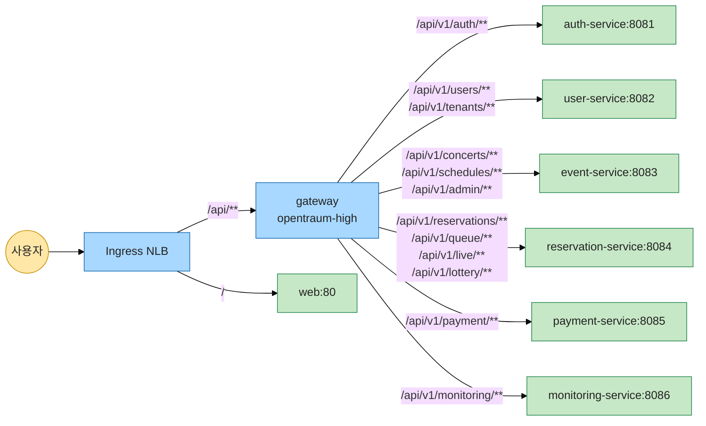
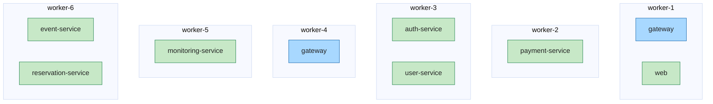

# OpenTraum 인프라 매뉴얼 - 워크로드 자원 산정

> 작성일: 2026-05-03
> 시리즈 인덱스: [00 INDEX](OPENTRAUM-INFRA-00-INDEX.md)
> 이전: [02 NETWORK](OPENTRAUM-INFRA-02-NETWORK.md) · 다음: [04 DATA](OPENTRAUM-INFRA-04-DATA.md)

## 목차

- [1. 개요](#1-개요)
- [1.5 핵심 개념 입문: request, limit, QoS, evict](#15-핵심-개념-입문-request-limit-qos-evict)
- [2. 클러스터 인벤토리](#2-클러스터-인벤토리)
- [3. 산정 기준](#3-산정-기준)
- [4. 서비스별 산정](#4-서비스별-산정)
- [5. JVM 옵션과 자원 산정의 정합](#5-jvm-옵션과-자원-산정의-정합)
- [6. opentraum 워크로드 카탈로그 (보조 정보)](#6-opentraum-워크로드-카탈로그-보조-정보)
- [7. 정량 / 튜닝](#7-정량--튜닝)
- [8. 트러블슈팅](#8-트러블슈팅)
- [9. 진단 명령어](#9-진단-명령어)

---

## 1. 개요

이 장은 OpenTraum 클러스터 `opentraum` 네임스페이스의 8개 서비스 Pod 자원(CPU/Memory request, limit) 산정을 다룹니다. 범위는 다음과 같습니다.

- gateway, auth-service, user-service, event-service, payment-service, reservation-service, monitoring-service - Spring Boot 7개 서비스. Liberica JRE 21 기반.
- web - NGINX 정적 파일 서빙. Spring 과 자원 특성이 달라 별도 산정.

산정의 출발점은 두 가지입니다. 첫째, 일부 t3.medium 노드의 CPU request 점유율이 99% 까지 차서 신규 Pod 스케줄링 여유가 좁았습니다. 둘째, 일부 Spring 서비스는 memory request 가 idle 사용량보다 작아 노드 메모리 압박 시 evict 보호 우선순위가 약화된 상태였습니다. 측정값으로 자원을 다시 잡아 클러스터 점유 여유를 확보하고 메모리 보호 우선순위를 정상화하는 것이 목적입니다.

산정 결과를 한 줄로 요약하면 다음과 같습니다. 8개 서비스 모두 `requests = limits` 로 두어 Guaranteed QoS 클래스로 분류되도록 했고, Spring 7개 서비스는 Memory 512Mi 로 통일, CPU 는 서비스별 startup 시간 실측을 기준으로 200~350m 사이에 차등 산정했습니다. web 은 CPU 50m / Memory 64Mi 로 별도 산정하고 replica 를 2 에서 1 로 축소했습니다.

CPU 를 startup 시간 실측으로 잡은 이유는 평소 사용량(idle) 만 보고 결정하면 기동할 때 잠깐 튀는 CPU burst 를 놓치기 때문입니다. Spring Boot 7개 서비스는 같은 JVM 옵션을 쓰지만 의존성(DB R2DBC, Redis, Kafka) 무게가 달라서 기동 시간이 서비스마다 1.5배까지 벌어집니다. 모든 서비스에 같은 값을 주면 가벼운 쪽에는 과하고 무거운 쪽에는 부족합니다. 그래서 별도 namespace 에 같은 이미지로 Pod 를 띄우고 CPU limit 을 200m → 250m → 300m 식으로 바꿔가며 기동 시간을 직접 재서, startupProbe 의 허용 한도(65초) 안에 충분히 들어오는 값을 서비스별로 채택합니다. 산정 절차는 [3장](#3-산정-기준), 서비스별 측정값은 [4장](#4-서비스별-산정) 에 있습니다.

본문에 적힌 모든 측정값과 자원 정의는 2026-05-03 기준 `kubectl top pod -n opentraum --containers`, `kubectl describe node`, 각 서비스 리포지토리의 `k8s/deployment.yml` 원본을 직접 읽어 옮긴 것입니다. startup 시간 실측은 별도 검증용 namespace `opentraum-test` 에서 동일 이미지·노드·환경으로 진행했습니다. 산정 기준의 외부 근거는 Kubernetes 공식 블로그(2023-11-16), Bellsoft Java on Kubernetes 가이드 두 곳이며 [3장](#3-산정-기준) 에 직접 인용합니다.

---

## 1.5 핵심 개념 입문: request, limit, QoS, evict

본 문서가 결정하는 값은 모두 Pod 자원의 request 와 limit 두 숫자입니다. 이 두 값이 얼마인지에 따라 Pod 의 QoS 클래스가 정해지고, 노드 자원이 부족할 때 누가 먼저 강제 종료되는지가 결정됩니다. 2장 이후의 표를 읽기 전에 이 절에서는 네 개념(request, limit, QoS, evict) 의 관계부터 정리합니다.

### 1.5.1 request 와 limit 이 둘 다 필요한 이유

Pod 가 컨테이너로 정의될 때 자원은 `requests` 와 `limits` 두 값으로 표현됩니다. 두 값이 가리키는 대상은 다릅니다.

- **request 는 스케줄러가 보는 값입니다**. kube-scheduler 는 Pod 를 어느 노드에 배치할지 결정할 때 노드의 allocatable 자원에서 이미 배치된 Pod 들의 request 합을 뺀 여유를 봅니다. request 는 "이만큼은 무조건 자리를 잡아두고 시작하겠다" 는 예약값입니다.
- **limit 은 컨테이너 런타임이 보는 값입니다**. kubelet 이 Linux cgroup 에 limit 값을 설정해, 컨테이너가 그 이상 CPU 를 쓰려 하면 throttle 되고 Memory 를 그 이상 쓰려 하면 OOMKill 됩니다. limit 은 "이 이상은 절대 못 쓴다" 는 상한값입니다.

두 값을 다르게 둘 수도 있습니다. request 50m / limit 200m 으로 두면 평소에는 50m 만 예약하지만 여유가 있을 때는 200m 까지 burst 가능합니다. 이를 over-commit 이라 부르며 노드 효율은 좋아지지만 burst 가 동시에 일어났을 때 throttle 또는 OOMKill 위험이 생깁니다.

### 1.5.2 QoS 클래스: Guaranteed / Burstable / BestEffort

kubelet 은 Pod 의 request 와 limit 조합을 보고 QoS 클래스를 자동으로 분류합니다. 분류 규칙은 다음과 같습니다.

| 조건 | QoS 클래스 |
|---|---|
| 모든 컨테이너에서 `requests = limits` (CPU 와 Memory 둘 다) | Guaranteed |
| 일부 컨테이너에서 request 만 있고 limit 없음, 또는 request < limit | Burstable |
| request 와 limit 모두 미설정 | BestEffort |

QoS 클래스가 중요한 이유는 노드 메모리가 부족해 어떤 Pod 를 강제 종료(evict) 해야 할 때 이 등급이 우선순위를 정하기 때문입니다.

### 1.5.3 evict: 노드 메모리 압박 시 누가 먼저 죽는가

kubelet 은 노드 메모리가 일정 임계치(`evictionHard.memory.available`) 아래로 떨어지면 Pod 를 강제 종료합니다. 종료 우선순위는 다음 순서입니다.

1. **BestEffort Pod 먼저** (request 도 limit 도 없는 Pod 가 가장 보호 약함)
2. **Burstable Pod 중 request 대비 실제 사용량이 큰 순서**
3. **Guaranteed Pod 마지막** (가장 늦게 evict)

같은 노드에 Guaranteed Pod 와 Burstable Pod 가 같이 있으면 Burstable 이 먼저 죽습니다. → 그래서 비즈니스 핵심 경로의 Pod 는 Guaranteed 로 두는 것이 일반적인 패턴입니다.

본 산정에서 8개 서비스를 모두 Guaranteed 로 통일한 의도가 여기 있습니다. 노드 메모리 압박이 와도 8개 서비스 모두 마지막 순서까지 보호되며, 같은 노드에 떠 있을 수 있는 다른 ns 의 Burstable Pod(예: Prometheus, Grafana 같은 모니터링 인프라) 가 먼저 evict 되어 메모리가 회수됩니다.

### 1.5.4 CPU 와 Memory 의 동작 차이

같은 limit 이라도 CPU 와 Memory 는 한도 초과 시 동작이 다릅니다.

- **CPU limit 초과 → throttle**: cgroup 이 그 시간 슬라이스에서 CPU 를 잠시 회수합니다. Pod 는 죽지 않고 응답 지연만 늘어납니다. 회복 가능한 상태입니다.
- **Memory limit 초과 → OOMKill**: 즉시 컨테이너가 SIGKILL 로 강제 종료됩니다. graceful shutdown 도 없고 in-flight 요청이 모두 끊깁니다. 회복 불가능한 종료입니다.

→ 그래서 Memory 는 CPU 보다 보수적으로 잡아야 합니다. CPU 는 limit 을 좀 빡빡하게 두어도 throttle 만 발생하지만, Memory 는 부족하면 즉시 OOMKill 됩니다. 본 산정에서 측정 idle 의 30% 헤드룸을 둔 이유가 여기 있습니다.

### 1.5.5 request = limit 이 만드는 트레이드오프

`request = limit` 으로 두면 두 가지가 동시에 발생합니다.

- **장점**: Pod 가 Guaranteed QoS 로 분류되어 가장 늦게 evict 되고, 같은 컨테이너의 자원 사용량이 측정 시점마다 일정해 모니터링과 capacity planning 이 단순해집니다.
- **단점**: burst 가 불가능합니다. 일시적으로 request 보다 더 많은 CPU 를 쓰고 싶어도 cgroup 이 limit 에서 throttle 합니다. 노드 over-commit 도 사라져 클러스터 자원 효율이 떨어집니다.

본 산정은 OpenTraum 워크로드 특성상 idle 사용량이 startup 시점 채택값의 1~5% 수준이라 burst 헤드룸이 거의 의미가 없고, 오히려 Guaranteed QoS 의 evict 보호가 더 중요하다고 판단해 `request = limit` 을 선택했습니다. 근거는 [3장](#3-산정-기준) 에서 다룹니다.

이상으로 자원 산정 의사결정에 필요한 기본기는 정리됐고, 2장부터는 실제 클러스터 인벤토리와 측정값으로 들어갑니다.

---

## 2. 클러스터 인벤토리

본 산정의 대상이 되는 일반 노드 자원과 재산정 전 네임스페이스별 점유 상태를 정리합니다.

### 2.1 일반 노드 인벤토리

`opentraum` 네임스페이스 워크로드는 모두 일반 노드그룹(`skala3-cloud1-team8-ng`, t3.medium x 7대) 에 배치됩니다. GPU 노드그룹(g5.xlarge x 2대) 과 그 위에 떠 있는 GPU 워크로드(nemotron-vllm, flux-image, gpu-monitoring) 는 nodegroup taint(`nodegroup-type=gpu:NoSchedule`) 로 격리되어 본 산정 범위에서 제외됩니다.

일반 노드 한 대의 allocatable 과 7대 합계는 다음과 같습니다.

| 항목 | 값 |
|---|---|
| 노드당 CPU allocatable | 1930m |
| 노드당 Memory allocatable | 3292Mi (약 3.2 GiB) |
| 7대 합계 CPU | 13510m |
| 7대 합계 Memory | 23044Mi (약 22.5 GiB) |

t3.medium 의 vCPU 2 / Memory 4 GiB 중 일부가 EKS 의 system-reserved, kube-reserved, eviction threshold 로 빠져 allocatable 이 위 값으로 줄어듭니다.

### 2.2 네임스페이스별 점유 (재산정 전)

재산정 전 일반 노드 점유 현황입니다. CPU / Memory 모두 request 합계 기준입니다.

| Namespace | CPU req | Memory req |
|---|---|---|
| opentraum (AI 제외) | 2700m | 2816Mi |
| kafka | 1700m | 3456Mi |
| kube-system | 1500m | 1428Mi |
| monitoring | 300m | 1452Mi |
| mariadb | 300m | 576Mi |
| ingress-nginx | 100m | 90Mi |
| redis | 50m | 128Mi |
| argocd, cert-manager | 0m | 0Mi |
| 합계 | 6650m | 9946Mi |

전체 점유율은 CPU 49.2% (6650m / 13510m) / Memory 43.2% (9946Mi / 23044Mi) 로 평균은 여유가 있습니다 (재산정 시점 기준 keda 네임스페이스는 별도 정리로 삭제되어 본 표에서 제외). 그러나 개별 노드 점유는 99% 까지 편중되어 있어, 신규 Pod 가 들어올 빈 자리를 찾기 어려운 상태였습니다. 본 산정의 직접 동기는 이 편중을 완화하는 것이며, 노드 분포 불균형 자체의 해소(podAntiAffinity, topologySpreadConstraints, descheduler) 는 별도 작업입니다.

---

## 3. 산정 기준

본 산정은 다음 네 가지 원칙을 따릅니다. 각 원칙은 외부 출처를 직접 인용하거나 직접 측정으로 근거를 확보합니다.

### 3.1 CPU 는 기동 시간을 직접 재서 서비스별로 잡는다

`kubectl top pod -n opentraum --containers` 로 잰 평소(idle) CPU 사용량은 서비스마다 2~9m 입니다. 이 값을 그대로 request 로 두면 기동할 때 잠깐 필요한 CPU 를 못 받아 기동이 늦어지고, startupProbe 가 정한 한도(65초) 안에 기동을 마치지 못해 컨테이너가 죽고 다시 뜨기를 반복합니다.

idle 만 보고 모든 서비스에 같은 단일 값(예: 200m) 을 주는 방식도 가능하지만 그 값이 충분한지 직접 확인할 방법이 없습니다. Spring Boot 7개 서비스는 같은 JVM 옵션을 쓰지만 의존성(R2DBC, Redis, Kafka) 무게가 달라 기동 시간이 서비스마다 1.5배까지 벌어지기 때문에, 단일 값으로 통일하면 가벼운 서비스에는 과하고 무거운 서비스에는 부족할 수 있습니다.

그래서 본 산정은 **CPU limit 을 바꿔가며 기동 시간을 직접 재고, 한도 안에 충분히 들어오는 값을 서비스별로 채택**합니다. 측정으로 확인된 비례 관계는 다음과 같습니다.

```
JIT 컴파일과 클래스 로딩의 작업량 = CPU × 시간 ≒ 일정
→ CPU 를 N 배 늘리면 시간이 N 배 짧아진다
→ 측정한 작업량을 65초 안에 끝내는 데 필요한 CPU 를 역산
```

산정 절차:

1. 별도 namespace (예: `opentraum-test`) 에 같은 이미지로 Pod 를 띄운다
2. CPU limit 을 200m → 250m → 300m 식으로 바꿔가며 `Started <Name> in N seconds` 로그의 N 값을 잰다
3. 65초 한도 대비 여유 +20% 이상이 나오는 값을 채택한다

여유 +20% 의 근거는 기동 시간의 실측 변동(노드 부하·디스크 캐시 미적재 등) 이 통상 ±15% 안에 들어오므로, 이 변동 폭을 마진으로 덮기 위함입니다. 여유가 +10% 보다 작으면 평소 변동만으로도 65초를 넘겨 CrashLoopBackOff 가 발생할 위험이 생깁니다.

Bellsoft 의 Java on Kubernetes 가이드도 idle 만 보고 limit 을 잡는 위험을 명시적으로 경고합니다.

출처: https://bell-sw.com/blog/7-tips-to-optimize-java-performance-on-kubernetes/

> "Don't set the limits too low. Even if your application consumes fewer resources under stable load, it needs more CPU for warmup and peak loads".

Bellsoft 는 OpenTraum 의 Spring Boot 베이스 이미지(`liberica-openjre-alpine:21`) 의 제작사이므로 같은 JVM 기동 특성에 가장 가까운 출처입니다.

서비스별 측정값과 채택 limit 은 [4장](#4-서비스별-산정) 표에 정리합니다.

### 3.2 startupProbe 한도와 probe 가 없는 서비스의 처리

본 산정에서 startup 실측이 의미를 가지는 이유는 startupProbe 한도를 넘기면 kubelet 이 컨테이너를 SIGTERM 으로 종료하기 때문입니다. 한도는 다음 식으로 계산합니다.

```
startupProbe 한도 = initialDelaySeconds + periodSeconds × failureThreshold
```

본 산정 8개 서비스 중 startupProbe 가 정의된 서비스는 gateway, auth-service, user-service, monitoring-service 4개입니다. 앞 3개는 한도 65초(5 + 3 × 20), monitoring 은 한도 95초(5 + 3 × 30) 입니다. event-service, payment-service, reservation-service, web 4개는 startupProbe 가 없어 한도가 적용되지 않습니다.

probe 가 없는 서비스는 기동 시간이 길어져도 컨테이너가 죽지 않으므로 65초 한도가 산정 제약이 되지 않습니다. 기동 시간 실측은 의미가 없고 평소 사용량(idle) 의 약 22배 여유인 200m 을 적용합니다. 대신 새 Pod 가 트래픽을 받기까지 시간이 길어지는 운영 부담은 있습니다 (200m 환경에서 event/payment/reservation 의 실측 기동 시간은 약 77~99초). 본 산정은 이 부담보다 자원 절감을 우선해 200m 으로 유지합니다. 8개 서비스의 probe 정의 차이는 [6.2](#62-probe--종료-정책-한-장-표) 표에 정리합니다.

### 3.3 Memory 측정 idle + 30% 헤드룸 + 64Mi 단위 반올림

측정한 idle Memory 사용량은 서비스별로 219~347Mi 입니다. 트래픽이 들어왔을 때 한계에 닿지 않도록 30% 안전 마진을 더하고, JVM heap 의 자연스러운 단위인 64Mi 로 반올림합니다.

```
측정 idle = 219~347Mi (서비스별)
헤드룸 30% (idle × 1.3) = 285~451Mi
64Mi 단위 반올림 = 512Mi
```

30% 와 64Mi 는 공식 출처가 있는 수치는 아니고 측정값 + 안전 마진 관행에 따른 정성적 결정입니다. 30% 의 근거는 평소 idle 대비 요청 처리 시 메모리 사용량이 1.2~1.4배 늘어난다는 일반적 관측이고, 64Mi 단위는 Spring Boot 의 heap 청크 단위와 가까워 JVM 이 메모리를 회수하거나 확장할 때 단편화가 적어진다는 점에서 선택했습니다.

Memory 는 CPU 와 달리 startup 시점에 추가 burst 가 작아(보통 idle 의 1.2배 이내) idle 기반 단일 산정으로 충분합니다.

### 3.4 request = limit 으로 두는 정책 적용

CPU 와 Memory 모두 산정한 값을 request 와 limit 두 자리에 동일하게 적용합니다. Kubernetes 공식 블로그(2023-11-16) 가 두 값을 같게 두면 성능이 예측 가능하고 Pod 가 Guaranteed QoS 클래스로 분류된다고 권장합니다.

출처: https://kubernetes.io/blog/2023/11/16/the-case-for-kubernetes-resource-limits/

> "Configure workloads with requests = limits ... the performance is fairly predictable. This also puts the pod into the Guaranteed QoS class".

Memory 의 경우 한도 초과 시 즉시 OOMKill 이 발생하므로 limit 을 request 보다 크게 잡으면 노드 메모리 압박 시 오히려 evict 우선 대상이 됩니다. → 그래서 Memory 도 `request = limit` 으로 둡니다.

### 3.5 Web 은 NGINX 정적 서빙 특성으로 별도 산정

Web 은 NGINX 가 정적 파일을 서빙하는 단순 워크로드라 Spring Boot 와 자원 특성이 완전히 다릅니다. 측정 idle 은 CPU 1m / Memory 3Mi 수준이며 JVM 도 없어 startup 실측 기반 산정이 의미가 없습니다.

```
측정 idle = 1m / 3Mi
CPU req = lim = 50m  (idle 약 50배 여유, NGINX startup 안전하한)
Memory req = lim = 64Mi  (idle 약 20배 여유, 64Mi 최소 단위)
replica 2 → 1 (학습 환경 트래픽에서 단일 Pod 충분)
```

Web 의 replica 를 2 에서 1 로 축소한 이유는 학습 환경의 동시 사용자 수가 단일 NGINX Pod 가 충분히 처리 가능한 수준이고, 다른 Spring 서비스가 모두 replica 1 로 운영되는 일관성을 맞추기 위함입니다.

---

## 4. 서비스별 산정

8개 서비스 각자의 측정 idle, 200m 환경 기동 시간, startupProbe 한도, 변경 전 값, 적용 값, QoS 변화를 표로 정리합니다.

| 서비스 | 측정 idle (cpu/mem) | 200m 기동 시간 | startupProbe 한도 | 변경 전 (req cpu/mem) | 변경 전 (lim cpu/mem) | 변경 후 (req=lim cpu/mem) | QoS 변화 |
|---|---|---|---|---|---|---|---|
| gateway | 2m / 243Mi | 68.2s | 65s | 500m / 256Mi | 1000m / 512Mi | **300m / 512Mi** | Burstable -> Guaranteed |
| auth-service | 3m / 306Mi | 66.7s | 65s | 250m / 256Mi | 1000m / 1024Mi | **300m / 512Mi** | Burstable -> Guaranteed |
| user-service | 2m / 288Mi | 81.4s | 65s | 250m / 256Mi | 1000m / 1024Mi | **350m / 512Mi** | Burstable -> Guaranteed |
| event-service | 7m / 291Mi | 76.7s | 없음 | 250m / 512Mi | 500m / 768Mi | 200m / 512Mi | Burstable -> Guaranteed |
| payment-service | 9m / 320Mi | 93.0s | 없음 | 500m / 512Mi | 500m / 512Mi | 200m / 512Mi | Guaranteed 유지 |
| reservation-service | 9m / 347Mi | 99.1s | 없음 | 500m / 512Mi | 500m / 512Mi | 200m / 512Mi | Guaranteed 유지 |
| monitoring-service | 3m / 219Mi | 65.2s | 95s | 250m / 256Mi | 1000m / 768Mi | 200m / 512Mi | Burstable -> Guaranteed |
| web | 1m / 3Mi (replica 2) | n/a | 없음 | 100m / 128Mi | 300m / 256Mi | 50m / 64Mi (replica 1) | Burstable -> Guaranteed |

서비스별로 짚을 점은 다음과 같습니다.

**gateway, user, auth 는 startupProbe 한도가 65초이며 200m 으로는 그 한도를 넘깁니다.** 그래서 [3.1](#31-cpu-는-기동-시간을-직접-재서-서비스별로-잡는다) 의 절차로 limit 을 단계별로 올려가며 다시 측정해, 65초 한도 대비 여유 +20% 이상이 나오는 값을 서비스별로 채택했습니다.

| 서비스 | 채택 limit | 채택 limit 기동 시간 | 65초 대비 여유 |
|---|---|---|---|
| auth | 300m | 46.9s | +38% |
| gateway | 300m | 48.4s | +34% |
| user | 350m | 46.1s | +41% |

**event, payment, reservation 은 startupProbe 가 정의되어 있지 않습니다.** 200m 기동 시간이 77~99초로 길지만 probe 가 없어 컨테이너가 죽지 않으므로 65초 한도가 산정 제약이 아닙니다. 200m 으로 유지합니다 (사유는 §3.2 참고).

**monitoring 은 startupProbe 한도가 95초로 다른 서비스보다 길게 잡혀 있습니다.** failureThreshold 가 20 이 아닌 30 이라 5 + 30 × 3 = 95초입니다. 200m 기동 시간 65.2초가 한도 95초의 69% 수준이라 마진이 충분합니다. 200m 으로 유지합니다.

**event-service 의 변경 전 limit memory 768Mi** 는 OpenAI API 응답 캐시 + Kafka 컨슈머 처리 동시 부하 시 OOMKilled 가 반복되어 다른 백엔드의 1.5배로 상향되었던 이력이 있습니다(이전 운영 단계 트러블슈팅 사례). 본 산정 시점의 측정 idle 은 291Mi 로 안정 수렴했고, 다른 서비스와 동일하게 512Mi 로 정규화합니다. OpenAI API 호출량이 학습 환경 부하 범위에서 idle 291Mi + 30% 헤드룸 안에 들어옴을 측정으로 확인했습니다.

**web 은 replica 도 함께 줄입니다.** 변경 전 replica 2 (각 100m / 128Mi req, 300m / 256Mi lim) 였으나 측정 idle 이 두 Pod 합쳐도 2m / 6Mi 수준으로 단일 Pod 충분합니다. replica 1 + 50m / 64Mi 로 축소합니다.

---

## 5. JVM 옵션과 자원 산정의 정합

8개 서비스 중 7개 Spring Boot 서비스(gateway, auth, user, event, payment, reservation, monitoring) 는 모두 동일한 JAVA_OPTS 를 사용합니다. 나머지 1개(web) 는 NGINX 기반이라 JVM 옵션이 적용되지 않습니다. 본 산정의 Memory 512Mi 결정은 이 JVM 옵션과 직접 맞물려 있습니다.

```bash
-XX:+UseContainerSupport
-XX:MaxRAMPercentage=75.0
-XX:+TieredCompilation
-XX:TieredStopAtLevel=1
```

각 옵션의 의미와 본 자원 산정과의 관계는 다음과 같습니다.

| 옵션 | 의미 | 자원 산정과의 관계 |
|---|---|---|
| `-XX:+UseContainerSupport` | JVM 이 cgroup limit 을 인식해 호스트 자원이 아닌 컨테이너 자원 기준으로 동작 | Memory limit 512Mi 가 JVM heap 산정의 기준이 됨 |
| `-XX:MaxRAMPercentage=75.0` | heap 최대 크기를 컨테이너 memory limit 의 75% 로 설정 | 512Mi × 75% = 384Mi heap, 나머지 128Mi 가 metaspace, thread stack, direct memory, GC overhead 헤드룸 |
| `-XX:+TieredCompilation` | JIT 컴파일러를 단계적으로 적용 (C1 -> C2) | startup 시 빠른 컴파일로 startup CPU burst 를 줄임 |
| `-XX:TieredStopAtLevel=1` | C1 까지만 컴파일하고 C2(고성능 최적화) 는 안 함 | startup 우선 + 메모리 절약, 장기 처리량 일부 손해 |

`MaxRAMPercentage=75` 의 의미를 산정 관점에서 풀어보면 다음과 같습니다. 컨테이너 환경에서 limit 의 100% 를 heap 으로 잡으면 metaspace, thread stack, direct memory, GC overhead 같은 비-heap 영역이 들어갈 자리가 없어 JVM 자체가 시동조차 못 하는 경우가 발생합니다. JVM 공식 권장 범위가 65~75% 인 이유는 비-heap 오버헤드가 보통 25~35% 사이에 분포하기 때문이고, 그 중 상한값인 75% 를 채택해 heap 을 384Mi 까지 잡으면서 비-heap 128Mi 를 확보합니다.

`TieredStopAtLevel=1` 은 startup 시점의 CPU 부담을 줄이는 옵션입니다. C2 컴파일까지 진행하면 startup 시 컴파일러 자체가 추가 CPU 를 점유해 startup 시간이 늘어납니다. C1 에서 멈추면 컴파일 부담이 줄어 startup 시간이 약 10~20% 짧아집니다. 다만 이 옵션 단독으로는 startupProbe 한도(65초) 를 보장하지 않으며, CPU limit 자체가 충분해야 한다는 점은 [3.1](#31-cpu-는-기동-시간을-직접-재서-서비스별로-잡는다) 의 실측이 보여줍니다. 장기 실행 처리량은 약간 손해이지만 gateway 같은 짧은 라우팅 워크로드에서는 처리량보다 startup 안정성이 더 가치 있습니다.

본 산정의 두 결정(CPU 200~350m, Memory 512Mi) 이 위 JVM 옵션 4개와 어떻게 맞물리는지 정합 확인 시나리오는 다음과 같습니다.

- 측정 idle Memory 최대 347Mi (reservation-service) → heap 384Mi 안에 충분히 수용
- 비-heap 128Mi → metaspace 60~80Mi + thread stack(`-Xss` 기본 1Mi × 50개) + direct buffer + GC overhead 가 안정적으로 들어감
- startup CPU burst → 서비스별 채택 CPU limit 환경에서 startup 실측으로 65초 startupProbe 한도 안에 기동 완료를 마진 +20% 이상으로 확보 (4장 표 참고)

이 정합이 깨지는 경우는 (1) Memory limit 을 줄이면 heap 384Mi 가 줄어 측정 idle 을 못 받고, (2) CPU limit 을 채택값 이하로 줄이면 startup 실측 마진이 사라져 65초를 넘깁니다. 두 값은 JVM 옵션과 함께 묶여 변경 시 동시 검증이 필요합니다.

---

## 6. opentraum 워크로드 카탈로그 (보조 정보)

본 절은 자원 산정의 대상이 되는 8개 서비스가 클러스터에서 어떻게 보이는지 한 장에 압축합니다. 라우팅, Probe, 노드 분포 세 축을 표 + 다이어그램으로 정리하며, 자원 산정 자체가 아닌 워크로드 맥락 이해용 보조 정보입니다.

### 6.1 8개 서비스 라우팅

Gateway 는 ConfigMap `opentraum-config` 의 인덱스 변수(`SPRING_CLOUD_GATEWAY_ROUTES_N_*`) 로 다음 6개 라우트를 주입받습니다.

| Path | Backend | Port |
|---|---|---|
| `/api/v1/auth/**` | auth-service | 8081 |
| `/api/v1/users/**`, `/api/v1/tenants/**` | user-service | 8082 |
| `/api/v1/concerts/**`, `/api/v1/schedules/**`, `/api/v1/admin/**` | event-service | 8083 |
| `/api/v1/reservations/**`, `/api/v1/queue/**`, `/api/v1/live/**`, `/api/v1/lottery/**` | reservation-service | 8084 |
| `/api/v1/payment/**` | payment-service | 8085 |
| `/api/v1/monitoring/**` | monitoring-service | 8086 |

monitoring-service 는 본 작업 시점에 추가되어 라우트가 5개에서 6개로 늘었습니다.



### 6.2 Probe + 종료 정책 한 장 표

8개 서비스의 Probe 정의와 종료 정책 차이를 정리합니다. 모든 Probe 는 동일한 엔드포인트 `GET /actuator/health` 또는 web 의 `GET /` 를 호출합니다.

| 서비스 | startupProbe | startupProbe 한도 | readinessProbe | livenessProbe | terminationGrace |
|---|---|---|---|---|---|
| gateway | O (5s/3s/3s, 20회) | 65s | O (5s/3s, 2회) | O (10s/3s, 3회) | 40s |
| auth-service | O 동일 | 65s | O 동일 | O 동일 | 40s |
| user-service | O 동일 | 65s | O 동일 | O 동일 | 40s |
| event-service | X | 없음 | O 동일 | O 동일 | 10s |
| payment-service | X | 없음 | X | X | 40s |
| reservation-service | X | 없음 | X | X | 40s |
| monitoring-service | O (5s/3s/3s, 30회) | 95s | O 동일 | O 동일 | 40s |
| web | X | 없음 | O `/` :80 | O `/` :80 | 30s (기본) |

startupProbe 한도는 `initialDelaySeconds + periodSeconds × failureThreshold` 로 계산합니다. probe 가 정의된 서비스 중 monitoring 만 한도가 95초로 길게 잡혀 있고 나머지는 65초입니다. 각 Probe 의 의미와 graceful shutdown 흐름은 [06 OPERATIONS](OPENTRAUM-INFRA-06-OPERATIONS.md) §4 에서 자세히 다룹니다.

### 6.3 라이브 노드 분포 (2026-05-03)

8개 서비스의 라이브 Pod 노드 분포는 다음과 같습니다.



reservation 과 event 가 한 노드에 묶여 있는 이유는 reservation 매니페스트의 podAffinity 가 reservation/payment/event 를 같은 노드로 끌어 모으는 선호(weight 80) 를 갖고 있기 때문입니다. 같은 노드에 묶이면 서비스 간 호출 경로가 노드 내부 루프백에 가까워져 지연이 줄어듭니다. 이 분포 자체의 균형 조정(podAntiAffinity 강화, descheduler 도입) 은 본 산정 비범위입니다.

### 6.4 Spring 공통 환경

8개 중 7개 Spring 서비스는 ConfigMap `opentraum-config` 가 주입하는 공통 환경을 따릅니다. graceful shutdown 과 lifecycle timeout 이 본 산정의 terminationGracePeriodSeconds 결정과 직접 연결됩니다.

| 항목 | 값 | 의미 |
|---|---|---|
| `SPRING_PROFILES_ACTIVE` | prod | application-prod.yml 활성. payment 는 deployment 에서 `prod,mock` 으로 override |
| `SERVER_SHUTDOWN` | graceful | Spring Boot 가 SIGTERM 을 받으면 새 요청을 받지 않고 진행 중 요청만 마저 처리 |
| `SPRING_LIFECYCLE_TIMEOUT_PER_SHUTDOWN_PHASE` | 30s | graceful shutdown 단계별 최대 대기 30초 |
| `terminationGracePeriodSeconds` | 40 | Spring 30s + 컨테이너 런타임 안전 마진 10s |

---

## 7. 정량 / 튜닝

본 산정으로 변하는 자원 합계와 클러스터 점유율 변화를 정리합니다.

### 7.1 8개 서비스 자원 합계 변화

opentraum 네임스페이스 8개 서비스의 request / limit 합계가 다음과 같이 변합니다.

| 항목 | 변경 전 | 변경 후 | 변화 |
|---|---|---|---|
| CPU request | 2700m | 1800m | -900m (-33%) |
| Memory request | 2816Mi | 3648Mi | +832Mi (+30%, idle 보호) |
| CPU limit | 6100m | 1800m | -4300m (-70%) |
| Memory limit | 5632Mi | 3648Mi | -1984Mi (-35%) |

변경 전 합계는 web replica 2 기준이고 변경 후는 replica 1 기준입니다. web 의 자원이 한 Pod 분 빠지면서 합계 차이가 약간 더 큽니다.

Memory request 만 늘어나는 이유는 변경 전 일부 서비스(gateway, auth, user) 의 request 256Mi 가 측정 idle (243~306Mi) 보다 작아 evict 보호가 약했던 상태였기 때문입니다. 변경 후 512Mi 로 통일되어 모든 서비스의 request 가 측정 idle + 30% 헤드룸을 안정적으로 덮습니다.

CPU 와 Memory limit 모두 큰 폭으로 줄어드는 이유는 변경 전 Burstable QoS 인 서비스들의 limit 이 측정 idle 의 수십~수백 배로 과대 설정되어 있었기 때문입니다. Guaranteed 로 통일하면서 limit 이 측정 기반 값으로 정규화됩니다.

### 7.2 일반 노드 클러스터 점유율 변화

opentraum 네임스페이스의 변화가 일반 노드 클러스터 전체 점유율에 미치는 영향입니다.

| 자원 | 변경 전 점유 | 변경 후 점유 | 점유율 변화 |
|---|---|---|---|
| CPU request | 6950m / 13510m (51.4%) | 6050m / 13510m (44.8%) | -6.6%p |
| Memory request | 10274Mi / 23044Mi (44.6%) | 11106Mi / 23044Mi (48.2%) | +3.6%p |
| CPU limit | 14950m / 13510m (110.7%) | 10650m / 13510m (78.8%) | -31.9%p |
| Memory limit | 21284Mi / 23044Mi (92.4%) | 19300Mi / 23044Mi (83.8%) | -8.6%p |

특히 CPU limit 점유율이 110.7% 에서 78.8% 로 떨어지는 점이 핵심 효과입니다. 변경 전에는 모든 워크로드가 동시에 limit 까지 burst 하면 노드가 1.1배 over-commit 상태로 throttle 이 광범위하게 발생할 수 있었습니다. 변경 후에는 78.8% 로 약 21% 의 burst 헤드룸이 노드 단위로 확보됩니다.

CPU request 점유율 51.4% -> 44.8% 의 6.6%p 감소는 일반 노드 약 0.5 대 분량의 여유로, 신규 Pod 스케줄링 자리가 확보됨을 뜻합니다.

### 7.3 회수 자원 합계

본 산정으로 클러스터에서 회수되는 자원은 다음과 같습니다.

| 자원 | 회수량 | 절감률 | 의미 |
|---|---|---|---|
| CPU request | 900m | -33% | 일반 노드 약 0.5 대 분량의 신규 Pod 스케줄 여유 |
| CPU limit | 4300m | -70% | 노드 over-commit 상태 해소 |
| Memory limit | 1984Mi | -35% | 노드 메모리 압박 시 안전 마진 확대 |

Memory request 는 +832Mi 늘지만, 이는 회수가 아니라 evict 보호를 강화하기 위한 의도적 투자입니다.

---

## 8. 트러블슈팅

본 절은 자원 산정과 직접 관련된 시나리오만 정리합니다. ImagePullBackOff 같은 자원 무관 이슈는 본 문서 범위 밖이며 [06 OPERATIONS](OPENTRAUM-INFRA-06-OPERATIONS.md) 의 운영 절에서 다룹니다.

### 8.1 CrashLoopBackOff with startupProbe failure

증상: 서비스 Pod 가 STATUS=`CrashLoopBackOff`, RESTARTS 가 빠르게 증가합니다.

진단 순서:

1. `kubectl describe pod -n opentraum <pod>` 의 Events 섹션에서 startupProbe 실패가 나오는지 확인합니다.
2. `kubectl logs -n opentraum <pod> --previous` 로 이전 컨테이너 종료 직전 로그에서 `Started <Name> in N seconds` 의 N 값을 확인합니다. 65초보다 크면 startup 이 못 끝난 것입니다.
3. CPU limit 이 [4장](#4-서비스별-산정) 의 채택값으로 적용되어 있는지 확인합니다. 채택값보다 작으면 기동 시간이 늘어나 65초 한도를 넘길 수 있습니다.
4. JVM 옵션 `-XX:TieredStopAtLevel=1` 이 적용되어 있는지 확인합니다. 이 옵션이 빠지면 C2 컴파일 부담이 더해져 기동 시간이 약 10~20% 더 길어집니다.
5. 다른 Pod 와 같은 노드에서 CPU 경합이 심한지 `kubectl top node` 로 확인합니다. 일시적 노드 과부하는 채택값이 적용된 환경에서도 기동을 늦출 수 있습니다.

### 8.2 OOMKilled 발생

증상: Pod 의 STATUS=`OOMKilled`, `kubectl describe pod` 의 Last State 에 `Reason: OOMKilled` 가 표시됩니다.

진단 순서:

1. `kubectl top pod -n opentraum <pod> --containers` 로 OOM 직전 메모리 사용량을 확인합니다. 512Mi limit 에 근접했는지 확인합니다.
2. JVM heap 사용량이 384Mi(512Mi × 75%) 를 초과했는지 [05 MONITORING](OPENTRAUM-INFRA-05-MONITORING.md) 의 Grafana JVM 대시보드에서 확인합니다.
3. heap 이 아닌 비-heap 영역(metaspace, direct memory) 이 128Mi 를 넘었는지 `jcmd <pid> VM.native_memory summary` 로 확인합니다.
4. heap 384Mi 를 초과한다면 메모리 누수 또는 설계 문제로 본 산정의 512Mi limit 자체가 부족한 케이스입니다. 측정 idle 이 산정 시점 대비 어떻게 변했는지 재측정해 산정 재검토가 필요합니다.

### 8.3 CPU throttle 로 인한 응답 지연

증상: Pod 자체는 살아 있지만 응답 시간이 평소보다 길고 `kubectl top pod` 의 CPU 사용량이 200m 부근에서 정체됩니다.

진단 순서:

1. `kubectl exec -n opentraum <pod> -- cat /sys/fs/cgroup/cpu.stat` 의 `nr_throttled` 값이 증가하는지 확인합니다.
2. 트래픽이 채택 limit 을 일상적으로 초과하는 경우라면 측정 idle 가정이 깨진 것입니다. 평시 측정값을 재산정해 limit 상향 여부를 검토합니다.
3. 평시에는 채택 limit 안에 들어오는데 특정 트래픽 패턴(예: GC full pause, large request batch) 에서만 throttle 이 발생한다면 limit 상향 대신 패턴 자체의 코드 최적화가 우선입니다.

### 8.4 evict 발생

증상: `kubectl get events -n opentraum` 에 `Evicted` 이벤트가 출현하고 Pod STATUS=`Failed`, Reason=`Evicted` 입니다.

진단 순서:

1. `kubectl describe pod -n opentraum <pod>` 의 Status 메시지에서 evict 사유(`The node was low on resource: memory`) 를 확인합니다.
2. 본 산정 적용 후라면 모든 8개 서비스가 Guaranteed QoS 이므로 BestEffort, Burstable Pod 가 먼저 evict 되어야 정상입니다. 같은 ns 또는 같은 노드의 다른 ns Pod 가 먼저 evict 되었는지 `kubectl get events -A | grep Evicted` 로 시간순 확인합니다.
3. Guaranteed Pod 가 그대로 evict 되었다면 노드 자체가 자원 한계에 도달한 것입니다. 노드 분포 불균형 해소(별도 작업) 가 필요한 신호이며, 단기 대응은 `kubectl drain` 으로 다른 노드로 재배치하는 것입니다.

### 8.5 단일 CPU 값으로 통일했을 때 무거운 서비스가 못 뜨는 사례

증상: Spring 7개 서비스 중 startupProbe 가 정의된 서비스만 `CrashLoopBackOff` 가 되고 나머지는 정상 기동합니다. 죽은 Pod 의 마지막 로그가 `Started <Name> in N seconds` 직전이거나 직후이며 N 이 startupProbe 한도에 가깝습니다.

원인: idle 측정값만 보고 모든 서비스에 같은 CPU limit (예: 200m) 을 주면 의존성이 가벼운 서비스는 한도 안에 들어오지만 무거운 서비스는 한도를 넘깁니다. 서비스별 200m 환경 기동 시간 실측값은 다음과 같습니다.

| 서비스 | 기동 시간 (200m) | startupProbe 한도 | 한도 안 통과 여부 |
|---|---|---|---|
| monitoring | 65.2s | 95s | 통과 |
| auth | 66.7s | 65s | 초과 |
| gateway | 68.2s | 65s | 초과 |
| event | 76.7s | 없음 | n/a (죽지 않음) |
| user | 81.4s | 65s | 초과 |
| payment | 93.0s | 없음 | n/a (죽지 않음) |
| reservation | 99.1s | 없음 | n/a (죽지 않음) |

같은 JVM 옵션과 같은 200m 환경에서도 의존성 무게 차이로 기동 시간이 1.5배까지 벌어집니다. 단일 값 통일이 안전하지 않다는 직접 증거입니다.

대응:

1. 죽은 서비스의 200m 환경 기동 시간을 위 표 또는 직접 측정으로 확인합니다.
2. 별도 namespace 에 같은 이미지로 Pod 를 띄워 CPU limit 을 단계별로 올려가며 기동 시간을 다시 측정합니다 ([3.1](#31-cpu-는-기동-시간을-직접-재서-서비스별로-잡는다) 의 절차).
3. 한도 대비 여유 +20% 이상 나오는 값을 채택해 해당 서비스의 deployment.yml 만 상향합니다. 다른 서비스의 limit 은 그대로 둡니다.
4. ArgoCD 가 sync 하면 RollingUpdate 로 새 Pod 가 채택값으로 뜹니다. `kubectl get pods -n opentraum` 으로 STATUS=Running 을 확인합니다.

본 산정에서 이 사례에 따라 채택된 값은 [4장](#4-서비스별-산정) 표의 채택 limit 열에 정리되어 있습니다.

### 8.6 Burstable -> Guaranteed 전환 시 startup 직후 RedisReactiveHealthIndicator timeout

증상: auth-service 를 250m / 512Mi (req=lim) 로 적용한 직후 신규 Pod 가 startupProbe 한도(65s) 직후 RedisReactiveHealthIndicator timeout 으로 SIGTERM 을 받고 `CrashLoopBackOff` 가 발생합니다. `Started AuthApplication in N seconds` 로그상 N 은 56.3s 로 65s 한도 자체는 통과한 상태입니다.

원인: 250m 자체로는 startup 56.3s 로 한도 안에 들어왔지만, Burstable -> Guaranteed 전환으로 burst 가 차단되면서 startup 직후 RedisReactiveHealthIndicator 의 첫 호출이 65s 한도 안에 끝나지 못한 것입니다. 이전 Pod 는 Burstable (req 250m / lim 1000m) 로 1000m 까지 burst 가능해 startup 22s 였으나, req=lim=250m 으로 전환되며 burst 가 차단되어 startup 자체는 56.3s 까지 늘어나고 직후 health check 에서 시간이 모자랍니다.

대응: 250m -> 300m 으로 상향 적용해 안정화했습니다. 실측 결과는 다음과 같습니다.

| 항목 | 값 |
|---|---|
| 채택 limit | 300m (req=lim) |
| 신규 Pod startup | 46.9s (auth-service-6f9779b65f-kwprq 실측) |
| QoS | Guaranteed |
| 65s 한도 대비 마진 | +38% |
| restart 횟수 | 0 |

교훈: Guaranteed 전환 시 burst 를 못 받으니 변경 전 limit 만 보고 산정하면 안 되고, 같은 채택값으로 startup 마진을 +30% 이상 확보하는 것이 안전합니다. startup 자체가 한도 안에 들어오더라도 startup 직후의 health check 첫 호출까지 한도 안에 끝나야 한다는 점을 같이 봐야 합니다.

---

## 9. 진단 명령어

본 산정을 검증하거나 점검할 때 자주 쓰는 명령어입니다.

```bash
# 서비스별 실제 CPU/Memory 사용량 (측정 idle 재확인)
kubectl top pod -n opentraum --containers

# 변경 후 자원 정의 확인 (request, limit, QoS)
kubectl get pod -n opentraum -o jsonpath='{range .items[*]}{.metadata.name}{"\t"}{.status.qosClass}{"\n"}{end}'

# Pod 노드 분포와 RESTART 횟수
kubectl get pods -n opentraum -o wide

# 노드별 점유율과 allocatable 확인
kubectl describe node | grep -E "Name:|cpu|memory|Allocated"

# 개별 노드의 점유 상세 (CPU/Memory request 합)
kubectl describe node <node-name> | grep -A 20 "Allocated resources"

# OOMKilled 이력 (최근 컨테이너 종료 사유)
kubectl get pod -n opentraum -o json | jq '.items[] | {pod: .metadata.name, state: .status.containerStatuses[0].lastState}'

# CPU throttle 카운터
kubectl exec -n opentraum deploy/gateway -- cat /sys/fs/cgroup/cpu.stat

# JVM heap 사용량 직접 조회 (Actuator)
kubectl exec -n opentraum deploy/gateway -- curl -s localhost:8080/actuator/metrics/jvm.memory.used

# 클러스터 전체 evict 이벤트
kubectl get events -A --field-selector reason=Evicted

# 모든 Deployment 자원 정의 한눈에
kubectl get deploy -n opentraum -o custom-columns=NAME:.metadata.name,CPU_REQ:.spec.template.spec.containers[0].resources.requests.cpu,MEM_REQ:.spec.template.spec.containers[0].resources.requests.memory,CPU_LIM:.spec.template.spec.containers[0].resources.limits.cpu,MEM_LIM:.spec.template.spec.containers[0].resources.limits.memory
```
