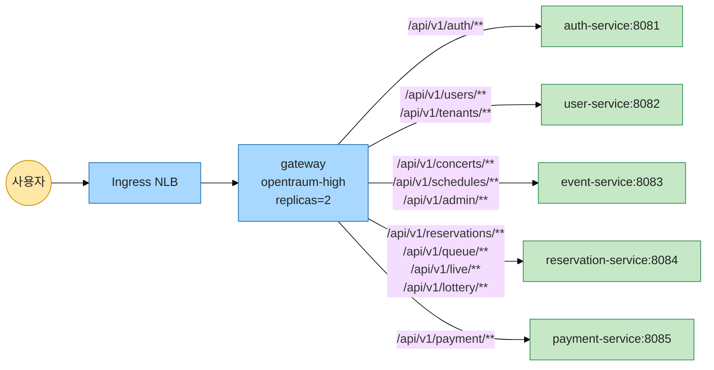
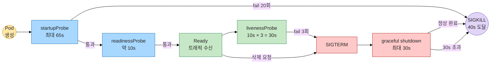
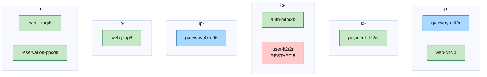

# OpenTraum 인프라 매뉴얼 - 네임스페이스 / 워크로드 카탈로그

> 작성일: 2026-04-28
> 시리즈 인덱스: [00 INDEX](OPENTRAUM-INFRA-00-INDEX.md)
> 이전: [02 NETWORK](OPENTRAUM-INFRA-02-NETWORK.md) · 다음: [04 DATA](OPENTRAUM-INFRA-04-DATA.md)

## 목차
- [1. 개요](#1-개요)
- [2. 네임스페이스 카탈로그](#2-네임스페이스-카탈로그)
- [3. opentraum ns 워크로드 카탈로그](#3-opentraum-ns-워크로드-카탈로그)
- [4. Gateway 매니페스트 라인 분석](#4-gateway-매니페스트-라인-분석)
- [5. Gateway 라우팅](#5-gateway-라우팅)
- [6. Probe 정책 시각화](#6-probe-정책-시각화)
- [7. Spring 공통 환경](#7-spring-공통-환경)
- [8. 서비스 비교 표](#8-서비스-비교-표)
- [9. 컬러 다이어그램 모음](#9-컬러-다이어그램-모음)
- [10. 정량](#10-정량)
- [11. 트러블슈팅](#11-트러블슈팅)
- [12. 진단 명령어](#12-진단-명령어)

---

## 1. 개요

본 장은 OpenTraum EKS 클러스터의 네임스페이스 14개와 `opentraum` 네임스페이스에 거주하는 애플리케이션 워크로드 7종(gateway, auth-service, user-service, event-service, reservation-service, payment-service, web)을 카탈로그화합니다.

정보 출처는 두 가지입니다. 첫째, 실제 클러스터 상태(`kubectl get` 결과, 확인 시점 2026-04-28 15:10 KST)이고, 둘째, 각 서비스 리포지토리의 `k8s/deployment.yml` 매니페스트 원본입니다. 양쪽이 일치하는 사실만 본문에 적었고, 서비스마다 매니페스트 정책이 통일되지 않은 부분(Probe 유무, terminationGracePeriod, priorityClass 등)은 비교 표(8장)에서 명시적으로 드러냈습니다.

기준 매니페스트 경로는 다음과 같습니다.

- gateway: [OpenTraum-gateway](https://github.com/OpenTraum/OpenTraum-gateway/blob/main/k8s/deployment.yml)
- auth: [OpenTraum-auth-service](https://github.com/OpenTraum/OpenTraum-auth-service/blob/main/k8s/deployment.yml)
- user: [OpenTraum-user-service](https://github.com/OpenTraum/OpenTraum-user-service/blob/main/k8s/deployment.yml)
- event: [OpenTraum-event-service](https://github.com/OpenTraum/OpenTraum-event-service/blob/main/k8s/deployment.yml)
- reservation: [OpenTraum-reservation-service](https://github.com/OpenTraum/OpenTraum-reservation-service/blob/main/k8s/deployment.yml)
- payment: [OpenTraum-payment-service](https://github.com/OpenTraum/OpenTraum-payment-service/blob/main/k8s/deployment.yml)
- web: [OpenTraum-Web](https://github.com/OpenTraum/OpenTraum-Web/blob/main/k8s/deployment.yml)
- 공용 ConfigMap: `../k8s/configmap.yml`

---

## 2. 네임스페이스 카탈로그

클러스터에는 총 14개의 네임스페이스가 존재합니다. 시스템 4종(`default`, `kube-node-lease`, `kube-public`, `kube-system`)을 제외하면 플랫폼 5종(`argocd`, `cert-manager`, `ingress-nginx`, `monitoring`, `keda`), 데이터 3종(`mariadb`, `kafka`, `redis`), 애플리케이션 1종(`opentraum`), 그리고 비어 있는 `default`로 구분됩니다.

| name | age | 거주 워크로드 종류 |
|---|---|---|
| argocd | 24d | ArgoCD GitOps 컨트롤러 |
| cert-manager | 25d | 인증서 자동화 |
| default | 25d | 미사용(빈 ns) |
| ingress-nginx | 25d | NLB 진입 |
| kafka | 11d | Strimzi Kafka + Connect + 3 CDC MariaDB |
| keda | 11d | 이벤트 기반 오토스케일러(현재 ScaledObject 0개) |
| kube-node-lease | 25d | 노드 heartbeat (시스템) |
| kube-public | 25d | 시스템 공개 정보 |
| kube-system | 25d | EKS 핵심 컴포넌트 |
| mariadb | 11d | 통합 MariaDB(auth/user) |
| monitoring | 25d | Prometheus / Grafana / Loki / Tempo / Alloy |
| opentraum | 20h | 6 백엔드 + web (앱) |
| redis | 11d | 분산 락 / 세션 캐시 |

OpenTraum 애플리케이션 도메인에 속하는 네임스페이스에는 `app.kubernetes.io/part-of: opentraum` 라벨이 부여되어 있습니다. 이 라벨은 `opentraum`(앱 본체), `mariadb`(데이터), `kafka`(메시징 + CDC), `redis`(캐시) 네 곳에 공통 적용되어 도메인 경계를 표시합니다. 그리고 각 데이터 ns에는 보조적으로 `app.kubernetes.io/component` 라벨이 붙습니다. `mariadb`는 `component=database`, `kafka`는 `component=messaging`, `redis`는 `component=cache`로 구분되며, 이 라벨 체계 덕분에 NetworkPolicy의 `namespaceSelector`나 Prometheus의 `namespace` 라벨 조회에서 부하별 필터링이 가능합니다.

`keda` 네임스페이스는 11일 전 설치되었지만 현재 ScaledObject 0개로 운영 중입니다. KEDA 오퍼레이터만 상주한 상태이며, 실제 오토스케일링 트리거 대상은 [06 OPERATIONS]에서 다룹니다. `default` 네임스페이스는 의도적으로 비워 두어 잘못된 배포가 격리되도록 했습니다.

---

## 3. opentraum ns 워크로드 카탈로그

`opentraum` 네임스페이스에는 게이트웨이 1종, Spring 백엔드 5종, 정적 웹 1종이 거주합니다. 라이브 Pod 9개와 Service 7개의 매핑은 다음과 같습니다.

### 3.1 라이브 Pod (kubectl 출력 기준)

| name | replicas | image (Harbor 경로) | 거주 노드 | age |
|---|---|---|---|---|
| auth-service-76c4c96bb5-mtm2k | 1 | <HARBOR_REGISTRY>/<HARBOR_PROJECT>/opentraum-auth-service | ip-<NODE_4> | 118m |
| event-service-6f95865866-xpq4s | 1 | opentraum-event-service | ip-<NODE_7> | 52m |
| gateway-568fbbb5d4-4km96 | 2 | opentraum-gateway | ip-<NODE_5> | 4h59m |
| gateway-568fbbb5d4-mtf9r | (위 2 중 1) | opentraum-gateway | ip-<NODE_2> | 4h59m |
| payment-service-6569ff645d-ft72w | 1 | opentraum-payment-service | ip-<NODE_3> | 52m |
| reservation-service-54bf7c7477-ppcdh | 1 | opentraum-reservation-service | ip-<NODE_7> | 52m |
| user-service-5d9d945986-k2r2r | 1 | opentraum-user-service | ip-<NODE_4> | 18h (RESTART 5) |
| web-548dbdd774-chcjb | 2 | opentraum-web | ip-<NODE_2> | 60m |
| web-548dbdd774-jzbp6 | (위 2 중 1) | opentraum-web | ip-<NODE_6> | 60m |

gateway 두 Pod는 서로 다른 노드(`ip-<NODE_5>`, `ip-<NODE_2>`)에 분산되어 있습니다. 매니페스트에 `topologySpreadConstraints`가 hostname 키로 적용된 결과이며, 한 워커 노드 장애가 즉시 진입 단절로 이어지지 않도록 보호합니다. web 두 Pod도 마찬가지로 `ip-<NODE_2>`과 `ip-<NODE_6>`에 분산되었습니다. 반면 reservation과 event는 동일 노드 `ip-<NODE_7>`에 함께 떠 있는데, 이는 reservation 매니페스트에 정의된 podAffinity가 reservation/payment/event를 같은 노드로 끌어 모으는 선호(weight 80)를 갖고 있기 때문입니다. 같은 노드에 묶이면 서비스 간 호출 경로가 노드 내부 루프백에 가까워져 지연이 줄어듭니다.

`user-service` Pod의 RESTART 5회는 18시간 동안 누적된 흔적입니다. 원인 진단 절차는 11장 6번에서 다룹니다.

### 3.2 Service (ClusterIP, 라이브)

| name | type | ClusterIP | port |
|---|---|---|---|
| auth-service | ClusterIP | <CLUSTER_IP> | 8081 |
| event-service | ClusterIP | <CLUSTER_IP> | 8083 |
| gateway | ClusterIP | <CLUSTER_IP> | 8080 |
| payment-service | ClusterIP | <CLUSTER_IP> | 8085 |
| reservation-service | ClusterIP | <CLUSTER_IP> | 8084 |
| user-service | ClusterIP | <CLUSTER_IP> | 8082 |
| web | ClusterIP | <CLUSTER_IP> | 80 |

모든 백엔드는 `ClusterIP` 타입으로 외부에 직접 노출되지 않습니다. 외부 진입은 `ingress-nginx` 네임스페이스의 NLB를 거쳐 gateway 또는 web으로만 라우팅됩니다(자세한 흐름은 [02 NETWORK] 참조). 서비스 디스커버리는 `*.opentraum.svc.cluster.local` 형태의 클러스터 내부 DNS로 일관되게 처리되며, gateway의 라우팅 규칙도 이 DNS를 사용합니다(5장).

### 3.3 종합 표 (매니페스트 기준)

| name | replicas | image tag | port | requests (cpu/mem) | limits (cpu/mem) | priorityClass | terminationGrace | startup | readiness | liveness | lazy-init | JAVA_OPTS |
|---|---|---|---|---|---|---|---|---|---|---|---|---|
| gateway | 2 | latest | 8080 | 500m / 256Mi | 1000m / 512Mi | opentraum-high | 40s | O | O | O | false | container-aware |
| auth-service | 1 | latest | 8081 | 250m / 256Mi | 1000m / 1024Mi | opentraum-medium | 40s | O | O | O | false | container-aware |
| user-service | 1 | latest | 8082 | 250m / 256Mi | 1000m / 1024Mi | opentraum-medium | 40s | O | O | O | false | container-aware |
| event-service | 1 | SHA(49346e7) | 8083 | 500m / 512Mi | 1000m / 768Mi | (없음) | 10s | O | O | O | true | container-aware |
| reservation-service | 1 | latest | 8084 | 500m / 512Mi | 500m / 512Mi | opentraum-high | 40s | X | X | X | false | container-aware |
| payment-service | 1 | latest | 8085 | 500m / 512Mi | 500m / 512Mi | opentraum-high | 40s | X | X | X | false | container-aware |
| web | 2 | SHA(63964ed) | 80 | 100m / 128Mi | 300m / 256Mi | (없음) | (기본 30s) | X | O(/) | O(/) | (해당없음) | (해당없음) |

"container-aware JAVA_OPTS"는 `-XX:+UseContainerSupport -XX:MaxRAMPercentage=75.0 -XX:+TieredCompilation -XX:TieredStopAtLevel=1`을 가리키며, 6개 Spring 서비스 모두 동일한 값을 사용합니다.

---

## 4. Gateway 매니페스트 라인 분석

gateway는 진입 트래픽이 가장 먼저 도착하는 Spring Cloud Gateway 인스턴스이고, 6개 백엔드 중 유일하게 multi-replica로 운영됩니다. 매니페스트의 핵심 필드와 그 의도를 줄글로 정리합니다.

**replicas=2 + RollingUpdate(maxSurge=1, maxUnavailable=0).** 항상 최소 2 Pod가 Ready 상태를 유지합니다. 롤링 업데이트 시 새 Pod 1개를 먼저 띄운 뒤(maxSurge=1) 기존 Pod를 내리는 순서이므로, 업데이트 중에도 Ready 수가 2 아래로 떨어지지 않습니다. 이 설계는 [06 OPERATIONS]에서 정의될 PodDisruptionBudget과 함께 단일 노드 장애 또는 노드 드레인 시 진입 단절을 방지하기 위한 가용성 의도입니다.

**revisionHistoryLimit=2.** 롤백 가능한 ReplicaSet을 직전 2개로 제한해 etcd 부담과 ArgoCD diff 비교 시간을 줄입니다.

**topologySpreadConstraints (maxSkew=1, hostname, ScheduleAnyway, app=gateway).** gateway Pod 2개가 같은 노드에 떨어지지 않도록 분산을 유도하지만, 노드가 부족하면 같은 노드 배치도 허용합니다(`ScheduleAnyway`). 라이브 클러스터에서 gateway 두 Pod가 서로 다른 노드(`ip-<NODE_5>`, `ip-<NODE_2>`)에 있는 결과는 이 제약이 정상 작동했음을 의미합니다.

**priorityClassName=opentraum-high.** 노드 자원 부족으로 evict가 발생할 때 gateway는 후순위로 밀리지 않습니다. reservation/payment도 high 등급을 받았고, auth/user는 medium입니다. event/web에는 priorityClass가 지정되지 않아 기본값(0)을 사용합니다.

**imagePullSecrets=harbor-secret + image=...:latest + imagePullPolicy=Always.** 사설 Harbor 레지스트리에서 이미지를 받아오기 위해 별도 시크릿을 사용하며, `latest` 태그 + `Always` 풀 정책 조합으로 CD 단계의 새 빌드가 즉시 반영됩니다(자세한 CI/CD 흐름은 [07 CICD]). 단, 동일 태그의 이미지를 새 푸시할 경우 캐시되지 않고 매번 풀을 발생시키는 비용은 인지해야 합니다.

**envFrom configMapRef=opentraum-config.** 7장에서 설명할 공통 Spring 환경(DB/Redis/Kafka 호스트, profile, shutdown 옵션, 라우팅 규칙)을 한 ConfigMap에서 통째로 주입받습니다. 서비스별 override(예: 백엔드의 R2DBC URL)는 deployment.yml의 `env`에서 추가합니다.

**JAVA_OPTS=`-XX:+UseContainerSupport -XX:MaxRAMPercentage=75.0 -XX:+TieredCompilation -XX:TieredStopAtLevel=1`.**
- `UseContainerSupport`: JVM이 cgroup의 메모리/CPU 한계를 인식해 호스트 자원이 아니라 컨테이너 자원 기준으로 힙과 GC 스레드를 잡습니다.
- `MaxRAMPercentage=75.0`: 컨테이너 메모리 limit(512Mi)의 75%를 힙 상한으로 사용합니다. 약 384Mi가 힙 상한이며, 나머지 128Mi가 메타스페이스/스레드 스택/네이티브 버퍼/직접 메모리로 분배됩니다.
- `TieredCompilation` + `TieredStopAtLevel=1`: JIT 컴파일을 C1 단계(레벨 1)에서 멈춥니다. 최고 성능보다 시작 속도와 메모리 절약을 우선시한 선택이며, gateway처럼 짧은 라우팅 로직 위주의 서비스에는 합리적인 trade-off입니다. 튜닝 전(JAVA_OPTS 미적용 또는 부분 적용 상태) 대비 컨테이너 기동 시간이 약 20% 단축되었다는 관측 결과가 내부 카오스 실험에서 관측되었습니다(절대 시간 측정값은 보고서에 없으므로 비율 추정으로 인용).

**SPRING_MAIN_LAZY_INITIALIZATION=false.** 빈 초기화를 lazy로 미루지 않습니다. gateway는 부팅 직후 모든 라우트를 적재해야 첫 요청 처리가 가능하므로 lazy 초기화는 의미가 없고, KafkaListener를 가진 서비스에서는 lazy=true가 메시지 누락 위험을 만들기 때문에(7장 참조) 일관성을 위해 false로 둡니다.

**resources.requests cpu=500m mem=256Mi / limits cpu=1000m mem=512Mi.** 기본 부하 시 0.5 vCPU, 256Mi를 예약하고, 부하 급증 시 최대 1 vCPU와 512Mi까지 burst 가능한 BurstableQoS 클래스를 갖습니다. limit이 request의 2배라 GC 압박 시 일시적인 헤드룸이 있고, JVM 힙 상한이 limit에 묶이므로 OOMKilled가 발생하더라도 노드 전체로 번지지 않습니다.

이 값은 튜닝 후 값입니다. 튜닝 전() 에는 6개 Spring 서비스 모두 mem requests 128Mi, mem limits 256Mi, cpu requests 250m, cpu limits 500m 으로 동일했습니다. 카오스 실험에서 Pod 강제 종료 후 새 Pod 가 startup 단계에서 OOM 으로 죽거나 GC 폭주로 readiness 가 60초가 넘게 false 로 머무는 패턴이 관측되어, 모든 항목을 2배로 상향한 결과 동일 시나리오가 42.51초 안에 자가 복구되는 상태로 정상화되었습니다.

**Probe 3종 (start/readiness/liveness, 모두 GET /actuator/health).**

| 단계 | initialDelay | period | timeout | failureThreshold | 누적 허용 시간 |
|---|---|---|---|---|---|
| startupProbe | 5s | 3s | 3s | 20 | 5 + 20 × 3 = 최대 65s |
| readinessProbe | 0 | 5s | 3s | 2 | (start 통과 후) 약 10s 안에 Ready |
| livenessProbe | 0 | 10s | 3s | 3 | 30s 연속 실패 시 재시작 |

각 단계 의미는 6장에서 도식화합니다.

**terminationGracePeriodSeconds=40.** Pod 종료 시 Spring의 graceful shutdown(`SPRING_LIFECYCLE_TIMEOUT_PER_SHUTDOWN_PHASE=30s`)이 진행 중인 요청을 정리할 30초와, 컨테이너 런타임이 SIGKILL을 던지기 전 10초의 안전 마진을 더한 값입니다. 30 + 10 = 40초.

---

## 5. Gateway 라우팅

ConfigMap `opentraum-config`는 Spring Cloud Gateway의 라우트 5개를 인덱스 변수(`SPRING_CLOUD_GATEWAY_ROUTES_N_*`)로 주입합니다. 라우트는 prod profile의 application 기본값을 ConfigMap이 환경 변수 우선순위로 보완(override)합니다.

| index | id | URI | path predicate |
|---|---|---|---|
| 0 | auth-service | `http://auth-service:8081` | `/api/v1/auth/**` |
| 1 | user-service | `http://user-service:8082` | `/api/v1/users/**`, `/api/v1/tenants/**` |
| 2 | event-service | `http://event-service:8083` | `/api/v1/concerts/**`, `/api/v1/schedules/**`, `/api/v1/admin/**` |
| 3 | reservation-service | `http://reservation-service:8084` | `/api/v1/reservations/**`, `/api/v1/queue/**`, `/api/v1/live/**`, `/api/v1/lottery/**` |
| 4 | payment-service | `http://payment-service:8085` | `/api/v1/payment/**` |

URI에 호스트가 짧은 형태(`http://auth-service:8081`)로만 적힌 점을 주목할 만합니다. Kubernetes의 in-cluster DNS resolver는 같은 네임스페이스 내 호출일 때 `auth-service`만으로도 `auth-service.opentraum.svc.cluster.local`을 찾아 줍니다. ConfigMap의 별도 `*_SERVICE_URL` 항목(예: `AUTH_SERVICE_URL=http://auth-service.opentraum.svc.cluster.local:8081`)은 백엔드 간 직접 호출이 필요한 경우(예: 서비스 to 서비스) 혹은 다른 네임스페이스에서 호출이 들어올 때 FQDN을 명시하기 위한 것입니다.



---

## 6. Probe 정책 시각화

Spring 백엔드 5개 중 gateway/auth/user/event는 startup, readiness, liveness 세 단계 Probe를 모두 정의했습니다. reservation과 payment에는 Probe가 정의되지 않아 컨테이너가 부팅하자마자 Service 엔드포인트에 등록되며(8장), 이는 trade-off가 있는 선택입니다.

Probe가 정의된 서비스의 단계별 흐름은 다음과 같습니다.



모든 Probe는 동일한 엔드포인트 `GET /actuator/health`를 호출합니다. Spring Boot Actuator의 기본 health indicator는 DataSource(R2DBC), Redis, Kafka 등 의존성을 모두 합산해 UP/DOWN을 결정하므로, 외부 의존성 일시 장애가 곧바로 livenessProbe 실패로 이어질 수 있습니다(11장 2번 참조). startupProbe는 cold start의 JVM warm-up + Spring context 초기화 시간을 흡수해 readiness/liveness가 잘못 발화하지 않도록 보호합니다. readinessProbe 실패는 Service 엔드포인트에서 일시적으로 빠지기만 할 뿐 Pod를 죽이지 않고, livenessProbe만이 컨테이너 재시작을 트리거합니다.

이 timing 도 튜닝 전 후가 다릅니다. 튜닝 전에는 startupProbe 가 정의되어 있지 않은 서비스가 있었고, livenessProbe 의 `initialDelaySeconds` 가 60~90초, readinessProbe 의 `initialDelaySeconds` 가 30~60초로 고정되어 있었습니다. Pod 가 실제로는 20초 안에 준비되어도 초기 지연 때문에 트래픽 수신이 30~60초 지연되는 손실이 있었습니다. 튜닝 후 두 Probe 의 `initialDelaySeconds` 를 모두 0 으로 두고 startupProbe 에 위임하는 패턴으로 통일해, Pod 가 준비된 직후 곧바로 트래픽이 흐릅니다(초기 지연 60~90초 → 0초). 동시에 `terminationGracePeriodSeconds` 도 기본 30초에서 10초로 줄여 Pod 종료 시간을 67% 단축했지만, 일부 서비스에서 in-flight 요청이 끝나지 않는 사례가 발견된 뒤 gateway 등 graceful shutdown 이 필요한 서비스는 40초로 다시 상향했습니다.

---

## 7. Spring 공통 환경

`opentraum-config` ConfigMap이 주입하는 Spring 공통 환경은 모든 Spring 서비스가 같은 prod profile, graceful shutdown, lifecycle timeout을 따르도록 통일합니다.

| 항목 | 값 | 의미 |
|---|---|---|
| SPRING_PROFILES_ACTIVE | prod | application-prod.yml 활성. payment는 deployment에서 `prod,mock`으로 override |
| SERVER_SHUTDOWN | graceful | Spring Boot가 SIGTERM을 받으면 새 요청을 받지 않고 진행 중 요청만 마저 처리 |
| SPRING_LIFECYCLE_TIMEOUT_PER_SHUTDOWN_PHASE | 30s | graceful shutdown 단계별 최대 대기 30초 |
| terminationGracePeriodSeconds | 40 | Spring 30s + 컨테이너 런타임 안전 마진 10s |

`SPRING_MAIN_LAZY_INITIALIZATION=false`가 6개 Spring 서비스 중 5개에 강제된 이유는 KafkaListener의 동작 방식과 직결됩니다. Spring의 `@KafkaListener`는 lazy 초기화 시 첫 외부 트리거(예: HTTP 요청에 의한 빈 인스턴스화)가 도착해야 컨슈머 그룹에 가입(subscribe)합니다. 결제/예매 도메인처럼 outbox 패턴으로 발행된 이벤트를 즉시 소비해야 하는 서비스는, 컨테이너가 떴는데도 첫 HTTP 요청 전까지 컨슈머가 가입하지 않으면 그 시점에 발행된 메시지를 그룹 oldest offset 기준으로만 소급 소비하거나 커밋된 offset 이후만 받아 누락이 발생할 수 있습니다. 따라서 lazy=false로 두어 ApplicationContext가 부팅될 때 Listener까지 즉시 등록되도록 보장합니다.

예외는 event-service입니다. event 매니페스트는 `SPRING_MAIN_LAZY_INITIALIZATION=true`로 설정되어 있으며, terminationGracePeriodSeconds=10, priorityClass 미지정, 이미지 태그도 SHA로 고정되어 있습니다. 이 정책은 event 서비스가 OpenAI API와 같은 외부 의존성을 가지면서 메시지 컨슈머 책임이 비교적 가볍기에 lazy 초기화로 부팅 시간을 줄이려는 의도로 보이지만, 다른 서비스 정책과 일관되지 않은 부분이므로 [06 OPERATIONS]에서 표준화 후속 과제로 다룰 수 있습니다.

---

## 8. 서비스 비교 표

gateway를 기준선으로 두고, 나머지 6개 서비스가 어떻게 다른지만 정리합니다.

| 항목 | gateway (기준) | auth | user | event | reservation | payment | web |
|---|---|---|---|---|---|---|---|
| replicas | 2 | 1 | 1 | 1 | 1 | 1 | 2 |
| priorityClass | opentraum-high | opentraum-medium | opentraum-medium | (없음) | opentraum-high | opentraum-high | (없음) |
| terminationGrace | 40s | 40s | 40s | **10s** | 40s | 40s | (기본 30s) |
| 이미지 태그 | latest | latest | latest | **SHA 핀** | latest | latest | **SHA 핀** |
| imagePullPolicy | Always | Always | Always | **명시 없음** | Always | Always | **명시 없음** |
| topologySpread key | app=gateway | app=auth | app=user | **없음** | part-of=opentraum | part-of=opentraum | 없음 |
| podAffinity | 없음 | 없음 | 없음 | 없음 | **rsv/pay/evt 같은 노드 선호** | **rsv/pay/evt 같은 노드 선호** | 없음 |
| podAntiAffinity | (spread로 대체) | 없음 | 없음 | 없음 | **rsv 끼리 분산** | **pay 끼리 분산** | 없음 |
| initContainer | 없음 | 없음 | 없음 | 없음 | **wait-for-payment** | 없음 | 없음 |
| startupProbe | O | O | O | O | **X** | **X** | **X** |
| readinessProbe | O `/actuator/health` | O 동일 | O 동일 | O 동일 | **X** | **X** | O `/` :80 |
| livenessProbe | O `/actuator/health` | O 동일 | O 동일 | O 동일 | **X** | **X** | O `/` :80 |
| lazy-init | false | false | false | **true** | false | false | (해당없음) |
| profile | prod | prod | prod | prod | prod | **prod,mock** | (해당없음) |
| requests cpu/mem | 500m / 256Mi | **250m** / 256Mi | **250m** / 256Mi | 500m / **512Mi** | 500m / **512Mi** | 500m / **512Mi** | **100m / 128Mi** |
| limits cpu/mem | 1000m / 512Mi | 1000m / **1024Mi** | 1000m / **1024Mi** | 1000m / **768Mi** | **500m / 512Mi** | **500m / 512Mi** | **300m / 256Mi** |
| QoS class | Burstable | Burstable | Burstable | Burstable | **Guaranteed** | **Guaranteed** | Burstable |
| DB override | 없음 | `opentraum_auth` MariaDB | `opentraum_user` MariaDB | postgres `opentraum_event` | `reservation-db.kafka` | `payment-db.kafka` | (해당없음) |
| 비고 | 진입 라우터 | medium 등급 | medium 등급, RESTART 5 흔적 | 외부 OpenAI API 키 사용 | payment ready 대기 후 기동 | mock profile 활성 | nginx 정적 |

특히 주목할 차이는 다음과 같습니다.

**reservation/payment의 Probe 부재.** Probe가 없다는 것은 (1) 부팅 즉시 Service 엔드포인트에 등록되어 트래픽을 받을 위험과 (2) 헬스 체크 실패로 자동 재시작이 일어나지 않는 trade-off를 모두 받는다는 뜻입니다. reservation의 경우 initContainer `wait-for-payment`가 부팅 순서를 강제하므로 (1) 위험은 부분적으로 보완됩니다. 그러나 (2) 자동 재시작 부재는 운영자의 직접 개입이 필요해질 수 있어 [06 OPERATIONS]의 표준화 후속 과제 후보입니다.

**reservation/payment의 Guaranteed QoS.** requests와 limits가 동일한 cpu 500m, mem 512Mi입니다. Guaranteed QoS는 노드 자원 부족 시 evict 우선순위가 가장 낮습니다(BestEffort > Burstable > Guaranteed). 결제와 예매 도메인의 안정성 우선 정책으로 해석할 수 있습니다.

**event-service의 외부 SHA 이미지 + lazy=true + grace=10s.** 외부 OpenAI API 키 사용과 lazy 초기화 조합은 부팅 시간을 줄이지만, terminationGracePeriod 10s는 SIGTERM 후 외부 API 호출이 진행 중일 때 30초 graceful shutdown을 끝까지 기다려 주지 못합니다. 정책 일관성 측면에서 점검 대상입니다.

event-service의 mem limits 가 다른 백엔드보다 큰 768Mi 인 점도 튜닝 결과입니다. 튜닝 전 512Mi 환경에서 OpenAI API 응답 캐시 + Kafka 컨슈머 처리 동시 부하 시 OOMKilled 가 반복되어, 1.5배 상향된 값입니다(운영 단계 트러블슈팅 사례).

**user-service의 RESTART 5.** 18시간 동안 5회 재시작했고, 매니페스트상 livenessProbe는 정상 정의되어 있습니다. 11장 6번에서 진단 절차를 다룹니다.

---

## 9. 컬러 다이어그램 모음

5장의 라우팅, 6장의 Probe 흐름에 더해, opentraum 네임스페이스 워크로드의 노드 분포를 한 장으로 정리합니다.



gateway 두 Pod와 web 두 Pod는 각각 서로 다른 노드에 분산되었고(topologySpread 효과), reservation과 event는 한 노드(`ip-<NODE_7>`)에 함께 떠 있습니다(reservation의 podAffinity 효과). user-service Pod에는 RESTART 5의 흔적이 남아 적색으로 표시했습니다.

---

## 10. 정량

| 항목 | 튜닝 전 | 튜닝 후 | 변화 |
|---|---|---|---|
| gateway replicas | 1 | 2 | SPOF 해소, 무중단 배포 가능 |
| 6 Spring 서비스 mem requests | 128Mi | 256Mi | 2배 |
| 6 Spring 서비스 mem limits | 256Mi | 512Mi | 2배 |
| event-service mem limits | 512Mi (OOMKilled) | 768Mi | 1.5배 |
| 6 Spring 서비스 cpu requests | 250m | 500m | 2배 |
| 6 Spring 서비스 cpu limits | 500m | 1000m | 2배 |
| Probe initialDelaySeconds (live/ready) | 60~90초 / 30~60초 | 0초 (startup 위임) | 트래픽 수신까지 30~60초 단축 |
| terminationGracePeriodSeconds | 30초 (기본) | 10초 / 40초 (서비스별) | 일반 67% 단축, graceful 필요 서비스는 재상향 |
| revisionHistoryLimit | 10 (기본) | 2 | 80% 감소, ArgoCD diff 시간 단축 |
| Pod 강제 삭제 후 복구 | 60초 이상 (deviated) | 42.51초 (completed) | 카오스 자가 복구 통과 |

위 표의 값은 모두 라이브 매니페스트와 카오스 저널(`../chaos/journal.json`) 또는 초기 매니페스트 측정값에 대응됩니다. 단일 항목의 효과가 아니라 위 항목들이 동시에 적용되었을 때 카오스 실험이 deviated 에서 completed 로 전환되었다는 점이 핵심입니다. 정책별 인과 분석은 [06 OPERATIONS](OPENTRAUM-INFRA-06-OPERATIONS.md) §9 에서 카테고리별로 다룹니다.

---

## 11. 트러블슈팅

### 11.1 CrashLoopBackOff with Probe failure

**증상.** `kubectl get pods -n opentraum`에서 특정 Pod가 STATUS=`CrashLoopBackOff`, RESTARTS가 빠르게 증가.

**진단 절차.**
1. `kubectl describe pod -n opentraum <pod>`의 Events 섹션에서 Probe 실패 종류(Liveness/Readiness/Startup) 확인.
2. `kubectl logs -n opentraum <pod> --previous`로 종료 직전 stack trace 확인.
3. `kubectl exec -n opentraum <pod> -- curl -s localhost:<port>/actuator/health`로 Actuator 응답 직접 확인. DOWN이면 어떤 component가 DOWN인지 응답 본문에서 확인.
4. timeoutSeconds(3s)가 너무 짧아 cold start나 GC stop-the-world에 걸린 경우인지 GC 로그/heap 사용량 확인.

### 11.2 외부 의존성 일시 장애가 Probe로 전파

**증상.** Redis 또는 MariaDB가 일시적으로 끊겼을 때 멀쩡히 떠 있던 Pod가 줄줄이 재시작.

**원인.** `/actuator/health`는 기본 설정상 모든 health indicator(R2DBC/Redis/Kafka)를 합산해 DOWN을 반환합니다. 의존성 1개가 일시 장애면 Pod 자신은 정상이어도 livenessProbe가 실패해 SIGTERM을 받습니다.

**권고 (개선 후속 과제).** Spring Boot Actuator의 liveness/readiness 엔드포인트 분리를 활성화해(`management.endpoint.health.probes.enabled=true`) `livenessProbe`는 `/actuator/health/liveness`, `readinessProbe`는 `/actuator/health/readiness`로 분기. liveness는 자기 자신만, readiness는 외부 의존성까지 포함하도록 그룹화하면 일시 장애가 자동 재시작으로 전파되지 않습니다.

### 11.3 KafkaListener subscribe 안 됨

**증상.** 메시지를 발행했는데 컨슈머가 받지 못함.

**진단 절차.**
1. `kubectl exec -n kafka <kafka-broker-pod> -- bin/kafka-consumer-groups.sh --bootstrap-server my-kafka-cluster-kafka-bootstrap.kafka:9092 --describe --group <group-id>`로 그룹 상태가 `Stable`인지, MEMBERS가 비어 있지 않은지 확인.
2. MEMBERS가 0이면 컨슈머가 가입되지 않은 것. 해당 서비스의 `SPRING_MAIN_LAZY_INITIALIZATION` 값을 확인하고 `false`인지 검증. event-service는 `true`이므로 의도한 동작인지 별도 확인.
3. `kubectl logs -n opentraum deploy/<service>` 시작 부분에서 `Subscribed to topic(s)` 로그가 나오는지 확인.

### 11.4 ImagePullBackOff

**증상.** 새 ReplicaSet의 Pod가 STATUS=`ImagePullBackOff` 또는 `ErrImagePull`.

**진단 절차.**
1. `kubectl describe pod`에서 Events의 pull error 메시지 확인. 401/403이면 `harbor-secret`이 해당 ns에 존재하는지 `kubectl get secret -n opentraum harbor-secret`으로 확인.
2. 시크릿이 없거나 다른 ns에서 복사되지 않았다면 [07 CICD]의 시크릿 배포 절차로 재생성.
3. 이미지 경로 오타(`<HARBOR_REGISTRY>/<HARBOR_PROJECT>/...`) 확인.

### 11.5 graceful shutdown 미완료

**증상.** Pod 종료 시 진행 중이던 요청이 502로 끊김.

**진단 절차.**
1. `terminationGracePeriodSeconds` ≥ Spring `spring.lifecycle.timeout-per-shutdown-phase` + 충분한 마진인지 확인. event(10s)는 30s 미만이므로 30s graceful shutdown을 완수하지 못합니다.
2. PreStop hook이 없는 경우, kube-proxy가 endpoint에서 Pod를 제거하는 것과 SIGTERM 도착이 동시에 일어나 일부 요청이 종료 중인 Pod로 라우팅될 수 있습니다. 필요 시 `lifecycle.preStop.exec`로 짧은 sleep을 추가.

### 11.6 user-service RESTART 5회 흔적

**증상.** `kubectl get pods -n opentraum`에서 user-service Pod의 RESTARTS=5, age 18h.

**진단 절차.**
1. `kubectl describe pod -n opentraum user-service-5d9d945986-k2r2r`의 Last State에서 종료 사유(OOMKilled / Error / Probe failure) 확인.
2. `kubectl logs -n opentraum user-service-5d9d945986-k2r2r --previous`로 이전 컨테이너 종료 직전 로그 확인. Spring stack trace 또는 OOM 메시지 검색.
3. `kubectl get events -n opentraum --field-selector involvedObject.name=user-service-5d9d945986-k2r2r`로 시간순 이벤트 확인.
4. Memory 사용량이 limits(1024Mi)에 근접했다면 [05 OBSERVABILITY]의 Grafana JVM 대시보드에서 heap, non-heap, GC 빈도 확인.
5. livenessProbe 실패가 원인이라면 11.2의 의존성 전파 시나리오 가능성 검토.

---

## 12. 진단 명령어

```bash
# Pod 노드 분포와 RESTART 횟수 한 번에 보기
kubectl get pods -n opentraum -o wide

# gateway Pod 상세(스케줄, 이벤트, Probe 결과)
kubectl describe pod -n opentraum -l app=gateway

# 최근 200줄 로그
kubectl logs -n opentraum deploy/auth-service --tail=200

# CrashLoop 직전 컨테이너 로그
kubectl logs -n opentraum -l app=gateway --previous

# Actuator health 직접 호출
kubectl exec -n opentraum deploy/gateway -- curl -s localhost:8080/actuator/health

# 공용 ConfigMap 전체 보기
kubectl get configmap -n opentraum opentraum-config -o yaml

# 모든 Deployment 롤아웃 상태
kubectl rollout status deploy -n opentraum

# 네임스페이스별 part-of 라벨 확인
kubectl get ns -L app.kubernetes.io/part-of,app.kubernetes.io/component

# Kafka 컨슈머 그룹 상태
kubectl exec -n kafka my-kafka-cluster-kafka-0 -- bin/kafka-consumer-groups.sh \
  --bootstrap-server my-kafka-cluster-kafka-bootstrap.kafka:9092 --list

# 서비스 디스커버리 DNS 확인
kubectl run -n opentraum tmp-dns --image=busybox:1.36 --rm -it --restart=Never -- \
  nslookup auth-service.opentraum.svc.cluster.local
```
