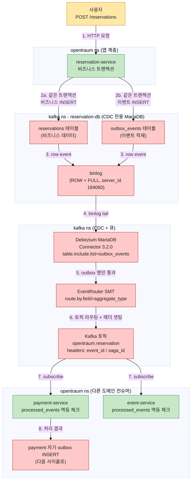
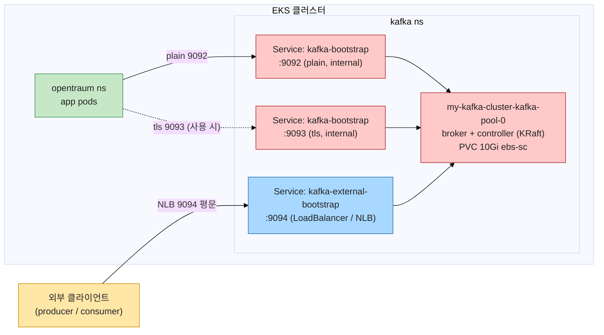
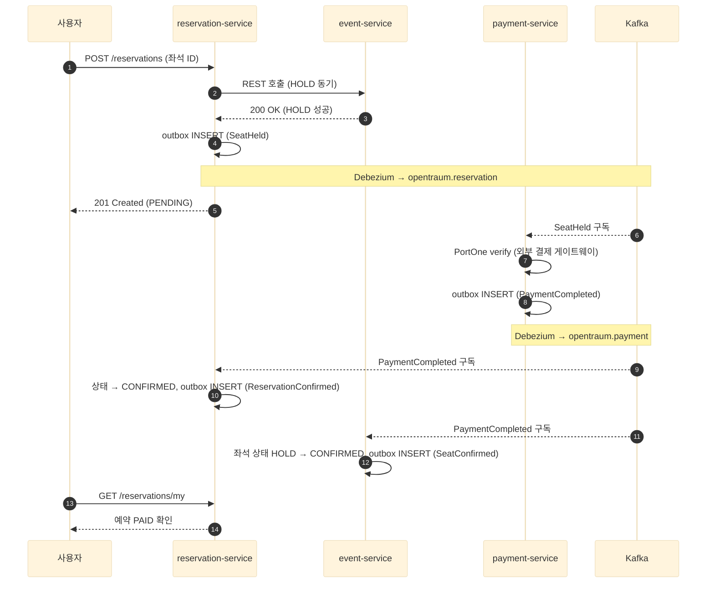

# OpenTraum 인프라 매뉴얼 - 데이터 계층

> 작성일: 2026-04-28
> 시리즈 인덱스: [00 INDEX](OPENTRAUM-INFRA-00-INDEX.md)
> 이전: [03 WORKLOAD](OPENTRAUM-INFRA-03-WORKLOAD.md) · 다음: [05 MONITORING](OPENTRAUM-INFRA-05-MONITORING.md)

## 목차
- [1. 개요](#1-개요)
- [1.5 핵심 개념 입문: CDC, Outbox, SAGA, OpenTraum 적용도](#15-핵심-개념-입문-cdc-outbox-saga-opentraum-적용도)
- [2. 도구 스택과 버전](#2-도구-스택과-버전)
- [3. 통합 MariaDB](#3-통합-mariadb)
- [4. Strimzi Kafka](#4-strimzi-kafka)
- [5. KafkaConnect + Debezium](#5-kafkaconnect--debezium)
- [6. CDC 전용 MariaDB 3개 (kafka ns)](#6-cdc-전용-mariadb-3개-kafka-ns)
- [7. SAGA 흐름 (현재 토픽 기준)](#7-saga-흐름-현재-토픽-기준)
- [8. Redis](#8-redis)
- [9. 정량 / 튜닝 (현재)](#9-정량--튜닝-현재)
- [10. 트러블슈팅](#10-트러블슈팅)
- [11. 진단 명령어](#11-진단-명령어)

---

## 1. 개요

이 장은 OpenTraum 의 데이터 계층 전체를 다룹니다. 범위는 다음과 같습니다.

- 통합 MariaDB(`mariadb` ns) - 5개 서비스 DB 를 한 인스턴스가 호스팅합니다. 현재는 auth-service, user-service 가 사용합니다.
- Strimzi Kafka(`kafka` ns) - 도메인 이벤트 메시지 브로커. KRaft 모드 단일 브로커.
- KafkaConnect + Debezium - Outbox 패턴의 변경 이벤트를 Kafka 토픽으로 흘려보내는 CDC 파이프라인.
- CDC 전용 MariaDB 3개(`kafka` ns) - reservation / payment / event 도메인의 outbox 테이블을 가진 별도 DB. binlog 가 활성화된 상태로, Debezium 이 직접 binlog 를 읽습니다.
- Redis(`redis` ns) - JWT 블랙리스트, Redisson 분산 락, 세션 캐시용 인메모리 스토어.

본문에 적힌 모든 토픽 수, replica 수, server.id, PVC 크기는 2026-04-28 15:10 KST 시점에 `kubectl get kafka,kafkanodepool,kafkaconnect,kafkaconnector,kafkatopic -A`, `kubectl get pods -n kafka,mariadb,redis -o wide`, `kubectl get pvc -A`, 그리고 각 매니페스트 파일을 직접 읽어 옮긴 것입니다. DB 자격증명은 모두 Secret 으로 관리되며 본문에는 표기하지 않습니다.

같은 데이터 계층이지만 통합 MariaDB 한 인스턴스가 5개 DB schema 를 한꺼번에 호스팅하는 것과, reservation / payment / event 만 별도 MariaDB 로 분리되어 있는 것이 동시에 보입니다. 이렇게 분리한 이유는 단순합니다. CDC(Debezium) 가 binlog 를 읽으려면 DB 측 server_id 가 인스턴스마다 고유해야 하고, GRANT REPLICATION SLAVE/CLIENT 권한이 필요합니다. 통합 MariaDB 는 표준 Bitnami Helm chart 로 운영되어 이 두 조건을 깨끗하게 분리하기 어렵기 때문에, CDC 가 필요한 3개 도메인만 server_id 와 my.cnf 를 따로 잡은 전용 StatefulSet 으로 빼냈습니다.

---

## 1.5 핵심 개념 입문: CDC, Outbox, SAGA, OpenTraum 적용도

이 절은 본 문서의 5장(Debezium 설정), 6장(CDC 전용 MariaDB), 7장(SAGA 흐름) 을 읽기 전에 알아야 할 세 개념을 한 번에 정리합니다. 같은 내용을 7장에서 라이브 토픽 이름으로 다시 보게 되지만, 여기서는 "왜 이 구조여야만 하는가" 에 초점을 맞춥니다.

### 1.5.1 왜 이 세 개념을 함께 보아야 하는가

마이크로서비스 환경에서는 한 사용자 요청 한 번에 두 가지를 동시에 해야 하는 상황이 흔합니다. 자기 도메인 DB 에 비즈니스 데이터를 쓰고, 다른 도메인이 그 사실을 알 수 있도록 메시지 큐에 이벤트를 발행하는 것입니다. 문제는 이 둘이 서로 다른 시스템이라는 점입니다. DB 커밋은 성공했는데 큐 발행이 네트워크 단절로 실패하면, 다른 도메인은 영원히 그 변경을 알지 못합니다. → 그래서 좌석은 점유됐지만 결제 도메인은 그 사실을 모르는, 정합성이 깨진 상태가 만들어집니다.

이 문제를 푸는 정통 해법이 분산 트랜잭션(2PC) 입니다. 하지만 2PC 는 모든 참여자가 prepare 단계에서 락을 잡고 coordinator 의 commit 결정을 기다리므로, 한 노드만 느려져도 전체가 멈춥니다. → 그래서 가용성이 직접적으로 깎입니다. 마이크로서비스 진영은 이 비용을 받아들이지 않는 대신 세 개념을 조합해서 같은 목표를 다르게 달성합니다.

- **CDC** 가 "DB 와 큐에 동시에 쓴다" 는 이중 쓰기 자체를 없앱니다. 앱은 DB 에만 쓰고, DB 변경 로그를 외부 도구가 따라 읽어 큐로 흘립니다.
- **Transactional Outbox** 가 "그 변경 로그 안에 비즈니스 데이터와 이벤트가 같은 commit 단위로 들어가도록" 보장합니다.
- **SAGA** 가 "여러 도메인을 가로지르는 업무 흐름을 로컬 트랜잭션 + 보상 트랜잭션의 연쇄로" 풀어냅니다.

세 가지가 따로따로 동작하면 의미가 약합니다. CDC 만 있으면 어떤 변경이 이벤트인지 구분되지 않고, Outbox 만 있으면 그 행이 어떻게 큐로 가는지 미정이며, SAGA 만 있으면 매번 이중 쓰기 함정에 다시 빠집니다. → 그래서 본 시스템은 셋을 하나의 파이프라인으로 결합했습니다.

### 1.5.2 CDC (Change Data Capture)

CDC 는 DB 의 INSERT/UPDATE/DELETE 변경을 외부 시스템에 실시간으로 흘리는 기법입니다. 동작 원리는 단순합니다. RDB 들은 자체 복구와 복제를 위해 모든 변경을 로그 파일에 순서대로 기록합니다. MariaDB/MySQL 의 binlog, PostgreSQL 의 WAL 이 그 로그입니다. CDC 도구는 이 로그를 마치 복제 슬레이브처럼 따라 읽어, 각 row 변경을 메시지로 가공해 큐에 발행합니다.

직접 발행 방식과 CDC 방식의 차이는 다음과 같습니다.

| 항목 | 앱이 직접 큐에 발행 | CDC 로 binlog 추적 |
|---|---|---|
| 쓰기 대상 | DB + 큐 (이중 쓰기) | DB 한 곳만 |
| 부분 실패 | DB 만 성공 / 큐만 성공 가능 | 발생 불가 (DB commit 이 진실의 단일 출처) |
| 트랜잭션 경계 | 두 시스템에 걸쳐 있음 | 앱 트랜잭션 안에서 끝남 |
| 가용성 | 큐 장애 시 앱도 실패 | 큐 장애 시 CDC 가 lag 만 늘림 |
| 순서 보장 | 앱 코드가 책임 | binlog 순서 그대로 전파 |

본 시스템의 CDC 도구는 [2장](#2-도구-스택과-버전) 의 표에 적힌 대로 Debezium MariaDB Connector 3.2.0 입니다. Strimzi KafkaConnect CR 의 build 정의에 connector tar 와 debezium-scripting 을 쌓아 ECR 에 push 한 커스텀 이미지(`<ECR_REGISTRY>/<ECR_REPOSITORY_PREFIX>debezium-connect:3.2.0`) 위에서 동작합니다. Debezium 은 binlog 의 변경 중에서도 우리가 지정한 테이블 변경만 읽도록 `table.include.list` 로 좁혀져 있어, outbox 테이블 외 비즈니스 테이블의 변경은 큐로 새지 않습니다.

### 1.5.3 Transactional Outbox

Outbox 패턴은 CDC 의 입력을 비즈니스가 통제하기 위한 장치입니다. 핵심 발상은 이렇습니다. 앱은 자기 비즈니스 트랜잭션 안에서 두 가지 INSERT 를 같이 실행합니다. 하나는 비즈니스 테이블(reservations, payments 등) 에 대한 INSERT/UPDATE 이고, 다른 하나는 같은 DB 의 `outbox_events` 테이블에 적는 이벤트 한 행입니다. 같은 트랜잭션이므로 둘 다 commit 되거나 둘 다 rollback 됩니다. → 그래서 부분 실패가 원천적으로 사라집니다. CDC 는 이 outbox 테이블의 변경만 따라 읽으면 됩니다.

본 시스템의 outbox 테이블 스키마는 [5.3](#53-outbox-테이블-스키마-debezium-eventrouter-입력) 에 라이브 컬럼 표가 있고, 같은 내용을 입문 관점에서 다시 정리하면 다음과 같습니다.

| 컬럼 | 타입 | 역할 |
|---|---|---|
| `id` | BIGINT AUTO_INCREMENT PK | 내부 PK, binlog 순서와 일치 |
| `event_id` | CHAR(36) UNIQUE | 비즈니스 이벤트 UUID, 멱등성 키 |
| `aggregate_id` | VARCHAR | 도메인 엔터티 ID, Kafka 메시지 키 |
| `aggregate_type` | VARCHAR | 라우팅 키 (`reservation` / `payment` / `event`) |
| `event_type` | VARCHAR | `SeatHeld`, `PaymentCompleted` 등 이벤트 종류 |
| `saga_id` | CHAR(36) | 분산 트랜잭션 식별자 |
| `payload` | JSON | 이벤트 본문 |
| `occurred_at` | TIMESTAMP(3) | 도메인 이벤트 발생 시각 |

인덱스: `idx_aggregate (aggregate_type, aggregate_id)`, `idx_saga (saga_id)`, `idx_occurred (occurred_at)`. 도메인별 조회, SAGA 단위 추적, 시간 범위 조회 세 패턴이 자주 일어나므로 이 세 인덱스가 따라붙습니다.

이 행이 큐로 옮겨지는 길은 Debezium 의 `EventRouter` SMT 가 책임집니다. SMT(Single Message Transform) 는 connector 가 binlog 에서 읽은 row 메시지를 큐에 쓰기 직전에 변환하는 단계로, EventRouter 의 동작은 다음 세 단계입니다.

1. `aggregate_type` 컬럼 값을 보고 토픽을 결정합니다. 본 시스템은 `route.topic.replacement=opentraum.${routedByValue}` 으로 설정되어 있어, `aggregate_type=reservation` 이면 `opentraum.reservation` 토픽으로 갑니다.
2. `aggregate_id` 를 메시지 키로 셋팅합니다. → 그래서 같은 엔터티에 대한 이벤트들이 같은 파티션으로 들어가 순서가 유지됩니다.
3. `event_id`, `event_type`, `saga_id` 를 Kafka 헤더로 전파합니다. 컨슈머는 헤더만 읽어 멱등성 처리와 SAGA 단위 추적을 할 수 있습니다.

또한 connector 설정 한 줄(`expand.json.payload=true`) 로 `payload` JSON 컬럼이 큐 메시지 본문에서 다시 한 번 문자열로 감싸지지 않게 막혀 있습니다. 이 한 줄이 빠지면 컨슈머가 두 번 parse 해야 하는 함정이 생깁니다 (라이브 트러블슈팅은 [10.4](#104-json-이중-직렬화-컨슈머-parse-실패) 에 기록).

### 1.5.4 SAGA (Choreography 방식)

SAGA 는 분산 트랜잭션을 여러 로컬 트랜잭션의 연쇄로 풀고, 중간에 실패하면 앞단계를 되돌리는 보상 트랜잭션을 발행하는 패턴입니다. 2PC 가 "모두 동시에 commit" 을 시도한다면, SAGA 는 "각자 commit 하되 실패 시 각자 보상" 을 시도합니다. → 그래서 가용성을 깎지 않으면서 eventual consistency 모델로 정합성을 회복합니다.

SAGA 의 조정 방식은 두 가지로 나뉩니다.

| 구분 | Orchestration | Choreography (본 시스템 채택) |
|---|---|---|
| 조율자 | 별도 orchestrator 서비스 | 없음 (각 서비스가 자율) |
| 흐름 결정 | orchestrator 코드가 다음 단계 호출 | 각 서비스가 이벤트를 구독해 다음 이벤트 발행 |
| 결합도 | 중앙 집중 (orchestrator 가 모든 도메인을 알아야 함) | 분산 (각 서비스는 자기 입출력 이벤트만 알면 됨) |
| 추적 | orchestrator 로그가 단일 출처 | `saga_id` 헤더로 추적 |
| 단점 | orchestrator 가 SPOF | 흐름이 코드 한 곳에 모이지 않음 |

본 시스템은 Choreography 입니다. orchestrator 가 따로 없고, 각 서비스(reservation / payment / event) 가 자기 도메인 이벤트를 구독해서 자기 outbox 에 다음 이벤트를 적습니다. 흐름의 전체 모습은 outbox 의 `saga_id` 가 같은 행들을 모아 보면 한 SAGA 단위가 재구성됩니다.

Choreography 가 동작하려면 멱등성이 필수입니다. Kafka 는 at-least-once 전달을 보장하므로, 같은 이벤트가 두 번 도달할 수 있고 컨슈머는 두 번째 도달을 무시해야 합니다. 본 시스템은 컨슈머 측 DB 에 `processed_events` 테이블을 두어 `(consumer_group, event_id)` 를 PK 로 잡습니다. INSERT IGNORE 또는 ON DUPLICATE 로 두 번째 INSERT 가 실패하면 비즈니스 처리도 같은 트랜잭션 안에서 건너뜁니다. → 그래서 메시지가 재전송되어도 비즈니스 effect 는 한 번만 적용됩니다.

### 1.5.5 OpenTraum 의 결합 흐름 (한 다이어그램)

세 개념이 본 시스템에서 어떻게 한 파이프라인으로 결합되는지 한 그림으로 정리합니다. 사용자 요청 한 번이 reservation-service 의 비즈니스 트랜잭션 commit 부터 다른 도메인 컨슈머의 처리까지 어떻게 흐르는지 보여줍니다.



이 그림이 보여주는 결합점은 다음 네 가지로 정리됩니다.

- **CDC 도구** = Debezium MariaDB Connector 3.2.0, Strimzi KafkaConnect 이미지에 build 로 포함.
- **Outbox 테이블 위치** = reservation-db, payment-db, event-db (`kafka` ns, hard antiAffinity 로 서로 다른 노드 강제, 6장에서 상술).
- **SAGA 조정** = Choreography, 별도 orchestrator 없음.
- **멱등성 키** = outbox 의 `event_id` UNIQUE 제약 + 컨슈머 측 `processed_events` 테이블 PK.

5번 단계의 "outbox 행만 통과" 가 중요합니다. binlog 자체에는 비즈니스 테이블 변경도 흘러가지만, Debezium connector 의 `table.include.list` 가 `outbox_events` 만 허용하도록 좁혀져 있어 비즈니스 테이블의 내부 변경은 큐로 새지 않습니다. → 그래서 도메인 내부 스키마가 바뀌어도 다른 도메인은 영향을 받지 않습니다.

### 1.5.6 OpenTraum SAGA 5단계 (Live Track)

위 결합 흐름이 좌석 예약 시나리오에 적용되면 다음 5단계가 됩니다. 같은 흐름의 sequence diagram 은 [7.1](#71-정상-흐름-5단계) 에 라이브 토픽 이름으로 다시 그려져 있고, 여기서는 입문자가 이 절만 보고도 흐름을 잡도록 압축한 줄글로 정리합니다.

1. **HOLD (좌석 점유)**: reservation-service 가 event-service 에 REST 동기 호출로 좌석 잠금을 요청합니다. event-service 는 Redis SETNX 로 분산 락을 잡고 seats 테이블을 UPDATE 한 뒤 200 OK 를 돌려줍니다. reservation-service 는 자기 트랜잭션 안에서 reservations 행을 PENDING 으로 INSERT 하고 outbox 에 `SeatHeld` 한 행을 같이 INSERT 한 뒤 commit 합니다. → 그래서 `opentraum.reservation` 토픽에 `SeatHeld` 가 흘러갑니다.
2. **PAYMENT (결제 검증)**: payment-service 가 `SeatHeld` 를 구독합니다. PortOne API 로 외부 결제 검증을 진행하고, 결과에 따라 자기 outbox 에 `PaymentCompleted` 또는 `PaymentFailed` 한 행을 적습니다. → 그래서 `opentraum.payment` 토픽으로 결과가 흘러갑니다.
3. **CONFIRM (reservation 측)**: reservation-service 가 `PaymentCompleted` 를 구독합니다. reservations 행을 PENDING 에서 PAID 로 UPDATE 하고 outbox 에 `ReservationConfirmed` 를 적습니다.
4. **CONFIRM (event 측)**: event-service 도 같은 `PaymentCompleted` 를 구독합니다. seats 행을 HOLD 에서 SOLD 로 UPDATE 하고 outbox 에 `SeatConfirmed` 를 적습니다.
5. **DONE**: 사용자가 GET /reservations/my 로 자기 예약 상태가 PAID 임을 확인합니다.

5단계가 모두 정상 commit 되면 SAGA 가 성공입니다. 어디든 실패하면 보상 흐름이 자율적으로 동작해서 좌석을 다시 풀어주고 결제를 환불합니다. 보상 흐름은 다음 표로 정리되며, 라이브 다이어그램은 [7.2](#72-보상-흐름) 에 있습니다.

| 트리거 | 발행 이벤트 | 보상 동작 |
|---|---|---|
| HOLD 후 5분 미결제 (HoldExpirationScheduler) | `ReservationCancelled` (reservation-service 발행) | event-service 가 seats 를 AVAILABLE 로 되돌리고 Redis 락 DEL |
| PortOne 결제 거절 | `PaymentFailed` (payment-service 발행) | reservation 이 CANCELED 처리, event 가 `SeatReleased` 로 좌석 해제 |
| 사용자 DELETE /reservations/{id} | `ReservationRefundRequested` (reservation-service 발행) | payment 가 PortOne cancel API 호출 후 `RefundCompleted` 발행, event 가 좌석 복구 |

보상에서도 같은 원칙이 그대로 적용됩니다. 어떤 도메인도 다른 도메인의 DB 를 직접 건드리지 않고, 자기 outbox 에 보상 이벤트를 적기만 합니다. 다른 도메인이 그 이벤트를 구독해서 자율적으로 되돌립니다. → 그래서 보상 경로도 정상 경로와 같은 CDC + Outbox 파이프라인을 재사용하며, 별도 분기 코드가 필요 없습니다.

이 절에서 정리한 세 개념이 어떻게 라이브 매니페스트로 떨어졌는지는 5장(KafkaConnect + Debezium 설정), 6장(CDC 전용 MariaDB 의 my.cnf 와 init_cdc.sql), 7장(라이브 토픽 기준 SAGA 흐름) 에서 이어집니다.

---

## 2. 도구 스택과 버전

| 항목 | 값 |
|---|---|
| 통합 MariaDB chart | bitnami/mariadb 25.0.10 (app 12.2.2) |
| 통합 MariaDB image | docker.io/bitnamilegacy/mariadb:11.4.6-debian-12-r0 |
| CDC MariaDB image (3개 공통) | docker.io/bitnamilegacy/mariadb:11.4.6-debian-12-r0 |
| Strimzi Cluster Operator | v0.51.0 (라이브 status.operatorLastSuccessfulVersion) |
| Kafka | 4.1.0 (KRaft, metadataVersion 4.1-IV1) |
| Debezium MariaDB Connector | 3.2.0 (Strimzi build 로 KafkaConnect 이미지에 포함) |
| Outbox EventRouter SMT | io.debezium.transforms.outbox.EventRouter |
| Redis | redis:7-alpine |
| 영구 스토리지 | 모든 PVC 가 `ebs-sc` (default StorageClass) |

KafkaConnect 이미지는 Strimzi build 기능으로 빌드된 커스텀 이미지(`<ECR_REGISTRY>/<ECR_REPOSITORY_PREFIX>debezium-connect:3.2.0`) 입니다. Strimzi Operator 가 KafkaConnect CR 의 `spec.build` 정의를 보고 베이스 이미지 위에 Debezium MariaDB Connector tar 와 debezium-scripting 을 쌓아 ECR 에 push 한 결과물이며, push 자격증명은 kafka 네임스페이스의 `ecr-push-secret` 으로 관리됩니다.

---

## 3. 통합 MariaDB

### 3.1 위치와 라이브 상태

| 항목 | 값 |
|---|---|
| Helm release | `opentraum-mariadb` |
| Chart | `bitnami/mariadb` 25.0.10 (app 12.2.2) |
| Namespace | `mariadb` |
| StatefulSet | `opentraum-mariadb` (replicas 1) |
| Pod (라이브) | `opentraum-mariadb-0` 2/2 Running (mariadb + mysqld-exporter sidecar) |
| Service (ClusterIP) | `opentraum-mariadb.mariadb:3306` (mysql), `:9104` (metrics) |
| Service (Headless) | `opentraum-mariadb-headless.mariadb` |
| PVC | `data-opentraum-mariadb-0` 5Gi RWO ebs-sc |
| 자격증명 | Secret 으로 관리 (root / opentraum 사용자) |

자동 생성 DB 는 `opentraum_auth`, `opentraum_user`, `opentraum_event`, `opentraum_reservation`, `opentraum_payment` 5개입니다. Helm 의 `initdbScripts.init_databases.sql` 가 첫 부팅 시 한 번 실행되어 만들어집니다. 현재 실제로 이 인스턴스를 사용하는 서비스는 auth-service, user-service 두 개이며, reservation / payment / event 는 [6장](#6-cdc-전용-mariadb-3개-kafka-ns) 의 CDC 전용 MariaDB 로 옮겨져 있습니다. 즉 통합 MariaDB 안에 비어 있는 schema 가 3개 남아 있는 셈인데, 이는 추후 비-CDC 워크로드가 생기거나 분석용 사본을 둘 때 그대로 활용할 수 있도록 의도적으로 남겨 둔 상태입니다.

### 3.2 custom-values 핵심

| 항목 | 값 | 의미 |
|---|---|---|
| `architecture` | `standalone` | 단일 primary, replica 없음 |
| `image.tag` | `11.4.6-debian-12-r0` | bitnamilegacy 레지스트리 (라이선스 분리 후 mirror) |
| `primary.podLabels` | `opentraum.io/heavy: "true"` | 노드 분산용 cross anti-affinity 라벨 |
| `primary.affinity` | preferred podAntiAffinity (`opentraum.io/heavy=true`, hostname) | loki / prometheus 와 다른 노드 선호, 강제 아님 |
| `primary.resources` | requests cpu 250m / mem 512Mi, limits cpu 500m / mem 512Mi | mem burst 없음 |
| `primary.persistence` | 5Gi RWO ebs-sc | EBS 동적 프로비저닝 |
| `secondary.replicaCount` | `0` | replica 없음 |
| `metrics.enabled` | `true` (mysqld-exporter sidecar) | 9104 포트, ServiceMonitor 는 disabled |
| `volumePermissions.enabled` | `true` | fsGroup 1001 로 PVC 권한 보정 |
| `networkPolicy.enabled` | `false` | NP 미사용 |
| `podSecurityContext` | `fsGroup: 1001` | 비루트 |
| `containerSecurityContext` | `runAsUser: 1001`, `runAsNonRoot: true` | 비루트 |

`primary.affinity` 가 preferred 인 이유는 노드가 적을 때 강제(required) 로 두면 Pending 사고가 잘 나기 때문입니다. 평소에는 가능하면 다른 무거운 인프라 Pod(loki, prometheus, kafka 등) 와 다른 노드를 잡지만, 자리가 정말 없을 때는 한 노드에 같이 뜨도록 양보합니다.

`opentraum.io/heavy=true` 라벨이 핵심입니다. Bitnami chart 기본 affinity 는 같은 release 내부 Pod 끼리만 회피하므로 단일 replica 환경에서는 사실상 무효이고, 이 cross anti-affinity 가 실제로 작동하는 분산 정책입니다.

비록 통합 MariaDB 의 my.cnf 에도 binlog 설정(`log-bin=mysql-bin`, `binlog-format=ROW`, `server-id=1`) 이 들어 있지만, 현재 이 인스턴스의 schema 에는 outbox 테이블이 없으므로 Debezium 이 붙지 않습니다. binlog 는 로컬 디스크에 쌓일 뿐 외부로 흘러 나가지 않으며, retention 은 `expire-logs-days=7` 입니다.

---

## 4. Strimzi Kafka

### 4.1 Kafka CR 매니페스트 라인 표

매니페스트는 Strimzi 가 관리하는 `Kafka` CR 한 장에 모여 있습니다. `kubectl get kafka -n kafka my-kafka-cluster -o yaml` 결과 기준으로 핵심 라인은 아래와 같습니다.

| 항목 | 값 |
|---|---|
| `apiVersion` | `kafka.strimzi.io/v1` |
| `metadata.name` | `my-kafka-cluster` (ns `kafka`) |
| annotations | `strimzi.io/kraft: enabled`, `strimzi.io/node-pools: enabled` |
| `spec.kafka.version` | `4.1.0` |
| `status.kafkaMetadataVersion` | `4.1-IV1` |
| `clusterId` | `<KAFKA_CLUSTER_ID>` |
| `spec.kafka.config.default.replication.factor` | `1` |
| `min.insync.replicas` | `1` |
| `offsets.topic.replication.factor` | `1` |
| `transaction.state.log.replication.factor` | `1` |
| `transaction.state.log.min.isr` | `1` |
| `entityOperator` | `topicOperator` + `userOperator` |

`strimzi.io/kraft: enabled` 가 붙어 있으므로 ZooKeeper 가 없습니다. 메타데이터(토픽 목록, ISR, ACL 등) 는 KRaft 가 자기 로그(`__cluster_metadata`) 에 기록하며, controller 와 broker 가 같은 Pod 에 합쳐집니다(KafkaNodePool 의 `roles`).

`strimzi.io/node-pools: enabled` 는 broker / controller 의 노드 구성을 별도 KafkaNodePool CR 로 분리해서 관리한다는 뜻입니다. 본 클러스터는 [4.2](#42-kafkanodepool-매니페스트-라인-표) 의 단일 NodePool `kafka-pool` 하나만 가집니다.

`replication.factor=1`, `min.insync.replicas=1`, `transaction.state.log.{min.isr,replication.factor}=1` 은 단일 브로커 학습 환경에서 부득이한 설정입니다. broker 가 1개이므로 replica 를 2 이상으로 둘 수가 없고, min.insync.replicas 도 1 이상으로 올리면 단일 브로커가 잠깐만 끊겨도 모든 produce 가 막힙니다. 운영 환경으로 옮길 때는 broker 를 3개 이상으로 늘리고 이 값들을 `replication.factor=3`, `min.insync.replicas=2` 로 함께 올리는 것이 정석입니다.

### 4.1.1 listener 3개

| name | type | port | tls | bootstrap |
|---|---|---|---|---|
| plain | internal | 9092 | false | `my-kafka-cluster-kafka-bootstrap.kafka.svc:9092` |
| tls | internal | 9093 | true | `my-kafka-cluster-kafka-bootstrap.kafka.svc:9093` (Strimzi cluster CA cert 로 서명, PEM 은 status.listeners 에 포함되며 Secret 으로 관리) |
| external | loadbalancer | 9094 | false | `k8s-kafka-mykafkac-<HASH>.elb.ap-northeast-2.amazonaws.com:9094` |

external listener 의 LoadBalancer 는 AWS NLB 이며 다음 annotation 이 붙어 있습니다.

- `service.beta.kubernetes.io/aws-load-balancer-scheme: internet-facing`
- `service.beta.kubernetes.io/aws-load-balancer-type: nlb`

즉 외부 인터넷 → NLB → Kafka broker 9094 경로가 평문(TLS 없이) 으로 열려 있는 상태입니다. 학습 환경에서는 producer / consumer 를 클러스터 밖에서 빠르게 붙여 보기 위한 설정이며, 운영 환경으로 옮길 때는 NLB 보안 그룹을 특정 CIDR 로 제한하거나 9093 (TLS) 으로 외부 listener 를 새로 정의해 인증서로 보호하는 것이 권장됩니다.

### 4.2 KafkaNodePool 매니페스트 라인 표

| 항목 | 값 |
|---|---|
| `metadata.name` | `kafka-pool` |
| `spec.replicas` | `1` |
| `spec.roles` | `[broker, controller]` (KRaft 단일 역할 통합) |
| `spec.storage.type` | `jbod` |
| `spec.storage.volumes[0]` | `id: 0`, `type: persistent-claim`, `size: 10Gi`, `deleteClaim: false`, `class: ebs-sc` |
| `spec.jvmOptions` | `-Xms 1g`, `-Xmx 1g` |
| `spec.resources.requests` | `cpu 500m`, `memory 1Gi` |
| `spec.resources.limits` | `cpu 1000m`, `memory 2Gi` |
| `status.nodeIds` | `[0]` |

라이브 Pod 는 `my-kafka-cluster-kafka-pool-0` 한 개이며, PVC 는 `data-0-my-kafka-cluster-kafka-pool-0` (10Gi) 가 붙어 있습니다. `deleteClaim: false` 이므로 Kafka CR 을 삭제해도 PVC 와 EBS 볼륨은 남으며, 이는 학습 환경에서 실수로 클러스터를 지웠을 때 메시지 로그를 잃지 않게 하는 방어선입니다.

JVM heap 1g 고정(`-Xms == -Xmx`) 은 Kafka 의 일반적 권장입니다. heap 이 동적으로 늘어나면 GC 패턴이 흔들려 produce 지연이 갑자기 튈 수 있기 때문입니다. requests memory 1Gi 는 heap 1g 에 OS 페이지 캐시 / 다이렉트 버퍼 여유를 더한 값이고, limits 2Gi 는 갑작스러운 page cache 사용량 급증을 흡수하기 위한 상한입니다.

### 4.3 KafkaTopic 8개

| name | partitions | replicationFactor | 용도 |
|---|---|---|---|
| `my-topic` | 1 | 1 | (테스트용 잔존) |
| `opentraum.dlq` | 6 | 1 | Dead Letter Queue (도메인별 분산 재처리) |
| `opentraum.event` | 6 | 1 | event 도메인 이벤트(Outbox EventRouter 라우팅 결과) |
| `opentraum.payment` | 6 | 1 | payment 도메인 이벤트 |
| `opentraum.reservation` | 6 | 1 | reservation 도메인 이벤트 |
| `schema-history.event` | 1 | 1 | Debezium event connector 의 schema history (retention=-1) |
| `schema-history.payment` | 1 | 1 | Debezium payment connector 의 schema history (retention=-1) |
| `schema-history.reservation` | 1 | 1 | Debezium reservation connector 의 schema history (retention=-1) |

비즈니스 토픽(`opentraum.event/payment/reservation`) 의 partitions=6 은 컨슈머 그룹 병렬도 6 을 보장합니다. 컨슈머 인스턴스를 6개까지 늘려도 모두 일이 분배되며, 그 이상은 일부가 idle 이 됩니다.

`schema-history.*` 는 Debezium 이 connector 시작 시 DB 스키마 스냅샷을 그대로 적재하는 내부용 토픽이며 retention 이 `-1` (무제한) 입니다. 이 토픽이 압축되거나 만료되면 connector 재시작 시 schema 정합을 못 맞추고 오류로 죽기 때문입니다.

`my-topic` 은 Strimzi 기본 동작 점검용으로 만들어진 잔존 토픽이며 production 흐름에서 사용하지 않습니다. 운영 환경으로 옮길 때는 정리 대상입니다.

### 4.4 listener 다이어그램



현재 클러스터 안 모든 앱은 plain 9092 로 붙습니다. tls 9093 은 internal-only 로 열려 있되 사용 중인 클라이언트는 없고, external 9094 는 NLB 를 통해 평문으로 노출되어 있어 NLB 보안 그룹과 NACL 이 보안 경계입니다.

---

## 5. KafkaConnect + Debezium

### 5.1 KafkaConnect CR 핵심

매니페스트: [../k8s/kafka-connect/kafka-connect.yaml](../k8s/kafka-connect/kafka-connect.yaml)

| 항목 | 값 |
|---|---|
| `apiVersion` | `kafka.strimzi.io/v1beta2` |
| `metadata.name` | `opentraum-debezium-connect` (ns `kafka`) |
| annotation | `strimzi.io/use-connector-resources: "true"` (KafkaConnector CR 자동 감시) |
| `spec.version` | `4.1.0` |
| `spec.replicas` | `1` |
| `spec.bootstrapServers` | `my-kafka-cluster-kafka-bootstrap.kafka:9092` (plain listener) |
| 내부 토픽 replication.factor | 모두 `1` (offset / config / status / internal) |
| converter | `org.apache.kafka.connect.json.JsonConverter` (key/value), `schemas.enable=false` |
| `spec.template.pod.affinity` | preferred podAntiAffinity 로 `database-cdc` 컴포넌트와 다른 노드 선호 (weight 50) |
| resources | requests cpu 250m / mem 512Mi, limits cpu 500m / mem 1Gi |
| jvm | `-Xms 256m`, `-Xmx 768m` |
| logging | `io.debezium`, `io.debezium.transforms.outbox` 모두 `INFO` |

`spec.build.output` 으로 Strimzi 가 다음 두 plugin 을 베이스 이미지에 쌓아 커스텀 이미지를 만듭니다.

- `debezium-mariadb-connector` 3.2.0 (https://repo1.maven.org/maven2/io/debezium/debezium-connector-mariadb/3.2.0.Final/...)
- `debezium-scripting` 3.2.0

Outbox EventRouter SMT(`io.debezium.transforms.outbox.EventRouter`) 는 Debezium MariaDB Connector tar 에 함께 포함되어 있어 별도 plugin 으로 추가하지 않습니다.

`config.providers: secrets` + `KubernetesSecretConfigProvider` 가 설정되어 있어 KafkaConnector CR 의 DB 접속 사용자명/비밀번호를 `${secrets:kafka/<secret-name>:<key>}` 형태로 참조합니다. Connect Pod 의 ServiceAccount(`opentraum-debezium-connect-connect`) 는 [../k8s/kafka-connect/secret-rbac.yaml](../k8s/kafka-connect/secret-rbac.yaml) 의 Role/RoleBinding 으로 CDC DB Secret 을 조회합니다.

라이브 KafkaConnect 는 1 replica, ready=True 상태이며 Pod 이름은 `opentraum-debezium-connect-connect-0` 입니다.

### 5.2 KafkaConnector 3개 비교

매니페스트:

- [../k8s/kafka-connect/connector-reservation.yaml](../k8s/kafka-connect/connector-reservation.yaml)
- [../k8s/kafka-connect/connector-payment.yaml](../k8s/kafka-connect/connector-payment.yaml)
- [../k8s/kafka-connect/connector-event.yaml](../k8s/kafka-connect/connector-event.yaml)

서비스별로 다른 항목만 표로 정리합니다.

| name | server.id | DB host | topic.prefix | schema.history.topic |
|---|---|---|---|---|
| `reservation-outbox-connector` | 184060 | `reservation-db.kafka` | `opentraum.cdc.reservation` | `schema-history.reservation` |
| `payment-outbox-connector` | 184061 | `payment-db.kafka` | `opentraum.cdc.payment` | `schema-history.payment` |
| `event-outbox-connector` | 184062 | `event-db.kafka` | `opentraum.cdc.event` | `schema-history.event` |

3개가 공통으로 쓰는 설정은 다음과 같습니다.

| 항목 | 값 | 의미 |
|---|---|---|
| `class` | `io.debezium.connector.mariadb.MariaDbConnector` | MariaDB binlog 를 직접 읽음 |
| `tasksMax` | `1` | replicas 1 이므로 task 도 1 |
| `database.user` | `${secrets:kafka/<service>-db-secret:mariadb-user}` | GRANT REPLICATION SLAVE/CLIENT 보유 사용자명 Secret 참조 |
| `database.password` | `${secrets:kafka/<service>-db-secret:mariadb-password}` | DB 비밀번호 Secret 참조 |
| `table.include.list` | `{db}.outbox_events` | 도메인 outbox 테이블만 추적 |
| `snapshot.mode` | `when_needed` | offset 이 없거나 복구가 필요할 때만 스냅샷 수행, 이후 binlog 따라가기 |
| `include.schema.changes` | `false` | DDL 이벤트는 토픽에 보내지 않음 |
| `tombstones.on.delete` | `false` | outbox row delete 가 토픽에 tombstone 으로 가지 않게 |
| `transforms` | `outbox` | 단일 SMT 체인 |
| `transforms.outbox.type` | `io.debezium.transforms.outbox.EventRouter` | Debezium 표준 Outbox SMT |
| `transforms.outbox.route.by.field` | `aggregate_type` | outbox row 의 이 컬럼 값으로 토픽 라우팅 |
| `transforms.outbox.route.topic.replacement` | `opentraum.${routedByValue}` | 결과 토픽: `opentraum.reservation`, `opentraum.payment`, `opentraum.event` |
| `transforms.outbox.route.tombstone.on.empty.payload` | `"false"` | payload 가 비어도 tombstone 보내지 않음 |
| `transforms.outbox.table.fields.additional.placement` | `event_id:header:event_id, event_type:header:event_type, saga_id:header:saga_id` | outbox 컬럼 3개를 Kafka 메시지 헤더로 매핑 |
| `transforms.outbox.table.field.event.key` | `aggregate_id` | Kafka 메시지 키 = aggregate_id (파티셔닝 안정화) |
| `transforms.outbox.table.field.event.payload` | `payload` | Kafka 메시지 value = outbox.payload 컬럼 |
| `transforms.outbox.table.expand.json.payload` | `"true"` | MariaDB JSON 컬럼을 그대로 펼침 (이중 직렬화 회피) |
| `key.converter` / `value.converter` | `JsonConverter` | `schemas.enable=false` |

라우팅 흐름이 핵심입니다. Debezium 이 `{db}.outbox_events` 테이블의 INSERT 를 binlog 로 잡아내면, EventRouter SMT 가 그 row 의 `aggregate_type` 값을 보고 `opentraum.{aggregate_type}` 형식으로 토픽을 정해 메시지를 그쪽으로 보냅니다. 그래서 `aggregate_type='reservation'` 이면 `opentraum.reservation` 으로, `aggregate_type='payment'` 이면 `opentraum.payment` 로 흘러갑니다. 이 규칙 덕에 컨슈머는 도메인별 토픽 하나만 구독하면 되고, connector 가 어디서 기동했는지를 신경 쓰지 않아도 됩니다.

`expand.json.payload=true` 가 없으면 outbox 의 JSON 컬럼이 한 번 더 문자열로 감싸져 컨슈머에서 두 번 parse 해야 하는 함정이 생깁니다. 이 한 줄로 그 함정을 차단합니다.

라이브 상태에서 3개 connector 모두 ready 입니다.

### 5.3 Outbox 테이블 스키마 (Debezium EventRouter 입력)

| 컬럼 | 타입 | 의미 |
|---|---|---|
| `id` | BIGINT AUTO_INCREMENT PK | 내부 PK |
| `event_id` | CHAR(36) UNIQUE | 비즈니스 이벤트 UUID (멱등성 키) |
| `aggregate_id` | VARCHAR | 도메인 엔터티 ID (Kafka 메시지 키로 사용) |
| `aggregate_type` | VARCHAR | 라우팅 키 (`reservation` / `payment` / `event`) |
| `event_type` | VARCHAR | `SeatHeld`, `PaymentCompleted` 등 이벤트 종류 |
| `saga_id` | CHAR(36) | SAGA 트랜잭션 식별자 |
| `payload` | JSON | 이벤트 본문 (`expand.json.payload=true` 로 그대로 펼침) |
| `occurred_at` | TIMESTAMP | 도메인 이벤트 발생 시각 |

인덱스: `idx_aggregate (aggregate_type, aggregate_id)`, `idx_saga (saga_id)`, `idx_occurred (occurred_at)`. SAGA 추적, 도메인별 조회, 시간 범위 조회 세 가지가 자주 일어나므로 이 세 인덱스가 필요합니다.

`event_id` UNIQUE 제약은 동일 이벤트가 중복 INSERT 되지 않도록 DB 레벨에서 보장하며, 컨슈머 측 `processed_events` 테이블의 멱등성 키와 짝을 이룹니다([7장](#7-saga-흐름-현재-토픽-기준)).

### 5.4 Outbox CDC 흐름 다이어그램

```mermaid
%%{init: {'theme':'base'}}%%
flowchart LR
  APP["앱 (opentraum ns)<br/>비즈니스 트랜잭션"]:::app
  OUT["outbox_events 테이블<br/>(reservation / payment / event DB)"]:::data
  BIN["MariaDB binlog<br/>(ROW + FULL, server_id 184060/61/62)"]:::data
  DEB["Debezium MariaDB<br/>Connector 3.2.0"]:::data
  SMT["EventRouter SMT<br/>route.by.field=aggregate_type<br/>opentraum.${routedByValue}"]:::data
  TOPIC["Kafka 토픽<br/>opentraum.{reservation, payment, event}<br/>headers: event_id / event_type / saga_id"]:::data
  CONS["컨슈머 서비스<br/>(reservation / payment / event)"]:::app

  APP -->|"INSERT 1건"| OUT
  OUT -->|"row event"| BIN
  BIN -->|"binlog tail"| DEB
  DEB -->|"row → message"| SMT
  SMT -->|"키=aggregate_id<br/>값=payload(JSON)"| TOPIC
  TOPIC -->|"subscribe"| CONS

  classDef app fill:#C7E8C7,stroke:#2E8B57,color:#222
  classDef data fill:#FFC9C9,stroke:#B22222,color:#222
```



이 그림이 보여주는 핵심은 두 가지입니다. 첫째, 앱은 자기 트랜잭션 안에서 비즈니스 테이블과 outbox 테이블을 함께 INSERT 하기만 하면 됩니다. 메시지 발행은 Debezium 이 비동기로 책임집니다. 둘째, 메시지의 키와 헤더가 SMT 단계에서 그대로 결정되므로 컨슈머는 헤더만 읽어 멱등성(`event_id`) 과 SAGA 추적(`saga_id`) 을 구현할 수 있습니다.

---

## 6. CDC 전용 MariaDB 3개 (kafka ns)

### 6.1 StatefulSet 매니페스트 표

매니페스트:

- [../k8s/mariadb-cdc/reservation-db.yaml](../k8s/mariadb-cdc/reservation-db.yaml)
- [../k8s/mariadb-cdc/payment-db.yaml](../k8s/mariadb-cdc/payment-db.yaml)
- [../k8s/mariadb-cdc/event-db.yaml](../k8s/mariadb-cdc/event-db.yaml)

| 항목 | 값 (3개 공통) |
|---|---|
| `kind` | StatefulSet |
| `metadata.namespace` | `kafka` |
| `spec.replicas` | `1` |
| Pod label | `app.kubernetes.io/component: database-cdc` |
| image | `docker.io/bitnamilegacy/mariadb:11.4.6-debian-12-r0` |
| `securityContext` | `fsGroup 1001`, `runAsUser 1001`, `runAsNonRoot true` |
| resources requests | `cpu 250m`, `mem 512Mi` |
| resources limits | `cpu 500m`, `mem 512Mi` (mem burst 없음, cpu 만 burst) |
| `affinity.podAntiAffinity` | required (hard), label `app.kubernetes.io/component: database-cdc`, topologyKey `kubernetes.io/hostname` |
| `volumeClaimTemplates` | 5Gi RWO ebs-sc |
| ports | 3306 |
| env | `MARIADB_ROOT_PASSWORD/USER/PASSWORD/DATABASE` 모두 Secret 으로 관리, `MARIADB_EXTRA_FLAGS=--server-id={184060/61/62}` |
| `livenessProbe` | tcpSocket 3306, initialDelay 60s, period 15s, timeout 5s, failureThreshold 3 |
| `readinessProbe` | exec `mariadb-admin ping`, initialDelay 30s, period 10s, timeout 5s, failureThreshold 3 |

서비스별로 다른 항목은 server_id, DB 이름, StatefulSet 이름뿐입니다.

| 서비스 | StatefulSet | Service | DB 이름 | server_id |
|---|---|---|---|---|
| reservation | `reservation-db` | `reservation-db.kafka:3306` | `reservation` | 184060 |
| payment | `payment-db` | `payment-db.kafka:3306` | `payment` | 184061 |
| event | `event-db` | `event-db.kafka:3306` | `event` | 184062 |

### 6.2 my.cnf (3개 공통, server_id 만 다름)

| 항목 | 값 | 의미 |
|---|---|---|
| `skip-name-resolve` | on | DNS 역조회 비활성, 접속 지연 줄임 |
| `explicit_defaults_for_timestamp` | on | TIMESTAMP 기본값 동작을 표준화 |
| `character-set-server` | `utf8mb4` | 이모지 포함 4바이트 문자 지원 |
| `collation-server` | `utf8mb4_unicode_ci` | 유니코드 정렬 |
| `max_allowed_packet` | `16M` | 큰 JSON payload 허용 |
| `log_bin` | `ON` | binlog 활성화 (CDC 의 전제) |
| `binlog_format` | `ROW` | 변경된 row 자체를 기록 (Debezium 의 입력 형식) |
| `binlog_row_image` | `FULL` | row 의 모든 컬럼 기록 (Outbox payload 보존) |
| `server_id` | 184060 / 61 / 62 | 인스턴스마다 고유 (Debezium 이 replica 로 등록될 때 충돌 방지) |
| `expire_logs_days` | `3` | binlog 3일치 보관 |
| `max_binlog_size` | `100M` | 파일당 100MB 까지 쓰면 회전 |
| `sync_binlog` | `1` | 매 트랜잭션마다 binlog fsync (안정성 우선) |
| `transaction-isolation` | `READ-COMMITTED` | InnoDB 락 충돌 줄임, Debezium 권장 |

`expire_logs_days=3` 인 이유는 Debezium 이 일시 중단됐다가 재기동할 때 따라잡을 여유를 주기 위해서입니다. 너무 짧으면(예: 1일) Debezium 재기동 직전에 binlog 가 회전되면서 일부 이벤트가 사라질 위험이 있고, 너무 길면(예: 30일) 5Gi PVC 안에서 binlog 가 데이터 영역을 압박합니다. 3일은 그 사이의 합리적인 절충값입니다.

`binlog_row_image=FULL` 은 Outbox 패턴에서 특히 중요합니다. `MINIMAL` 이면 변경되지 않은 컬럼이 binlog 에 안 적히는데, Outbox row 는 INSERT 시점에 모든 컬럼이 함께 기록되어야 EventRouter SMT 가 `aggregate_type`, `payload` 등을 다 읽어 라우팅할 수 있습니다.

### 6.3 init_cdc.sql (3개 공통, db 명만 다름)

```sql
CREATE DATABASE IF NOT EXISTS {db} CHARACTER SET utf8mb4 COLLATE utf8mb4_unicode_ci;

GRANT ALL PRIVILEGES ON {db}.* TO 'opentraum'@'%';

GRANT SELECT, RELOAD, SHOW DATABASES, REPLICATION SLAVE, REPLICATION CLIENT
  ON *.* TO 'opentraum'@'%';

FLUSH PRIVILEGES;
```

| GRANT | 대상 | 용도 |
|---|---|---|
| `ALL PRIVILEGES` | `{db}.*` | 앱이 자기 도메인 DB 에 모든 작업 가능 |
| `SELECT` | `*.*` | Debezium 이 스냅샷 시 SELECT 가능 |
| `RELOAD` | `*.*` | Debezium snapshot 시 `FLUSH TABLES WITH READ LOCK` 사용 |
| `SHOW DATABASES` | `*.*` | Debezium 이 binlog 위치 추적 |
| `REPLICATION SLAVE` | `*.*` | binlog 스트림 구독 (CDC 의 핵심 권한) |
| `REPLICATION CLIENT` | `*.*` | `SHOW MASTER STATUS` 등 binlog 메타 조회 |

`REPLICATION SLAVE` 와 `REPLICATION CLIENT` 두 권한이 빠지면 connector 가 시작 직후 binlog 를 읽지 못해 status 가 RUNNING 인데도 새 이벤트가 토픽에 안 들어오는 무성 실패 패턴이 나옵니다. 진단할 때 가장 먼저 확인할 권한입니다.

### 6.4 왜 hard antiAffinity 인가

3개 CDC MariaDB 의 affinity 는 `requiredDuringSchedulingIgnoredDuringExecution` (hard) 입니다. label `app.kubernetes.io/component: database-cdc` 이 같은 Pod 끼리는 절대 같은 노드에 뜨지 못합니다.

이렇게까지 강하게 묶은 이유는 단일 replica 3개의 가용성 때문입니다. 각 도메인 DB 가 replicas=1 이므로 Pod 가 떠 있는 노드 한 대가 사라지면 그 도메인의 CDC 가 중단됩니다. 만약 3개가 한 노드에 같이 떠 있다가 그 노드가 죽으면 reservation / payment / event CDC 가 동시에 멈추고 SAGA 전 단계가 마비됩니다. hard antiAffinity 가 있으면 노드 1대 장애 시 최대 1개 도메인만 영향을 받고, 나머지 2개는 정상 동작합니다.

대신 노드가 부족할 때는 일부가 Pending 으로 멈출 수 있습니다. 이는 학습 환경의 7개 노드 구성에서 의도적으로 감수한 트레이드오프이며, hard 로 가용성 격리를 우선했습니다.

### 6.5 왜 expire_logs_days=3 인가

Debezium 이 잠깐 중단됐다가 다시 떠서 binlog 를 따라잡을 때 필요한 retention 입니다. KafkaConnect Pod 재기동, 노드 교체, network partition 등으로 connector 가 멈춰 있을 수 있고, 이때 마지막으로 commit 한 binlog position 이 만료된 binlog 파일에 들어가 있다면 연결이 복구돼도 거기서부터 읽을 수가 없어 처음부터 snapshot 을 다시 떠야 합니다.

3일이면 보통의 운영 사고(주말 사이 발생한 connector 중단 포함) 까지는 안전하게 따라잡을 수 있고, 5Gi PVC 안에서 binlog 가 데이터 디렉터리를 압박하지도 않습니다.

---

## 7. SAGA 흐름 (현재 토픽 기준)

OpenTraum 의 좌석 예약은 reservation / payment / event 세 도메인을 가로지르는 분산 트랜잭션이며, 토픽 `opentraum.reservation`, `opentraum.payment`, `opentraum.event` 위에서 SAGA 패턴으로 조율됩니다.

### 7.1 정상 흐름 5단계



5단계 요약:

1. **HOLD**: reservation-service 가 event-service 에 REST 동기 호출로 좌석을 잠시 잡습니다(SeatHeld). HOLD 자체는 동기이지만 결과를 outbox 에 적어 비동기 경로로도 알립니다.
2. **PAYMENT**: payment-service 가 SeatHeld 를 구독해서 PortOne 결제 검증을 진행합니다. 결과는 PaymentCompleted 또는 PaymentFailed 로 outbox 에 기록됩니다.
3. **CONFIRM(reservation)**: reservation-service 가 PaymentCompleted 를 구독해 자기 예약을 CONFIRMED 로 바꾸고 ReservationConfirmed 를 outbox 에 적습니다.
4. **CONFIRM(event)**: event-service 가 PaymentCompleted 를 구독해 좌석을 HOLD 에서 CONFIRMED 로 옮기고 SeatConfirmed 를 outbox 에 적습니다.
5. **DONE**: 사용자가 GET /reservations/my 로 PAID 상태를 확인합니다.

### 7.2 보상 흐름

```mermaid
%%{init: {'theme':'base'}}%%
flowchart TB
  subgraph EXP["Hold expiration (TTL 만료)"]
    direction LR
    EX1["event-service 의 HOLD TTL 만료"]:::app
    EX2["outbox: SeatReleased"]:::data
    EX3["opentraum.event 토픽"]:::data
    EX4["reservation-service 가 구독<br/>예약 EXPIRED 처리"]:::app
    EX1 --> EX2 --> EX3 --> EX4
  end

  subgraph PFAIL["Payment failure"]
    direction LR
    PF1["payment-service: PortOne 거절"]:::app
    PF2["outbox: PaymentFailed"]:::data
    PF3["opentraum.payment 토픽"]:::data
    PF4["reservation 이 CANCELED 처리,<br/>event 가 SeatReleased 발행"]:::app
    PF1 --> PF2 --> PF3 --> PF4
  end

  subgraph UCAN["User cancel"]
    direction LR
    UC1["사용자 DELETE /reservations/{id}"]:::user
    UC2["reservation: outbox CancelRequested"]:::data
    UC3["payment 환불 + event SeatReleased"]:::app
    UC1 --> UC2 --> UC3
  end

  classDef user fill:#FFE7A8,stroke:#C58E00,color:#222
  classDef app fill:#C7E8C7,stroke:#2E8B57,color:#222
  classDef data fill:#FFC9C9,stroke:#B22222,color:#222
```



보상이 SAGA 의 핵심입니다. 실패 발생 시 각 도메인은 자기 외에는 누구도 직접 변경하지 않고, outbox 에 보상 이벤트를 적어 다른 도메인이 자발적으로 되돌리도록 합니다.

### 7.3 멱등성

각 컨슈머 서비스는 자신의 DB 에 `processed_events` 테이블을 두어 멱등성을 보장합니다.

| 컬럼 | 의미 |
|---|---|
| `consumer_group` | 컨슈머 그룹 식별자 (서비스 + 이벤트 종류 조합) |
| `event_id` | outbox 의 `event_id` (Kafka 메시지 헤더) |
| `processed_at` | 처리 완료 시각 |

`(consumer_group, event_id)` 가 PK 입니다. 동일 메시지가 재전송되어도 INSERT IGNORE / ON DUPLICATE 로 무시되며, 비즈니스 처리도 같은 트랜잭션 안에서 한 번만 일어나도록 묶입니다. 이 패턴이 있어야 Kafka 의 at-least-once 전달 보장 위에서도 비즈니스 effect 가 한 번만 적용됩니다.

---

## 8. Redis

매니페스트:

- [../k8s/redis/deployment.yml](../k8s/redis/deployment.yml)
- [../k8s/redis/service.yml](../k8s/redis/service.yml)

| 항목 | 값 |
|---|---|
| Namespace | `redis` |
| Deployment | `opentraum-redis` (replicas 1) |
| Pod (라이브) | `opentraum-redis-5d4cf4b98f-lmh7v` 1/1 Running |
| Service | `opentraum-redis.redis:6379` (ClusterIP) |
| 이미지 | `redis:7-alpine` |
| `priorityClassName` | `opentraum-high` |
| 실행 옵션 | `--appendonly yes`, `--maxmemory 128mb`, `--maxmemory-policy allkeys-lru` |
| resources | requests cpu 50m / mem 128Mi, limits cpu 200m / mem 192Mi |
| livenessProbe / readinessProbe | `redis-cli ping` |
| affinity | preferred podAffinity 로 `database` 또는 `messaging` 컴포넌트와 같은 노드 선호 (weight 50) |

용도는 셋입니다.

- **JWT 블랙리스트**: 로그아웃 시 토큰 jti 를 만료 시각까지 저장. auth-service 가 토큰 검증 시 조회.
- **Redisson 분산 락**: 좌석 HOLD 시 같은 좌석을 동시에 두 사용자가 잡지 않도록 event-service 가 좌석 ID 단위로 락을 잡습니다.
- **세션 캐시**: 자주 조회되는 사용자 / 좌석 메타데이터를 짧은 TTL 로 캐싱.

`priorityClassName: opentraum-high` 는 좌석 경합 처리에 필수적이라는 판단 때문입니다. 클러스터 자원이 부족해 스케줄러가 어떤 Pod 를 evict 해야 할 때 Redis 가 가장 늦게 밀리도록 우선순위를 올려 둔 상태입니다.

`appendonly yes` 는 AOF(append-only file) 모드로 모든 쓰기를 파일에 기록하는 옵션이지만, 현재 Redis Pod 에는 PVC 가 연결되어 있지 않습니다. 즉 Pod 가 재시작되면 AOF 파일이 사라지고 캐시도 초기화됩니다. 이는 학습 환경에서 의도된 동작이며, JWT 블랙리스트 / 분산 락 / 세션 캐시 모두 단기 데이터라 영속성을 포기해도 비즈니스 정합성에 영향이 없습니다. 운영으로 옮길 때는 PVC 를 붙이거나 ElastiCache 같은 관리형으로 옮기는 것이 정석입니다.

`maxmemory-policy allkeys-lru` 는 메모리 한도에 도달하면 가장 오래 쓰지 않은 키부터 자동으로 evict 합니다. 캐시 용도에는 LRU 가 자연스럽지만, JWT 블랙리스트는 evict 되어도 보안에 직접 영향이 없는지 검토가 필요합니다(현재 토큰 TTL 이 수십 분 단위라 128MB 안에서 충분히 수용 가능).

---

## 9. 정량 / 튜닝 (현재)

| 항목 | 값 | 근거 |
|---|---|---|
| 비즈니스 토픽 partitions | 6 | 컨슈머 그룹 병렬도 6 보장. reservation / payment / event 가 각자 컨슈머를 6개까지 늘려도 일이 분배됨. |
| DLQ partitions | 6 | 비즈니스 토픽과 동일 병렬도, 도메인별 DLQ 재처리 분산. |
| schema-history partitions / retention | 1 / `-1` | Debezium 내부용, 압축 / 만료되면 connector 재기동 시 schema 정합 실패. |
| `expire_logs_days` (CDC MariaDB) | `3` | Debezium 일시 중단 시 따라잡기 여유 + 5Gi PVC 디스크 절약. |
| `expand.json.payload` | `true` | MariaDB JSON 컬럼 이중 직렬화 회피. |
| CDC MariaDB resources | requests 250m/512Mi, limits 500m/512Mi | cpu burst 만 허용, mem 은 burst 없음(OOM 으로 죽이는 편이 깨진 데이터로 도는 것보다 안전). |
| KafkaNodePool jvm | `-Xms 1g`, `-Xmx 1g` | 고정 heap 으로 GC 안정화. |
| KafkaNodePool resources | requests 500m/1Gi, limits 1000m/2Gi | heap 1g + page cache 여유 1Gi. |
| Redis maxmemory | `128mb` + `allkeys-lru` | 캐시 용도, 영속 데이터 없음. |
| 통합 MariaDB resources | requests 250m/512Mi, limits 500m/512Mi | mem burst 없음 (정합성 우선). |

`replication.factor=1` 일관성은 학습 환경의 단일 브로커 / 단일 replica 와 짝을 이룹니다. broker 가 하나뿐인데 replication factor 가 2 이상이면 토픽 자체를 만들 수 없고, `min.insync.replicas` 도 1 이상이면 어떤 produce 도 ISR 부족으로 막힙니다. 즉 현재 값은 최소화된 합리적 기본이며, 운영으로 옮길 때 broker 와 함께 동시에 올려야 하는 값입니다.

---

## 10. 트러블슈팅

### 10.1 Debezium 가 outbox INSERT 를 잡아내지 못함

- **증상**: 앱이 outbox_events 에 row 를 넣었는데 `opentraum.{aggregate_type}` 토픽에 메시지가 안 보임. KafkaConnector status 는 RUNNING.
- **점검 1 - server_id 충돌**: 같은 DB 인스턴스를 보는 다른 connector 가 server_id 184060/61/62 와 겹치지 않는지. 매니페스트의 `database.server.id` 와 my.cnf 의 `server_id` 가 일치해야 합니다.
- **점검 2 - GRANT**: `REPLICATION SLAVE`, `REPLICATION CLIENT` 가 `opentraum` 사용자에게 부여돼 있는지.
  ```bash
  kubectl exec -n kafka reservation-db-0 -- bash -c 'mariadb -uroot -p"$MARIADB_ROOT_PASSWORD" -e "SHOW GRANTS FOR opentraum@\"%\""'
  ```
- **점검 3 - binlog 활성화**:
  ```bash
  kubectl exec -n kafka reservation-db-0 -- bash -c 'mariadb -uopentraum -p"$MARIADB_PASSWORD" -e "SHOW VARIABLES LIKE \"log_bin\""'
  ```
- **점검 4 - binlog 만료**: Debezium 이 마지막으로 commit 한 position 이 `expire_logs_days=3` 보다 더 오래된 파일에 있다면 따라잡기에 실패합니다. 이 경우 connector 를 삭제하고 snapshot=initial 로 재기동해야 합니다.

### 10.2 Connector RESTART 흔적

- **증상**: KafkaConnect Pod 가 멀쩡한데 특정 connector 만 task 가 FAILED 상태.
- **진단**:
  ```bash
  kubectl exec -n kafka opentraum-debezium-connect-connect-0 -- \
    curl -s localhost:8083/connectors/reservation-outbox-connector/status | jq
  ```
- **재기동**:
  ```bash
  kubectl exec -n kafka opentraum-debezium-connect-connect-0 -- \
    curl -X POST localhost:8083/connectors/reservation-outbox-connector/restart
  ```
- **task 단위 재기동** (task 0 만):
  ```bash
  kubectl exec -n kafka opentraum-debezium-connect-connect-0 -- \
    curl -X POST localhost:8083/connectors/reservation-outbox-connector/tasks/0/restart
  ```

### 10.3 토픽이 생성되지 않음

- **증상**: KafkaTopic CR 을 apply 했는데 `kubectl exec -- kafka-topics.sh --list` 결과에 안 보임.
- **점검**: Topic Operator 가 entityOperator 안에서 실행되고 있는지.
  ```bash
  kubectl get pods -n kafka -l strimzi.io/name=my-kafka-cluster-entity-operator
  kubectl logs -n kafka my-kafka-cluster-entity-operator-... -c topic-operator --tail=200
  ```
- 라이브에서 entity-operator Pod 의 RESTART 카운트가 17회로 누적되어 있어, Topic Operator 가 과거 일시적으로 흔들렸음을 추정할 수 있습니다. 이 경우 KafkaTopic CR 을 재 apply 하면 보통 회복됩니다.

### 10.4 JSON 이중 직렬화 (컨슈머 parse 실패)

- **증상**: 컨슈머가 메시지 value 를 `JSON.parse` 했더니 또 문자열이 나옴.
- **원인**: connector 의 `transforms.outbox.table.expand.json.payload` 가 `false` 이거나 빠져 있음.
- **처치**: 매니페스트에서 `transforms.outbox.table.expand.json.payload: "true"` 가 들어 있는지 확인하고, 빠져 있으면 추가 후 KafkaConnector CR 을 apply 합니다. apply 만으로 Strimzi Operator 가 task 를 재구성합니다.

### 10.5 PVC AZ 불일치 재스케줄 실패

- **증상**: 노드 한 대가 죽고 Pod 가 다른 AZ 노드에 스케줄됐는데 `MountVolume.MountDevice failed` 또는 `VolumeBindingFailed` 이벤트 발생.
- **원인**: EBS 는 AZ 종속이라 한 번 AZ 2a 에 만들어진 EBS 는 AZ 2b 노드에 attach 가 불가능합니다.
- **점검**: ebs-sc 가 `WaitForFirstConsumer` 인지 확인 (그래야 첫 스케줄 결정 시점에 EBS 가 만들어집니다).
  ```bash
  kubectl get sc ebs-sc -o yaml | grep volumeBindingMode
  ```
- **임시 해결**: 같은 AZ 의 다른 노드에 자리가 있다면 그 노드로 스케줄되도록 cordon / drain 으로 유도하거나, 정 안되면 PVC + EBS 를 새로 만들고 데이터를 이관해야 합니다.

---

## 11. 진단 명령어

```bash
# 데이터 계층 한눈에 보기
kubectl get kafka,kafkanodepool,kafkaconnect,kafkaconnector,kafkatopic -A
kubectl get pods -n kafka
kubectl get pods -n mariadb
kubectl get pods -n redis

# KafkaConnect 로그 (Debezium INFO 레벨)
kubectl logs -n kafka opentraum-debezium-connect-connect-0 --tail=200

# Kafka 토픽 목록 (broker 안에서 직접)
kubectl exec -n kafka my-kafka-cluster-kafka-pool-0 -- \
  bin/kafka-topics.sh --bootstrap-server localhost:9092 --list

# 특정 토픽 메시지 확인
kubectl exec -n kafka my-kafka-cluster-kafka-pool-0 -- \
  bin/kafka-console-consumer.sh --bootstrap-server localhost:9092 \
  --topic opentraum.reservation --from-beginning --max-messages 5

# CDC MariaDB binlog 위치 확인
kubectl exec -n kafka reservation-db-0 -- bash -c \
  'mariadb -uopentraum -p"$MARIADB_PASSWORD" -e "SHOW MASTER STATUS\G"'

# KafkaConnector 상태 (Connect REST API)
kubectl exec -n kafka opentraum-debezium-connect-connect-0 -- \
  curl -s localhost:8083/connectors/reservation-outbox-connector/status | jq

# 영구 스토리지
kubectl get pvc -n kafka
kubectl get pvc -n mariadb

# Redis ping
kubectl exec -n redis deploy/opentraum-redis -- redis-cli ping
```
