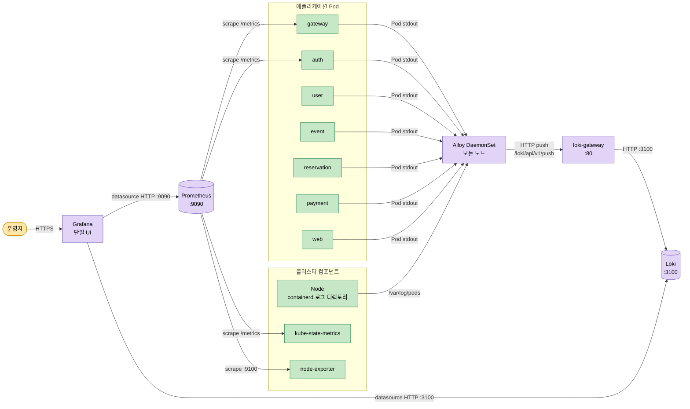
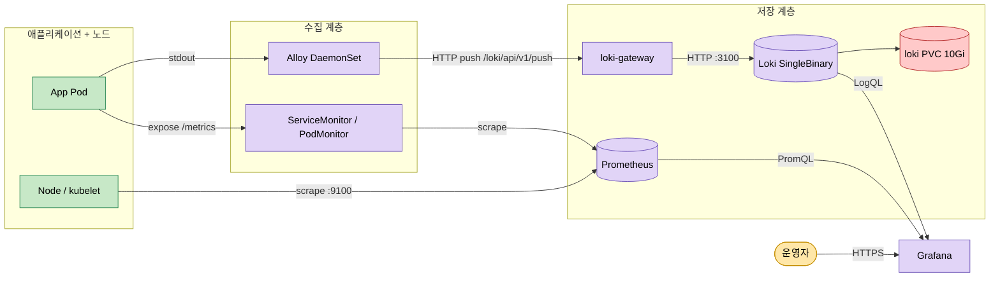

# OpenTraum 인프라 매뉴얼 - 모니터링 스택

> 작성일: 2026-04-29
> 시리즈 인덱스: [00 INDEX](OPENTRAUM-INFRA-00-INDEX.md)
> 이전: [04 DATA](OPENTRAUM-INFRA-04-DATA.md) · 다음: [06 OPERATIONS](OPENTRAUM-INFRA-06-OPERATIONS.md)

## 목차

1. [개요](#1-개요)
1.5. [모니터링 스택 입문: 이 도구들이 무엇이고 왜 같이 쓰는가](#15-모니터링-스택-입문-이-도구들이-무엇이고-왜-같이-쓰는가)
2. [도구 스택과 버전](#2-도구-스택과-버전)
3. [2축 데이터 흐름](#3-2축-데이터-흐름)
4. [Prometheus 매니페스트 라인 분석](#4-prometheus-매니페스트-라인-분석)
5. [Grafana 매니페스트 라인 분석](#5-grafana-매니페스트-라인-분석)
6. [Alertmanager 매니페스트 라인 분석](#6-alertmanager-매니페스트-라인-분석)
7. [Loki SingleBinary 매니페스트 라인 분석](#7-loki-singlebinary-매니페스트-라인-분석)
8. [Alloy DaemonSet과 로그 수집 흐름](#8-alloy-daemonset과-로그-수집-흐름)
9. [Grafana datasource sidecar 자동 등록](#9-grafana-datasource-sidecar-자동-등록)
10. [분산 정책 (현재)](#10-분산-정책-현재)
11. [정량 / 튜닝 (현재)](#11-정량--튜닝-현재)
12. [트러블슈팅](#12-트러블슈팅)
13. [진단 명령어](#13-진단-명령어)

---

## 1. 개요

본 문서는 OpenTraum 클러스터 monitoring 네임스페이스의 모니터링 스택을 설명합니다. 모니터링은 metrics 와 logs 두 축으로 구성되어 있고 모든 데이터는 Grafana 한 곳에서 조회됩니다.

- **metrics**: kube-prometheus-stack 의 Prometheus 가 ServiceMonitor / PodMonitor 를 통해 클러스터와 애플리케이션 지표를 수집합니다.
- **logs**: 각 노드의 Alloy DaemonSet 이 Pod stdout 을 읽어 loki-gateway 를 거쳐 Loki SingleBinary 로 push 합니다.

본문 사실 출처는 다음과 같습니다.

- 라이브 클러스터 상태: 2026-04-29 기준 `kubectl get pod/svc/pvc -n monitoring` 및 `helm list -n monitoring` 결과.
- 매니페스트와 values 파일:
  - `k8s/monitoring/values-kube-prometheus-stack.yaml`
  - `k8s/monitoring/values-loki.yaml`
  - `k8s/monitoring/README.md`
  - `k8s/alloy/configmap-patch.yaml`

---

## 1.5 모니터링 스택 입문: 이 도구들이 무엇이고 왜 같이 쓰는가

본 문서가 다루는 Prometheus, Grafana, Loki, Alloy, Alertmanager 는 각각 역할이 다른 컴포넌트입니다. 2장 이후 매니페스트를 라인 단위로 보기 전에, 이 절에서는 각 도구가 무엇이고 왜 같이 쓰이는지부터 정리합니다.

### 1.5.1 왜 metrics 와 logs 두 축인가

분산 시스템에서 한 종류의 데이터만으로는 진단이 어렵습니다. CPU 사용률 같은 숫자(metrics) 는 "지금 시스템이 어떤 상태인가" 를 빠르게 보여주지만 "왜 그 상태가 됐는지" 는 답하지 못합니다. 로그(logs) 는 그 시점에 무슨 일이 있었는지 텍스트로 기록하지만 정량 분석이 어렵고 검색 비용이 큽니다.

→ 그래서 두 데이터를 함께 쌓고 같은 식별자(`pod`, `service.name`, 본 시스템의 `saga_id` 등) 로 서로를 참조하게 만드는 것이 표준 패턴입니다. metrics 로 이상을 감지하고, logs 로 무슨 일이 있었는지 확인하는 흐름입니다.

본 시스템은 분산 트레이싱(traces) 을 운영하지 않습니다. 학습 환경의 비용·운영 부담을 낮추는 것이 우선이며, 멱등성 기반 SAGA 설계에서는 `event_id` / `saga_id` 헤더가 메시지 단위 추적의 단일 식별자 역할을 충분히 수행합니다. 더 깊은 단위의 호출 그래프가 필요해지면 추후 별도 인프라로 도입을 검토할 수 있습니다.

### 1.5.2 Metrics (Prometheus)

- **정의**: 일정 주기로 수집되는 시계열 숫자 데이터입니다. CPU 사용률, 요청 처리량, 에러율, GC 시간 같은 값들이 여기 해당합니다.
- **Pull 모델**: Prometheus 가 대상 엔드포인트에 정기적으로 HTTP scrape 요청을 보내 `/metrics` 응답을 가져갑니다. 반대로 Push 모델(StatsD 같은) 은 클라이언트가 수집기로 데이터를 보내는 방식인데, Prometheus 는 "수집 대상의 헬스 체크 자체를 scrape 성공/실패로 겸할 수 있다" 는 이유로 Pull 을 택했습니다.
- **ServiceMonitor / PodMonitor**: Prometheus Operator 가 제공하는 CR 입니다. scrape 대상을 매번 Prometheus config 에 직접 적지 않고 "이 라벨의 Service 를 scrape 하라" 는 선언적 리소스로 관리합니다. → 그래서 새 서비스가 떠도 Prometheus 재배포 없이 수집이 시작됩니다.
- **라벨 기반 다차원 모델**: 같은 메트릭 이름이라도 `pod`, `namespace`, `method` 같은 라벨로 차원을 구분합니다. 단 라벨 값의 조합 수(cardinality) 가 폭증하면 메모리 / 디스크가 빠르게 소모되므로 user_id 같은 고유 식별자는 라벨로 쓰지 않는 것이 원칙입니다.
- **PromQL 한 줄 예시**: `rate(http_requests_total[5m])` 는 최근 5분간 요청 수의 초당 증가율입니다.
- **약점**: 시계열 저장 비용이 크고, cardinality 폭발에 취약합니다.

### 1.5.3 Logs (Loki)

- **정의**: 사람이 읽는 텍스트 시계열입니다. Pod stdout, request log, 에러 스택 트레이스가 대표적입니다.
- **Loki 의 차별점**: 로그 본문은 인덱스 없이 압축 저장하고 라벨만 인덱스합니다. Elasticsearch 류는 본문 전체를 inverted index 로 만들어 검색이 빠르지만 저장 / 색인 비용이 큽니다. Loki 는 라벨로 일단 chunk 를 좁히고 본문은 grep 식으로 스캔합니다. → 그래서 운영 비용이 훨씬 작은 대신, 본문 키워드 검색 자체는 ELK 보다 느립니다.
- **LogQL 예시**: `{namespace="opentraum", app="gateway"} |= "ERROR"` 는 opentraum 네임스페이스의 gateway 앱 로그 중 본문에 ERROR 가 들어간 라인입니다. 앞쪽 `{}` 부분이 라벨 필터(인덱스 사용), 뒤쪽 `|=` 가 본문 필터(스캔) 입니다.
- **본 시스템 모드**: SingleBinary 모드로 read / write / backend 를 한 Pod 에 통합했고 filesystem 백엔드 + 10Gi PVC 를 씁니다.
- **운영 환경 권고**: 데이터가 커지면 S3 backend 로 바꾸고 read / write 컴포넌트를 분리하는 SimpleScalable 또는 Distributed 모드로 전환합니다.

### 1.5.4 Collection Agent (Alloy)

- **정의**: Grafana 가 만든 수집 에이전트입니다. 옛 Grafana Agent 의 후속으로, 하나의 바이너리로 metrics / logs 수집을 모두 다룰 수 있습니다.
- **본 시스템에서의 역할**: Pod stdout 을 수집해 loki-gateway 로 push 합니다(`loki.source.kubernetes` + `loki.write`).
- **왜 노드 단위(DaemonSet) 인가**: kubelet 의 컨테이너 로그 디렉터리(`/var/log/pods`), 노드 메트릭, 호스트 네트워크 정보에 직접 접근해야 하기 때문입니다. Deployment 로 두면 같은 노드의 다른 Pod 로그를 읽을 수 없습니다.

### 1.5.5 Visualization (Grafana)

- **정의**: 등록된 데이터소스에 쿼리를 날려 대시보드 / 패널로 시각화하는 UI 입니다. 자체 저장소는 없고 backend 에 위임합니다.
- **본 시스템에서 데이터소스 2개**: Prometheus(default), Loki. 한 화면에서 PromQL 패널 옆에 LogQL 패널을 두고, 패널 간 변수(예: `pod`) 를 공유해 같은 시각의 metrics 와 logs 를 같이 볼 수 있습니다.
- **데이터소스 자동 등록 메커니즘**: Grafana Pod 옆에 sidecar 컨테이너(`kiwigrid/k8s-sidecar`) 가 떠서 monitoring 네임스페이스의 ConfigMap 중 라벨 `grafana_datasource: "1"` 이 붙은 것을 watch 합니다. 매칭되는 ConfigMap 의 데이터를 Grafana provisioning 디렉토리로 마운트하거나 Grafana HTTP API 로 주입합니다. → 그래서 새 데이터소스를 추가할 때 Grafana 재기동 없이 ConfigMap apply 한 번으로 끝납니다.
- **대시보드도 같은 패턴**: ConfigMap 라벨 `grafana_dashboard: "1"` 으로 자동 등록 가능합니다. 본 시스템은 현재 chart 가 기본 제공하는 대시보드 위주로 사용 중입니다.

### 1.5.6 Alerting (Alertmanager)

- **정의**: Prometheus 가 평가한 alert rule 결과를 받아 deduplication / grouping / silencing / routing 후 외부 채널(Slack, Email, PagerDuty, Webhook 등) 로 발송하는 컴포넌트입니다.
- **Prometheus 가 직접 알림을 보내지 않는 이유**: alert 평가 책임(rule 표현식 계산) 과 발송 책임(어디로 어떻게 보낼지) 을 분리하기 위함입니다. → 그래서 발송 채널을 Slack 에서 PagerDuty 로 바꿔도 Prometheus 룰은 그대로 두고 Alertmanager config 만 수정하면 됩니다. 또 Prometheus 가 HA 로 여러 인스턴스가 동일 alert 를 평가해도 Alertmanager 가 dedup 해 한 번만 발송합니다.

### 1.5.7 본 시스템에서 도구들이 어떻게 맞물리는가

위 도구들이 클러스터 안에서 실제로 어떻게 연결되는지 한 다이어그램으로 보면 다음과 같습니다.



metrics 와 logs 두 축이 각각 Prometheus 와 Alloy 를 거쳐 자기 backend 로 들어가고, Grafana 한 곳이 둘 모두를 데이터소스로 들고 있는 구조입니다.

### 1.5.8 비교 표: Metrics vs Logs

| 측면 | Metrics | Logs |
|---|---|---|
| 데이터 형태 | 시계열 숫자 | 시계열 텍스트 |
| 인덱싱 | 라벨 기반 | 라벨만(Loki) / 본문(ELK) |
| 도구 | Prometheus | Loki |
| 저장 비용 | 카디널리티 의존 | 보존 기간 + 본문 크기 |
| 진단 강점 | "지금 시스템 상태?" | "그 시점 무슨 일?" |
| 약점 | "왜?" 답 못함 | 검색 비용, 정량 분석 어려움 |

두 데이터는 강점과 약점이 보완 관계에 있어 함께 쌓을 때 분산 시스템 진단이 가능해집니다.

이상으로 도구별 기본기는 정리됐고, 2장부터는 본 시스템에 실제 설치된 버전과 매니페스트의 라인 단위 설명으로 들어갑니다.

---

## 2. 도구 스택과 버전

monitoring 네임스페이스에 설치된 Helm release 와 라이브 Pod 이미지는 다음과 같습니다.

| Release | Chart 버전 | App 버전 | 역할 |
|---|---|---|---|
| `kube-prometheus-stack` | 84.3.0 | v0.90.1 | Prometheus, Alertmanager, Grafana, Operator, kube-state-metrics 통합 |
| `loki` | 7.0.0 | 3.6.7 | 로그 저장(SingleBinary) + gateway |
| `alloy` | 1.7.0 | v1.15.0 | 로그 수집(DaemonSet) |

라이브 Pod 인벤토리(이미지 태그 포함) 는 다음과 같습니다.

| Pod | 이미지 |
|---|---|
| `alertmanager-kube-prometheus-stack-alertmanager-0` (2/2) | `quay.io/prometheus/alertmanager:v0.32.0` + `quay.io/prometheus-operator/prometheus-config-reloader:v0.90.1` |
| `alloy-*` (DaemonSet, 노드당 1 Pod, 2/2) | `docker.io/grafana/alloy:v1.15.0` + `quay.io/prometheus-operator/prometheus-config-reloader:v0.81.0` |
| `kube-prometheus-stack-grafana-*` (3/3) | `quay.io/kiwigrid/k8s-sidecar:2.7.1` (×2) + `docker.io/grafana/grafana:13.0.1` |
| `kube-prometheus-stack-kube-state-metrics-*` | `registry.k8s.io/kube-state-metrics/kube-state-metrics:v2.18.0` |
| `kube-prometheus-stack-operator-*` | `quay.io/prometheus-operator/prometheus-operator:v0.90.1` |
| `loki-0` (2/2) | `docker.io/grafana/loki:3.6.7` + `docker.io/kiwigrid/k8s-sidecar:2.5.0` |
| `loki-canary-*` (DaemonSet, 노드당 1 Pod) | `docker.io/grafana/loki-canary:3.6.7` |
| `loki-gateway-*` | `docker.io/nginxinc/nginx-unprivileged:1.29-alpine` |
| `prometheus-kube-prometheus-stack-prometheus-0` (2/2) | `quay.io/prometheus/prometheus:v3.11.3` + `quay.io/prometheus-operator/prometheus-config-reloader:v0.90.1` |

Service 라이브 인벤토리는 다음과 같습니다.

| Service | 포트 |
|---|---|
| `alertmanager-operated` (headless) | 9093, 9094 |
| `alloy` | 12345 |
| `kube-prometheus-stack-alertmanager` | 9093, 8080 |
| `kube-prometheus-stack-grafana` | 80 |
| `kube-prometheus-stack-operator` | 443 |
| `kube-prometheus-stack-prometheus` | 9090, 8080 |
| `kube-prometheus-stack-prometheus-node-exporter` | 9100 |
| `loki` | 3100, 9095 |
| `loki-canary` | 3500 |
| `loki-gateway` | 80 |
| `loki-headless` | 3100 |
| `loki-memberlist` | 7946 |
| `prometheus-operated` (headless) | 9090 |

PVC 라이브 인벤토리는 다음과 같습니다.

| PVC | 용량 | Access | StorageClass |
|---|---|---|---|
| `storage-loki-0` | 10Gi | RWO | `ebs-sc` |

DaemonSet 인 alloy 와 loki-canary 는 일반 워커 노드에서 기동되며, taint 가 걸린 g5 노드는 회피합니다. 본문에서는 "노드당 1 Pod (DaemonSet)" 으로 표기합니다.

---

## 3. 2축 데이터 흐름

두 축의 데이터 경로를 한 다이어그램으로 표현하면 다음과 같습니다.



각 화살표 라벨에 포트와 프로토콜을 명시했습니다. metrics 는 HTTP scrape, logs 는 HTTP push 로 입수되고 Grafana 가 두 backend 모두 데이터소스로 보유합니다.

---

## 4. Prometheus 매니페스트 라인 분석

`values-kube-prometheus-stack.yaml` 의 `prometheus` 섹션은 다음과 같이 구성되어 있습니다.

- **ingress**: `host=prometheus`, `pathType=Prefix`, `paths=[/prometheus]`, `ingressClassName=nginx`. NGINX Ingress 의 `/prometheus` prefix 로 외부 접근을 받습니다.
- **externalUrl / routePrefix**: 둘 다 `/prometheus`. Prometheus UI 가 자기 자신을 sub-path 로 인식해 정적 자산 경로를 올바르게 생성합니다.
- **retention**: `7d`. 기본 15d 에서 단축해 PVC 디스크 부담을 줄였습니다.
- **podMetadata.labels**: `opentraum.io/heavy: "true"`. 다른 무거운 컴포넌트(Loki, MariaDB) 와 cross podAntiAffinity 를 매칭하기 위한 공용 라벨입니다.
- **podAntiAffinity**: 빈 문자열 `""`. chart 기본값인 self-only podAntiAffinity 를 비활성화했습니다. Prometheus 는 단일 replica 라 자기 자신끼리 회피해도 효과가 없고, 아래 cross anti-affinity 와 라벨 키가 충돌해 의도치 않은 우선순위 충돌이 생기기 때문입니다.
- **topologySpreadConstraints**: `maxSkew=1`, `topologyKey=kubernetes.io/hostname`, `whenUnsatisfiable=ScheduleAnyway`, `labelSelector` 는 `app.kubernetes.io/name=prometheus`. 같은 라벨 Pod 끼리 노드별 차이를 1 이내로 유지하도록 스케줄러에 힌트를 줍니다. 강제는 아니므로 노드가 부족하면 Pending 으로 빠지지 않습니다.
- **affinity.podAntiAffinity.preferred**: `weight=100`, `labelSelector=opentraum.io/heavy=true`, `topologyKey=kubernetes.io/hostname`. Prometheus 가 다른 무거운 Pod 와 같은 노드에 떨어지지 않도록 선호 표시를 줍니다.
- **resources**: requests `mem 512Mi / cpu 100m`, limits `mem 1Gi / cpu 500m`. 7일 retention + 6노드 규모 메트릭 수집을 감안한 보수적 한도입니다.

`opentraum.io/heavy=true` 라벨은 Prometheus, Loki, MariaDB 가 공통으로 들고 있어, 세 Pod 가 서로 다른 노드를 선호하게 만드는 단일 식별자 역할을 합니다.

---

## 5. Grafana 매니페스트 라인 분석

`values-kube-prometheus-stack.yaml` 의 `grafana` 섹션은 다음과 같습니다.

- **adminPassword**: values 파일에 평문으로 존재하지만 본문 표기는 생략합니다. 운영 시 Sealed Secret 이나 외부 비밀 관리로 이전하는 것이 안전합니다.
- **ingress**: `enabled=true`, `ingressClassName=nginx`. NGINX Ingress 로 노출됩니다.
- **sidecar.datasources.enabled**: `true`. Grafana Pod 옆에 sidecar 컨테이너가 떠서 ConfigMap 을 감시합니다.
- **additionalDataSources**: Loki 한 건이 인라인으로 등록됩니다. `type=loki`, `url=http://loki.monitoring.svc.cluster.local:3100`, `isDefault=false`.
- **topologySpreadConstraints**: `maxSkew=1`, `ScheduleAnyway`, `labelSelector=app.kubernetes.io/name=grafana`.
- **resources**: requests `mem 128Mi / cpu 50m`, limits `mem 256Mi / cpu 300m`.

데이터소스 자동 등록 흐름은 다음과 같이 동작합니다. sidecar 컨테이너(`kiwigrid/k8s-sidecar:2.7.1`) 가 monitoring 네임스페이스의 ConfigMap 중 라벨 `grafana_datasource: "1"` 이 붙은 것을 watch 하다가, 매칭되는 ConfigMap 의 데이터를 Grafana provisioning 디렉토리로 마운트하거나 Grafana HTTP API 로 주입합니다. 새 ConfigMap 을 apply 하면 Grafana 재기동 없이 데이터소스가 추가됩니다. Loki 는 values 의 `additionalDataSources` 로 인라인 등록됩니다.

---

## 6. Alertmanager 매니페스트 라인 분석

`values-kube-prometheus-stack.yaml` 의 `alertmanager.alertmanagerSpec` 은 다음과 같이 단순합니다.

- **topologySpreadConstraints**: `maxSkew=1`, `ScheduleAnyway`, `labelSelector=app.kubernetes.io/name=alertmanager`.
- **resources**: requests `mem 64Mi / cpu 10m`, limits `mem 128Mi / cpu 100m`.

라이브 Pod `alertmanager-kube-prometheus-stack-alertmanager-0` 은 Alertmanager 본체(`v0.32.0`) + config-reloader(`v0.90.1`) 사이드카로 구성되어 있고 9093(HTTP) / 9094(cluster) 포트를 노출합니다.

---

## 7. Loki SingleBinary 매니페스트 라인 분석

`values-loki.yaml` 의 핵심은 SingleBinary 모드 + filesystem 백엔드입니다.

- **deploymentMode**: `SingleBinary`. backend / read / write 세 컴포넌트의 `replicas: 0` 으로 비활성화하고 SingleBinary 한 Pod 가 ingester / distributor / querier 를 모두 수행합니다.
- **chunksCache.enabled**: `false`. 별도 memcached 를 두지 않습니다.
- **resultsCache.enabled**: `false`. 동일하게 캐시 컴포넌트 미사용.
- **loki.auth_enabled**: `false`. 클러스터 내부 호출만 받으므로 multi-tenant 인증 비활성.
- **loki.commonConfig.replication_factor**: `1`. SingleBinary 단일 Pod 에 맞춥니다.
- **loki.schemaConfig**: `from=2024-04-01`, `index.period=24h`, `index.prefix=loki_index_`, `object_store=filesystem`, `schema=v13`, `store=tsdb`. 24시간 단위 인덱스 + tsdb v13.
- **loki.storage.type**: `filesystem`. 외부 오브젝트 스토리지(S3 등) 미사용, 로컬 PVC 만 사용.
- **singleBinary.replicas**: `1`.
- **singleBinary.persistence**: `enabled=true`, `size=10Gi`, `storageClass=ebs-sc`. 라이브 PVC 는 `storage-loki-0`.
- **singleBinary.podLabels**: `opentraum.io/heavy: "true"` (cross anti-affinity 매칭).
- **singleBinary.topologySpreadConstraints**: `maxSkew=1`, `ScheduleAnyway`, `labelSelector=app.kubernetes.io/component=single-binary`.
- **singleBinary.affinity.podAntiAffinity.preferred**: `weight=100`, `labelSelector=opentraum.io/heavy=true`, `topologyKey=kubernetes.io/hostname`. 다른 무거운 Pod 와 다른 노드 선호.
- **singleBinary.resources**: requests `mem 256Mi / cpu 50m`, limits `mem 512Mi / cpu 500m`.
- **gateway.replicas**: `1`. NGINX 기반 게이트웨이 한 Pod (`loki-gateway`).
- **gateway.topologySpreadConstraints**: `maxSkew=1`, `labelSelector=app.kubernetes.io/component=gateway`.
- **gateway.resources**: requests `mem 32Mi / cpu 10m`, limits `mem 128Mi / cpu 100m`.

Alloy 는 `loki-gateway` (`http://loki-gateway.monitoring.svc.cluster.local/loki/api/v1/push`) 로 push 하고, gateway 가 SingleBinary 의 3100 포트로 reverse proxy 합니다.

---

## 8. Alloy DaemonSet과 로그 수집 흐름

Alloy 는 노드당 1 Pod 의 DaemonSet 입니다. `configmap-patch.yaml` 은 chart 가 만든 기본 alloy ConfigMap 을 통째로 덮어쓰는 patch 매니페스트로, Pod 로그 수집 파이프라인을 정의합니다.

```
discovery.kubernetes "pods"  -> Pod 자원 watch
discovery.relabel    "pods"  -> namespace / pod / container / app 라벨 부여
loki.source.kubernetes "pods" -> Pod stdout 수집
loki.write           "default" -> http://loki-gateway.monitoring.svc.cluster.local/loki/api/v1/push
```

`discovery.relabel` 에서 4개 메타 라벨(`__meta_kubernetes_namespace`, `__meta_kubernetes_pod_name`, `__meta_kubernetes_pod_container_name`, `__meta_kubernetes_pod_label_app_kubernetes_io_name`) 을 각각 `namespace`, `pod`, `container`, `app` 으로 매핑해 Loki 에서 LogQL 셀렉터로 사용 가능하게 합니다.

```mermaid
flowchart LR
    classDef app fill:#C7E8C7,stroke:#2E8B57,color:#000
    classDef obs fill:#E1D4F7,stroke:#6A4FB6,color:#000
    classDef data fill:#FFC9C9,stroke:#B22222,color:#000

    AppPod[App Pod<br/>stdout 로그]
    AlloyDS[Alloy DaemonSet Pod<br/>loki.source.kubernetes]
    AlloyWrite[loki.write default]
    LokiGW[loki-gateway Service]
    LokiPod[Loki SingleBinary Pod]
    LokiPVC[(loki PVC 10Gi)]

    AppPod -- "/var/log/pods" --> AlloyDS
    AlloyDS --> AlloyWrite
    AlloyWrite -- "HTTP /loki/api/v1/push" --> LokiGW
    LokiGW -- "HTTP :3100" --> LokiPod
    LokiPod --> LokiPVC

    class AppPod app
    class AlloyDS,AlloyWrite,LokiGW,LokiPod obs
    class LokiPVC data
```



---

## 9. Grafana datasource sidecar 자동 등록

본 시스템의 Loki 데이터소스는 `values-kube-prometheus-stack.yaml` 의 `additionalDataSources` 로 인라인 등록되어 있습니다. 추가 데이터소스를 ConfigMap 으로 등록하고 싶으면, `metadata.labels.grafana_datasource: "1"` 을 붙인 ConfigMap 을 monitoring 네임스페이스에 apply 하면 됩니다.

ConfigMap 을 apply 하면 Grafana sidecar(`k8s-sidecar:2.7.1`) 가 변경을 감지해 Grafana provisioning 으로 주입하므로 Grafana Pod 재기동은 필요하지 않습니다. 캐시 반영이 늦으면 Grafana Pod 만 rollout restart 하면 됩니다.

---

## 10. 분산 정책 (현재)

monitoring 의 무거운 Pod 는 두 가지 스케줄링 장치를 함께 씁니다.

### 10.1 topologySpreadConstraints (같은 라벨 끼리)

`maxSkew=1`, `topologyKey=kubernetes.io/hostname`, `whenUnsatisfiable=ScheduleAnyway`. `labelSelector` 가 같은 Pod 그룹 내에서 노드별 Pod 수 차이를 1 이내로 유지하라는 힌트입니다. `ScheduleAnyway` 라 강제는 아니므로 노드가 부족하면 Pending 으로 빠지지 않고 같은 노드에라도 스케줄됩니다. monitoring 에서는 `app.kubernetes.io/name=prometheus`, `=grafana`, `=alertmanager` 등 컴포넌트별 라벨로 적용되어 있어, 같은 컴포넌트의 여러 Pod 가 한 노드에 몰리는 것을 막습니다.

### 10.2 cross podAntiAffinity (서로 다른 컴포넌트끼리)

`opentraum.io/heavy=true` 공통 라벨을 Prometheus, Loki, MariaDB 가 모두 들고 있고, 각자의 affinity 에 `preferredDuringSchedulingIgnoredDuringExecution` `podAntiAffinity` 를 `weight=100`, `topologyKey=kubernetes.io/hostname` 으로 설정해 둡니다. 결과적으로 세 무거운 Pod 가 서로 다른 노드를 선호하게 됩니다. `preferred` 라 노드 부족 시 강제하지 않아 Pending 위험이 없습니다.

### 10.3 두 장치를 함께 쓰는 이유

topologySpreadConstraints 는 같은 `labelSelector` 매칭 Pod 끼리만 분산을 정렬하므로 단일 replica StatefulSet(Prometheus, Loki, MariaDB) 에서는 서로를 보지 못합니다. 반대로 cross podAntiAffinity 는 서로 다른 컴포넌트 사이에 작용하지만 같은 컴포넌트의 여러 Pod(예: kube-state-metrics) 가 한 노드에 몰리는 것은 막지 못합니다. 두 장치를 같이 쓰는 것은 이 두 축의 분산을 모두 챙기기 위함입니다.

---

## 11. 정량 / 튜닝 (현재)

- **Prometheus retention 7d**: 기본 15d 에서 단축. PVC 크기를 7일치 메트릭에 맞춰 운용 가능합니다.
- **Loki SingleBinary + filesystem + 10Gi PVC**: 학습 / 개발 환경에 맞춘 단일 Pod 구성. 인덱스는 24h 단위 tsdb v13.
- **Alloy 노드당 1 Pod (DaemonSet)**: taint 가 없는 일반 워커 노드에서 기동되어 모든 일반 워크로드 노드의 Pod stdout 을 수집합니다.
- **Grafana sidecar 자동 등록**: ConfigMap 라벨 `grafana_datasource: "1"` 만 붙이면 데이터소스가 자동으로 추가되어 수동 등록 작업이 0 입니다.
- **무거운 Pod cross anti-affinity preferred**: 노드 부족 시 강제 분산하지 않아 Pending 위험을 회피하면서, 여유 있을 때는 Prometheus / Loki / MariaDB 가 서로 다른 노드로 자연스럽게 흩어집니다.

---

## 12. 트러블슈팅

### 12.1 무거운 Pod 한 노드 집중으로 메모리 압박

증상: 한 노드의 메모리 사용률이 90% 를 넘어가고 OOMKilled 이벤트가 발생합니다.

진단 순서:

1. `kubectl top pods -A --sort-by=memory` 로 상위 소비 Pod 와 노드를 확인합니다.
2. `kubectl get pod -n monitoring -o wide` 로 Prometheus, Loki, MariaDB 가 같은 노드에 모여 있는지 확인합니다.
3. 각 Pod 매니페스트에서 `opentraum.io/heavy: "true"` 라벨과 cross podAntiAffinity preferred 가 적용되어 있는지 확인합니다.
4. 라벨이 누락되어 있다면 values 파일을 수정한 뒤 `helm upgrade` 로 반영합니다.

### 12.2 Loki PVC AZ 종속으로 재스케줄 실패

증상: Loki Pod 재기동 시 `VolumeBindingFailed` 또는 `FailedScheduling` 이벤트가 발생합니다.

진단 순서:

1. `kubectl describe pod -n monitoring loki-0` 로 Events 를 확인합니다.
2. PVC `storage-loki-0` 가 바인딩된 AZ 와 사용 가능한 노드의 AZ 가 일치하는지 확인합니다.
3. `kubectl get sc ebs-sc -o yaml` 로 `volumeBindingMode: WaitForFirstConsumer` 가 설정되어 있는지 확인합니다. EBS 는 AZ-bound 라 이 모드가 비활성화되어 있으면 PVC 가 임의 AZ 에 미리 묶여 재스케줄 시 실패할 수 있습니다.

### 12.3 Loki 디스크 가득

증상: Loki Pod 가 write error 를 내거나 PVC 사용량이 90% 에 근접합니다.

진단 순서:

1. `kubectl exec -n monitoring loki-0 -- df -h /var/loki` 로 사용량을 확인합니다.
2. Loki retention 설정과 `loki.schemaConfig` 의 인덱스 주기를 점검합니다.
3. 학습 환경은 PVC 확장으로 대응하고, 운영 환경에서는 storage.type 을 `s3` 로 전환해 오브젝트 스토리지 backend 를 검토합니다.

### 12.4 Grafana datasource 미등록

증상: Grafana 에서 Loki 데이터소스가 보이지 않습니다.

진단 순서:

1. `kubectl logs -n monitoring deploy/kube-prometheus-stack-grafana -c grafana-sc-datasources` 로 sidecar 가 ConfigMap 을 인식했는지 확인합니다.
2. `additionalDataSources` 로 인라인 등록한 경우, values 파일 변경 후 `helm upgrade` 가 반영됐는지 확인합니다.
3. 그래도 반영되지 않으면 `kubectl rollout restart deploy/kube-prometheus-stack-grafana -n monitoring` 으로 Grafana Pod 만 재기동합니다.

### 12.5 Alertmanager 알림 미발송

증상: Prometheus alert 는 firing 인데 외부 채널(이메일, Slack 등) 로 도착하지 않습니다.

진단 순서:

1. `kubectl get secret -n monitoring -l app.kubernetes.io/name=alertmanager` 로 Alertmanager config secret 을 확인합니다.
2. secret 안의 `alertmanager.yaml` 의 receiver / route 설정을 점검합니다.
3. `kubectl logs -n monitoring alertmanager-kube-prometheus-stack-alertmanager-0 -c alertmanager` 로 발송 시도 로그를 확인합니다.

---

## 13. 진단 명령어

```bash
# 전체 monitoring Pod 와 분산 노드 확인
kubectl get pods -n monitoring -o wide

# Alloy 로그 (DaemonSet)
kubectl logs -n monitoring ds/alloy -c alloy --tail=200

# Loki readiness
kubectl exec -n monitoring loki-0 -- wget -qO- http://localhost:3100/ready

# 등록된 ServiceMonitor / PodMonitor 전체
kubectl get servicemonitor,podmonitor -A

# Prometheus readiness
kubectl exec -n monitoring prometheus-kube-prometheus-stack-prometheus-0 -- wget -qO- http://localhost:9090/-/ready

# Helm release 버전 확인
helm list -n monitoring
```
