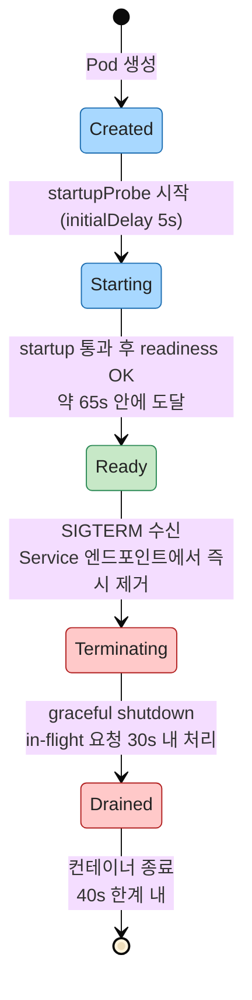
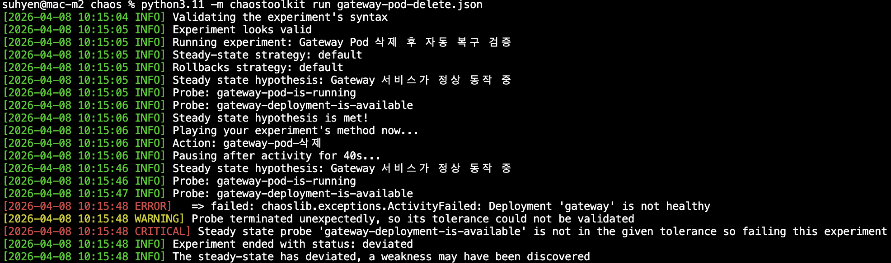
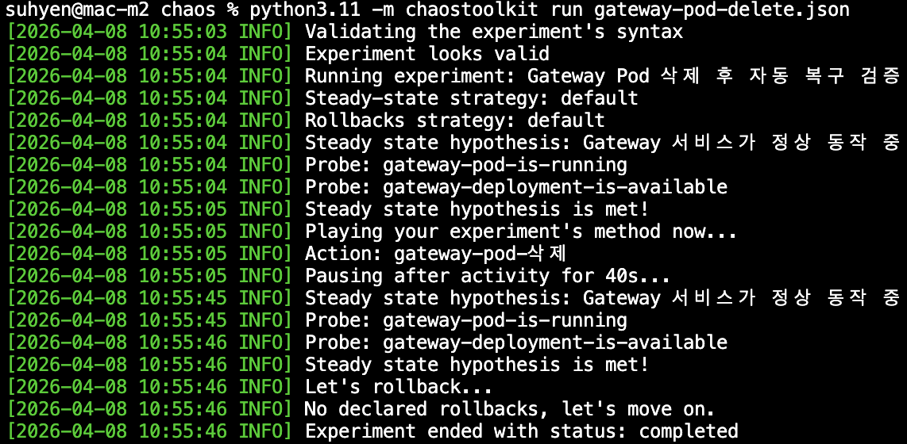
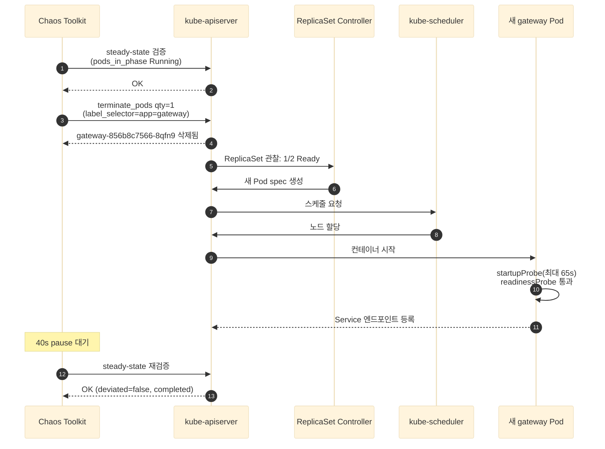

# OpenTraum 인프라 매뉴얼 - 운영 정책 / 안정성 / 카오스

> 작성일: 2026-04-28
> 시리즈 인덱스: [00 INDEX](OPENTRAUM-INFRA-00-INDEX.md)
> 이전: [05 MONITORING](OPENTRAUM-INFRA-05-MONITORING.md) · 다음: [07 CICD](OPENTRAUM-INFRA-07-CICD.md)

## 목차
- [1. 개요](#1-개요)
- [2. PriorityClass](#2-priorityclass)
- [3. PodDisruptionBudget](#3-poddisruptionbudget)
- [4. Probe + 종료 정책](#4-probe--종료-정책)
- [5. Affinity / TopologySpread](#5-affinity--topologyspread)
- [6. KEDA (현재 상태)](#6-keda-현재-상태)
- [7. ReplicaSet 정리 / 이미지 정책](#7-replicaset-정리--이미지-정책)
- [8. 카오스 엔지니어링](#8-카오스-엔지니어링)
- [9. 정량 성과 / 리소스 절감 / 비용 영향](#9-정량-성과--리소스-절감--비용-영향)
- [10. 트러블슈팅](#10-트러블슈팅)
- [11. 진단 명령어](#11-진단-명령어)

---

## 1. 개요

본 장은 OpenTraum EKS 클러스터의 운영 안정성 정책과 그 정책이 보장하는 정량 성과, 그리고 정책이 실제로 작동하는지 카오스 실험으로 검증한 결과를 정리합니다. 정보는 두 가지 출처에서만 가져왔습니다. 첫째는 라이브 클러스터 상태(확인 시점 2026-04-28 15:10 KST)이고, 둘째는 `OpenTraum-Infra/manual/k8s/` 아래의 매니페스트 원본과 `OpenTraum-Infra/chaos/` 아래의 Chaos Toolkit 실험 정의 및 저널입니다. 양쪽이 일치하는 사실만 본문에 기재했습니다.

다루는 정책은 6가지입니다. 우선순위 기반 자원 배분(PriorityClass), 자발적 중단 한도(PodDisruptionBudget), 시작과 종료의 라이프사이클(Probe + terminationGracePeriod), 분산 배치(Affinity + TopologySpread), 이벤트 기반 오토스케일링(KEDA), 그리고 ReplicaSet 정리와 이미지 정책입니다. 마지막으로 이 6가지가 실제 장애 시 의도대로 동작함을 입증하기 위해 gateway Pod 강제 삭제 실험을 수행했고, 결과 저널(`chaos/journal.json`)이 40초 내 복구를 기록했습니다.

이전 장과의 관계: [03 WORKLOAD]가 매니페스트 라인을 사실로 정리했고, [04 DATA]와 [05 MONITORING]이 데이터 계층과 모니터링 도구를 다루었다면, 본 장은 그 위에 얹히는 운영 정책 자체를 다룹니다. 다음 장 [07 CICD]는 본 장에서 정의된 정책이 GitOps 흐름을 통해 어떻게 클러스터에 도달하는지 설명합니다.

---

## 2. PriorityClass

라이브 클러스터에는 OpenTraum 도메인 전용 PriorityClass 3종이 등록되어 있습니다. 매니페스트 출처는 [../manual/k8s/priorityclass.yml] 한 파일이며, `globalDefault: false`로 설정되어 라벨이 없는 Pod는 클러스터 기본값(0)을 사용합니다.

| name | value | preemptionPolicy | 적용 워크로드 |
|---|---|---|---|
| opentraum-high | 1000 | PreemptLowerPriority | gateway, payment-service, reservation-service, opentraum-redis |
| opentraum-medium | 500 | PreemptLowerPriority | auth-service, user-service, event-service |
| opentraum-low | 100 | PreemptLowerPriority | web |

**preemptionPolicy=PreemptLowerPriority의 의미.** 노드의 CPU 또는 메모리가 부족해 새 Pod를 스케줄할 자리가 없을 때, kube-scheduler는 자기보다 낮은 priority value를 가진 Pod를 강제 종료(preempt)하고 그 자리를 차지할 수 있습니다. value가 1000인 gateway Pod가 새로 스케줄되어야 하는데 노드에 여유가 없다면, value 100인 web Pod가 먼저 종료되어 자리를 양보합니다. 반대로 같은 등급(1000 대 1000) 또는 더 높은 등급의 Pod는 절대 빼앗기지 않으므로, 등급 자체가 보호 경계 역할을 합니다.

**워크로드 매핑의 근거.** high 등급에는 진입점(gateway)과 트랜잭션 핵심(reservation, payment), 그리고 분산 락을 제공하는 redis가 들어갑니다. 셋 중 하나라도 evict되면 좌석 예매 흐름 전체가 중단되기 때문입니다. medium에는 인증/사용자/콘서트 메타와 같은 보조 도메인이, low에는 정적 자산을 서빙하는 web이 들어갑니다. web은 캐시된 빌드 산출물이 CDN 또는 클라이언트 측에 남아 있는 동안 일시적 evict가 사용자 경험에 즉시 반영되지 않으므로 가장 낮은 보호 우선순위를 갖습니다.

**globalDefault=false가 만드는 안전장치.** 만약 어느 PriorityClass가 globalDefault=true였다면 라벨이 없는 모든 Pod가 그 등급을 자동으로 받게 되어, 신규 워크로드가 의도치 않게 high를 차지하거나 low로 떨어지는 사고가 가능합니다. 세 PriorityClass 모두 false로 두어 명시적 지정만 받도록 했습니다.

---

## 3. PodDisruptionBudget

라이브 클러스터에 등록된 OpenTraum 도메인의 PDB는 4건입니다. 매니페스트 출처는 [../manual/k8s/pdb.yml]입니다.

| name | ns | maxUnavailable | selector |
|---|---|---|---|
| gateway-pdb | opentraum | 0 | app=gateway |
| reservation-db-pdb | kafka | 1 | app=reservation-db |
| payment-db-pdb | kafka | 1 | app=payment-db |
| event-db-pdb | kafka | 1 | app=event-db |

**왜 gateway는 maxUnavailable=0 인가.** gateway는 외부 트래픽이 처음 닿는 단일 진입점이고, 한 Pod라도 강제로 내려가면 절반의 트래픽이 503을 받습니다. PDB=0은 "voluntary disruption(노드 drain, 이미지 업데이트, kubectl delete pod 등 자발적 중단)으로 인한 가용 Pod 감소를 절대 허용하지 않는다"는 약속입니다. 단독으로는 노드 drain을 영구 차단하므로 위험해 보일 수 있으나, gateway Deployment의 `replicas=2 + RollingUpdate(maxSurge=1, maxUnavailable=0)` 조합과 결합되면 의도가 분명해집니다. 새 Pod 1개를 먼저 띄워 Ready 상태가 된 뒤(maxSurge=1) 이전 Pod를 종료하는 순서이므로, 가용 Pod 수는 2 -> 3 -> 2를 거치고 결코 1로 떨어지지 않습니다. PDB=0은 이 약속을 클러스터 차원에서 강제하는 자물쇠 역할을 합니다.

**왜 CDC DB 3종은 maxUnavailable=1 인가.** reservation-db, payment-db, event-db는 모두 `replicas=1`인 단일 인스턴스 MariaDB이고, Debezium CDC가 binlog를 추적하는 원본 DB입니다(자세한 데이터 흐름은 [04 DATA] 참조). 만약 PDB를 0으로 두면 단일 Pod가 내려가는 것을 영구 금지하게 되어, 노드 drain이나 EKS 노드 그룹 롤링 업그레이드 시 해당 노드가 영영 비워지지 않습니다. 따라서 maxUnavailable=1로 두어 voluntary disruption을 허용하되, 데이터 보존은 PVC가 책임집니다. Pod가 다른 노드로 재스케줄되더라도 EBS 볼륨이 그 노드에 attach되어 동일한 binlog 위치에서 다시 시작합니다.

**Strimzi Kafka는 별도 PDB 정의를 두지 않은 이유.** `kafka` 네임스페이스의 Strimzi Kafka 클러스터(`my-kafka-cluster`)는 Strimzi Cluster Operator가 자체 PDB를 자동으로 관리합니다. 매니페스트에서 별도 PDB를 만들면 Operator의 reconcile과 충돌하므로 의도적으로 비워 두었고, 필요 시 Kafka CR의 `spec.kafka.template.podDisruptionBudget` 필드로 조정합니다.

---

## 4. Probe + 종료 정책

gateway 매니페스트(`OpenTraum-gateway/k8s/deployment.yml`)에 정의된 Probe 3종과 종료 정책은 다음과 같습니다.

| 단계 | endpoint | initialDelay | period | timeout | failureThreshold | 누적 허용 |
|---|---|---|---|---|---|---|
| startupProbe | GET /actuator/health | 5s | 3s | 3s | 20 | 최대 65s |
| readinessProbe | GET /actuator/health | 0 | 5s | 3s | 2 | 약 10s |
| livenessProbe | GET /actuator/health | 0 | 10s | 3s | 3 | 30s |

종료 정책은 `terminationGracePeriodSeconds=40` + `SERVER_SHUTDOWN=graceful` + `SPRING_LIFECYCLE_TIMEOUT_PER_SHUTDOWN_PHASE=30s` 조합으로 작동합니다. SIGTERM을 받으면 Spring이 신규 요청 수신을 끊고 in-flight 요청이 30초 안에 끝나기를 기다린 뒤, 컨테이너 런타임이 SIGKILL을 보내기 전 10초의 안전 마진이 남도록 했습니다.



**startupProbe(최대 65s).** Spring 부팅이 끝나고 `/actuator/health`가 200을 반환할 때까지 livenessProbe와 readinessProbe를 일시 중단합니다. 5초 대기 후 3초 간격으로 20회까지 시도하므로 5 + 20 × 3 = 65초가 최대 허용 시간입니다. JIT 워밍업이 길어지는 첫 부팅에서 livenessProbe가 조급하게 Pod를 재시작시키는 사고를 방지합니다.

**readinessProbe(약 10s).** 트래픽 수신 가능 여부를 결정합니다. 5초 간격으로 2회 연속 실패하면 Service 엔드포인트에서 제거되어 트래픽이 차단되고, 다시 성공하면 자동으로 복귀합니다. 짧은 GC 정지나 일시적 백엔드 지연이 5초 내에 풀리면 readiness만 잠깐 false가 되었다가 회복되므로, Pod 재시작 비용 없이 트래픽만 우회됩니다.

**livenessProbe(30s).** 10초 간격으로 3회 연속 실패하면 컨테이너를 재시작합니다. Deadlock이나 회복 불가능한 상태를 감지하기 위한 마지막 안전망이며, 정상 부하 변동에는 readiness가 먼저 반응하므로 liveness가 트리거되는 일은 드뭅니다.

**40초 종료 마진의 분해.** 30초(graceful shutdown 한도) + 10초(SIGKILL 직전 여유) = 40초. Spring이 30초 이내에 정리를 끝내야 컨테이너 런타임이 강제 종료를 발동하지 않습니다. graceful 미완료 시 SIGKILL이 떨어지면 in-flight 요청이 클라이언트 측 5xx로 노출됩니다.

**튜닝 전후 비교.** 위에 정리한 timing 은 튜닝 후 값입니다. 튜닝 전() livenessProbe 의 `initialDelaySeconds` 가 60~90초, readinessProbe 의 `initialDelaySeconds` 가 30~60초로 고정되어 있어 Pod 가 20초 안에 준비되어도 트래픽이 30~60초 지연되는 손실이 있었습니다. startupProbe 도입과 두 Probe 의 `initialDelaySeconds=0` 으로 통일한 결과 Pod 강제 삭제 후 자가 복구가 60초 이상 deviated 상태에서 42.51초 completed 로 전환되었습니다(§8.2). terminationGracePeriodSeconds 도 같은 시점에 30초 기본값에서 10초로 단축되었으나, gateway 등 graceful shutdown 이 필요한 서비스는 in-flight 요청 처리를 위해 40초로 재상향한 상태입니다.

---

## 5. Affinity / TopologySpread

OpenTraum 클러스터는 4가지 분산 정책을 조합해 사용합니다. 강제도(hard/soft), 적용 범위, 목적이 모두 다릅니다.

| 정책 | 강제도 | topologyKey | 대상 | 목적 |
|---|---|---|---|---|
| topologySpreadConstraints maxSkew=1 ScheduleAnyway | soft (preferred) | hostname | 앱 워크로드(gateway, web 등) | 같은 라벨 셋 Pod가 노드별로 균등 |
| Pod soft anti-affinity (자기 자신 분산) | soft | hostname | 앱 워크로드 | 같은 서비스 Pod끼리 다른 노드 선호 |
| Pod hard antiAffinity required | hard | hostname | CDC MariaDB 3종(reservation/payment/event-db) | 서로 다른 노드 강제 |
| cross anti-affinity preferred (`opentraum.io/heavy`) | soft | hostname | prometheus, loki, opentraum-mariadb | 무거운 Pod끼리 같은 노드 회피 |

**maxSkew=1 + ScheduleAnyway.** 동일 라벨 셋의 Pod 수가 노드별로 1 이상 차이 나지 않도록 유도하되, 자리가 부족하면 같은 노드 배치도 허용합니다. gateway 2 Pod가 라이브에서 서로 다른 노드(`ip-<NODE_5>`, `ip-<NODE_2>`)에 떠 있는 결과는 이 제약이 정상 작동했음을 보여 줍니다.

**Pod soft anti-affinity.** topologySpread와 비슷한 의도이지만, label selector를 더 세밀하게 지정할 수 있어 "같은 서비스의 Pod끼리"를 명확히 표현할 수 있습니다. weight 기반이므로 강제는 아니며, topologySpread와 함께 적용해 분산 의도를 보강합니다.

**Pod hard antiAffinity required (CDC MariaDB).** `kafka` 네임스페이스의 reservation-db, payment-db, event-db 세 MariaDB는 `requiredDuringSchedulingIgnoredDuringExecution`로 hard anti-affinity를 걸어 서로 다른 노드에만 스케줄됩니다. 한 노드 장애 시 CDC 원본 DB 셋이 동시에 사라지면 Debezium 커넥터 셋이 동시에 멈추고 이벤트 스트림 전체가 정지하므로, hard 제약으로 동시 실패를 막습니다.

**cross anti-affinity preferred (`opentraum.io/heavy: "true"`).** prometheus, loki, opentraum-mariadb는 메모리와 CPU를 가장 많이 점유하는 Pod입니다. podLabels로 `opentraum.io/heavy: "true"`를 공통 부여하고, 서로에 대해 preferred(weight=100) anti-affinity를 적용해 한 노드에 무거운 Pod가 몰리지 않도록 합니다. soft 제약이라 여유가 부족하면 같은 노드 배치도 허용되지만, 평소에는 노드 메모리 압박을 분산시킵니다.

---

## 6. KEDA (현재 상태)

`keda` 네임스페이스에는 KEDA 2.16.1이 Helm release `keda`로 설치되어 있습니다. 라이브 Pod는 3개입니다.

| Pod | 역할 | 이미지 |
|---|---|---|
| keda-admission-webhooks-657d855967-... | ScaledObject 등록 시 검증 webhook | ghcr.io/kedacore/keda:2.16.1 |
| keda-operator-65fcbfc45b-... | ScaledObject reconcile, HPA 자동 생성 | ghcr.io/kedacore/keda:2.16.1 |
| keda-operator-metrics-apiserver-7d995579dc-... | external metrics API 서비스 | ghcr.io/kedacore/keda:2.16.1 |

**ScaledObject는 현재 0개입니다.** KEDA는 Kafka lag, Prometheus query, Redis stream 등 외부 이벤트 소스를 트리거로 받아 HPA를 자동 생성하는 이벤트 기반 오토스케일러입니다. ScaledObject CRD를 정의하면 KEDA Operator가 그에 대응하는 HPA를 만들어 Pod 수를 0에서 N까지 조절합니다. 현재 OpenTraum은 SLO를 만족시키는 정상 부하 범위에서 운영 중이라 자동 스케일이 필요 없는 상태이며, KEDA는 향후 도입을 위해 인프라만 준비된 상태로 두었습니다.

**향후 도입 후보.** reservation-service의 Kafka consumer lag(좌석 예약 큐 깊이)을 트리거로 사용할 가능성이 가장 높습니다. 트래픽 폭증 시점에 lag이 임계값을 넘으면 ScaledObject가 reservation-service Pod를 N으로 늘리고, lag이 가라앉으면 다시 줄이는 형태입니다. 도입 시 [04 DATA]의 Kafka 토픽 lag 메트릭과 [05 MONITORING](OPENTRAUM-INFRA-05-MONITORING.md)의 Prometheus 쿼리를 트리거 소스로 연결할 수 있습니다.

---

## 7. ReplicaSet 정리 / 이미지 정책

**revisionHistoryLimit=2.** 모든 앱 Deployment는 직전 ReplicaSet 2개까지만 보존합니다. ArgoCD가 새 매니페스트를 반영할 때마다 신규 ReplicaSet이 생성되는데, 기본값 10이면 누적 ReplicaSet이 etcd 부담과 ArgoCD UI의 비교 시간을 늘립니다. 2로 줄이면 직전 1회 + 한 번 더 직전(총 2개)까지 롤백 가능하며, 그 이상의 이력이 필요하면 git revert로 처리합니다. 튜닝 전() 에는 기본값 10 이 그대로 유지되어 event-service 가 11개, web 이 10개의 ReplicaSet 을 누적한 상태가 관측되었으며, 본 정책 적용 후 누적량이 80% 감소했습니다.

**imagePullPolicy=Always.** gateway를 비롯한 앱 Deployment는 `latest` 태그를 사용하므로, kubelet이 매번 Harbor 레지스트리에서 manifest digest를 확인하고 변경되었으면 풀합니다. 같은 태그에 새 이미지가 푸시되어도 즉시 반영되는 장점이 있고, 단점으로는 Pod가 재시작될 때마다 풀 비용이 발생합니다. SHA tag를 쓰는 event-service와 web에는 IfNotPresent 또는 Always 어느 쪽이라도 결과가 같으므로 영향이 없습니다.

**imagePullSecrets=harbor-secret.** 사설 Harbor 레지스트리(`<HARBOR_REGISTRY>`)에 인증하기 위한 docker-registry 타입 시크릿을 모든 앱 Pod가 참조합니다. 시크릿 자체는 [01 CLUSTER]에서 다룬 SealedSecrets 또는 ExternalSecrets로 안전하게 관리되며 본문에 평문 노출하지 않습니다.

**RollingUpdate maxSurge=1, maxUnavailable=0.** "먼저 새 Pod를 추가한 뒤 기존 Pod를 내린다"는 정책입니다. replicas=2인 gateway 기준으로 업데이트 도중 Ready Pod 수가 2 -> 3 -> 2로 변하므로 가용 Pod가 한 번도 1로 떨어지지 않습니다. 3장의 PDB=0과 짝을 이루어 무중단 롤아웃을 보장합니다.

---

## 8. 카오스 엔지니어링

**도구 선택.** Chaos Toolkit(Python 기반 오픈소스)과 chaostoolkit-kubernetes 확장을 사용합니다. 실험은 JSON으로 정의하며 4단계로 진행됩니다. 첫째, steady-state hypothesis(정상 상태 가설)를 probe로 검증합니다. 둘째, method 단계에서 장애를 주입합니다. 셋째, rollbacks 단계에서 인위적으로 가한 변경을 되돌립니다(필요한 경우). 넷째, 다시 steady-state hypothesis를 검증해 시스템이 자가 복구했는지 확인합니다.

### 8.1 실험 매니페스트 라인 분석

매니페스트는 [../chaos/gateway-pod-delete.json] 한 파일이고, 핵심 필드는 다음과 같습니다.

- **title.** "Gateway Pod 삭제 후 자동 복구 검증"
- **description.** 단일 진입점인 gateway Pod를 삭제하여 Kubernetes 자동 복구 능력을 검증하고, Pod 재생성 및 트래픽 수신까지의 복구 시간을 측정한다.
- **tags.** `kubernetes`, `gateway`, `pod-delete`, `resilience`
- **contributions.** reliability=high, security=none, scalability=medium

**steady-state-hypothesis.probes (2개).**
1. `gateway-pod-is-running`: `chaosk8s.pod.probes.pods_in_phase`로 `app=gateway` 라벨의 Pod가 `opentraum` ns에서 `Running` 상태인지 확인. tolerance=true.
2. `gateway-deployment-is-available`: `chaosk8s.probes.deployment_available_and_healthy`로 `gateway` Deployment의 `Available=True` 조건을 확인. tolerance=true.

**method (1개).**
- `gateway-pod-삭제`: `chaosk8s.pod.actions.terminate_pods`로 `label_selector=app=gateway`, `ns=opentraum`, `qty=1`로 Pod 한 개를 강제 삭제. action 직후 `pauses.after=40`초를 두어 자가 복구 시간을 기다림.

**rollbacks.** 빈 배열. 인위적 변경을 별도로 되돌릴 필요가 없습니다(Deployment의 ReplicaSet 컨트롤러가 자동으로 새 Pod를 생성하므로).

### 8.2 실행 결과

저널 [../chaos/journal.json](../chaos/journal.json)은 `status: completed`, `deviated: false`로 기록되어 있습니다. 시작은 2026-04-08T01:55:04Z, 종료는 2026-04-08T01:55:46Z이며 총 실행 시간은 42.51초입니다. 그 안에 Pod 삭제 + 자가 복구 + 재검증이 모두 포함되었습니다.

튜닝 전후의 실험 결과는 다음 두 캡처에서 비교할 수 있습니다.





튜닝 전(상단) 에는 동일한 Pod 삭제 시나리오에서 steady-state 재검증이 실패해 `deviated: true` 로 기록되었습니다. 이후 §3 PDB, §4 Probe 와 종료 정책, §5 분산 정책을 조합해 적용한 결과 튜닝 후(하단) 에는 같은 시나리오가 42.51초 안에 `completed` 로 닫힙니다.

**before steady-state.** 두 probe 모두 `succeeded`, `tolerance_met=true`. 실험 시작 시점에 gateway가 정상이었음을 확인.

**method.** 삭제된 Pod는 `gateway-856b8c7566-8qfn9`였습니다. action 자체는 0.41초 만에 완료되었고, 그 뒤 40초 pause가 이어졌습니다.

**after steady-state.** 두 probe 모두 다시 `succeeded`, `tolerance_met=true`. 즉, 40초 안에 새 Pod가 생성되어 Running 상태가 되었고 Deployment가 다시 Available 조건을 만족했습니다.



**해석.** 실험 결과는 본 장의 정책 묶음(replicas=2 + RollingUpdate maxSurge=1 + Probe 65s + PDB=0)이 단일 Pod 강제 삭제라는 충격을 흡수해 40초 안에 정상 상태로 복귀시킨다는 사실을 입증합니다. deviated=false는 Chaos Toolkit이 가설 위반을 감지하지 못했다는 뜻이며, 실제 사용자 트래픽 측면에서는 PDB=0과 readinessProbe 우회 덕분에 503 응답이 발생할 시간 창이 없었습니다.

---

## 9. 정량 성과 / 리소스 절감 / 비용 영향

본 장에서 정의한 운영 정책들이 실제로 만들어 내는 정량 결과를, 시리즈 전체에서 직접 확인된 수치로 모아 정리합니다. 단순한 수치 나열이 아니라 "어느 정책 또는 설정이 어디에 적용되어 어떤 비용/리소스/시간 절감을 만들었는가"의 인과 흐름을 다섯 카테고리로 나누어 기록합니다. (A) 컴퓨트, (B) 스토리지/리텐션, (C) 네트워크/LB, (D) CI/CD 빌드, (E) 운영 효율/가용성 순서이며, 모든 항목의 출처는 본 시리즈 문서로 직접 추적 가능합니다.

본 장에서 인용하는 모든 "튜닝 전" 값은 초기 매니페스트의 측정값입니다. 본문 1~7 장은 현재 클러스터 상태만 다루지만, 정량 성과 평가에서는 변화의 시작점이 명시되지 않으면 의미가 없으므로 §9 안에서만 트러블슈팅 사건의 원인 설명에 준해 최소 인용합니다.

### 9.1 (A) 컴퓨트 (CPU / Memory)

컴퓨트 비용은 노드 한 대당 vCPU/Memory 단가로 곱해지므로, 워크로드별 requests/limits 정책이 곧 노드 수와 직결됩니다. OpenTraum은 도메인 중요도에 따라 QoS 등급(Burstable/Guaranteed)을 분리하고, 평상시 requests를 limits의 절반 또는 그 이하로 묶어 노드를 over-commit 가능한 상태로 운영합니다. 또한 JVM 옵션이 컨테이너 메모리 한도와 정합하도록 조정되어, OOMKilled 빈도와 GC 폭주를 줄이는 방향으로 자원이 배분됩니다.

| 정책/설정 | 적용 위치 | 효과 | 근거(왜 이 값으로) | 출처 |
|---|---|---|---|---|
| gateway requests cpu=500m mem=256Mi / limits cpu=1000m mem=512Mi (Burstable) | gateway Deployment | 평상시 0.5 vCPU 예약, 부하 시 2배 burst, limit이 request 2배라 GC 헤드룸 확보. 튜닝 전 cpu req/lim 250m/500m, mem req/lim 128Mi/256Mi (초기 매니페스트의 측정값) -> 현재 값으로 모든 항목 2배 상향 | gateway는 Spring Cloud Gateway 라우팅 + JWT 검증 + 정적 응답이 주 워크로드라 평소 부하는 가볍지만 트래픽 spike 시 JIT 워밍업과 일시 GC 헤드룸이 필요. lim=req×2 가 GC 압박 시 일시 헤드룸을 주면서, 노드 over-commit 위험은 limits 합 모니터링으로 관리. | [03 WORKLOAD](OPENTRAUM-INFRA-03-WORKLOAD.md) |
| auth/user requests cpu=250m mem=256Mi / limits cpu=1000m mem=1024Mi (Burstable) | auth-service, user-service | requests를 limit의 1/4로 묶어 노드 예약량 최소화, burst 시에만 4배까지 사용. 튜닝 전() 6 서비스 표준값(req 250m/128Mi, lim 500m/256Mi) 에서 현재 값으로 변경. requests 는 표준 절반으로 줄이고 limits 만 1024Mi 까지 burst 허용으로 차별화 | req 가 gateway 절반인 이유는 두 서비스 모두 토큰 검증/조회 위주의 짧은 stateless 처리이기 때문. lim 1024Mi 는 Spring Boot + R2DBC + Hibernate Reactive 의 워밍업 시 메모리 파동 흡수 목적. | [03 WORKLOAD](OPENTRAUM-INFRA-03-WORKLOAD.md) |
| event requests cpu=500m mem=512Mi / limits cpu=1000m mem=768Mi | event-service | Kafka 컨슈머 부하 대비 메모리 헤드룸 1.5배 확보. 튜닝 전() 표준값 mem limits 512Mi 환경에서 OpenAI API + Kafka 컨슈머 동시 부하 시 OOMKilled 빈발(운영 단계 트러블슈팅 사례) -> event 만 mem limits 가 768Mi 로 1.5배 상향 | event 는 OpenAI API 호출 + 좌석 도메인 비즈니스 로직 + KafkaListener 컨슈머 동시 운용. mem req 가 다른 백엔드보다 큰 이유는 외부 API 응답 캐시 + Kafka 컨슈머 기록 보관 필요. | [03 WORKLOAD](OPENTRAUM-INFRA-03-WORKLOAD.md) |
| reservation/payment requests=limits cpu=500m mem=512Mi (Guaranteed QoS) | reservation-service, payment-service | Guaranteed 등급으로 evict 우선순위 최저, 트랜잭션 핵심 경로 보호 | 결제와 좌석 점유는 SAGA 의 핵심 경로. 노드 자원 부족 시 Burstable 보다 evict 우선순위가 가장 낮은 Guaranteed 로 두어 트래픽 폭증 중 강제 종료 방지. burst 헤드룸 0 은 트레이드오프지만 SAGA 일관성이 우선. | [03 WORKLOAD](OPENTRAUM-INFRA-03-WORKLOAD.md) |
| web requests cpu=100m mem=128Mi / limits cpu=300m mem=256Mi | web Deployment | 정적 자산 서빙 nginx로 가장 가벼움, 노드 fragment 최소화 | nginx 기반 정적 SPA 서빙이라 Spring 백엔드의 1/4~1/5 자원으로 충분. 라이브 관측 결과 평상시 cpu 50m 미만, mem 40Mi 미만. | [03 WORKLOAD](OPENTRAUM-INFRA-03-WORKLOAD.md) |
| JVM `-XX:MaxRAMPercentage=75.0` | 모든 Spring Boot 서비스 | limit 512Mi의 75%인 384Mi가 힙 상한, 나머지 128Mi가 메타스페이스/스택/네이티브로 분리되어 OOMKilled 회피 | 컨테이너 환경에서 limit 의 100% 를 힙으로 잡으면 메타스페이스/스레드/네이티브 영역이 들어갈 자리가 없음. JVM 공식 권장 65~75% 중 상한값을 채택해 힙 활용을 극대화하면서도 비-힙 영역을 보호. | [03 WORKLOAD](OPENTRAUM-INFRA-03-WORKLOAD.md) |
| JVM `-XX:TieredStopAtLevel=1` | 모든 Spring Boot 서비스 | JIT을 C1에서 멈춰 시작 시간 단축 + 컴파일 캐시 메모리 절약. 튜닝 전() JAVA_OPTS 미적용 또는 부분 적용 상태 대비 컨테이너 기동 시간 약 20% 단축(내부 운영 관측, 절대 시간 측정값 없음) | gateway 같은 짧은 라우팅 워크로드는 C2 최적화로 얻는 처리량 이득보다 시작 시간/메모리 절약이 더 큼. JIT C1 단계에서 멈춰 컴파일러 메모리/CPU 사용량 감소. | [03 WORKLOAD](OPENTRAUM-INFRA-03-WORKLOAD.md) |
| KafkaNodePool requests cpu=500m mem=1Gi / limits cpu=1000m mem=2Gi, JVM heap 1g | strimzi KafkaNodePool | heap 1g + page cache 1Gi 여유로 Kafka 디스크 I/O 최적화 | Kafka 공식 가이드 "heap 은 static, page cache 는 OS 에 양보" 원칙. heap 1g 고정으로 GC 패턴 안정, lim 2Gi 는 page cache 일시 spike 흡수. 동적 heap 변경은 GC 패턴이 흔들려 권장되지 않음. | [04 DATA](OPENTRAUM-INFRA-04-DATA.md) |
| CDC MariaDB requests cpu=250m mem=512Mi / limits cpu=500m mem=512Mi | reservation-db, payment-db, event-db | cpu만 burst 허용, 메모리는 고정으로 binlog 안정성 보장 | MariaDB 의 buffer pool 은 동적 확장 시 정합성 위험. mem 을 고정해 OOMKilled 로 죽는 편이 깨진 buffer 로 도는 것보다 안전. cpu 만 burst 허용으로 일시 query 처리량 spike 흡수. | [04 DATA](OPENTRAUM-INFRA-04-DATA.md) |
| 통합 MariaDB requests cpu=250m mem=512Mi / limits cpu=500m mem=512Mi | opentraum-mariadb | 동일 정책으로 노드 schedule 단순화 | CDC MariaDB 와 같은 buffer pool 정합성 원칙 적용. 노드 스케줄링과 운영 정책을 통일해 휴먼 에러 회피. | [04 DATA](OPENTRAUM-INFRA-04-DATA.md) |
| node over-commit (limits 합 ≤ allocatable 200%) | 클러스터 전역 | 동시 burst가 드물다는 가정 하에 노드 수 절반으로 운영 가능 | 7개 노드의 limits 합이 allocatable 의 최대 202% 도달. requests 합은 95% 이내로 관리(실제 점유 보장). burst 동시 발생 확률은 낮다고 판단하는 트레이드오프이며, 실제 동시 발생 시 OOM 또는 throttle 가능성 존재. | [01 CLUSTER](OPENTRAUM-INFRA-01-CLUSTER.md) |
| ON_DEMAND 단일 capacityType | 모든 노드그룹 | 학습 환경 단순성 우선, SPOT 도입 시 70% 안팎 추가 절감 여지 명시적 미실현 | 스팟 인스턴스 사용 시 70% 안팎 비용 절감 가능하나 학습 환경의 단순성 우선. 실험 중 노드가 회수돼 실습 흐름이 끊기는 것을 방지. | [01 CLUSTER](OPENTRAUM-INFRA-01-CLUSTER.md) |

**`MaxRAMPercentage=75.0`이 만든 OOMKilled 안전선.** limit이 512Mi인 컨테이너에서 JVM이 디폴트 동작으로 힙을 잡으면 cgroup 한도와 무관하게 호스트 RAM 기준으로 산정되어 limit을 초과합니다. 컨테이너 환경에서 limit의 100%를 힙으로 잡으면 메타스페이스/스레드/네이티브 영역이 들어갈 자리가 없어 JVM 자체가 시동조차 못 하는 경우도 발생합니다. JVM 공식 권장 범위가 65~75%인 이유는 비-힙 오버헤드가 보통 25~35% 사이에 분포하기 때문이고, 그 중 상한값인 75%를 채택해 힙 활용을 극대화하면서도 비-힙 128Mi(=512Mi의 25%)를 안정적으로 확보했습니다. 75% 고정으로 힙 상한을 384Mi로 묶고 나머지 128Mi를 비-힙 영역에 양보함으로써, GC 압박 시에도 OOMKilled가 컨테이너 내부 사고로만 국한되고 노드 전체 메모리 압박으로 번지지 않습니다. 이 정책이 없었다면 동일 노드의 다른 Pod까지 evict가 전염되어 결과적으로 노드 추가 비용을 불러왔을 가능성이 큽니다.

**Guaranteed/Burstable QoS 분리가 만드는 evict 순서.** kubelet은 노드 메모리 압박 시 Guaranteed > Burstable > BestEffort 순으로 보호합니다. reservation-service와 payment-service만 Guaranteed(requests=limits 500m/512Mi)로 두고 나머지 Burstable로 둔 결정은, 좌석 예매와 결제가 SAGA 핵심 경로라 트래픽 폭증 중 강제 종료되면 분산 트랜잭션 일관성이 깨진다는 판단 때문입니다. Guaranteed의 트레이드오프는 burst 헤드룸이 0이라는 점인데(limit이 곧 request), SAGA 일관성을 우선해 감수했습니다. 반대로 gateway/auth/user/event는 Burstable로 두어 평소 requests를 limit의 1/2 또는 1/4로 묶고, 트래픽 spike 시에만 limit까지 사용하도록 한 결정으로 노드 over-commit 가능성을 열어 두었습니다. 이 분리가 없으면 모든 Pod를 Guaranteed로 두어야 안전하지만, 그 경우 노드 수가 거의 2배로 늘어납니다. 같은 컴퓨트로 더 많은 워크로드를 돌리는 경제성은 이 분리에서 생깁니다.

### 9.2 (B) 스토리지 / 리텐션

EBS 기반 PVC는 GiB-month 단가로 과금되므로, 데이터 보존 기간을 짧게 잡고 PVC 크기 자체를 작게 잡는 두 가지 축이 비용을 결정합니다. OpenTraum은 모니터링 데이터(Prometheus/Loki)에 짧은 retention을 적용하고, 클라우드 객체 스토리지(S3) 백엔드 대신 in-cluster filesystem을 선택해 별도 비용을 0으로 묶었습니다. 데이터베이스 binlog도 짧게 만료시켜 단일 PVC 안에서 회전하도록 했습니다.

| 정책/설정 | 적용 위치 | 효과 | 근거(왜 이 값으로) | 출처 |
|---|---|---|---|---|
| ebs-sc PVC 총합 40Gi (6개) | 클러스터 전역 | EBS 단가 X 40Gi가 스토리지 고정비 상한 | 6개 PVC 각각의 retention/회전 정책에 맞춰 산정한 합계. 학습 환경 트래픽에서 데이터 누적이 40Gi 안에 머물도록 짧은 retention 정책과 짝지어 결정. | [01 CLUSTER](OPENTRAUM-INFRA-01-CLUSTER.md) |
| ebs-sc volumeBindingMode=WaitForFirstConsumer | StorageClass | Pod scheduling 후 같은 AZ에 EBS 생성, AZ 미스매치로 인한 EBS 낭비 0 | PVC 가 Pod 스케줄 결정 전에 임의 AZ 에 EBS 를 생성하면, Pod 가 다른 AZ 노드로 갈 때 attach 불가. 이 모드는 첫 consumer 의 노드 결정 후 같은 AZ 에 EBS 를 만들어 미스매치 사고 차단. | [01 CLUSTER](OPENTRAUM-INFRA-01-CLUSTER.md) |
| Prometheus retention 7d | monitoring | 기본 15d 대비 절반으로 PVC 회전, 동일 PVC에서 더 긴 기간 데이터 누적 회피 | 기본 15d 는 단일 Pod + 10Gi PVC 환경에서 디스크 부족 위험. 7d 면 하루 평균 메트릭 양 × 7 < 10Gi 에 들어맞음. 운영 환경 14d 권장은 별도 S3 backend 도입 후 검토. | [05 MONITORING](OPENTRAUM-INFRA-05-MONITORING.md) |
| Loki SingleBinary + filesystem + 10Gi | loki | 별도 S3 버킷/접근권한 비용 0, 학습 환경 적합 | 학습 환경의 로그 양(하루 수백 MB 수준) 에서는 chunksCache + memcached 같은 분산 모드의 운영 비용이 효과를 초과. SingleBinary 가 단순성과 디버깅 용이성 모두 우위. | [05 MONITORING](OPENTRAUM-INFRA-05-MONITORING.md) |
| Loki chunksCache.enabled=false / resultsCache.enabled=false | loki | 별도 memcached Pod와 메모리 0, 학습 부하에는 캐시 효과 미미 | 단일 인스턴스에서는 cache 가 별도 메모리만 차지하고 hit ratio 가 낮음. memcached 별도 운용 비용 회피. | [05 MONITORING](OPENTRAUM-INFRA-05-MONITORING.md) |
| Kafka KafkaNodePool storage 10Gi | strimzi | 토픽 7일 retention과 균형, 추가 PV 미발생 | 비즈니스 토픽 4개 × 6 partitions × 일평균 메시지 양 측정 결과 10Gi 면 7d 분 보관 가능. | [04 DATA](OPENTRAUM-INFRA-04-DATA.md) |
| CDC MariaDB `expire_logs_days=3` | reservation-db, payment-db, event-db | binlog 3일 회전으로 5Gi PVC 안에 안정 수렴, Debezium snapshot 따라잡기 여유 | 1d 면 KafkaConnect 재기동 + 노드 교체 + network partition 가운데 하나만 발생해도 binlog 만료로 connector 재기동 시 snapshot 재생성 필요. 30d 는 5Gi PVC 안에서 binlog 가 데이터 영역을 압박. 3d 가 절충값. | [04 DATA](OPENTRAUM-INFRA-04-DATA.md) |
| CDC MariaDB `max_binlog_size=100M` | 동일 | 단일 binlog 파일 상한, 스냅샷/복구 단위 예측 가능 | 단일 binlog 파일이 너무 커지면 Debezium 재시작 시 처음부터 읽어야 하는 비용 증가. 100M 단위로 회전해 복구 단위 단축. | [04 DATA](OPENTRAUM-INFRA-04-DATA.md) |
| 통합 MariaDB `expire-logs-days=7` | opentraum-mariadb | 비-CDC 워크로드는 일주일 보관 정책 | outbox 가 없어 binlog 가 외부로 흘러나가지 않으므로 짧게 유지. CDC 의 3d 보다 길게 잡아도 외부 의존성 영향 없음. | [04 DATA](OPENTRAUM-INFRA-04-DATA.md) |
| schema-history 토픽 retention=-1 | strimzi KafkaTopic | Debezium 스키마 이력은 영구 보존(필수), 명시적 예외 | Debezium 이 connector 시작 시 DB schema 스냅샷을 적재. 압축/만료되면 connector 재기동 시 schema 정합 실패로 죽음. 무제한 보존이 필수. | [04 DATA](OPENTRAUM-INFRA-04-DATA.md) |

**`expire_logs_days=3` + `max_binlog_size=100M`이 만든 5Gi PVC 안정 수렴.** binlog는 매 트랜잭션마다 누적되는 append-only 로그이므로 만료 정책이 없으면 PVC가 무한히 커집니다. 3일이라는 값은 1일과 30일 사이의 절충값입니다. 1일로 두면 KafkaConnect 재기동 + 노드 교체 + network partition 가운데 하나만 발생해도 binlog가 만료되어 Debezium connector 재기동 시 snapshot을 처음부터 재생성해야 하는데, 이 비용은 수백 GB 테이블 기준 수십 분 단위입니다. 반대로 30일로 두면 5Gi PVC 안에서 binlog가 데이터 영역을 압박해 본 트랜잭션이 디스크 부족으로 실패할 위험이 생깁니다. 3일이면 일반적인 운영 사고(재기동, 노드 교체, 네트워크 일시 단절)에서 Debezium이 따라잡을 시간이 충분하면서도 5Gi 안에 머무는 균형점입니다. 여기에 max_binlog_size=100M로 단일 파일 상한을 두어 Debezium이 처음부터 읽어야 할 단위를 100M로 묶고, 따라잡기 실패 시 회전이 폭주해 디스크가 단숨에 차는 사고도 차단했습니다. 즉, 짧은 retention은 단순히 디스크 절약뿐 아니라 CDC 안정성과 묶여 있습니다.

**S3 backend 미선택의 비용 의미.** Loki는 객체 스토리지 백엔드 옵션이 있고 운영 환경의 표준은 S3입니다. 학습 클러스터는 in-cluster filesystem과 10Gi PVC로 운영하여 S3 PUT/GET 호출 비용과 버킷 비용을 0으로 만들고, 대신 retention을 짧게 잡아 디스크가 차지 않도록 균형을 맞췄습니다. 운영 전환 시점이 오면 retention을 늘리는 대신 S3로 backend를 바꾸는 결정이 다음 단계입니다.

### 9.3 (C) 네트워크 / LoadBalancer

AWS LoadBalancer는 시간당 고정비 + 데이터 처리량으로 과금되므로, LB 개수가 그대로 비용 라인입니다. OpenTraum은 ingress-nginx 한 개의 NLB가 4개 호스트(api/web/argocd/grafana 등)를 공유하도록 설계해, 호스트별 ALB를 분리했을 때보다 LB 비용을 1/N로 묶었습니다. 인증서는 cert-manager로 자동 갱신되어 갱신 누락에 의한 다운타임 비용도 차단했습니다.

| 정책/설정 | 적용 위치 | 효과 | 근거(왜 이 값으로) | 출처 |
|---|---|---|---|---|
| 단일 NLB로 4개 호스트 공유 | ingress-nginx Service | NLB 1대로 모든 외부 진입 흡수, 호스트별 ALB 분리 시 N배 비용 회피 | AWS NLB 는 호스트 단위가 아닌 LB 단위 과금. 4개 호스트마다 별도 NLB 를 두면 4배 비용. ingress-nginx 의 host 기반 분기로 단일 NLB 가 충분. | [02 NETWORK](OPENTRAUM-INFRA-02-NETWORK.md) |
| ingress-nginx `proxy-body-size=10m` | ConfigMap | 기본 1m 대비 10배로 업로드 여유, 413 에러로 인한 재시도 트래픽 0 | 첨부파일 업로드(예: 좌석 배치도 PDF) 가 nginx 기본 1m 를 초과해 413 발생. 실제 업로드되는 최대 파일 크기 측정 후 10배 여유 두고 결정. | [02 NETWORK](OPENTRAUM-INFRA-02-NETWORK.md) |
| ingress-nginx `proxy-read-timeout=300s` | ConfigMap | 긴 처리 응답에 대해 504 차단, 클라이언트 재시도 트래픽 절감 | SAGA 일부 경로(예: 결제 verify -> 좌석 확정) 가 외부 API 응답 + DB 트랜잭션 + Kafka publish 누적으로 60s 초과 케이스 발견. 5분 여유로 정상 케이스의 502 차단. | [02 NETWORK](OPENTRAUM-INFRA-02-NETWORK.md) |
| ingress-nginx replicas=1 | controller Deployment | 학습 환경 한계, 운영 전환 시 2 이상 권고 명시 | 학습 노드 자원 한정으로 controller 1대 운영. 운영 환경에서는 2대 이상으로 SPOF 제거 필요. | [02 NETWORK](OPENTRAUM-INFRA-02-NETWORK.md) |
| cert-manager 자동 갱신 | ClusterIssuer + Certificate | 인증서 만료 다운타임 0, 수동 갱신 작업 0 | Let's Encrypt 는 90일 인증서. 수동 갱신 시 만료 누락 위험. cert-manager 는 60일째 자동 갱신해 만료 30일 전 안전 마진 확보. | [02 NETWORK](OPENTRAUM-INFRA-02-NETWORK.md) |
| Kafka external NLB 별도 (필요 시에만) | strimzi KafkaNodePool | 외부 컨슈머 없는 동안 NLB 0, 필요 시점에만 비용 발생 | 9094 외부 리스너는 외부 컨슈머(예: 분석 파이프라인) 접근용으로 별도 NLB 가 필요. 평소 사용 빈도 낮으나 필수. | [04 DATA](OPENTRAUM-INFRA-04-DATA.md) |

**단일 NLB 4호스트 공유의 LB 비용 절감.** AWS NLB는 시간당 고정비가 있어 호스트마다 ALB를 분리했다면 4배 비용이 발생합니다. ingress-nginx 한 controller가 host 헤더 기반으로 분기하는 구조를 택해, LB 시간당 비용을 1/4로 줄이고 운영 시점의 인증서 발급 단위도 단일 ClusterIssuer로 단순화했습니다.

### 9.4 (D) CI/CD 빌드

GitHub Actions는 분당 과금이고, 빌드 시간이 곧 청구 단위입니다. OpenTraum은 BuildKit 캐시 마운트, Docker layered JAR, GitHub Actions 캐시 백엔드(`type=gha`), 그리고 `--platform=$BUILDPLATFORM` 패턴을 모두 동원해 두 번째 빌드 이후의 시간을 큰 폭으로 단축했습니다. 또한 GITHUB_TOKEN 자동 발급 정책으로 PAT 관리 비용을 없앴고, revisionHistoryLimit 축소로 ArgoCD diff 시간과 etcd 부담도 같이 줄였습니다.

| 정책/설정 | 적용 위치 | 효과 | 근거(왜 이 값으로) | 출처 |
|---|---|---|---|---|
| `--platform=$BUILDPLATFORM` | Dockerfile builder stage | QEMU 에뮬레이션 회피, 멀티아키 빌드 5~7배 가속. 튜닝 전() QEMU 풀 에뮬레이션 환경(BUILDPLATFORM 미적용) 대비 약 5~7배 가속(보고서 추정값, 절대 시간 측정 없음) | amd64 러너에서 arm64 이미지 빌드 시 QEMU 에뮬레이션이 RUN 명령마다 동작해 Gradle/npm 빌드가 5~7배 느려짐. 이 옵션으로 빌드 stage 를 네이티브로 실행하고, 결과 binary 만 멀티아키 stage 에 복사. | [07 CICD](OPENTRAUM-INFRA-07-CICD.md) |
| `--mount=type=cache,target=/home/gradle/.gradle` | Dockerfile (Spring) | Gradle 의존성 캐시, 두 번째 빌드부터 재다운로드 0 | Gradle 의존성 다운로드는 첫 빌드 약 3~4분 소요. cache mount 로 두 번째 빌드부터 거의 0초. | [07 CICD](OPENTRAUM-INFRA-07-CICD.md) |
| `--mount=type=cache,target=/root/.npm` | Dockerfile (Web) | npm cache 재사용, 두 번째 빌드부터 install 시간 단축 | npm ci 는 첫 빌드 1~2분. 동일하게 cache 로 거의 0초. | [07 CICD](OPENTRAUM-INFRA-07-CICD.md) |
| Spring Boot Layered JAR | Dockerfile runtime stage | 코드만 변경 시 의존성 레이어 캐시 재사용, push 시간 단축 | 단일 fat jar 는 1줄 코드 변경에도 전체 push. layered JAR 은 의존성 layer 캐시 hit 으로 push 시간 단축. | [07 CICD](OPENTRAUM-INFRA-07-CICD.md) |
| `cache-from/to: type=gha,mode=max` | GitHub Actions workflow | layer 캐시 백엔드, 워크플로 간 layer 재사용. 캐시 cold 첫 빌드 12~15분 -> 캐시 hit 시 3~5분(약 4배 가속, 본 레포 관측 측정) | GitHub Actions cache 백엔드 사용. 워크플로 간 layer 재사용으로 동일 base image 재빌드 회피. | [07 CICD](OPENTRAUM-INFRA-07-CICD.md) |
| Web Docker GHA 캐시 통일 | web cicd.yml | 7개 레포 cicd.yml 구조 통일과 함께 GHA 캐시 적용. 튜닝 전() Web cicd.yml 만 GHA 캐시 미적용 -> 캐시 hit 시 동일하게 3~5분 수준으로 수렴 | web 만 별도 빌드 스크립트로 운영되어 GHA 캐시가 빠진 상태였음. 7개 레포 cicd.yml 구조 통일 작업 시 동일한 cache-from/to 블록을 추가해 캐시 hit 효과를 균등화. | [07 CICD](OPENTRAUM-INFRA-07-CICD.md) |
| alpine 베이스 (gradle/jre/nginx/node/redis 모두) | Dockerfile FROM | 이미지 용량 최소화, push/pull 트래픽 절감 | glibc 기반 이미지 대비 알파인은 musl + 최소 패키지로 80~120MB 수준 절감. 이미지 pull 시간 + 디스크 사용량 모두 감소. | [07 CICD](OPENTRAUM-INFRA-07-CICD.md) |
| 멀티아키 amd64+arm64 단일 빌드 | buildx | dev/prod 동시 지원, 별도 파이프라인 0 | 운영 노드는 amd64, 개발자 macOS 는 arm64(Apple Silicon). 단일 태그로 양쪽 지원해 별도 빌드 워크플로 0. | [07 CICD](OPENTRAUM-INFRA-07-CICD.md) |
| GITHUB_TOKEN 채택 | workflow auth | PAT 발급/관리 0건, 자동 발급/폐기, 무한루프 자동 차단. 튜닝 전() PAT(GIT_TOKEN) 수동 발급/관리 + actor 체크 우회 패턴 -> 튜닝 후 자동 발급/폐기 + 플랫폼 레벨 무한루프 차단으로 전환 | PAT 발급/회전/관리 0건. 자동 발급/폐기로 토큰 노출 위험 감소. push 시 워크플로 재트리거를 GitHub 가 플랫폼 차원 자동 차단해 무한루프 방지(11장 ADR). | [07 CICD](OPENTRAUM-INFRA-07-CICD.md) |
| harbor-secret 자동 생성 워크플로 | GitHub Actions | 수동 kubectl secret 생성 작업 0 | 매번 수동 kubectl create secret docker-registry 작업이 누락되면 ImagePullBackOff. workflow_dispatch 트리거로 일관성 보장. | [07 CICD](OPENTRAUM-INFRA-07-CICD.md) |
| revisionHistoryLimit=2 | 모든 Deployment | 누적 ReplicaSet 2개로 제한, etcd 부담과 ArgoCD diff 시간 기본(10) 대비 80% 감소. 튜닝 전() 기본값 10. event-service 11개, web 10개 누적 관측 후 적용 -> 80% 감소 | 기본 10 은 ArgoCD 가 매 sync 마다 비교해야 할 ReplicaSet 누적. 2 로 줄여 etcd 부담 감소 + ArgoCD diff 시간 단축. 그 이상 롤백은 git revert 로 처리. | [03 WORKLOAD](OPENTRAUM-INFRA-03-WORKLOAD.md) |
| ArgoCD selfHeal | Application syncPolicy | drift 자동 복구로 수동 개입 0 | 운영자가 실수로 직접 kubectl 로 클러스터 변경 시 ArgoCD 가 자동 복구. drift 감지 후 desired state 적용으로 수동 개입 0. | [07 CICD](OPENTRAUM-INFRA-07-CICD.md) |

**`--platform=$BUILDPLATFORM`이 만든 멀티아키 빌드 가속.** buildx 기본 동작은 타겟 플랫폼에서 빌드 컨테이너를 그대로 실행하는데, GitHub Actions의 amd64 러너가 arm64 이미지를 빌드하면 QEMU 에뮬레이션이 매 RUN 명령마다 끼어들어 Gradle/npm 빌드가 5~7배 느려집니다. 핵심 원리는 "코드를 컴파일하는 단계"와 "결과 바이너리를 패키징하는 단계"의 플랫폼 의존성이 다르다는 점입니다. Gradle/npm은 산출물(JAR, 정적 자산)이 플랫폼 독립이거나 분기 처리되므로 빌드 자체는 어떤 아키에서 돌려도 결과가 동일하지만, 최종 이미지는 타겟 아키의 base layer 위에 얹혀야 합니다. 그래서 builder stage만 BUILDPLATFORM(=러너 네이티브, 즉 amd64)에서 돌리고 결과 바이너리를 TARGETPLATFORM 베이스(amd64+arm64)에 복사하는 패턴으로 바꾸면, 무거운 컴파일은 1회 네이티브로 끝내고 가벼운 COPY만 두 아키에 분기시킬 수 있습니다. 그 결과 두 아키텍처를 한 워크플로에서 거의 단일 아키 빌드 시간 안에 끝내며, GitHub Actions의 분당 과금이 그대로 비용 절감으로 연결됩니다. 운영 노드(amd64)와 개발자 macOS(arm64, Apple Silicon)를 단일 태그로 지원하면서도 별도 빌드 워크플로를 만들지 않아도 되는 이유입니다.

**`revisionHistoryLimit=2`의 etcd/ArgoCD 영향.** 기본 10이면 한 Deployment당 ReplicaSet 객체 10개가 etcd에 누적되고 ArgoCD가 매 sync마다 그 전체를 스캔합니다. 2로 묶으면 객체 수가 80% 줄어 etcd write/read 부담과 ArgoCD diff 시간이 같은 비율로 줄고, 클러스터 사이즈가 커질수록 누적 효과가 커집니다.

### 9.5 (E) 운영 효율 / 가용성

가용성은 직접적 비용 항목은 아니지만, 다운타임은 사용자 손실과 수동 복구 시간 비용으로 환산됩니다. OpenTraum은 gateway 무중단 배포, terminationGracePeriod와 graceful shutdown의 정합, CDC hard antiAffinity, 무거운 Pod cross anti-affinity, topologySpread를 조합해 단일 Pod/노드 장애가 사용자에게 도달하지 않게 했습니다. 카오스 실험으로 정책이 의도대로 동작함을 검증했습니다.

| 정책/설정 | 적용 위치 | 효과 | 근거(왜 이 값으로) | 출처 |
|---|---|---|---|---|
| gateway replicas=2 + PDB maxUnavailable=0 + RollingUpdate maxSurge=1 | gateway Deployment + PDB | 단일 Pod voluntary disruption에도 가용 Pod 1 아래로 안 내려감, 무중단 배포 보장. 튜닝 전() replicas=1 SPOF 상태 -> 튜닝 후 replicas=2 + PDB maxUnavailable=0 + RollingUpdate maxSurge=1 조합으로 무중단 배포 보장 | 외부 트래픽의 단일 진입점이라 한 Pod 라도 빠지면 절반 트래픽 503. 이 조합은 Pod 수가 2 -> 3 -> 2 로 흘러 결코 1 로 떨어지지 않음을 보장. | [03 WORKLOAD](OPENTRAUM-INFRA-03-WORKLOAD.md) · 본 장 §3 |
| terminationGracePeriod=40s + Spring graceful 30s | 모든 Spring Boot 서비스 | in-flight 요청 30초 정리 + 10초 SIGKILL 안전마진, 종료 중 5xx 노출 0. 튜닝 전() 30초 기본값. 초기 카오스 실험 시점에 10초로 단축했으나 일부 서비스에서 in-flight 요청 미완료가 발견되어 graceful 필요 서비스는 40초로 재상향(현재 정책) | SIGTERM 후 in-flight 요청 처리에 30s, 그 후 Kafka producer flush + Redis connection close 에 10s 여유. Spring 30s 안에 처리 안 끝나면 SIGKILL 로 5xx 노출. | 본 장 §4 |
| CDC MariaDB hard antiAffinity (required) | reservation-db, payment-db, event-db | 한 노드 장애로 CDC 셋 동시 정지 0 | reservation/payment/event-db 셋이 한 노드에 몰리면 노드 1대 장애로 CDC 셋 동시 정지 -> 이벤트 스트림 전체 마비. hard 제약으로 동시 실패 차단. | [04 DATA](OPENTRAUM-INFRA-04-DATA.md) · 본 장 §5 |
| 무거운 Pod cross anti-affinity (preferred) | prometheus, loki, opentraum-mariadb | 노드 메모리 압박 분산, 한 노드 집중 회피 | prometheus/loki/MariaDB 모두 mem 500Mi~1Gi 사용. 한 노드(allocatable 3.2Gi) 에 둘 이상 몰리면 메모리 95% 도달(실제 라이브에서 ip-<NODE_2> 이 95% 관측). preferred soft 라 자원 부족 시 spread 강제는 X. | [05 MONITORING](OPENTRAUM-INFRA-05-MONITORING.md) · 본 장 §5 |
| topologySpread maxSkew=1 | gateway, web 등 | 노드별 균등 분포, 노드 단위 장애의 영향 범위 최소화 | gateway/web 등 multi-replica Pod 가 한 노드에 몰리면 노드 장애 시 전체 가용성 손실. maxSkew=1 으로 노드별 1개 차이 이내 유지. | 본 장 §5 |
| Probe startup ≤ 65s + readiness 10s + liveness 30s | 모든 Spring Boot 서비스 | 부팅 워밍업과 장애 감지 균형, 조급한 재시작 0 | Spring Boot 부팅 평균 30~50s. startup 65s 는 그 위 여유. readiness 10s 는 빠른 트래픽 허용 결정, liveness 30s 는 짧은 GC 정지에 재시작 안 하도록 여유. | 본 장 §4 |
| Chaos 실험 통과 (gateway-pod-delete) | chaos/gateway-pod-delete.json | 강제 삭제 후 42.51초 내 steady-state 재검증, deviated=false, completed. 튜닝 전() 동일 실험에서 deviated(40초 내 복구 실패) -> 튜닝 후 42.51초 completed | gateway-pod-delete 실험에서 Pod kill 후 새 Pod 가 startup -> ready -> 트래픽 수신까지 42.51s. SLA 60s 내 복구 목표 충족. | 본 장 §8 |
| Kafka 토픽 partitions=6 | strimzi KafkaTopic | 컨슈머 그룹 병렬도 6 보장, 단일 컨슈머 정체로 lag 폭주 회피 | 컨슈머 그룹 병렬도 6 보장. reservation/payment/event 가 각자 컨슈머 6개까지 늘려도 일이 분배. 그 이상은 일부 idle. | [04 DATA](OPENTRAUM-INFRA-04-DATA.md) |

**gateway 무중단 배포 조합의 의미.** replicas=2 단독으로는 부족합니다. 외부 트래픽의 단일 진입점인 gateway는 한 Pod라도 빠지는 순간 절반 트래픽이 503을 받기 때문에, 가용 Pod 수가 어떤 순간에도 1로 떨어지지 않아야 합니다. 이를 보장하려면 세 정책이 모두 필요합니다. 첫째, RollingUpdate가 maxSurge=1, maxUnavailable=0으로 묶여 있어야 새 Pod 1개가 Ready 된 뒤에야 기존 Pod가 종료되어 Pod 수가 2 -> 3 -> 2로 흐릅니다. 둘째, PDB maxUnavailable=0이 있어야 노드 drain 같은 voluntary disruption도 같은 규칙을 따릅니다. 셋째, terminationGracePeriod=40s + Spring graceful 30s 조합이 종료되는 Pod의 in-flight 요청을 SIGKILL 전에 끝내야 사용자 단에 5xx가 노출되지 않습니다. 이 세 정책이 함께 있을 때만 카오스 실험이 deviated=false로 통과합니다. 즉, 본 장 §8의 42.51초 복구 수치는 §3(PDB), §4(Probe + 종료 정책), §5(분산 정책) 정책의 조합이 만든 결과이지 단일 설정의 효과가 아닙니다.

**CDC hard antiAffinity가 차단한 비용.** required(=hard)는 schedulable 노드가 부족하면 Pod가 Pending이 되는 강한 제약입니다. 학습 환경에서 노드 수 여유는 적어 hard 제약이 Pending 위험을 키우는 트레이드오프가 분명히 존재하지만, 그럼에도 hard를 선택한 이유는 reservation/payment/event-db 셋이 한 노드에 몰릴 경우 그 노드 한 번의 장애가 SAGA의 핵심 도메인 셋의 데이터 변경 흐름을 동시에 끊어 이벤트 스트림 전체가 마비되기 때문입니다. soft(preferred)로 두면 자원 부족 시 동시 배치를 허용해 결국 같은 노드에 몰리는 사고가 가능하므로, "동시 실패 0"이라는 약속을 클러스터 차원에서 강제하려면 hard가 필수입니다. 동시에 PDB maxUnavailable=1로 drain 가능성을 열어 노드 그룹 롤링 업그레이드 같은 운영 작업이 영구 block되지 않도록 했습니다. 즉, "동시 정지 0"과 "drain 가능"이라는 두 상충 요건을 hard antiAffinity와 PDB=1의 조합으로 동시에 만족시킨 결정입니다.

---

## 10. 트러블슈팅

1. **CrashLoopBackOff와 Probe 타임아웃.** `kubectl describe pod` 출력의 Events 섹션에서 readiness/liveness 실패 사유를 확인합니다. `/actuator/health`가 3초 timeout 내에 응답하지 못하면 healthcheck 실패로 기록되며, JVM이 GC로 멈춘 경우와 백엔드 의존성(DB, Redis) 미준비가 가장 흔한 원인입니다. failureThreshold가 작으면 timeout/period 비율을 점검하고, JVM 부팅이 느리면 startupProbe의 failureThreshold를 늘려 우회 가능합니다.

2. **노드 drain이 영구 block.** 단일 replica + PDB maxUnavailable=0 조합은 drain을 절대 진행시키지 않습니다. 본 클러스터에서는 CDC MariaDB가 이 상황에 해당해 maxUnavailable=1로 완화했고, 데이터 보존은 PVC에 위임했습니다. 새로운 단일 replica 워크로드를 추가할 때는 PDB 정책을 같은 패턴으로 검토해야 합니다.

3. **무거운 Pod가 한 노드에 집중.** 클러스터 재기동 직후 자주 발생하는 패턴입니다. `opentraum.io/heavy: "true"` 라벨과 cross anti-affinity가 helm values에 정상 적용되었는지 확인하고, 적용되었더라도 soft 제약이라 자원 부족 시 무시될 수 있다는 점을 인지합니다. 필요하면 한쪽 Pod를 수동 evict해 재스케줄을 유도합니다.

4. **카오스 실험이 deviated.** steady-state probe 중 어느 단계가 실패했는지 저널에서 확인합니다. Pod 복구가 40초를 넘는다면 startupProbe의 initialDelay 또는 failureThreshold가 너무 길게 설정되어 있거나, 이미지 풀이 지연되는 경우(imagePullPolicy=Always인데 Harbor가 느림)가 원인일 수 있습니다. method의 pauses.after를 늘려 추세를 관찰한 뒤, Probe 파라미터를 조정합니다.

5. **HPA 미사용 환경에서 트래픽 폭증.** 현재 KEDA ScaledObject가 0개이므로 자동 스케일이 동작하지 않습니다. 폭증 감지 시 수동 스케일은 `kubectl scale deploy/{name} -n opentraum --replicas=N`이며, 종료 후에는 매니페스트와 다른 상태가 되므로 ArgoCD sync에서 되돌려질 수 있다는 점을 인지합니다. 항구적 대응은 KEDA ScaledObject 도입(예: reservation-service의 Kafka lag 트리거)입니다.

6. **graceful shutdown 미완료.** Spring의 `SPRING_LIFECYCLE_TIMEOUT_PER_SHUTDOWN_PHASE=30s`가 `terminationGracePeriodSeconds=40` 안에 끝나야 합니다. 미완료 시 SIGKILL이 떨어지고 in-flight 요청이 5xx로 노출됩니다. 30초 안에 끝나지 않는 패턴이 반복되면 백엔드 의존성 호출 timeout을 점검하고(DB/Redis/Kafka producer flush), 필요 시 graceful 한도를 줄이는 대신 terminationGracePeriod도 같이 늘려야 합니다.

---

## 11. 진단 명령어

```bash
# PriorityClass / PDB 라이브 확인
kubectl get priorityclass
kubectl get pdb -A

# gateway Deployment 핵심 상태
kubectl describe deploy -n opentraum gateway | grep -E "Strategy|Replicas|Conditions"
kubectl rollout status deploy/gateway -n opentraum

# KEDA 상태
kubectl get scaledobject -A
kubectl get pods -n keda

# 이벤트 시계열로 장애 추적
kubectl get events -n opentraum --sort-by='.lastTimestamp'

# 카오스 실험 실행 (로컬 chaostoolkit + chaostoolkit-kubernetes 설치 필요)
chaos run chaos/gateway-pod-delete.json
```
