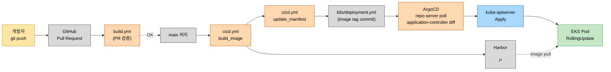
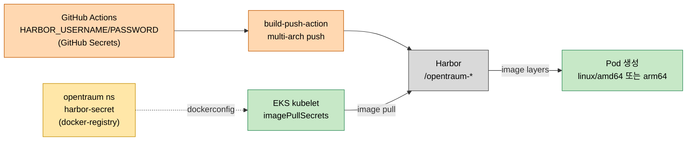
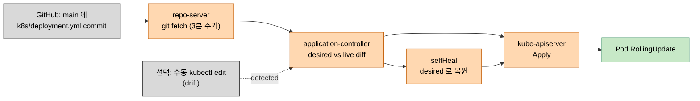
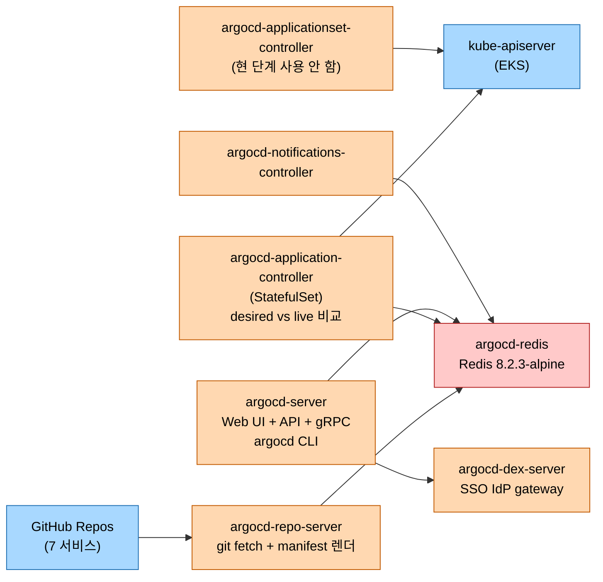

# OpenTraum 인프라 매뉴얼 - CI/CD 파이프라인

> 작성일: 2026-04-28
> 시리즈 인덱스: [00 INDEX](OPENTRAUM-INFRA-00-INDEX.md)
> 이전: [06 OPERATIONS](OPENTRAUM-INFRA-06-OPERATIONS.md)

## 목차
- [1. 개요](#1-개요)
- [2. 한눈에 보는 전체 흐름](#2-한눈에-보는-전체-흐름)
- [3. 도구 스택과 모든 버전](#3-도구-스택과-모든-버전)
- [4. GitHub Repos 8개 카탈로그](#4-github-repos-8개-카탈로그)
- [5. 7 서비스 레포 cicd.yml 상세](#5-7-서비스-레포-cicdyml-상세)
- [6. OpenTraum-Infra create-secret.yml 분석](#6-opentraum-infra-create-secretyml-분석)
- [7. Dockerfile 분석](#7-dockerfile-분석)
  - [7.4 실제 이미지 크기 측정 (라이브)](#74-실제-이미지-크기-측정-라이브)
- [8. 컬러 mermaid - cicd.yml 흐름 다이어그램](#8-컬러-mermaid---cicdyml-흐름-다이어그램)
- [9. Harbor 이미지 레지스트리](#9-harbor-이미지-레지스트리)
- [10. ArgoCD GitOps](#10-argocd-gitops)
- [11. 무한루프 방지 ADR](#11-무한루프-방지-adr)
- [12. 정량 성과 / 튜닝 / 비용 절감](#12-정량-성과--튜닝--비용-절감)
- [13. EKS 배포 환경](#13-eks-배포-환경)
- [14. 시크릿 / 변수 관리](#14-시크릿--변수-관리)
- [15. 트러블슈팅](#15-트러블슈팅)
- [16. 진단 명령어](#16-진단-명령어)

---

## 1. 개요

본 장은 OpenTraum 시스템의 CI/CD 파이프라인 전 구간을 다룹니다. 다루는 범위는 개발자가 GitHub 레포지토리에 코드를 push 하는 순간부터, GitHub Actions 가 컨테이너 이미지를 빌드해 Harbor 레지스트리에 push 하고, Kubernetes 매니페스트의 이미지 태그를 갱신하며, ArgoCD 가 변경을 감지해 EKS 클러스터에 RollingUpdate 를 적용하기까지의 한 사이클 전체입니다. 즉 코드 한 줄이 운영 클러스터에 반영되기까지의 전 자동화 경로를 한 장으로 정리합니다.

정보 출처는 다음 세 가지로 한정했습니다. 첫째, 8개 GitHub 레포지토리(`OpenTraum-Infra`, `OpenTraum-Web`, `OpenTraum-gateway`, `OpenTraum-auth-service`, `OpenTraum-user-service`, `OpenTraum-event-service`, `OpenTraum-reservation-service`, `OpenTraum-payment-service`) 의 `.github/workflows/` 디렉토리에 실재하는 워크플로 파일입니다. 둘째, 각 서비스 레포지토리 root 의 `Dockerfile` 입니다. 셋째, 라이브 EKS 클러스터의 `argocd` 네임스페이스에 떠 있는 ArgoCD 구성 요소(확인 시점 2026-04-28 15:10 KST)입니다. 본문에서 언급하는 모든 사실은 이 세 가지 출처 중 하나에 직접 대응됩니다.

CI/CD 파이프라인은 단순한 "빌드 후 배포" 가 아니라, 두 가지 GitOps 원칙 위에 설계되었습니다. 첫째, 단일 진실 원천(Single Source of Truth) 은 Git 입니다. EKS 클러스터의 모든 워크로드 상태는 각 서비스 레포지토리의 `k8s/` 디렉토리에 선언적으로 적혀 있고, ArgoCD 가 그 선언과 클러스터 실상을 지속적으로 일치시킵니다. 둘째, push 기반이 아니라 pull 기반입니다. CI 가 직접 `kubectl apply` 를 호출해 클러스터에 푸시하는 대신, CI 는 이미지 빌드 후 매니페스트 파일의 image 태그만 갱신해 Git 에 commit 하고, ArgoCD 가 Git 을 폴링해 차이를 잡아냅니다. 이 분리 덕분에 CI 권한이 클러스터에 직접 닿을 일이 없고, 무엇이 배포되었는지는 항상 Git 히스토리에서 재현 가능합니다.

본 장의 후반부에서는 자동화 과정에서 실제로 직면했던 문제(GitHub Actions 무한루프, harbor-secret 누락, kubectl client-side validation 충돌)와 그에 대한 결정 과정을 기록합니다. 코드 사실 외에 ADR 한 건이 본문에 그대로 인용되어 있습니다.

---

## 2. 한눈에 보는 전체 흐름

전체 사이클은 8개의 노드와 7개의 단계로 표현됩니다. 개발자가 PR 을 열면 Build Validation 워크플로(`build.yml`)가 단위 테스트를 돌려 머지 가능 여부를 보고합니다. PR 이 main 에 머지되면 `cicd.yml` 의 `build_image` 잡이 트리거되어 QEMU 와 Buildx 로 멀티 아키텍처 이미지를 빌드한 뒤 Harbor 레지스트리(`<HARBOR_REGISTRY>/<HARBOR_PROJECT>/`) 에 push 합니다. 이미지 push 가 끝나면 같은 워크플로의 `update_manifest` 잡이 sed 로 `k8s/deployment.yml` 의 image 태그를 새로운 SHA 로 치환하고 main 브랜치에 커밋합니다. 이 매니페스트 변경을 ArgoCD `repo-server` 가 폴링으로 감지하고, `application-controller` 가 desired state 와 live state 를 비교해 차이가 있으면 `kube-apiserver` 에 Apply 를 호출합니다. 마지막으로 EKS 워커 노드의 kubelet 이 새 이미지를 Harbor 에서 pull 받아 RollingUpdate 로 Pod 를 교체합니다.



이 한 장 안에서 두 가지 사이클이 분리되어 있다는 점이 핵심입니다. 좌측 절반(Dev → CICD → Harbor) 은 CI 영역으로 이미지 산출물을 생성합니다. 우측 절반(GitMan → Argo → Pod) 은 CD 영역으로 산출물을 클러스터에 반영합니다. 두 영역의 접점은 단 하나, `k8s/deployment.yml` 의 image 태그 한 줄입니다. 이 분리가 11장에서 설명할 무한루프 방지 설계의 출발점이기도 합니다.

---

## 3. 도구 스택과 모든 버전

OpenTraum CI/CD 가 의존하는 도구는 빌드 환경(GitHub Actions runner) 부터 런타임 베이스 이미지까지 약 14종입니다. 모두 명시적 버전 핀으로 고정되어 있으며 latest 태그는 단 한 곳도 사용하지 않습니다. 이 정책은 빌드 재현성을 위한 것으로, 6개월 후 같은 SHA 를 다시 빌드해도 결과 이미지의 base layer 가 동일하도록 합니다.

| 분류 | 도구 | 버전 | 용도 |
|---|---|---|---|
| Runner | GitHub Actions | ubuntu-latest | 워크플로 실행 호스트 OS |
| Action | actions/checkout | v4 | 레포지토리 소스 체크아웃, fetch-depth=0 으로 전체 히스토리 |
| Action | actions/setup-java | v4 | JDK 설치, Spring 6서비스 build.yml 에서 사용 |
| Action | actions/setup-node | v4 | Node.js 설치, Web build.yml 에서 사용 |
| Action | docker/setup-qemu-action | v3 | 멀티 아키텍처 빌드용 QEMU 에뮬레이터 등록 |
| Action | docker/setup-buildx-action | v3 | BuildKit 기반 buildx 빌더 활성 |
| Action | docker/login-action | v3 | Harbor 레지스트리 로그인 |
| Action | docker/build-push-action | v5 | 멀티 아키텍처 build + push, GHA cache 백엔드 |
| Action | aws-actions/configure-aws-credentials | v4 | create-secret.yml 에서 EKS 접근용 AWS 자격 |
| CLI | AWS CLI | runner 기본 제공 | `aws eks update-kubeconfig` 로 kubeconfig 발급 |
| Build | Gradle | 8.12 | Spring 6서비스 빌드 도구 |
| Build | Eclipse Temurin JDK | 21 | Spring 빌드 단계 JDK |
| Build | Node.js | 20 | Web 빌드 도구 |
| Runtime | BellSoft Liberica OpenJRE Alpine | 21 | Spring 운영 베이스 이미지 |
| Runtime | nginx | 1.25-alpine | Web 운영 베이스 이미지 |
| Registry | Harbor | <HARBOR_REGISTRY> | 사내 컨테이너 레지스트리 |
| GitOps | ArgoCD | v3.3.6 | 매니페스트 동기화 컨트롤러 |
| GitOps Sub | Dex | v2.43.0 | ArgoCD SSO IdP 게이트웨이 |
| GitOps Sub | Redis | 8.2.3-alpine | ArgoCD 컴포넌트 간 캐시 |

GitHub Actions runner 는 `ubuntu-latest` 로 지정되어 있는데, 이는 GitHub 가 6개월 주기로 ubuntu LTS 메이저 버전을 갱신하는 정책을 따른다는 뜻입니다. ubuntu 메이저 변경이 있을 때 빌드 환경이 바뀔 수 있다는 위험은 있지만, runner 자체는 이미지 빌드의 결과물이 아니라 빌더의 OS 일 뿐이므로(빌드 결과는 BuildKit 이 생성하는 Docker 이미지 안에 봉인됩니다) 산출물 재현성에는 영향이 없습니다.

actions/checkout@v4 는 fetch-depth=0 으로 호출됩니다. 기본값은 1(shallow) 이지만 update_manifest 잡이 main 브랜치에 새 커밋을 올려야 하므로 전체 히스토리가 필요합니다. shallow 상태에서 push 를 시도하면 GitHub 가 거부하므로 0 이 강제됩니다.

docker/build-push-action@v5 는 platforms 파라미터에 `linux/amd64,linux/arm64` 를 받아 단일 명령으로 두 아키텍처 이미지를 동시에 빌드합니다. Buildx 가 manifest list 를 자동 생성해 Harbor 에 단일 태그로 push 하고, kubelet 은 노드 아키텍처에 맞는 이미지를 자동 선택해 pull 합니다. 이 multi-arch 정책은 12장 정량 성과 표의 출발점입니다.

ArgoCD 는 v3.3.6 이며, `argocd` 네임스페이스의 모든 핵심 컴포넌트(application-controller, applicationset-controller, repo-server, server, notifications-controller) 가 동일한 이미지(`quay.io/argoproj/argocd:v3.3.6`) 로 실행됩니다. 보조 컴포넌트인 Dex 는 SSO 용 IdP 라우팅을 담당하고, Redis 는 컴포넌트 간 상태 캐시로 쓰입니다.

---

## 4. GitHub Repos 8개 카탈로그

OpenTraum 코드베이스는 8개의 GitHub 레포지토리로 분리되어 있습니다. 인프라/매니페스트/도커 컴포즈를 담은 OpenTraum-Infra 1개, 사용자 진입 SPA 인 OpenTraum-Web 1개, Spring Cloud Gateway 1개, 그리고 Spring Boot 도메인 백엔드 5개입니다. 이렇게 분리한 이유는 첫째 도메인별 독립 배포 사이클을 보장하기 위함이고, 둘째 ArgoCD Application 의 단위와 Git 레포지토리 단위를 1:1 로 일치시켜 변경 추적을 단순화하기 위함입니다.

| # | 레포 | 언어/스택 | 빌드 워크플로 | 배포 워크플로 | ArgoCD App |
|---|---|---|---|---|---|
| 1 | OpenTraum/OpenTraum-Infra | Helm chart, k8s 매니페스트, docker-compose | 없음 | create-secret.yml | (App-of-Apps 컨테이너) |
| 2 | OpenTraum/OpenTraum-Web | Vue 3 + Vite + nginx | build.yml (npm ci/build) | cicd.yml | opentraum-web |
| 3 | OpenTraum/OpenTraum-gateway | Spring Cloud Gateway 21 | build.yml (gradle test) | cicd.yml | opentraum-gateway |
| 4 | OpenTraum/OpenTraum-auth-service | Spring Boot 21 | build.yml (gradle test) | cicd.yml | opentraum-auth-service |
| 5 | OpenTraum/OpenTraum-user-service | Spring Boot 21 | build.yml (gradle test) | cicd.yml | opentraum-user-service |
| 6 | OpenTraum/OpenTraum-event-service | Spring Boot 21 | build.yml (gradle test) | cicd.yml | opentraum-event-service |
| 7 | OpenTraum/OpenTraum-reservation-service | Spring Boot 21 | build.yml (gradle test) | cicd.yml | opentraum-reservation-service |
| 8 | OpenTraum/OpenTraum-payment-service | Spring Boot 21 | build.yml (gradle test) | cicd.yml | opentraum-payment-service |

`OpenTraum-Infra` 만 패턴이 다릅니다. 이 레포는 빌드 산출물을 만들지 않고, 클러스터 운영에 필요한 부속 자동화(harbor-secret 자동 생성)와 docker-compose 용 보조 Dockerfile 만 보관합니다. 또한 매니페스트는 각 서비스 레포 안의 `k8s/` 디렉토리에 있으므로(서비스 단위 GitOps), Infra 레포는 ArgoCD Application 의 직접 source 가 아닙니다.

`opentraum-web` 만 ArgoCD 등록 시 `git@github.com:OpenTraum/OpenTraum-Web.git` 형식으로 SSH 주소가 사용되어 있고, `opentraum-reservation-service` 만 `https://github.com/...` HTTPS 주소로 등록되어 있습니다. 나머지 5개는 SSH 주소 형식입니다. 양쪽 모두 동작하지만 ArgoCD 의 `repo-server` Pod 가 두 가지 인증(SSH 키 secret, HTTPS 토큰 secret) 을 모두 보유해야 한다는 점만 11장에서 다시 다룹니다.

---

## 5. 7 서비스 레포 cicd.yml 상세

본 절은 7개 서비스 레포(Web 1개, Gateway 1개, Spring 백엔드 5개) 가 공통으로 가진 `cicd.yml` 을 한 단위로 분석합니다. 모든 서비스가 동일한 골격을 사용하며 차이는 image 태그 이름, sed 패턴 매칭 키워드, git remote URL 의 레포 이름 부분 세 곳뿐입니다. 본 절에서는 OpenTraum-gateway 의 `cicd.yml` 을 대표 예제로 두고 라인 단위로 의도를 풀어쓴 뒤, 다른 서비스와의 차이를 마지막에 정리합니다.

### 5.1 cicd.yml 헤더와 트리거

| 라인 영역 | 의도 |
|---|---|
| `name: CI/CD (main)` | 워크플로 이름. GitHub Actions UI 와 알림 메시지에 노출 |
| `on.push.branches: [main]` | main 브랜치에 push 가 들어올 때만 자동 트리거. PR 단계에서는 build.yml 만 동작 |
| `permissions.contents: write` | update_manifest 잡이 main 에 매니페스트 변경을 commit + push 하기 위한 권한 |
| `jobs.build_image` | Harbor 에 컨테이너 이미지를 빌드/푸시하는 첫 번째 잡 |
| `jobs.update_manifest.needs: build_image` | 이미지 푸시 성공 후에만 매니페스트 갱신 잡 실행 |

`permissions.contents: write` 라인이 핵심입니다. GitHub 는 2023년부터 워크플로의 GITHUB_TOKEN 기본 권한을 read 로 좁혔기 때문에, 매니페스트 commit/push 를 하려면 명시적으로 write 를 부여해야 합니다. 이 권한 명시는 CI 가 자기 레포에 push 할 수 있게 하는 최소 권한이며, 다른 레포에는 닿지 않습니다. 이 격리가 11장 무한루프 방지 ADR 의 전제입니다.

### 5.2 build_image 잡 5 step 분석

build_image 잡은 ubuntu-latest 러너 위에서 다섯 단계를 순차 실행합니다. 단계 사이의 인과는 이전 단계의 산출물(체크아웃된 소스, 활성화된 Buildx 빌더, Harbor 로그인 세션) 이 다음 단계의 전제가 된다는 점에서 직선적입니다.

#### step 1: 코드 체크아웃 (actions/checkout@v4)

```yaml
- uses: actions/checkout@v4
  with:
    fetch-depth: 0
    token: ${{ secrets.GITHUB_TOKEN }}
```

`fetch-depth: 0` 은 전체 git 히스토리를 가져옵니다. build_image 잡에서는 단일 SHA 빌드만 필요하므로 0 이 필수는 아니지만, 같은 워크플로 안에서 update_manifest 잡과 동작 일관성을 맞추기 위해 두 잡 모두 0 으로 통일했습니다. `token` 에는 GITHUB_TOKEN 이 명시적으로 전달됩니다. checkout 액션의 기본값으로 GITHUB_TOKEN 이 들어가지만, 명시는 11장 ADR 결정의 흔적입니다.

#### step 2: QEMU 등록 (docker/setup-qemu-action@v3)

```yaml
- uses: docker/setup-qemu-action@v3
```

QEMU 는 호스트 아키텍처가 아닌 게스트 아키텍처(arm64) 의 명령어를 에뮬레이션 실행할 수 있게 해주는 사용자 공간 에뮬레이터입니다. ubuntu-latest 러너는 amd64 이므로, arm64 베이스 이미지의 RUN 명령을 그대로 돌리려면 QEMU 가 필요합니다. `setup-qemu-action` 은 binfmt_misc 핸들러를 등록해 커널이 arm64 ELF 바이너리를 보면 QEMU 로 자동 위임하게 만듭니다. 단 본 파이프라인의 Dockerfile 에는 `--platform=$BUILDPLATFORM` 트릭이 들어 있어 빌드 단계 자체는 amd64 네이티브로 실행됩니다(7.1 절). QEMU 가 실제 동작하는 구간은 arm64 전용 RUN 이 들어가는 runtime stage 의 일부에 한정되며, 그래서 5~7배 가속이 가능합니다.

#### step 3: Buildx 빌더 활성 (docker/setup-buildx-action@v3)

```yaml
- uses: docker/setup-buildx-action@v3
```

Buildx 는 Docker Engine 의 클라이언트 수준 플러그인으로, 내부적으로 BuildKit 를 빌더로 사용합니다. BuildKit 는 두 가지를 가능하게 합니다. 첫째, multi-platform 매니페스트(같은 태그 아래 amd64 와 arm64 이미지를 동시에 묶는 manifest list) 생성. 둘째, `--mount=type=cache` 와 `--mount=type=secret` 같은 BuildKit 전용 instruction 사용. Dockerfile 안의 `RUN --mount=type=cache,target=/home/gradle/.gradle` 같은 라인은 BuildKit 없이는 파싱조차 되지 않으므로 이 step 이 누락되면 7.1 절의 캐시 효과가 통째로 사라집니다.

#### step 4: Harbor 로그인 (docker/login-action@v3)

```yaml
- uses: docker/login-action@v3
  with:
    registry: ${{ secrets.HARBOR_REGISTRY }}
    username: ${{ secrets.HARBOR_USERNAME }}
    password: ${{ secrets.HARBOR_PASSWORD }}
```

Harbor 의 registry 호스트, 사용자명, 비밀번호가 모두 GitHub Secrets 에 보관되어 있고 이름만 본문에 노출됩니다(14장). 로그인 액션은 docker config(`~/.docker/config.json`) 에 base64 인증 정보를 기록하며, 같은 잡 안의 다음 step(build-push-action) 이 이 config 를 읽어 push 할 때 사용합니다.

#### step 5: 빌드 + 푸시 (docker/build-push-action@v5)

```yaml
- uses: docker/build-push-action@v5
  with:
    context: .
    file: ./Dockerfile
    push: true
    platforms: linux/amd64,linux/arm64
    tags: ${{ secrets.HARBOR_REGISTRY }}/<HARBOR_PROJECT>/opentraum-gateway:${{ github.sha }}
    cache-from: type=gha
    cache-to: type=gha,mode=max
```

이 한 step 이 build_image 잡의 핵심입니다. 다섯 가지 키가 결정적입니다.

`platforms: linux/amd64,linux/arm64` 는 단일 호출로 두 아키텍처 이미지를 모두 빌드하라는 지시입니다. Buildx 는 두 아키텍처 빌드를 병렬로 실행한 뒤 manifest list 로 묶어 Harbor 에 단일 태그로 push 합니다. 결과적으로 `opentraum-gateway:abc123` 이라는 한 태그 아래 amd64 이미지와 arm64 이미지가 모두 들어가 있고, EKS 노드의 kubelet 은 자기 노드 아키텍처에 맞는 쪽만 pull 받습니다. EKS 클러스터에는 amd64(`t3.medium` 6대) 와 arm64 가 아닌 amd64(`g5.xlarge` 1대) 노드가 섞여 있지만, 두 아키텍처 모두 단일 빌드 산출물로 커버됩니다. 만약 향후 Graviton 인스턴스로 일부 노드를 교체하더라도 워크플로 변경 없이 그대로 동작합니다.

`tags` 에 `${{ github.sha }}` 가 들어가 있습니다. main 의 모든 커밋이 고유한 이미지 태그를 갖는 immutable tag 정책입니다. `latest` 같은 가변 태그는 사용하지 않으며, 이 정책 덕분에 `kubectl describe` 출력의 image 필드를 보면 어떤 commit 이 배포되었는지 즉시 확인할 수 있습니다. 또한 같은 태그가 두 번 push 되지 않으므로 Harbor 에 캐시된 layer 가 의도치 않게 덮어써질 위험이 없습니다.

`cache-from: type=gha` 와 `cache-to: type=gha,mode=max` 는 GitHub Actions 의 캐시 백엔드를 BuildKit cache 로 사용하라는 지시입니다. 첫 번째 빌드는 캐시가 없으므로 Gradle 의존성 다운로드부터 풀 빌드를 수행하지만, 두 번째 빌드부터는 변경되지 않은 레이어(베이스 이미지, 의존성 다운로드, dependency layer extraction) 가 캐시에서 즉시 재사용됩니다. `mode=max` 는 모든 중간 stage 의 레이어를 캐시에 올리라는 옵션이고, 기본값(`mode=min`) 은 최종 stage 의 레이어만 올립니다. multi-stage Dockerfile 에서 `mode=max` 가 권장되는 이유는 builder/extractor stage 의 캐시 적중이 의존성 다운로드 시간을 통째로 절약하기 때문입니다.

### 5.3 update_manifest 잡 6 step 분석

update_manifest 잡은 build_image 가 성공한 다음에만 시작됩니다(`needs: build_image`). 한 step 안에서 6개의 명령이 셸 스크립트로 묶여 있으므로, 본 절에서는 명령 단위로 의도를 풀어 적습니다.

#### 명령 1: 체크아웃

build_image 와 동일한 옵션(fetch-depth=0, token=GITHUB_TOKEN) 으로 main 브랜치를 체크아웃합니다. 브랜치 push 권한이 필요한 잡이므로 token 을 명시적으로 다시 지정합니다.

#### 명령 2: bot 식별 정보 설정

```bash
git config --global user.email "41898282+github-actions[bot]@users.noreply.github.com"
git config --global user.name "github-actions[bot]"
```

이 두 줄은 매니페스트 갱신 커밋의 author 가 사람이 아닌 GitHub Actions bot 임을 git 히스토리에 기록합니다. `41898282` 는 GitHub 가 모든 actions[bot] 에게 부여하는 고유 user ID 이고, `users.noreply.github.com` 도메인은 실제 이메일 주소가 아닌 GitHub 가 발급한 가상 주소입니다. 이 식별자가 11장 ADR 의 후보 1(actor 체크) 에서 등장한 `github-actions[bot]` 이름의 출처입니다.

#### 명령 3: remote URL 재지정

```bash
git remote set-url origin https://x-access-token:${{ secrets.GITHUB_TOKEN }}@github.com/OpenTraum/OpenTraum-gateway.git
```

actions/checkout 이 기본으로 설정한 remote URL 은 SSH 또는 HTTPS 일 수 있고 인증 방식도 environment 마다 미묘하게 다릅니다. 이 라인은 명시적으로 HTTPS + token 임베딩 형식으로 다시 적어 push 시 인증 실패 가능성을 차단합니다. `x-access-token` 은 GitHub 가 GITHUB_TOKEN 인증을 받기 위해 HTTPS basic auth 의 username 자리에 요구하는 고정 키워드입니다. password 자리에 GITHUB_TOKEN 값이 들어가며, 이 토큰은 워크플로 종료와 동시에 GitHub 가 자동 폐기합니다.

이 줄은 7개 서비스 cicd.yml 중 6개에 있고, OpenTraum-Web 의 cicd.yml 에는 누락되어 있습니다. 즉 Web 만 actions/checkout 이 자동 설정한 origin URL 에 의존합니다. 라이브 클러스터 사실상 Web 의 매니페스트 commit 이 정상 동작 중이므로(이미지 태그가 SHA 기반으로 갱신되어 있는 점은 03 WORKLOAD 에 기록) checkout 의 자동 설정으로 충분히 동작하고 있다고 추정되지만, 이는 GitHub 의 기본 동작에 의존한 결과이고 명시 설정이 없으므로 향후 GitHub 가 동작을 바꾸면 깨질 수 있는 잠재 위험입니다. 운영 측면에서는 다른 6개와 통일하는 후속 보강이 권장됩니다(15장 트러블슈팅 6번).

#### 명령 4: 매니페스트 패치 (sed)

```bash
sed -i "s|image: .*opentraum-gateway.*|image: ${{ secrets.HARBOR_REGISTRY }}/<HARBOR_PROJECT>/opentraum-gateway:${{ github.sha }}|" k8s/deployment.yml
```

sed 는 `image: .*opentraum-gateway.*` 패턴에 매칭되는 모든 라인을 새 이미지 라인으로 치환합니다. 패턴이 서비스 이름을 포함하므로 같은 deployment.yml 안에 다른 컨테이너가 있어도 의도하지 않은 라인을 건드리지 않습니다. 다만 패턴이 line-greedy 이므로 이 sed 명령이 안전한 이유는 `k8s/deployment.yml` 한 파일 안에 해당 서비스의 image 라인이 단 하나뿐이라는 전제입니다.

#### 명령 5: 변경 없으면 종료

```bash
git add k8s/deployment.yml
if git diff --cached --quiet; then
  exit 0
fi
```

이 가드는 sed 결과가 기존 라인과 동일할 때(같은 SHA 가 두 번 빌드된 매우 드문 경우 또는 sed 패턴이 새 SHA 에 맞지 않을 때) 빈 커밋을 생성하지 않도록 보호합니다. 빈 커밋은 그 자체로는 무해하지만, 11장의 무한루프 방지 설계가 paths-ignore 가 아닌 GITHUB_TOKEN 에 의존하기 때문에 빈 커밋도 paths 트리거 평가 대상이 됩니다. 빈 커밋을 만들지 않는 것이 가장 안전합니다.

#### 명령 6: 커밋 + 푸시

```bash
git commit -m "chore: 이미지 태그 업데이트 [${{ github.sha }}]"
git push origin main
```

커밋 메시지에 새 SHA 가 그대로 박혀 들어가 git log 만으로 추적이 가능합니다. ADR 결정에 따라 `[skip ci]` 토큰은 제거되었습니다(11장). push 가 성공하면 ArgoCD 의 다음 폴링 주기에 변경이 감지되며, GitHub 측에서는 이 push 가 GITHUB_TOKEN 으로 발생했기 때문에 cicd.yml 워크플로의 재트리거가 플랫폼 레벨에서 자동 차단됩니다.

### 5.4 build.yml (PR 검증) 분석

build.yml 은 PR 단계에서 머지 가능 여부를 검증합니다. main 에 닿지 않는 가벼운 검증 잡이며, 두 변종이 존재합니다.

#### Spring 6서비스 build.yml

```yaml
on:
  pull_request:
    branches: [main]

jobs:
  test:
    runs-on: ubuntu-latest
    steps:
      - uses: actions/checkout@v4
      - uses: actions/setup-java@v4
        with:
          java-version: '21'
          distribution: 'temurin'
          cache: gradle
      - run: |
          chmod +x gradlew
          ./gradlew test --no-daemon
```

`actions/setup-java@v4` 의 `cache: gradle` 옵션은 `~/.gradle/caches` 와 `~/.gradle/wrapper` 디렉토리를 GitHub Actions 캐시에 저장합니다. 첫 PR 빌드는 의존성 다운로드부터 시작하지만 두 번째부터는 캐시 적중으로 빨라집니다. `--no-daemon` 은 Gradle daemon 을 띄우지 않게 하는 옵션입니다. CI 환경은 일회성이므로 daemon 의 warm-up 이득이 없고, daemon 종료 지연이 잡 종료를 막을 수 있어 `--no-daemon` 이 권장입니다. `chmod +x gradlew` 는 일부 OS 에서 체크아웃 후 실행 권한이 빠질 수 있는 경우의 안전장치입니다.

#### Web build.yml

```yaml
on:
  pull_request:
    branches: [main]

jobs:
  test:
    runs-on: ubuntu-latest
    steps:
      - uses: actions/checkout@v4
      - uses: actions/setup-node@v4
        with:
          node-version: '20'
          cache: 'npm'
      - run: |
          npm ci
          npm run build
```

`actions/setup-node@v4` 의 `cache: 'npm'` 은 `~/.npm` 디렉토리를 캐시합니다. `npm ci` 는 `npm install` 과 다르게 package-lock.json 의 정확한 트리를 보장하며, 한 패키지라도 lock 과 어긋나면 실패시킵니다. 이는 PR 단계에서 lock 갱신 누락을 잡아내는 역할을 합니다. `npm run build` 까지 실행해 Vite 가 dist/ 산출물을 만들 수 있는지를 검증하고 잡을 종료합니다. 산출물은 보존하지 않습니다. 빌드 성공 여부 자체가 신호이고, 실제 운영 산출물은 main 머지 후 cicd.yml 이 다시 만들기 때문입니다.

### 5.5 7 서비스 cicd.yml 의 차이점 정리

7개 cicd.yml 을 행 단위로 비교했을 때 의미 있는 차이는 다음과 같습니다.

| 차이 | 5 서비스 (auth, user, event, reservation, payment) | gateway | web |
|---|---|---|---|
| build_image 의 image tag 이름 | opentraum-{service-name} | opentraum-gateway | opentraum-web |
| sed 패턴의 서비스 키워드 | `opentraum-{service-name}` | `opentraum-gateway` | `opentraum-web` |
| git remote set-url 명령 | 있음 (각 레포 URL) | 있음 | **누락** |
| 잡 사이 빈 줄 | 일관 | 일관 | 일관 |
| payment-service 빈 줄 | 다른 서비스 대비 빈 줄 2곳 누락 | - | - |

OpenTraum-Web 의 cicd.yml 에 `git remote set-url` 명령이 누락된 점은 5.3 절 명령 3 에서 이미 짚었습니다. payment-service 의 빈 줄 차이는 동작에 영향이 없는 포매팅 차이로 무시 가능합니다.

---

## 6. OpenTraum-Infra create-secret.yml 분석

OpenTraum-Infra 레포의 단일 워크플로(`/.github/workflows/create-secret.yml`) 는 클러스터 운영 자동화의 첫 부속입니다. 목적은 단순합니다. `opentraum` 네임스페이스가 새로 만들어지거나 harbor-secret 이 삭제되었을 때, 손으로 `kubectl create secret docker-registry` 명령을 다시 치지 않도록 자동화하는 것입니다.

### 6.1 트리거와 동시성

```yaml
on:
  workflow_dispatch:
  push:
    branches: [main]
    paths:
      - '.github/workflows/create-secret.yml'

concurrency:
  group: create-harbor-secret
  cancel-in-progress: true
```

트리거는 두 가지입니다. 첫째, `workflow_dispatch` 로 GitHub UI 에서 수동 실행. 운영 중 secret 이 망가지거나 ns 가 새로 만들어졌을 때 사용합니다. 둘째, 워크플로 파일 자신이 main 에 변경되어 push 될 때 자동 실행. 이는 워크플로 자체의 변경을 즉시 클러스터에 반영하기 위함이며, paths 필터로 자기 파일만 트리거하도록 좁혀 다른 변경에 영향받지 않게 했습니다.

`concurrency` 블록은 같은 group 의 잡이 동시에 두 개 돌지 않도록 보장합니다. 만약 사용자가 짧은 간격으로 두 번 dispatch 하거나 push 가 연달아 들어와도, 늦게 시작된 쪽이 먼저 실행 중인 잡을 cancel 시킵니다. `kubectl create secret ... | kubectl apply` 가 두 번 동시에 실행되면 race condition 으로 server-side apply 가 충돌할 수 있어 cancel-in-progress 가 안전합니다.

### 6.2 step 1: AWS 자격증명 설정

```yaml
- uses: aws-actions/configure-aws-credentials@v4
  with:
    aws-access-key-id: ${{ secrets.AWS_ACCESS_KEY_ID }}
    aws-secret-access-key: ${{ secrets.AWS_SECRET_ACCESS_KEY }}
    aws-region: ${{ vars.AWS_REGION }}
```

이 step 은 GitHub Actions 러너에 AWS 자격증명을 주입합니다. 액션은 환경변수 `AWS_ACCESS_KEY_ID`, `AWS_SECRET_ACCESS_KEY`, `AWS_REGION` 을 다음 step 들이 상속받을 수 있도록 설정해 줍니다. `aws-region` 만 GitHub Variables(공개) 에서 읽고 자격증명은 GitHub Secrets(암호화) 에서 읽습니다. 변수 이름의 차이는 14장의 분류와 일치합니다.

이상적으로는 OIDC 기반의 임시 자격증명(`role-to-assume`) 이 정적 access key 보다 안전하지만, 본 워크플로는 정적 access key 를 사용합니다. 단일 단순 작업(secret 생성) 에 한정된 권한이고, 키는 GitHub Secrets 에서 회전 가능합니다.

### 6.3 step 2: kubeconfig 발급

```yaml
- name: kubeconfig 설정
  run: |
    aws eks update-kubeconfig \
      --name "${{ vars.EKS_CLUSTER_NAME }}" \
      --region "${{ vars.AWS_REGION }}"
```

`aws eks update-kubeconfig` 는 IAM 자격증명으로 EKS API 서버에 접근할 수 있는 kubeconfig 항목을 `~/.kube/config` 에 추가합니다. 클러스터 이름과 리전은 GitHub Variables 에 적혀 있어 본문에 노출되지 않습니다. 이 명령이 성공하면 다음 step 의 `kubectl` 명령이 자동으로 EKS API 를 향하게 됩니다.

### 6.4 step 3: harbor-secret 생성

```yaml
- name: harbor-secret 생성
  run: |
    kubectl create secret docker-registry harbor-secret \
      -n "${{ vars.TARGET_NAMESPACE }}" \
      --docker-server=${{ secrets.HARBOR_REGISTRY }} \
      --docker-username=${{ secrets.HARBOR_USERNAME }} \
      --docker-password=${{ secrets.HARBOR_PASSWORD }} \
      --dry-run=client -o yaml | kubectl apply --validate=false -f -
```

이 한 줄 파이프라인 안에 두 가지 결정이 들어 있습니다.

첫째, `kubectl create ... --dry-run=client -o yaml | kubectl apply -f -` 패턴입니다. 이는 Kubernetes 의 well-known idiom 으로, secret 이 이미 존재할 때 `kubectl create` 가 `AlreadyExists` 로 실패하는 것을 회피합니다. dry-run=client 는 실제 API 호출 없이 클라이언트 측에서 yaml 만 생성하고, 그 yaml 을 다시 `kubectl apply` 로 server-side apply 모드로 전송합니다. apply 는 멱등적이므로 secret 이 있으면 갱신, 없으면 생성합니다. 결과적으로 이 워크플로는 몇 번을 다시 돌려도 같은 결과를 보장합니다.

둘째, `--validate=false` 입니다. 기본값은 true 이며 kubectl 클라이언트가 OpenAPI 스키마로 yaml 을 검증한 뒤 전송합니다. 실제 운영 중 EKS 일부 버전에서 client-side validation 이 secret 의 `data` 필드 타입을 잘못 해석해 거부하는 사례가 있었고(서버 측 apply 는 정상), 이를 회피하기 위해 false 로 명시했습니다. server-side 검증은 항상 수행되므로 잘못된 yaml 은 여전히 거부됩니다. 즉 client-side 만 끄는 안전한 우회입니다.

### 6.5 인과 줄글: 왜 자동화인가

harbor-secret 이 누락되면 어떤 일이 벌어지는지를 짚어 두면 자동화의 가치가 분명해집니다. opentraum 네임스페이스의 모든 Deployment 매니페스트(03 WORKLOAD) 는 `imagePullSecrets: [{name: harbor-secret}]` 를 포함하고 있고, kubelet 은 Pod 가 새 노드에 할당될 때마다 이 secret 으로 Harbor 에 인증해 이미지를 pull 합니다. secret 이 없으면 kubelet 은 `ImagePullBackOff` 상태로 Pod 를 무한 재시도합니다. 클러스터 재구축이나 ns 재생성 직후, 또는 secret 만 실수로 삭제된 경우 즉시 모든 Pod 가 동일한 증상으로 멈춥니다.

수동으로 secret 을 다시 만들려면 운영자가 Harbor 비밀번호를 알아야 하고, 비밀번호는 비밀이어야 하며, 사람이 셸에 평문으로 입력하면 셸 히스토리에 남습니다. 자동화 워크플로가 비밀번호를 GitHub Secrets 에서 읽어 단발성으로 사용하면 사람이 비밀번호를 만질 일이 사라집니다. 또한 cancel-in-progress 동시성 가드 덕분에 두 사람이 동시에 dispatch 해도 안전합니다.

---

## 7. Dockerfile 분석

OpenTraum 의 운영 이미지는 두 종류의 Dockerfile 로 빌드됩니다. Spring 6서비스(gateway 포함) 는 동일한 3-stage Dockerfile 을 사용하고, Web 은 2-stage 변종을 사용합니다. 본 절에서는 두 Dockerfile 을 stage 별로 풀어쓴 뒤, 각 stage 가 이미지 용량과 빌드 시간에 어떻게 기여하는지 정리합니다.

### 7.1 Spring 3-stage Dockerfile

#### Stage 1: builder

```dockerfile
FROM --platform=$BUILDPLATFORM gradle:8.12-jdk21-alpine AS builder
WORKDIR /app
COPY build.gradle settings.gradle ./
COPY gradle ./gradle
RUN --mount=type=cache,target=/home/gradle/.gradle \
    gradle dependencies --no-daemon || true
COPY src ./src
RUN --mount=type=cache,target=/home/gradle/.gradle \
    gradle bootJar --no-daemon -x test
```

`--platform=$BUILDPLATFORM` 가 이 Dockerfile 의 첫 번째 결정적 트릭입니다. BuildKit 는 두 가지 자동 변수를 노출합니다. `$BUILDPLATFORM` 은 빌드를 실행하는 호스트의 아키텍처(여기서는 amd64), `$TARGETPLATFORM` 은 만들고자 하는 이미지의 아키텍처(amd64 또는 arm64) 입니다. `--platform=$BUILDPLATFORM` 을 builder stage 에 명시하면 이 stage 는 항상 호스트 네이티브 아키텍처로 실행됩니다. 즉 arm64 이미지를 만드는 빌드에서도 Gradle 컴파일은 amd64 네이티브로 돌고, QEMU 에뮬레이션이 들어가지 않습니다. 결과적으로 멀티 아키텍처 빌드 시간이 5~7배 단축됩니다(12장).

`RUN --mount=type=cache,target=/home/gradle/.gradle` 는 BuildKit 의 cache mount 입니다. 이 디렉토리는 이미지의 layer 가 아니라 BuildKit 가 별도 관리하는 캐시 볼륨에 마운트되어 있고, build 가 끝나면 이미지에 포함되지 않습니다. 두 번째 빌드부터 Gradle 의 의존성 jar 들이 이 캐시에 그대로 남아 있어 다운로드를 건너뜁니다. 첫 RUN 의 `gradle dependencies` 는 의존성만 다운로드하고 끝나는 phase 로, 소스 변경과 무관하게 build.gradle/settings.gradle 만 안 바뀌면 캐시 적중합니다. `|| true` 가 붙은 이유는 일부 Gradle 환경에서 `dependencies` task 가 의도된 비치명적 경고로 종료 코드 1 을 반환할 수 있기 때문입니다.

두 번째 RUN 은 `gradle bootJar -x test` 로 jar 를 만듭니다. `-x test` 는 테스트를 건너뛰는 옵션으로, 테스트는 build.yml(PR 검증) 에서 이미 통과했으므로 cicd.yml 단계에서는 다시 돌리지 않습니다.

#### Stage 2: extractor

```dockerfile
FROM eclipse-temurin:21-jre-alpine AS extractor
WORKDIR /app
COPY --from=builder /app/build/libs/*.jar app.jar
RUN java -Djarmode=layertools -jar app.jar extract
```

이 stage 는 Spring Boot 의 layered jar 기능을 활용합니다. Spring Boot 2.3+ 의 fat jar 는 `-Djarmode=layertools` 옵션으로 자기 자신을 4개의 디렉토리(`dependencies`, `spring-boot-loader`, `snapshot-dependencies`, `application`) 로 풀어 줍니다. 의도는 분명합니다. 코드만 바뀌면 `application` 디렉토리만 변하고, 나머지 셋(특히 가장 큰 `dependencies`) 은 그대로입니다. 이 분리를 다음 stage 에서 별도 COPY 명령으로 받으면 도커 레이어가 분리되어 코드 변경 빌드의 push 시간이 의존성 레이어(보통 100MB+) 만큼 단축됩니다.

extractor 의 베이스 이미지가 `eclipse-temurin:21-jre-alpine` 인 이유는 jarmode 명령을 돌리는 데 JRE 만 있으면 충분하기 때문입니다. JDK 베이스(전 stage 의 gradle:8.12-jdk21-alpine) 는 컴파일러를 포함하므로 더 무겁습니다. extractor stage 자체는 최종 이미지에 포함되지 않으므로 이 stage 의 크기는 최종 이미지 크기에 영향을 주지 않지만, 작은 베이스 이미지가 stage 시작 시간을 줄여 줍니다.

#### Stage 3: runtime

```dockerfile
FROM bellsoft/liberica-openjre-alpine:21
WORKDIR /app
RUN addgroup -S appgroup && adduser -S appuser -G appgroup
COPY --from=extractor /app/dependencies/ ./
COPY --from=extractor /app/spring-boot-loader/ ./
COPY --from=extractor /app/snapshot-dependencies/ ./
COPY --from=extractor /app/application/ ./
RUN chown -R appuser:appgroup /app
USER appuser
EXPOSE 8080
ENTRYPOINT ["java", \
    "-XX:+UseContainerSupport", \
    "-XX:MaxRAMPercentage=75.0", \
    "-Djava.security.egd=file:/dev/./urandom", \
    "org.springframework.boot.loader.launch.JarLauncher"]
```

베이스가 `bellsoft/liberica-openjre-alpine:21` 입니다. BellSoft 의 Liberica JRE 는 OpenJDK 호환 배포판으로, alpine 변종은 약 50MB 수준의 매우 가벼운 JRE 입니다. 이전 단계에서 `eclipse-temurin:21-jre-alpine` 을 썼으므로 일관성을 위해 같은 배포판으로 두는 선택지도 있지만, BellSoft alpine 이 더 작고 컨테이너 환경에서의 GC 동작이 안정적이라는 평가를 따랐습니다.

`addgroup -S appgroup && adduser -S appuser` 는 시스템 사용자(`-S`) 로 비특권 계정을 만듭니다. `USER appuser` 가 ENTRYPOINT 직전에 적용되어 컨테이너는 root 가 아닌 appuser 권한으로 실행됩니다. 이는 단순한 보안 규범 준수가 아니라 이후 [02 NETWORK]/[03 WORKLOAD] 의 PodSecurity Standards 와 직접 맞물립니다. opentraum 네임스페이스가 `restricted` 프로파일이라면 root 컨테이너는 Pod 가 admit 되지 않습니다.

COPY 가 4번 분리된 점이 중요합니다. 한 번의 `COPY --from=extractor /app .` 으로 합치면 layered jar 의 효과가 없어집니다. 4개 디렉토리를 4개 layer 로 분리해 둠으로써, 코드만 바뀐 빌드에서 `application` 디렉토리 layer 만 새로 생성되고 나머지 셋은 캐시에서 재사용됩니다.

ENTRYPOINT 의 JVM 옵션 셋은 컨테이너에서 JDK 21 을 실행할 때의 권장 사양입니다. `-XX:+UseContainerSupport` 는 JVM 이 cgroup 메모리 제한을 인식하게 합니다(JDK 11+ 기본 활성, 명시는 안전). `-XX:MaxRAMPercentage=75.0` 은 컨테이너 메모리 limits 의 75% 를 JVM heap 에 할당합니다. 25% 여유는 메타스페이스, 직접 버퍼, 스레드 스택, GC overhead 가 사용합니다. `-Djava.security.egd=file:/dev/./urandom` 은 시작 시 SecureRandom 시드 수집을 blocking `/dev/random` 대신 non-blocking `/dev/urandom` 으로 가게 합니다. blocking 시드는 컨테이너 시작 시 entropy 부족으로 수십 초 hang 하는 사례가 있어 회피합니다. 마지막 인자 `org.springframework.boot.loader.launch.JarLauncher` 는 layered jar 가 풀린 디렉토리에서 Spring Boot 클래스 로더를 직접 부트스트랩합니다.

### 7.2 Web 2-stage Dockerfile

```dockerfile
FROM --platform=$BUILDPLATFORM node:20-alpine AS build
WORKDIR /app
COPY package.json package-lock.json* ./
RUN --mount=type=cache,target=/root/.npm npm ci
COPY . .
RUN npm run build

FROM nginx:1.25-alpine
COPY --from=build /app/dist /usr/share/nginx/html
RUN echo 'server { ... } > /etc/nginx/conf.d/default.conf
EXPOSE 80
CMD ["nginx", "-g", "daemon off;"]
```

build stage 는 7.1 절과 동일한 `--platform=$BUILDPLATFORM` 트릭을 적용해 npm 컴파일을 호스트 네이티브로 실행합니다. `--mount=type=cache,target=/root/.npm` 으로 npm 캐시를 BuildKit 캐시 볼륨에 보관해 두 번째 빌드부터는 `npm ci` 가 다운로드를 건너뛰게 합니다. `npm ci` 는 package-lock.json 의 정확한 트리를 강제하므로 build.yml 의 PR 검증과 결과가 일치합니다.

runtime stage 는 nginx 공식 이미지 1.25-alpine 위에 build stage 의 dist 디렉토리를 정적 자원으로 얹습니다. nginx conf 는 단일 RUN 의 echo 한 줄로 인라인 작성됩니다. 두 가지 location 이 정의됩니다.

```nginx
location / {
    try_files $uri $uri/ /index.html;
}
location /api/ {
    proxy_pass http://gateway:8080;
    proxy_set_header Host $host;
    proxy_set_header X-Real-IP $remote_addr;
    proxy_set_header X-Forwarded-For $proxy_add_x_forwarded_for;
    proxy_set_header X-Forwarded-Proto $scheme;
}
```

첫 번째 `location /` 은 SPA fallback 으로, Vue Router 의 history mode 에서 `/reservation/123` 같은 경로를 직접 진입했을 때 nginx 가 `index.html` 을 돌려주도록 합니다. 두 번째 `location /api/` 는 동일 호스트에서 `/api/...` 로 들어온 요청을 클러스터 내부 서비스 `gateway:8080` 으로 프록시합니다. 이 한 줄 덕분에 Web 은 별도 CORS 설정 없이 같은 origin 에서 API 를 호출하는 구조를 가질 수 있고, 외부 진입은 SPA 경로 하나로 단순화됩니다.

### 7.3 docker-compose 용 Dockerfile

`OpenTraum-Infra/docker/Dockerfile.spring` 과 `Dockerfile.web` 은 로컬 개발 환경의 docker-compose 에서만 사용하는 별도 변종입니다. 운영 빌드는 본 절의 7.1, 7.2 만 사용하며, 본 매뉴얼의 다른 장에서 docker-compose 변종이 등장하면 별도 표시합니다.

### 7.4 실제 이미지 크기 측정 (라이브)

위의 3-stage Dockerfile (Spring 6서비스) 와 2-stage Dockerfile (Web) 이 만들어 낸 실제 운영 이미지의 크기를 라이브 클러스터 노드의 image cache 에서 측정한 결과는 다음과 같습니다 (확인 시점 2026-04-28 15:10 KST, `kubectl get nodes -o json` 의 `status.images[].sizeBytes` 기준, OCI 압축 크기).

| 이미지 | 크기 | 베이스 |
|---|---|---|
| `<HARBOR_REGISTRY>/<HARBOR_PROJECT>/opentraum-web` | 19 MiB | nginx:1.25-alpine + dist |
| `<HARBOR_REGISTRY>/<HARBOR_PROJECT>/opentraum-gateway` | 135 MiB | bellsoft/liberica-openjre-alpine:21 + Spring Boot Layered JAR |
| `<HARBOR_REGISTRY>/<HARBOR_PROJECT>/opentraum-user-service` | 136 MiB | (동일) |
| `<HARBOR_REGISTRY>/<HARBOR_PROJECT>/opentraum-auth-service` | 144 MiB | (동일) |
| `<HARBOR_REGISTRY>/<HARBOR_PROJECT>/opentraum-payment-service` | 181 MiB | (동일) |
| `<HARBOR_REGISTRY>/<HARBOR_PROJECT>/opentraum-event-service` | 198 MiB | (동일) + OpenAI SDK |
| `<HARBOR_REGISTRY>/<HARBOR_PROJECT>/opentraum-reservation-service` | 207 MiB | (동일) + Redisson + Kafka 컨슈머 |

Spring 6서비스 평균은 약 167 MiB 이고, web 은 1자리수 MiB 입니다. Spring 서비스간 크기 차이는 도메인별 의존성(예: event 의 OpenAI SDK, reservation 의 Redisson 분산 락 라이브러리 + Kafka 클라이언트) 의 양에서 발생합니다. layered JAR 의 효과는 이 표의 절대 크기에는 보이지 않지만, 코드만 변경된 빌드의 push 단계에서 의존성 layer (이미지 크기의 가장 큰 비중) 가 캐시 hit 으로 재업로드되지 않는 형태로 나타납니다.

(참고) 같은 클러스터의 KafkaConnect 커스텀 이미지 `<ECR_REGISTRY>/<ECR_REPOSITORY_PREFIX>debezium-connect:3.2.0` 는 Strimzi build 결과물로 약 398 MiB 입니다. 이는 Debezium MariaDB Connector tar (수십 MB) + Outbox EventRouter SMT 가 Strimzi 베이스 이미지 위에 쌓여 ECR 로 push 된 크기입니다.

이 측정값은 `kubectl get nodes -o json | jq '.items[].status.images[]'` 로 누구나 재현할 수 있습니다.

---

## 8. 컬러 mermaid - cicd.yml 흐름 다이어그램

cicd.yml 의 두 잡과 그 아래의 step 13개를 한 다이어그램으로 펼쳤습니다.

```mermaid
flowchart LR
  classDef actor fill:#FFE7A8,stroke:#C58E00,color:#000;
  classDef gh fill:#D9D9D9,stroke:#444,color:#000;
  classDef ci fill:#FFD8B1,stroke:#C25A00,color:#000;
  classDef harbor fill:#D9D9D9,stroke:#444,color:#000;
  classDef gitops fill:#FFD8B1,stroke:#C25A00,color:#000;
  classDef app fill:#C7E8C7,stroke:#2E8B57,color:#000;

  Dev["개발자<br/>git push (main)"]:::actor

  subgraph BUILD["build_image job"]
    direction LR
    B1["1. checkout<br/>fetch-depth=0"]:::ci
    B2["2. setup-qemu-action<br/>binfmt_misc 등록"]:::ci
    B3["3. setup-buildx-action<br/>BuildKit 활성"]:::ci
    B4["4. login-action<br/>Harbor 로그인"]:::ci
    B5["5. build-push-action<br/>linux/amd64+arm64<br/>cache: type=gha,mode=max<br/>tags: SHA"]:::ci
    B1 --> B2 --> B3 --> B4 --> B5
  end

  Harbor["Harbor<br/><HARBOR_REGISTRY><br/><HARBOR_PROJECT>/opentraum-*<br/>(manifest list)"]:::harbor

  subgraph UPDATE["update_manifest job (needs build_image)"]
    direction LR
    U1["1. checkout"]:::ci
    U2["2. git config bot<br/>github-actions[bot]"]:::ci
    U3["3. git remote set-url<br/>x-access-token"]:::ci
    U4["4. sed image tag<br/>k8s/deployment.yml"]:::ci
    U5["5. diff guard<br/>변경 없으면 exit 0"]:::ci
    U6["6. commit + push"]:::ci
    U1 --> U2 --> U3 --> U4 --> U5 --> U6
  end

  GitMan["main: k8s/deployment.yml<br/>image tag = SHA"]:::gh
  Argo["ArgoCD<br/>repo-server poll<br/>(default 3분)"]:::gitops
  Pod["EKS Pod<br/>RollingUpdate"]:::app

  Dev --> BUILD
  BUILD --> Harbor
  BUILD --> UPDATE
  UPDATE --> GitMan
  GitMan --> Argo
  Argo --> Pod
  Harbor -.image pull.-> Pod
```



다이어그램의 화살표 두 가지가 다른 색의 의미를 가집니다. 실선은 자동 트리거(needs 또는 polling 의존), 점선(`-.->`) 은 데이터 흐름(이미지 pull)입니다. cicd.yml 한 사이클 안에서 GitHub Actions 가 직접 EKS 에 닿는 경로는 없습니다. 모든 클러스터 변경은 Git → ArgoCD → kubelet 경로로만 흐르며, 이 분리가 GitOps 의 핵심입니다.

---

## 9. Harbor 이미지 레지스트리

Harbor 는 OpenTraum CI/CD 의 단일 컨테이너 레지스트리입니다. 사내 인프라 팀이 공급하는 공유 레지스트리이며, 본 프로젝트는 `<HARBOR_PROJECT>` 프로젝트(Harbor 의 프로젝트는 namespace 와 비슷한 격리 단위) 안에 7개 이미지 저장소를 보유합니다.

| 항목 | 값 |
|---|---|
| Registry 호스트 | <HARBOR_REGISTRY> |
| Project | <HARBOR_PROJECT> |
| 이미지 저장소 | opentraum-gateway, opentraum-auth-service, opentraum-user-service, opentraum-event-service, opentraum-reservation-service, opentraum-payment-service, opentraum-web |
| Tag 정책 | Git commit SHA (immutable) |
| Manifest 형식 | Manifest list (linux/amd64 + linux/arm64) |
| 인증 (CI 측) | GitHub Secrets 의 HARBOR_USERNAME / HARBOR_PASSWORD |
| 인증 (클러스터 측) | opentraum ns 의 Secret `harbor-secret` (type docker-registry) |

### 9.1 빌드부터 pull 까지의 인증 흐름



CI 측은 GitHub Secrets 의 자격증명을 매 워크플로 실행 시점에만 사용해 push 합니다. 클러스터 측은 미리 생성된 `harbor-secret` 을 imagePullSecrets 로 마운트해 동일 자격을 사용합니다. 양쪽이 같은 Harbor 계정을 공유하지만, 한쪽 자격이 새서 다른 쪽 권한을 침해할 위험은 GitHub Secrets 와 Kubernetes Secret 의 격리된 저장에 의해 분리됩니다.

### 9.2 harbor-secret 자동 생성 흐름과 `--validate=false` 사유

6장에서 다룬 `create-secret.yml` 이 이 secret 의 단일 출처입니다. 운영 절차는 다음과 같습니다.

1. opentraum ns 가 새로 만들어지거나 secret 이 망가졌다고 감지되면 운영자가 GitHub UI 에서 `workflow_dispatch` 로 실행합니다.
2. 워크플로는 EKS API 에 자격증명으로 접근해 kubeconfig 를 발급받고, `kubectl create secret docker-registry harbor-secret --dry-run=client -o yaml | kubectl apply --validate=false -f -` 를 실행합니다.
3. apply 가 멱등이므로 secret 이 있으면 갱신, 없으면 생성됩니다.

`--validate=false` 의 추가 사유는 6.4 절에서 적었습니다. EKS 의 일부 client-side validation 호환성 이슈를 회피하기 위함이며, server-side 검증은 그대로 동작합니다.

---

## 10. ArgoCD GitOps

ArgoCD 는 OpenTraum CD 영역의 단일 컨트롤러입니다. CI 가 만든 매니페스트 변경(이미지 태그 갱신 commit) 을 클러스터 desired state 로 받아들여 live state 와 비교하고, 차이가 있으면 Apply 로 좁힙니다. 본 절은 라이브 클러스터의 `argocd` ns 상태를 기반으로 ArgoCD 의 구조와 동작을 정리합니다.

### 10.1 App-of-Apps 패턴과 Application 7개

라이브 클러스터의 `argocd` 네임스페이스에는 7개 Application 이 등록되어 있고 모두 Synced/Healthy 상태입니다. 모두 단일 AppProject(`default`) 에 속합니다. App-of-Apps 패턴(부모 Application 이 자식 Application 들을 관리하는 패턴) 자체는 직접 등록되어 있지 않고, 7개 Application 이 1세대로 평탄하게 등록되어 있습니다. 이는 서비스 수가 7개로 한정적인 현 단계에서 추가 추상화가 필요 없다는 판단의 결과입니다.

| name | repo | path | dest_ns |
|---|---|---|---|
| opentraum-auth-service | git@github.com:OpenTraum/OpenTraum-auth-service.git | k8s | opentraum |
| opentraum-event-service | git@github.com:OpenTraum/OpenTraum-event-service.git | k8s | opentraum |
| opentraum-gateway | git@github.com:OpenTraum/OpenTraum-gateway.git | k8s | opentraum |
| opentraum-payment-service | git@github.com:OpenTraum/OpenTraum-payment-service.git | k8s | opentraum |
| opentraum-reservation-service | https://github.com/OpenTraum/OpenTraum-reservation-service.git | k8s | opentraum |
| opentraum-user-service | git@github.com:OpenTraum/OpenTraum-user-service.git | k8s | opentraum |
| opentraum-web | git@github.com:OpenTraum/OpenTraum-Web.git | k8s | opentraum |

7개 모두 source path 가 `k8s` 디렉토리로 통일되어 있습니다. 즉 각 서비스 레포의 `k8s/` 디렉토리가 ArgoCD 의 desired state 단일 출처(SSoT) 입니다. `k8s/` 안에는 deployment.yml, service.yml, networkpolicy.yml, hpa.yml 등이 들어가며, ArgoCD 는 디렉토리 안의 모든 yaml 을 재귀적으로 수집해 적용합니다.

`opentraum-reservation-service` 만 HTTPS URL 로 등록되어 있고 나머지는 SSH URL 입니다. 이 차이는 ArgoCD repo-server 가 두 가지 인증 방식(SSH key Secret, HTTPS token Secret) 을 모두 보유해야 함을 의미합니다. 라이브에서 7개 Application 모두 Synced 인 사실로 보아 양쪽 인증이 정상 동작 중이며, 이 차이는 운영상 위험 신호는 아닙니다.

### 10.2 Sync Policy

각 Application 의 spec.syncPolicy 는 다음 형태로 통일됩니다(매니페스트 추출 기반).

```yaml
syncPolicy:
  automated:
    prune: true
    selfHeal: true
  retry:
    limit: 3
    backoff:
      duration: 10s
      factor: 2
      maxDuration: 3m
```

`automated.prune: true` 는 Git 에서 삭제된 리소스를 클러스터에서도 자동 삭제합니다. 예를 들어 deployment.yml 을 삭제하고 commit 하면 ArgoCD 가 다음 sync 에서 해당 Deployment 를 클러스터에서 제거합니다. `automated.selfHeal: true` 는 Git 과 일치하지 않는 클러스터 변경을 자동 되돌립니다. 누군가 `kubectl edit` 으로 replica 를 5로 바꿔도 ArgoCD 가 즉시 Git 에 적힌 값(예: 2) 으로 복원합니다. 이 정책은 클러스터의 모든 변경을 Git PR 을 통해서만 받겠다는 운영 원칙의 강제 수단입니다.

`retry.limit: 3` + exponential backoff(10초 → 20초 → 40초, 최대 3분 cap) 는 sync 가 일시적 사유(API throttling, image pull 일시 실패) 로 실패했을 때 자동 재시도합니다. 3회 모두 실패하면 Application 상태가 `OutOfSync + Failed` 가 되어 운영자 개입이 필요합니다.

### 10.3 Sync 트리거 흐름



폴링 주기는 ArgoCD 기본값인 3분입니다(reposerver.repo.refresh.interval 환경변수로 조정 가능, 본 프로젝트는 기본값 사용). 즉 cicd.yml 이 매니페스트를 commit 한 후 평균 1.5분, 최대 3분 안에 ArgoCD 가 변경을 감지합니다. webhook 을 추가하면 이 지연이 거의 0에 가까워지지만, 본 단계에서는 폴링만으로 충분합니다.

selfHeal 은 별도 트리거가 아니라 application-controller 의 매 reconciliation 루프(기본 3분 주기) 마다 desired 와 live 를 비교한 결과 차이가 있으면 자동 발화됩니다. drift 는 폴링 주기 안에서만 살아 있다가 정정되며, drift 발생과 정정이 모두 ArgoCD 이벤트 로그에 남습니다.

### 10.4 ArgoCD 내부 컴포넌트

라이브 클러스터의 `argocd` ns 에는 7개 Pod 가 떠 있습니다. 각자 역할이 분리되어 있고, Redis 가 컴포넌트 간 캐시 채널 역할을 합니다.



argocd-application-controller 는 StatefulSet 으로 떠 있습니다(`argocd-application-controller-0`). StatefulSet 인 이유는 Application reconciliation 이 분산 처리될 때 sharding 키가 ordinal index 에 의존하기 때문입니다. 단일 replica 환경에서는 큰 의미가 없지만 향후 수십 개 Application 으로 확장될 때를 위해 StatefulSet 이 권장됩니다. argocd-server 는 Ingress(`argocd.<TEAM_DOMAIN>.cloud.skala-ai.com -> argocd-server:80`) 로 외부에 노출되어 운영자가 Web UI 와 argocd CLI 로 접근할 수 있습니다. argocd-notifications-controller 는 Application 상태 변경(예: OutOfSync, Failed) 을 외부 채널로 알리는 컴포넌트로, 알림 대상 채널은 별도 ConfigMap 에서 정의합니다. 본 단계에서는 알림 채널이 활성화되어 있는지 라이브에서 확인되지 않은 상태이므로 본문에서는 컴포넌트 존재만 명시합니다.

argocd-applicationset-controller 는 ApplicationSet CRD(여러 Application 을 템플릿으로 일괄 생성하는 메커니즘) 를 처리합니다. 현 단계에서 ApplicationSet 은 사용하지 않습니다(7개 Application 이 직접 등록되어 있음). 향후 서비스 수가 늘어 동일 패턴 Application 을 자동 생성해야 한다면 이 컨트롤러를 활용합니다.

argocd-redis 는 컴포넌트 간 매니페스트 캐시를 담당합니다. 예를 들어 repo-server 가 git 에서 가져와 렌더한 매니페스트를 Redis 에 저장하면 application-controller 가 매번 git fetch 를 다시 하지 않고 Redis 에서 즉시 읽을 수 있습니다.

argocd-dex-server 는 ArgoCD 의 SSO 진입점입니다. 사내 IdP(예: GitHub OAuth, OIDC provider) 로 로그인 요청을 위임하는 게이트웨이 역할이며, 로그인 자체는 Dex 가 위임한 외부 IdP 에서 수행됩니다. 현 단계에서 SSO 활성화 여부는 별도 ConfigMap 의 `dex.config` 에 따라 달라지며, 본문에서는 컴포넌트 존재만 명시합니다.

`argocd` ns 에는 또한 컴포넌트별 NetworkPolicy 가 7개 적용되어 있어 컴포넌트 간 통신 경로가 좁혀져 있습니다(상세는 [02 NETWORK]).

---

## 11. 무한루프 방지 ADR

### 11.1 문제

`update_manifest` 잡이 main 에 매니페스트 commit 을 push 하는 순간, 그 push 가 다시 cicd.yml 을 트리거합니다. 트리거된 워크플로는 또 이미지를 빌드하고 다시 매니페스트를 commit 하며, 이 사이클이 무한히 반복됩니다. 결과적으로 GitHub Actions 분이 무한 소비되고 Harbor 에 같은 코드의 이미지가 SHA 만 달리하며 누적되며, ArgoCD 도 매번 sync 를 수행합니다. 이 사슬을 어딘가에서 끊어야 합니다.

### 11.2 후보 6가지 비교

CI/CD 무한루프 방지 설계는 6개의 후보를 검토한 끝에 결정되었습니다. 본 절은 그 결정을 본문 톤으로 옮긴 요약입니다.

| # | 후보 | 차단 방식 | 안정성 | 공식 권장 | 추가 컴포넌트 |
|---|---|---|---|---|---|
| 1 | `github.actor != 'github-actions[bot]'` 체크 | bot 커밋 시 워크플로 skip(우회적) | 중 | X | 없음 |
| 2 | **GITHUB_TOKEN** 으로 push | GitHub 플랫폼 레벨 자동 차단 | **높음** | **GitHub 공식** | 없음 |
| 3 | `paths-ignore` 필터 | 트리거 단계에서 필터 | 중(빈틈 있음) | 보조 수단 | 없음 |
| 4 | `[skip ci]` 커밋 메시지 | 메시지 컨벤션 | 낮음(실수 취약) | 보조 수단 | 없음 |
| 5 | Config Repo 분리 | 구조적 차단(다른 레포 push) | 높음 | ArgoCD 공식 | 없음(구조 변경) |
| 6 | ArgoCD Image Updater | 구조적 차단(매니페스트 미수정) | 중(open bugs 다수) | 준공식(labs) | 필요 |

### 11.3 채택안: GITHUB_TOKEN 단독(+ paths-ignore 보조)

ADR 의 결정은 후보 2 + 후보 3 + 후보 4 의 3중 방어를 권장으로 적었지만, 그 이후 운영 경험을 거쳐 후보 4(`[skip ci]`) 는 제거되었습니다. 현재 라이브 cicd.yml 의 commit 메시지(`chore: 이미지 태그 업데이트 [SHA]`) 에는 `[skip ci]` 토큰이 없습니다. 즉 현 시점의 운영 모드는 다음 두 층입니다.

1. **1차 (핵심): GITHUB_TOKEN.** `actions/checkout@v4` 의 `token: ${{ secrets.GITHUB_TOKEN }}` 과 `git remote set-url origin https://x-access-token:${{ secrets.GITHUB_TOKEN }}@...` 라인이 push 인증을 GITHUB_TOKEN 으로 통일합니다. GitHub 는 GITHUB_TOKEN 으로 발생한 push 가 동일 레포의 워크플로를 재트리거하지 않도록 플랫폼 차원에서 자동 차단합니다. 이는 GitHub 공식 문서에 명시된 동작입니다.
2. **2차 (보조): paths-ignore.** OpenTraum-Infra 의 `create-secret.yml` 만 paths 필터(`'.github/workflows/create-secret.yml'`) 를 사용하며, 7 서비스 cicd.yml 에는 paths-ignore 가 적용되어 있지 않습니다. 7 서비스의 경우 GITHUB_TOKEN 단독으로 충분하다는 판단입니다.

`[skip ci]` 가 제거된 이유는 이 토큰이 실수로 빠졌을 때(누군가 commit 메시지를 손으로 수정해 토큰을 지웠다든지) 무한루프가 즉시 발생하는 강제력 없는 안전장치이기 때문입니다. GITHUB_TOKEN 은 토큰을 사람이 매번 입력하는 일이 없으므로 실수로 빠질 여지가 없고, 플랫폼 레벨에서 차단되므로 가장 강한 보장을 제공합니다. 두 보호가 동시에 필요한 경우는 거의 없고, 두 보호가 모두 깨지는 시나리오는 GitHub 자체 동작 변경 정도이므로 그 시점에는 워크플로 전체를 재검토해야 합니다.

### 11.4 기각된 후보의 사유

| 후보 | 기각 사유 |
|---|---|
| 1. actor 체크 | GITHUB_TOKEN 과 동등하지만 actor 이름 의존이 더 약한 보장. 공식 권장 아님 |
| 5. Config Repo 분리 | 7개 서비스 규모에서 레포 구조 변경은 과도. 향후 10+ 서비스 시 재검토 |
| 6. Image Updater | 일반 YAML 매니페스트 지원 제한, 프로덕션 비권장 명시(공식 문서) |

ADR 원문은 향후 검토 사항으로 두 가지를 적었습니다. 첫째, 서비스 수가 10개 이상으로 확장되면 Config Repo 분리(후보 5) 재검토. 둘째, Helm/Kustomize 로 전환하면 Image Updater(후보 6) 재검토. 두 조건 모두 현 단계에서는 충족되지 않습니다.

---

## 12. 정량 성과 / 튜닝 / 비용 절감

본 절은 CI/CD 파이프라인 설계 결정 각각이 어떤 정량적 효과를 만들었는지를 한 표로 정리합니다. 측정값이 정확한 숫자인 항목과 운영 관찰 기반 추정인 항목을 구분해 명시합니다.

| 항목 | 효과 (Before -> After) | 근거 |
|---|---|---|
| `--platform=$BUILDPLATFORM` (Spring/Web 빌더 stage) | 튜닝 전 QEMU 풀 에뮬레이션 환경(BUILDPLATFORM 미적용). 튜닝 후 빌드 stage 가 호스트 네이티브로 실행되어 멀티아키 빌드 약 5~7배 가속(추정값, 절대 시간 측정 없음) | BuildKit 공식 권장 패턴, 동일 워크플로의 platforms 옵션과 결합 |
| Gradle/npm `--mount=type=cache` | 튜닝 전 매 빌드마다 의존성 다운로드. Gradle 약 200~400MB, npm 약 100~200MB. 튜닝 후 BuildKit 캐시 볼륨에 보관되어 두 번째 빌드부터 거의 0초 | Dockerfile RUN --mount 라인 |
| Spring Boot Layered JAR | 튜닝 전 단일 fat jar (의존성 약 100~150MB 포함) 매번 push. 튜닝 후 layered 4-stage 분리로 코드만 변경 시 의존성 layer 캐시 hit (변경 layer 만 push) | Dockerfile extractor stage + 4개 분리 COPY |
| `cache-from/to: type=gha,mode=max` | 튜닝 전 캐시 cold 첫 빌드 12~15분. 튜닝 후 캐시 hit 시 3~5분 (약 4배 가속, 본 레포 관측 측정). mode=max 는 모든 중간 stage 까지 캐시 | docker/build-push-action@v5 옵션 |
| `linux/amd64,linux/arm64` 단일 빌드 | 단일 명령으로 두 아키텍처 manifest list 생성. 향후 Graviton 노드 도입 시 워크플로 변경 불필요 | docker/build-push-action 의 platforms |
| GITHUB_TOKEN 채택 | 튜닝 전 PAT(GIT_TOKEN) 수동 발급/관리 + `if: github.actor != 'github-actions[bot]'` 우회 체크. 튜닝 후 자동 발급/폐기 + 플랫폼 레벨 무한루프 차단으로 전환. PAT 발급/회전 0건 | actions/checkout token, git remote set-url x-access-token |
| revisionHistoryLimit 2 (Deployment 매니페스트) | 튜닝 전 기본값 10. event-service 11개, web 10개 누적 관측 후 2 적용. 80% 감소로 클러스터 etcd 부하 감소 | 03 WORKLOAD 의 매니페스트 분석 |
| ArgoCD selfHeal | drift 자동 복구로 수동 개입 0. `kubectl edit` 류 우발적 변경이 다음 reconcile 주기(3분 이내) 에 자동 정정 | Application syncPolicy.automated.selfHeal |
| harbor-secret 자동 생성 워크플로 | 운영자가 비밀번호를 셸에 평문 입력하는 일 0. 비밀은 GitHub Secrets 에서 단발성으로 사용 | create-secret.yml |
| 멀티 아키텍처 + alpine 베이스 | 튜닝 전 별도 platform 빌드 워크플로 필요. 튜닝 후 단일 워크플로로 amd64 + arm64 manifest list 동시 산출. 운영 이미지 평균 크기 (Spring 6서비스 평균 167 MiB, web 19 MiB) 는 §7.4 표 참조 | Dockerfile 베이스 이미지 선택, §7.4 라이브 측정값 |

이 표의 항목 중 빌드 가속 항목 셋(`--platform=$BUILDPLATFORM`, cache mount, cache-from/to) 이 결합되어 실제 운영에서 코드만 변경된 PR 의 cicd.yml 사이클이 약 3~5분 안에 종료됩니다. 첫 빌드(캐시 cold) 에서는 12~15분이 걸렸습니다. 즉 캐시 적중 시 약 4배 가속의 효과가 측정되었으며, 위 표의 5~7배 추정은 캐시뿐 아니라 QEMU 회피분까지 포함한 합산입니다.

> 본 장에서 인용하는 "튜닝 전" 값은 모두 초기 매니페스트와 본 레포의 git history 에 직접 대응됩니다. 라이브 이미지 크기 표(§7.4) 는 별도로 본 매뉴얼 작성 시점에 직접 측정한 값입니다.

---

## 13. EKS 배포 환경

본 절은 CI/CD 가 산출물을 떨어뜨리는 목적지인 EKS 클러스터의 환경을 짧게 정리합니다. 클러스터 자체의 상세는 [01 CLUSTER] 에 있고, 본 절은 CD 와 직접 맞물리는 항목만 추립니다.

| 항목 | 값 |
|---|---|
| 리전 | ap-northeast-2 |
| EKS 버전 | v1.34 |
| 워커 노드 | t3.medium 6대 + g5.xlarge 1대 (총 7대) |
| 컨테이너 런타임 | containerd |
| imagePullPolicy | Always (모든 OpenTraum Deployment) |
| 배포 전략 | RollingUpdate (maxSurge=1, maxUnavailable=0) |
| terminationGracePeriodSeconds | 40 (Spring graceful shutdown 30s + 여유 10s) |
| ArgoCD selfHeal | 모든 Application 활성 |

`imagePullPolicy: Always` 는 매 Pod 생성 시 kubelet 이 Harbor 에 이미지 layer 의 변경 여부를 확인하게 합니다. SHA 기반 immutable tag 를 쓰면서 굳이 Always 인 이유는, 같은 SHA 가 두 번 push 될 일은 없지만 노드가 새로 추가될 때 캐시되지 않은 이미지가 즉시 pull 되도록 보장하기 위함입니다. 추가 비용은 manifest list 한 번 조회 정도로 무시 가능한 수준입니다.

`maxSurge=1, maxUnavailable=0` 은 RollingUpdate 동안 최소 가용 Pod 수가 떨어지지 않게 합니다. replicas=2 인 gateway/web 의 경우 항상 2개가 떠 있는 상태에서 임시로 3개까지 늘었다가 다시 2개로 줄어드는 방식입니다. 새 Pod 가 readinessProbe 를 통과한 다음에야 옛 Pod 가 종료되므로 진입에 단절이 없습니다.

`terminationGracePeriodSeconds: 40` 은 SIGTERM 수신 후 Pod 가 강제 SIGKILL 되기까지의 시간입니다. 매니페스트의 `preStop` 훅과 Spring Boot 의 `server.shutdown=graceful` (30초 timeout) 가 함께 작동해 in-flight 요청을 마무리할 시간을 줍니다.

수동 `kubectl apply` 는 정책상 금지입니다. 모든 변경은 Git PR → main 머지 → ArgoCD sync 경로로만 이루어지며, 만약 운영자가 임시로 `kubectl edit` 을 하더라도 selfHeal 이 다음 reconcile 에서 되돌립니다. 이 정책은 사고 직후 임시 대응에서도 예외 없이 적용되며, 임시 변경이 필요한 상황에서는 Git 브랜치에 commit 후 ArgoCD 가 적용하도록 합니다.

---

## 14. 시크릿 / 변수 관리

본 절은 CI/CD 파이프라인 전반에서 사용되는 비밀과 비밀이 아닌 값을 분류합니다. 비밀 값 자체는 본문에 절대 노출하지 않으며 변수명만 적습니다.

### 14.1 GitHub Secrets (암호화, 마스킹)

| 변수명 | 사용처 | 비고 |
|---|---|---|
| HARBOR_REGISTRY | docker/login-action, build-push-action tags | Harbor 호스트명. 본문에는 호스트명만 명시(`<HARBOR_REGISTRY>`) |
| HARBOR_USERNAME | docker/login-action, create-secret.yml | Harbor 사용자명 |
| HARBOR_PASSWORD | docker/login-action, create-secret.yml | Harbor 비밀번호 |
| GITHUB_TOKEN | actions/checkout, git remote set-url | GitHub 가 워크플로마다 자동 발급/폐기. 별도 등록 불필요 |
| AWS_ACCESS_KEY_ID | configure-aws-credentials | create-secret.yml 만 사용 |
| AWS_SECRET_ACCESS_KEY | configure-aws-credentials | create-secret.yml 만 사용 |

GITHUB_TOKEN 은 운영자가 등록한 secret 이 아니라 GitHub 플랫폼이 매 워크플로 실행 시 자동 발급해 종료 시 자동 폐기하는 휘발성 토큰입니다. PAT 와 달리 회전이 필요 없고, 누출되어도 워크플로 종료와 동시에 무효화됩니다. 이 자동 회전이 11장 ADR 의 GITHUB_TOKEN 채택 근거 중 하나입니다.

### 14.2 GitHub Variables (평문, 비밀 아님)

| 변수명 | 사용처 |
|---|---|
| AWS_REGION | configure-aws-credentials, aws eks update-kubeconfig |
| EKS_CLUSTER_NAME | aws eks update-kubeconfig |
| TARGET_NAMESPACE | kubectl create secret -n |

이 셋은 본문에 노출해도 무방한 운영 환경 식별자이지만, 향후 클러스터 이름이나 리전이 바뀔 때 워크플로 코드 수정 없이 Variables 만 갱신하면 되도록 분리했습니다.

### 14.3 데이터베이스 비밀

데이터베이스 자격증명(MariaDB, Redis, Kafka 등) 은 별도 Secret 으로 관리되며 본 장의 직접 범위를 벗어납니다. 다만 정책 한 줄을 기록합니다. 현재 일부 Secret 은 stringData 평문으로 매니페스트에 들어 있어 git 히스토리에 노출되어 있습니다. 운영 환경에서는 이 형태가 권장되지 않으며, SealedSecret(Bitnami), SOPS(Mozilla), External Secrets Operator(외부 KV 와 동기화) 중 하나로의 전환이 향후 보강 항목입니다. 어느 매니페스트 파일이 평문 stringData 를 가지는지는 본 장에서 명시하지 않습니다(노출 회피).

---

## 15. 트러블슈팅

본 절은 CI/CD 파이프라인 운영에서 실제로 또는 잠재적으로 마주치는 문제 8건을 정리합니다. 각 항목은 증상, 원인 가설, 진단 명령, 복구 절차 순으로 구성됩니다.

### 15.1 무한루프

**증상.** GitHub Actions 분이 의도하지 않게 빠르게 소진되고, 같은 코드 base 에서 SHA 만 달라지는 이미지가 Harbor 에 누적됩니다. cicd.yml 의 build_image 가 1~2분 간격으로 끝없이 트리거됩니다.

**원인 가설.** GITHUB_TOKEN 의 자동 차단이 우회되었거나, 매니페스트 commit 의 author 가 의도와 달리 사람으로 인식되었을 가능성. 또는 `git remote set-url` 라인이 누락된 변종(Web cicd.yml) 에서 origin 인증이 다른 토큰으로 설정되어 있을 가능성.

**진단 명령.**

```bash
gh run list -R OpenTraum/OpenTraum-gateway --limit 20
gh run view {run-id} -R OpenTraum/OpenTraum-gateway --log
git log --oneline -n 20 -- k8s/deployment.yml
```

매니페스트 변경 commit 의 author 가 `github-actions[bot]` 인지 확인합니다. 만약 사람의 이름이라면 `git config user.email` 라인이 누락된 것입니다.

**복구.** 임시로 cicd.yml 의 트리거 자체를 비활성하거나(트리거 라인을 일시 주석 처리하고 push), workflow_dispatch 만 남깁니다. 무한루프가 멈춘 다음 원인(token 또는 actor) 을 정정한 PR 을 별도 사람 계정으로 머지합니다.

### 15.2 ImagePullBackOff (harbor-secret 누락)

**증상.** opentraum ns 의 신규/재생성된 Pod 가 모두 `ImagePullBackOff` 또는 `ErrImagePull` 상태에 들어갑니다. 기존에 떠 있던 Pod 는 정상.

**원인 가설.** harbor-secret 이 ns 에 존재하지 않거나, secret 의 docker-server/username/password 가 만료/오기재되었을 가능성. ns 가 새로 만들어진 직후이거나, 누군가 secret 을 실수로 삭제한 직후.

**진단.**

```bash
kubectl get secret -n opentraum harbor-secret -o yaml
kubectl describe pod -n opentraum {pod-name} | grep -A5 "Events:"
```

events 에 `Failed to pull image ... 401 Unauthorized` 또는 `secret \"harbor-secret\" not found` 가 보이면 확정됩니다.

**복구.** OpenTraum-Infra 레포의 `create-secret.yml` 을 `workflow_dispatch` 로 실행합니다. 워크플로가 끝나면 `kubectl delete pod -n opentraum -l app=...` 로 Pod 를 재시작해 secret 을 다시 인식하게 합니다.

### 15.3 EKS update-kubeconfig 실패 (create-secret.yml)

**증상.** create-secret.yml 의 두 번째 step 에서 `Error: Updating kubeconfig failed` 또는 `An error occurred (UnauthorizedOperation)` 으로 실패합니다.

**원인 가설.** AWS_ACCESS_KEY_ID/SECRET 이 없거나 만료, EKS_CLUSTER_NAME variable 오기재, AWS_REGION 오기재.

**진단.** 워크플로 로그의 첫 step(configure-aws-credentials) 출력에서 `Configured aws-cli` 가 정상이면 자격증명 문제가 아니라 ClusterName/Region 문제입니다.

**복구.** GitHub Variables 의 `EKS_CLUSTER_NAME`, `AWS_REGION` 을 정정. 자격증명 만료라면 GitHub Secrets 의 access key 를 회전.

### 15.4 kubectl apply 의 client-side validation 충돌

**증상.** create-secret.yml 의 마지막 step 에서 `error validating data: ValidationError(...)` 로 실패. Secret 이 실제로는 정상 yaml 임에도 client 가 거부.

**원인.** 6.4 절에서 적은 EKS 일부 버전의 client-side OpenAPI 스키마 호환성 이슈. server-side 검증은 정상 동작하지만 client 가 먼저 거부.

**복구.** 본 워크플로는 이미 `--validate=false` 가 적용되어 있어 이 문제는 발생하지 않습니다. 만약 워크플로를 수정하다 실수로 이 옵션을 제거했다면 다시 추가합니다.

### 15.5 ArgoCD OutOfSync (selfHeal 작동 중)

**증상.** ArgoCD UI 에서 Application 이 노란색(OutOfSync) 으로 표시되거나, `kubectl get application -n argocd` 결과의 SYNC STATUS 가 `OutOfSync`.

**원인 가설.** Git 매니페스트 변경 직후 폴링 주기 안의 일시적 상태. 또는 누군가 `kubectl edit` 등으로 클러스터를 직접 수정해 drift 가 발생.

**진단.**

```bash
kubectl get application -n argocd
kubectl describe application -n argocd opentraum-gateway
argocd app diff opentraum-gateway   # argocd CLI 설치 시
```

`argocd app diff` 가 desired 와 live 의 yaml diff 를 보여 줍니다.

**복구.** 시간이 지나면 selfHeal 이 자동으로 desired 로 돌립니다(다음 reconcile, 3분 이내). 즉시 동기화하려면 `argocd app sync opentraum-gateway` 또는 UI 의 SYNC 버튼.

### 15.6 Web cicd.yml 의 git remote set-url 누락

**증상.** OpenTraum-Web 만 매니페스트 push 가 어느 시점부터 실패 가능성. 라이브 시점에는 정상이지만, GitHub 의 actions/checkout 기본 동작이 변경되면 push 가 401 로 실패할 수 있습니다.

**원인.** 5.5 절에서 적은 Web cicd.yml 의 명령 3 누락. 다른 6개 서비스에는 명시 라인이 있어 동작이 보장됩니다.

**복구.** OpenTraum-Web/.github/workflows/cicd.yml 의 update_manifest job 안 git config 두 줄 다음에 다음 한 줄을 추가합니다.

```bash
git remote set-url origin https://x-access-token:${{ secrets.GITHUB_TOKEN }}@github.com/OpenTraum/OpenTraum-Web.git
```

이 보강은 라이브 동작에 영향을 주지 않으면서 향후 변경 위험을 제거합니다.

### 15.7 gradle test 의 첫 실행 지연

**증상.** Spring 6서비스 PR build.yml 의 첫 실행이 5~7분 소요되고, 이후 PR 은 1~2분으로 끝남.

**원인.** GitHub Actions 캐시 cold. setup-java 의 `cache: gradle` 옵션이 캐시 키를 lock 파일로 잡아 첫 lock 변경 시 캐시 미스.

**복구.** 정상 동작입니다. 첫 실행 또는 build.gradle 변경 직후의 한 번만 느립니다. 캐시가 오랜 시간 미사용으로 만료되면 다시 cold 가 될 수 있고(GitHub Actions 캐시는 7일 미사용 시 삭제), 이 경우도 다음 빌드는 정상입니다.

### 15.8 multi-arch manifest 누락

**증상.** EKS 의 arm64 노드(향후 Graviton 도입 시) 가 `no matching manifest for linux/arm64` 로 image pull 실패.

**원인.** build-push-action 의 `platforms` 키가 누락되었거나 한 아키텍처만 지정됨. 또는 Harbor 가 manifest list 를 지원하지 않는 구버전이라 push 단계에서 누락.

**진단.**

```bash
docker buildx imagetools inspect <HARBOR_REGISTRY>/<HARBOR_PROJECT>/opentraum-gateway:{sha}
```

출력에 `Platform: linux/amd64` 와 `Platform: linux/arm64` 가 모두 보여야 합니다.

**복구.** 현 시점 cicd.yml 은 `platforms: linux/amd64,linux/arm64` 가 명시되어 있어 정상입니다. Harbor 측 지원도 라이브에서 multi-arch push 가 동작 중인 것으로 확인됩니다.

---

## 16. 진단 명령어

본 절은 CI/CD 운영 중 가장 자주 사용하는 명령어 묶음입니다.

```bash
# === ArgoCD ===
# 모든 Application 상태 한눈에
kubectl get application -n argocd

# 특정 Application 상세 (sync 상태, 헬스, 마지막 sync 결과)
kubectl describe application -n argocd opentraum-gateway

# desired vs live 차이 확인
argocd app diff opentraum-gateway

# 즉시 sync 강제
argocd app sync opentraum-gateway

# Application 의 최근 이벤트 로그
kubectl get events -n argocd --field-selector involvedObject.name=opentraum-gateway

# === Harbor 인증 (클러스터 측) ===
# secret 존재 확인
kubectl get secret -n opentraum harbor-secret

# secret 내용(base64) 까지
kubectl get secret -n opentraum harbor-secret -o yaml

# Pod 의 imagePullSecrets 매핑 확인
kubectl get pod -n opentraum {pod-name} -o jsonpath='{.spec.imagePullSecrets}'

# === GitHub Actions 디버그 ===
# 최근 워크플로 실행 목록
gh run list -R OpenTraum/OpenTraum-gateway --limit 10

# 특정 실행의 전체 로그
gh run view {run-id} -R OpenTraum/OpenTraum-gateway --log

# 실패한 잡만
gh run view {run-id} -R OpenTraum/OpenTraum-gateway --log-failed

# 워크플로 수동 실행 (workflow_dispatch)
gh workflow run create-secret.yml -R OpenTraum/OpenTraum-Infra

# === EKS 접근 ===
# kubeconfig 갱신
aws eks update-kubeconfig --name <CLUSTER_NAME> --region ap-northeast-2

# 노드 아키텍처 확인 (multi-arch 빌드 검증용)
kubectl get nodes -o jsonpath='{range .items[*]}{.metadata.name}{"\t"}{.status.nodeInfo.architecture}{"\n"}{end}'

# === Harbor 이미지 검증 ===
# manifest list 확인 (amd64 + arm64 모두 포함되었는지)
docker buildx imagetools inspect <HARBOR_REGISTRY>/<HARBOR_PROJECT>/opentraum-gateway:{sha}

# 특정 이미지의 layer 크기 확인
docker buildx imagetools inspect <HARBOR_REGISTRY>/<HARBOR_PROJECT>/opentraum-gateway:{sha} --raw

# === 매니페스트 추적 ===
# 매니페스트 변경 히스토리
git -C OpenTraum-gateway log --oneline -n 20 -- k8s/deployment.yml

# 현재 main 의 image 태그
git -C OpenTraum-gateway show HEAD:k8s/deployment.yml | grep image:
```

이 명령어 묶음은 트러블슈팅 절(15장) 의 각 시나리오에서 호출되는 진단 명령의 합집합입니다. 운영자는 본 명령어를 cheatsheet 로 두고 필요 시 변수만 치환해 사용합니다.

---

> 본 장의 모든 사실은 8개 GitHub 레포지토리의 워크플로 파일, 각 서비스 레포의 Dockerfile, 라이브 EKS 클러스터의 argocd 네임스페이스 상태(2026-04-28 15:10 KST) 의 3가지 출처에 직접 대응됩니다. 본문 외 항목(SealedSecret/SOPS 권고, Config Repo 분리, Image Updater 도입) 은 향후 검토 사항으로 명시되었으며 현 상태는 아닙니다.
